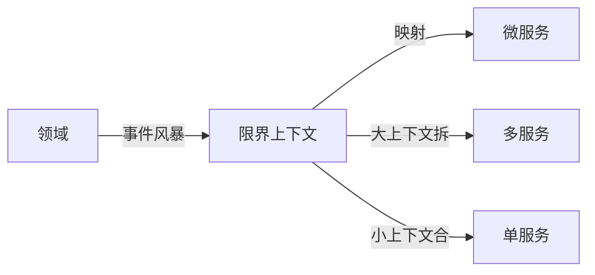

# DDD 与微服务协同落地实战

> DDD 的限界上下文（Bounded Context）与微服务的"服务边界"天然契合，但并非一一对应。本文讲二者如何协同划分与落地。

## 1. 关系总览

- 限界上下文是概念边界，微服务是部署边界。
- 通常"一个限界上下文 = 一个微服务"，但可调整。

## 2. 上下文映射（Context Mapping）

| 关系 | 含义 |
| --- | --- |
| 合作关系（Partnership） | 互相依赖，需协调 |
| 共享内核（Shared Kernel） | 共享少量模型 |
| 客户-供应商（Customer-Supplier） | 上游供下游 |
| 防腐层（ACL） | 下游用 ACL 隔离上游模型 |
| 发布-订阅 | 事件解耦 |
| 大泥球（Big Ball） | 应避免 |

## 3. 划分微服务

- 以限界上下文为候选边界。
- 考虑团队规模（康威定律：架构匹配组织）。
- 考虑变更频率、数据一致性、部署独立性。
- 警惕过细拆分（分布式事务、网络开销）。

## 4. 上下文间通信

- **同步**：REST/gRPC（客户-供应商）。
- **异步**：领域事件（发布-订阅）解耦。
- **防腐层**：下游不直接依赖上游模型，用 ACL 转换，避免被上游污染。

## 5. 数据自治

- 每个微服务自有数据库（Database per Service）。
- 跨上下文数据通过事件同步（最终一致）。
- 避免共享数据库（会重新耦合）。

## 6. 协作落地步骤

1. 事件风暴识别领域与上下文。
2. 定义统一语言（每个上下文内）。
3. 设计上下文映射关系。
4. 按上下文划微服务 + 团队。
5. 用事件/ACL 打通协作。

## 7. 反模式

| 反模式 | 问题 | 对策 |
| --- | --- | --- |
| 共享数据库 | 耦合 | 每服务独立库 |
| 贫血跨服务 | 逻辑乱 | 领域内聚 |
| 上下文过大 | 难演进 | 拆子域 |
| 忽视统一语言 | 沟通错 | 每上下文定义 |

## 8. 面试题

1. 限界上下文与微服务关系？
2. 防腐层的作用？
3. 为什么每服务独立数据库？
4. 上下文映射有哪些关系？
5. 康威定律与微服务？

## 9. 小结

DDD 为微服务提供了"边界划分的方法论"：限界上下文是逻辑边界，微服务是物理边界，二者通过事件与防腐层协作。独立数据与统一语言是防止耦合回潮的关键。
