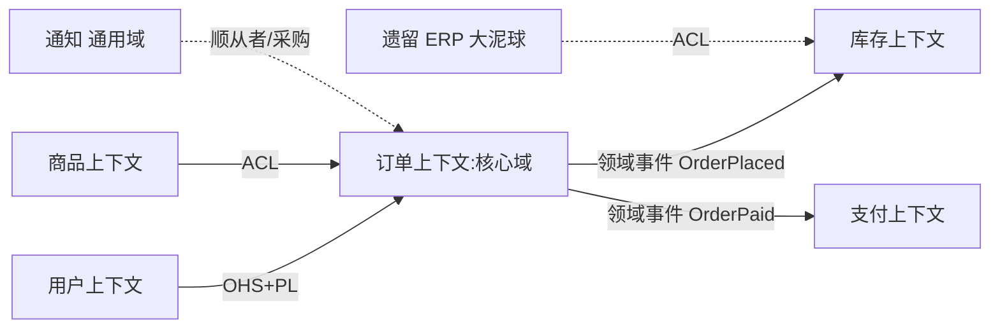

# DDD 上下文映射与子域（Strategic Design）

> 配套：[DDD 入门](入门.md) · [战术设计](战术设计.md) · [事件风暴实战](事件风暴实战.md) · 返回：[板块导航](README.md)
> 战略设计关注「多个限界上下文之间如何划界、如何协作」，是团队间接口与依赖的契约层。本文在九种上下文映射关系之外，补充**代码级实现样例**、**真实电商划分案例**与**评审清单**，让战略设计落到工程。

## 〇、本体介绍

当系统大到无法用一个统一的领域模型覆盖时，DDD 用**限界上下文（Bounded Context）** 切割出多个「模型自治」的边界。每个上下文内可以使用自己的一套统一语言与模型；上下文之间则需要明确的**映射关系**来约定如何协作。战略设计回答两个问题：
1. **怎么划子域、定核心域**（价值优先级）；
2. **上下文之间是什么关系**（上下游、依赖方向、防腐策略）。

---

## 一、子域划分（Subdomain）

子域是对「问题空间」的切分，分三类：

| 类型 | 含义 | 投入优先级 | 示例 |
|------|------|-----------|------|
| **核心域（Core）** | 业务差异化竞争力、产品核心价值 | 最高，自研精做 | 电商的下单与优惠、金融的风控 |
| **支撑域（Supporting）** | 必要但非差异化，可定制 | 中等 | 内部权限、审批流 |
| **通用域（Generic）** | 行业通用、可买现成 | 最低，采购/开源 | 邮件、短信、鉴权、日志 |

### 实践要点
- 资源向核心域倾斜：核心域应自研、深耕、配最强人力。
- 通用域直接采购（如用云厂商短信服务），别重复造轮子。
- 子域 ≠ 微服务：一个子域可能对应一个限界上下文，也可能内部再分；划分首要依据是「业务变化原因是否一致」。

---

## 二、Context Mapping（上下文映射）九种关系

> 上下游（Upstream/Downstream）：被依赖方为上游，依赖方为下游。下游要适应上游的变化。

### 1. 合作关系（Partnership）
两上下文团队同进同退，一起协调接口变更。适合同团队、强耦合、同步演进的场景。
- 特点：无单方上游，变更需共同 agreed。

### 2. 共享内核（Shared Kernel）
两上下文共享一小部分模型（如公共的枚举、ID 类型）。
- 风险：共享部分一改双方都受影响，需严格治理。
- 适用：早期过渡、或极小且稳定的公共子模型。

### 3. 客户-供应商（Customer-Supplier）
上下游明确：上游（供应商）按下游（客户）需求排期演进接口。
- 适用：团队间有协作意愿，下游需求能被上游纳入规划。

### 4. 顺从者（Conformist）
下游无条件**顺从**上游模型（不翻译、不对抗）。
- 适用：上游强势/不可协商（如强依赖的第三方平台、遗留系统），且转换成本高于收益。
- 代价：上游模型缺陷会直接传染下游 → 此时应改用 ACL。

### 5. 防腐层（Anti-Corruption Layer, ACL）
下游在自身与上游之间加适配器，把上游模型翻译成自己的模型。
- 适用：**强烈推荐**用于对接外部/遗留系统，保护本上下文不被污染。
- 代码形态（详见[战术设计·防腐层](../DDD/战术设计.md)）：

```java
// 下游自己的模型
class LocalOrder { OrderId id; Money total; }

// 外部（上游）模型，字段/命名都不同，且会变动
class ExternalOrderDTO { long order_no; int amount_cents; }

// 防腐层：把外部翻译成本地模型，下游永远不碰 ExternalOrderDTO
class OrderACL {
    LocalOrder translate(ExternalOrderDTO ext) {
        return new LocalOrder(
            new OrderId(ext.order_no),
            Money.ofCents(ext.amount_cents));
    }
}
```
> ACL 的价值：**上游再怎么改，只动 ACL 一处**，下游领域不受污染。

### 6. 开放主机服务（Open Host Service, OHS）
上游把能力以**一套定义良好的协议/服务**对外开放（如 RESTful API、gRPC），供多个下游共用。
- 常配合 **PL（Published Language，发布语言）**：用一份公开、稳定的语言（如 OpenAPI/Schema）描述交互。

```yaml
# OHS + PL：对外契约（OpenAPI 片段）
/openapi/orders/{id}:
  get:
    summary: 查询订单（发布语言：稳定、版本化）
    responses:
      '200': { description: OrderDTO }
```

### 7. 发布语言（Published Language, PL）
上下游交换数据时使用的**公共、文档化的语言/格式**（如 Protobuf schema、领域事件契约）。
- 常与 OHS 一起出现，是「对外开放的接口契约」。

### 8. 各行其道（Separate Ways）
两上下文**完全不集成**，各自独立实现所需能力。
- 适用：集成成本高于各自重复实现的收益；或二者本就无实质耦合。

### 9. 大泥球（Big Ball of Mud）
无边界、模型混乱、相互缠绕的遗留系统。
- 处置：用 ACL 把它包起来，新上下文通过防腐层与之交互，逐步绞杀（Strangler Fig）替换，而不是把混乱引进新系统。

---

## 三、九种关系速查表

| 关系 | 依赖方向 | 是否翻译 | 典型场景 |
|------|---------|---------|---------|
| 合作关系 | 双向协商 | 否 | 同团队强耦合 |
| 共享内核 | 双向 | 否（共享） | 极小公共模型 |
| 客户-供应商 | 下游依赖上游 | 可选 | 有协作的上下游团队 |
| 顺从者 | 下游顺从上游 | 否 | 强势/不可协商的上游 |
| 防腐层 ACL | 下游依赖上游 | **是** | 对接外部/遗留系统 |
| 开放主机服务 OHS | 多下游依赖上游 | 协议约定 | 平台型上游对外开放 |
| 发布语言 PL | — | 契约 | 交换数据的公共格式 |
| 各行其道 | 无 | — | 无实质耦合 |
| 大泥球 | 混乱 | 需 ACL | 遗留混乱系统 |

---

## 四、下游如何「选关系」

1. 先判断上游是否可控：可控 → 客户-供应商；不可控 → ACL。
2. 上游是平台、要服务多团队 → OHS + PL。
3. 上游是遗留混乱系统 → ACL 包裹（绞杀者模式逐步替换）。
4. 两套模型确实毫无交集 → Separate Ways。
5. 同团队高速协同 → Partnership。

---

## 五、真实案例：电商上下文划分



- **核心域**：订单上下文（自研深耕，配最强人力）；
- **商品、库存**：支撑域（重要但非差异点，可定制）；
- **通知（短信/邮件）**：通用域，直接采购云服务；
- **遗留 ERP**：大泥球，用 ACL 包裹，新链路不直连；
- **对外**：订单/商品以 OHS + PL（OpenAPI + 事件 schema）对多团队开放。

---

## 六、与微服务边界的关系

- **一个限界上下文 ≈ 一个微服务**（常见实践，但不绝对）。
- 上下文映射的「上下游」直接对应服务间的调用/依赖方向。
- ACL 边界往往就是一个服务的防腐适配层；OHS/PL 就是对外 API 与契约。
- 划分错了的典型信号：两个服务频繁同步改同一张表、或为了一个字段要跨 3 个服务联调 → 回头重做子域/上下文划分。

---

## 七、落地实操：一次上下文划分评审的检查清单

**划界阶段**
- [ ] 每个上下文是否能用一句业务语言描述其职责？（说不清 = 边界没划对）
- [ ] 变化原因是否一致？——「A 变化会拖累 B」则不该同界，这是边界划分的首要依据
- [ ] 是否避免了「按技术分层划线」（把 MQ 层/DB 层当边界）？

**协作阶段**
- [ ] 每个上下文之间是否明确了一对映射关系（在九种里选型）？
- [ ] 对不可控/遗留依赖是否都包了 ACL（而不是「先直连，以后再补」）？
- [ ] 对外契约是否落了文档化的 PL（OpenAPI/事件 schema），并做兼容性治理？

**演进阶段**
- [ ] 是否记录了「当初为什么这么划分」的决策记录（ADR）？
- [ ] 是否预留了绞杀者路径——把「识别错的大泥球」安全拆出的路线？

> 一个常见坑：**只画了上下文图，没有为每个边界配「映射关系 + 防腐策略」**——图纸很漂亮，落地照样互相渗透。评审时先问「边界处你用什么保护自己」。

---

## 八、与微服务拆分的配合（对照表）

| DDD 战略设计概念 | 微服务工程的对应物 |
|------------------|--------------------|
| 限界上下文 | 服务边界 / 独立部署单元 |
| 核心域 | 重点投入、独立演进的服务群 |
| 上下游映射 | 服务依赖方向、接口契约 |
| ACL | 适配层 / 网关翻译 / 异步事件翻译 |
| OHS + PL | 开放 API 网关 + 契约测试（消费者驱动） |
| 大泥球 | 遗留单体 → 绞杀者模式改造 |

> 对应关系（详见 [单体到微服务演进](../架构/单体到微服务演进.md)）：战略设计先出「契约地图」，微服务拆分再按图施工——**没有上下文映射就拆服务，拆出来的一定是技术边界不是业务边界**。

---

## 九、面试高频追问

1. Q：限界上下文和子域的区别？ A：子域是「问题空间」的切分（业务视角）；限界上下文是「解空间」的模型边界（解决方案视角）。一个子域通常对应一个上下文。
2. Q：核心域/支撑域/通用域怎么分？ A：按业务价值与差异化：核心域是竞争力、自研深耕；通用域买现成；支撑域必要但可定制。
3. Q：什么时候用防腐层？ A：对接外部/遗留系统时，把外部模型翻译成自己的模型，防止污染本上下文；比顺从者更安全。
4. Q：OHS 和 PL 是什么？ A：开放主机服务=上游对外开放能力的一套协议；发布语言=交换数据的公共契约（如 OpenAPI/Protobuf）。
5. Q：大泥球怎么处理？ A：用 ACL 包裹它，新系统通过防腐层交互，再用绞杀者模式逐步替换，不把混乱引入新系统。
6. Q：上下文映射和微服务划分关系？ A：一个限界上下文常对应一个微服务；映射的上下游对应服务依赖方向，ACL 即服务适配层。
7. Q：客户-供应商和顺从者区别？ A：前者上游会考虑下游需求演进；后者下游无条件顺从上游（上游不可协商时）。
8. Q：共享内核的风险？ A：共享模型一改双方都受影响，需严格治理，只用于极小且稳定的公共子模型。
9. Q：为什么不能所有上下文都用 ACL？ A：ACL 有翻译成本；可控的上游用客户-供应商/OHS 更直接，ACL 留给不可控/遗留依赖。
10. Q：上下文划分错了有什么信号？ A：两服务频繁同步改同一张表、为取一个字段跨 3 个服务联调 → 边界划错，重做划分。
