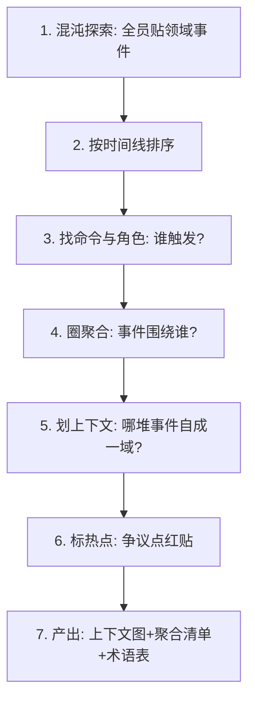

# DDD 事件风暴实战（Event Storming Workshop）

> 配套：[DDD 入门](入门.md) · [战术设计](战术设计.md) · [上下文映射与子域](上下文映射与子域.md) · 返回：[板块导航](README.md)
> 事件风暴（Event Storming）是 Alberto Brandolini 提出的**协作建模工作坊**，用便利贴在墙上把领域事件、命令、聚合快速"风暴"出来。它是 DDD 落地最实用的"启动器"——比读三个月书更能让团队对齐领域模型。

---

## 〇、为什么要做事件风暴

传统建模是架构师关起门画 UML，出来团队不认、业务看不懂。事件风暴把**业务专家、开发、测试、架构师**拉到同一面墙前，用统一语言（Ubiquitous Language）当场把系统"跑一遍"：

- 暴露隐藏的业务规则与边界（"原来退款要等 72 小时？"）；
- 快速识别**限界上下文**（哪类事件总在一起出现）；
- 识别出**聚合根**（哪个实体是事件的主体）；
- 让代码命名直接对齐便利贴上的业务词。

> 一句话：**事件风暴 = 用便利贴在墙上"演一遍业务"，把 tacit knowledge（ tacit 知识）变成 explicit model（显式模型）。**

---

## 一、核心元素（便利贴颜色约定）

| 颜色 | 元素 | 含义 | 示例 |
|------|------|------|------|
| 🟠 橙色 | **领域事件（Domain Event）** | 业务中"已发生"的事实，过去时 | `OrderPlaced`（订单已下单） |
| 🔵 蓝色 | **命令（Command）** | 某角色"想做"的动作 | `PlaceOrder`（下单） |
| 🟡 黄色 | **聚合/聚合根（Aggregate）** | 命令和事件围绕的核心实体 | `Order`（订单） |
| 🟢 绿色 | **角色/Actor** | 触发命令的人/系统 | `用户`、`定时任务` |
| 🔴 红色 | **热点/问题（Hotspot）** | 争议点、待定项、风险 | `？退款要不要风控` |
| ⚪ 白色 | **只读模型/外部系统** | 查询用的、外部依赖 | `库存视图`、`支付网关` |

---

## 二、标准流程（2~4 小时工作坊）



### 步骤 1：混沌探索（Chaotic Exploration）
不讲规则，让每个人把脑子里"业务里发生过的事件"写成橙贴往墙上贴。禁止批判——"这个事件不对"先别说话，全贴完再理。

> 常见产出：墙上几百张橙贴，从"用户注册"到"订单取消"到"发票开具"全有。

### 步骤 2：时间线排序
把事件按**业务流程先后**从左到右排成一条线。缺失环节立刻暴露（"下单和支付之间是不是漏了风控？"）。

### 步骤 3：命令与角色
在每个事件左侧放蓝贴（命令），上方放绿贴/白贴（角色/Actor），回答"谁、做了什么、导致了这个事件"。

### 步骤 4：圈聚合
把围绕同一核心实体的一组命令+事件圈起来，这就是候选**聚合根**。`OrderPlaced`、`OrderPaid`、`OrderShipped` 都围绕 `Order` → `Order` 是聚合根。

### 步骤 5：划限界上下文
观察"哪些聚合/事件天然聚在一起、与外部交互少"——它们构成一个限界上下文。电商里 `Order` 相关一堆事件 = 订单上下文；`Invoice` 相关 = 发票上下文。

### 步骤 6：标热点
所有"争议、不确定、需要后续调研"用红贴标出，形成 action list，避免现场卡死。

---

## 三、实战案例：电商下单链路

墙上的关键片段（简化）：

```text
[用户] --PlaceOrder--> [Order]
   OrderCreated
      ├─ (库存) StockReserved        ← 跨上下文
      ├─ (支付) PaymentRequested
   [用户] --Pay--> [Payment]
   PaymentSucceeded
   OrderPaid
      ├─ (物流) ShipmentCreated
   OrderShipped
```

**读图结论**：
- `Order` 是聚合根，承载 `OrderCreated/Paid/Shipped` 状态机；
- `StockReserved`、`PaymentRequested`、`ShipmentCreated` 是**跨上下文事件** → 对应上下文映射里的 OHS/PL + 事件协作；
- "退款要不要风控"标红 → 热点，会后调研。

---

## 四、常见陷阱（工作坊层面）

| 陷阱 | 表现 | 修正 |
|------|------|------|
| 架构师独角戏 | 一个人贴完，其他人旁听 | 业务专家必须主导事件描述 |
| 陷入技术细节 | 讨论"用 Kafka 还是 RocketMQ" | 聚焦业务事件，技术实现会后定 |
| 事件不是过去时 | 写成 `CreateOrder`（命令当事件） | 强制过去时：`OrderCreated` |
| 聚合过大 | 把所有事件圈进一个聚合 | 按一致性边界拆，跨聚合走事件 |
| 没有角色 | 命令不知谁触发 | 每个命令上方补 Actor |
| 不收敛 | 工作坊结束没产出图 | 最后 30 分钟强制产出上下文图+术语表 |

---

## 五、事件风暴产出如何落到代码

| 工作坊产物 | 代码落点 |
|-----------|----------|
| 限界上下文图 | 模块/微服务边界、Maven module 划分 |
| 聚合清单 | 聚合根类、`@Aggregate`、仓储接口 |
| 领域事件列表 | `XxxEvent` 类 + 事件发布（Outbox） |
| 统一语言术语表 | 类名/方法名强制对齐、禁止同义混用 |
| 热点清单 | 待定架构决策（ADR）+ 调研任务 |

> 与 [DDD 落地](落地.md) 衔接：事件风暴是"探索期"，落地篇是"施工期"——前者出地图，后者按图分模块、写分层、接微服务。

---

## 六、远程/异步事件风暴

线下贴墙受限时：
- 用 Miro/Mural 在线白板，颜色便利贴同约定；
- 异步模式：先各自提交事件清单，再约 1 小时线上串时间线；
- 工具：[eventstorming.com](https://www.eventstorming.com/) 社区资源、Miro 官方模板。

---

## 七、面试高频追问

1. Q：事件风暴解决什么？ A：让业务/开发/测试对齐领域模型，快速识别上下文与聚合，避免闭门造车。
2. Q：领域事件怎么命名？ A：过去时（`OrderPlaced`），表示"已发生的事实"，不可变。
3. Q：命令和事件区别？ A：命令是"想做"（可能失败），事件是"已发生"（事实）。
4. Q：怎么识别聚合根？ A：看哪些命令和事件围绕同一核心实体，且需强一致。
5. Q：事件风暴产出怎么用？ A：上下文图→模块边界，事件列表→领域事件类，术语表→命名对齐。
6. Q：工作坊多久、谁参加？ A：2~4 小时，业务专家必须主导，开发/测试/架构师参加。
7. Q：聚合圈太大怎么办？ A：按一致性边界拆小，跨聚合用领域事件最终一致。

---

## 八、Cheat Sheet

| 元素 | 颜色 | 要点 |
|------|------|------|
| 领域事件 | 🟠 | 过去时、已发生、不可变 |
| 命令 | 🔵 | 谁想做什么、可能失败 |
| 聚合 | 🟡 | 事件围绕的核心实体 |
| 角色 | 🟢 | 触发命令的人/系统 |
| 热点 | 🔴 | 争议点、待定项 |

> 一句话：**事件风暴 = 业务专家主导、便利贴演业务、橙贴排时间线、黄贴圈聚合、红贴标热点，最终收敛出上下文图 + 聚合清单 + 统一语言术语表。**
