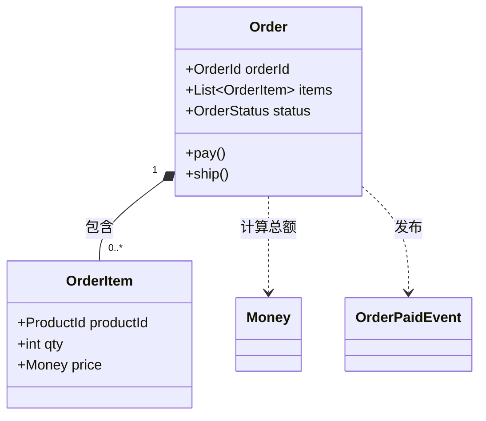
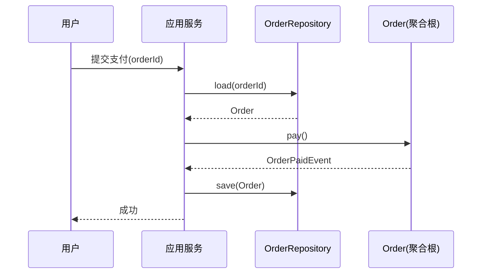
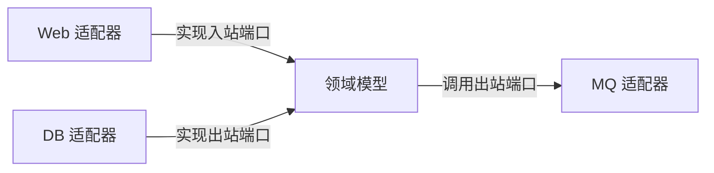
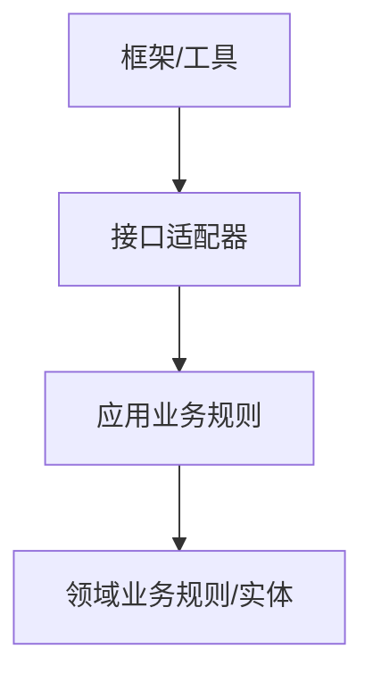
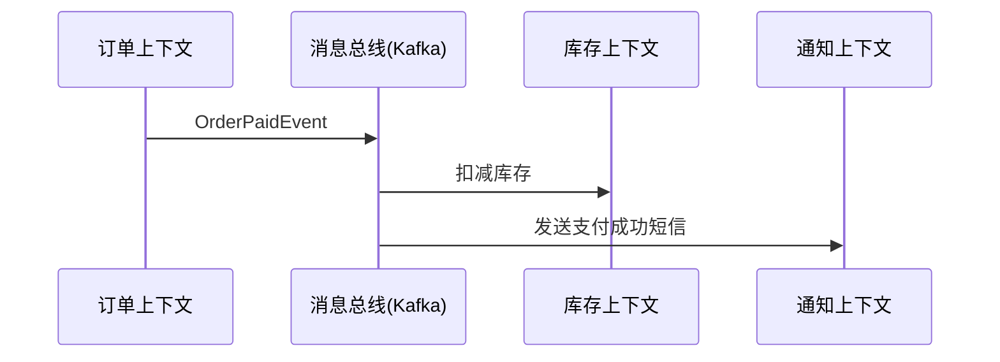
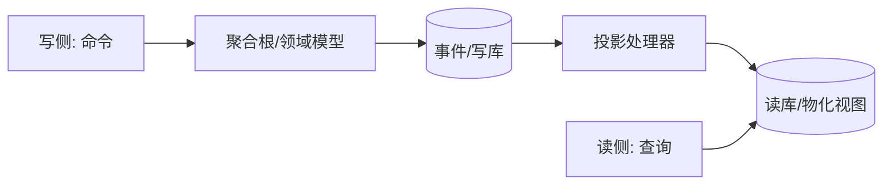

# DDD 入门

## 定义

领域驱动设计分为两个阶段：

1. 以一种领域专家、设计人员、开发人员都能理解的通用语言作为相互交流的工具，在交流的过程中发现领域概念，然后将这些概念设计成一个领域模型；
2. 由领域模型驱动软件设计，用代码来实现该领域模型。

## 问题域与限界上下文

那么，如果要对整个电商网站进行领域驱动设计，应当怎么做呢？它包含那么多场景，每个场景都要包含那么多的领域对象，进而会形成很多的领域对象，并且每个领域对象之间还有那么多复杂的关联关系。这时候，怎样通过领域驱动来设计这个系统呢？怎么去绘制领域模型呢？是绘制一张密密麻麻的大图，还是绘制成一张一张的小图呢？学完本讲后，将能解决这些问题。

假如将整个系统中那么多的场景、涉及的那么多领域对象，全部绘制在一张大图上，可以想象这张大图需要绘制出密密麻麻的领域对象，以及它们之间纷繁复杂的对象间关系。绘制这样的图，绘制的人非常费劲，看这张图的人也非常费劲，这样的图也不利于我们理清思路、交流思想及提高设计质量。

正确的做法就是**将整个系统划分成许多相对独立的业务场景**，在一个一个的业务场景中进行领域分析与建模，这样的业务场景称为 **“问题子域”**，简称“子域”。

**领域驱动核心的设计思想，就是将对软件的分析与设计还原到真实世界中**，那么就要先分析和理解真实世界。

因此，一个复杂系统的领域驱动设计，就是以子域为中心进行领域建模，绘制出一张一张的领域模型设计，然后以此作为基础指导程序设计。这一张一张的领域模型设计，称为 **限界上下文（Bounded Context）**。

## 限界上下文

DDD 中限界上下文的设计，很好地体现了高质量软件设计中 **“单一职责原则”** 的要求，即每个限界上下文中实现的都是软件变化同一个原因的业务。比如，“用户下单”这个限界上下文都是实现用户下单的相关业务。这样，当“用户下单”的相关业务发生变更的时候，只与“用户下单”这个限界上下文有关，只需要对它进行修改就行了，与其他限界上下文无关。这样，需求变更的代码**修改范围缩小了，维护成本也就降低了。**

**所谓“限界上下文内的高内聚”，也就是每个限界上下文内实现的功能，都是软件变化的同一个原因的代码**。因为这个原因的变化才需要修改这个限界上下文，而不是这个原因的变化就不需要修改这个限界上下文，修改与它无关。正是因为限界上下文有如此好的特性，才使得现在很多微服务团队，**运用限界上下文作为微服务拆分的原则**，即每个限界上下文对应一个微服务。

限界上下文的主题是什么呢？我认为是子域。每个限界上下文专注于解决某个特定的子域的问题。每个子域都对应一个明确的问题，提供独立的价值，所以每个子域都相对独立。子域及其对应的限界上下文中的模型会因为其要解决的问题变化而变化，不会因为其他子域的变化而变化，即低耦合；当一个子域发生变化时，只需要修改其对应限界上下文中的模型，不需要变动其他子域的模型，即高内聚。

### 识别核心域

由于核心域是最明显、最容易识别出来的子域，所以我们先从核心域开始。

每一个子域甚至每一个领域模型都是为了产品愿景而存在的。我们分解子域的第一步，就是从产品愿景中获取核心域。**产品愿景包含“相对抽象的产品价值”，以及“实现该价值的主要功能”。**其中，主要功能就是我们寻找核心域的依据。想象一下，如果要做 MVP 的话，我们会挑选最能够提供其核心价值的功能来开发，以验证产品价值。MVP 往往就是核心域。

以上述活动运营系统为例，其产品愿景是通过各种吸引用户的优惠活动，以帮助客户通过活动提升用户量和知名度。其核心域是给客户提供吸引用户的多样的灵活的活动，包括活动形式、活动规则和多种奖励。

### 识别核心域周边的子域

核心域识别出来了，接下来就是识别核心域周边的子域。核心域往往不会独立存在，会有其他子域同核心域一起才能达成业务目标。这里需要回答的问题是：

- 有哪些子域是用来支撑核心域的？

  这些子域是帮助核心域更好的工作。例如提供审批流程以配置核心域，提供各种辅助功能更好的为核心域提供内容。

- 有哪些子域是核心域衍生出来的？

  核心域经常会产生一些数据，这些数据也有其价值。比如产生各种报表，活动奖励的发放记录。

- 有哪些子域是用来支撑或衍生自这些新识别出的子域的？

  用来支撑核心域的子域、以及核心域衍生的子域，也有各自的支撑子域和衍生子域。

[参考配图](https://insights.thoughtworks.cn/wp-content/uploads/2020/06/1-bounded-context-ddd-aggregation-bounded-context-1.png)


活动运营系统

识别出来的每个子域只对应一个问题，子域之间是相互独立的，没有交叉，不是包含关系。所以子域加起来就是整个领域。

也可以通过角色、时间等因素分解子域。解决不同角色的问题可能分属不同子域，比如用户参与活动、运营人员配置活动分属不同子域，两个子域的变化原因不同；**不同时间使用的功能可能属于不同子域**，比如先有运营人员配置活动，再有用户参与活动，配置活动和参与活动分属不同子域。

如果按照聚合分组划分限界上下文，很可能出现“活动上下文”，同时活动模型，即承担运营人员配置的职责，又承担用户参与规则校验的职责，这会导致职责过多，违背了单一职责。另外活动规则校验的模块需要支持高并发，需要使用和配置模块不同的技术架构。如果这些相似的概念和不同的技术实现属于不同的上下文，就可以保持各自模型的完整，技术上也可以做到独立演进。

### 子域的粒度

理论上子域仍然可以被分解。例如活动子域可以分解为活动参与规则子域、奖励子域等。那么子域粒度多大是合适的呢？

我们希望每个子域可以解决某个特定的问题，让这个问题的解决方案都内聚在子域对应的限界上下文内，所以如果问题的再分解**的边界**并不清晰，建议先不分解。随意的拆分会导致成为“分布式单体”。

## 聚合

1. 聚合是用来封装真正的不变性，而不是简单的将对象组合在一起；
2. 聚合应尽量设计的小；
3. 聚合之间的关联通过 ID，而不是对象引用；
4. 聚合内强一致性，聚合之间最终一致性；


淘宝的 DDD 文章

[https://zhuanlan.zhihu.com/p/340911587](https://zhuanlan.zhihu.com/p/340911587)

> ⚠️ 以下案例引用自外部文章，本文件未包含该案例上下文，仅保留原文结论。

在上面那个案例里，核心的问题是由于 Repository 接口规范的限制，让调用方仅能操作 Aggregate Root，而无法单独针对某个非 Aggregate Root 的 Entity 直接操作。这个和直接调用 DAO 的方式很不一样。这个的解决方案是需要能识别到底哪些 Entity 有变更，并且只针对那些变更过的 Entity 做操作，就需要加上变更追踪的能力。换一句话说就是原来很多人为判断的代码逻辑，现在可以通过变更追踪来自动实现，让使用方真正只关心 Aggregate 的操作。在上一个案例里，通过变更追踪，系统可以判断出来只有 LineItem2 和 Order 有变更，所以只需要生成两个 UPDATE 即可。业界有两个主流的变更追踪方案：

1. **基于 Snapshot 的方案：**当数据从 DB 里取出来后，在内存中保存一份 snapshot，然后在数据写入时和 snapshot 比较。常见的实现如 Hibernate。
2. **基于 Proxy 的方案：**当数据从 DB 里取出来后，通过 weaving 的方式将所有 setter 都增加一个切面来判断 setter 是否被调用以及值是否变更，如果变更则标记为 Dirty。在保存时根据 Dirty 判断是否需要更新。常见的实现如 Entity Framework。


## 战术设计详解

战术设计（Tactical Design）是 DDD 中用于落地领域模型的"编程层面"模式集合。战略设计（限界上下文、子域）解决"边界划在哪"，战术设计解决"边界内该怎么写代码"。下面逐一拆解核心构件。

### 实体（Entity）

实体是具有**唯一标识（Identity）**且**通过标识判断相等性**的对象，而非通过属性。即使两个实体的属性完全相同，只要标识不同，它们就是不同的对象；反之，即使属性发生变化，只要标识不变，它仍是同一个实体。

典型特征：
- 拥有生命周期，可被创建、修改、归档、删除；
- 标识在生命周期内保持不变（通常用 ID、UUID 或业务键）；
- 需要保证业务不变量（Invariant）。

```java
public class Order {
    private final OrderId orderId;   // 标识，值对象
    private OrderStatus status;
    private Money totalAmount;

    public Order(OrderId orderId, List<OrderItem> items) {
        this.orderId = Objects.requireNonNull(orderId);
        this.status = OrderStatus.CREATED;
        this.totalAmount = items.stream()
                .map(OrderItem::subtotal)
                .reduce(Money.ZERO, Money::add);
    }

    public void pay() {
        if (this.status != OrderStatus.CREATED) {
            throw new IllegalStateException("只有待支付订单可以支付");
        }
        this.status = OrderStatus.PAID;
    }
    // equals 只比较 orderId，不比较属性
}
```

### 值对象（Value Object）

值对象**没有标识**，通过属性集合整体来判断相等，且**不可变（Immutable）**。它通常用于描述实体身上的度量、描述性概念（金额、地址、时间区间等）。

优点：
- 不可变带来线程安全与可测试性；
- 用领域语言命名（Money、Address、Color），提升表达力；
- 可作为聚合内、甚至跨聚合传递的"数据信封"。

```java
public final class Money {
    private final BigDecimal amount;
    private final String currency;

    public Money(BigDecimal amount, String currency) {
        this.amount = amount;
        this.currency = currency;
    }
    public Money add(Money other) {
        requireSameCurrency(other);
        return new Money(amount.add(other.amount), currency); // 返回新对象，自身不变
    }
    @Override public boolean equals(Object o) {
        if (!(o instanceof Money m)) return false;
        return amount.compareTo(m.amount) == 0 && currency.equals(m.currency);
    }
}
```

### 聚合与聚合根（Aggregate & Aggregate Root）

聚合是一组关联对象（实体 + 值对象）的**一致性边界**。其中一个实体被指定为**聚合根（Aggregate Root）**，它是外部访问该聚合的唯一入口。

规则回顾（与上文战略部分一致）：
1. 聚合封装真正的不变性；
2. 聚合尽量小；
3. 聚合之间通过 ID 引用，而非对象引用；
4. 聚合内强一致，聚合间最终一致。

```java
// 聚合根：Order；内部实体：OrderItem；值对象：Money
public class Order {            // Aggregate Root
    private final OrderId orderId;
    private final List<OrderItem> items = new ArrayList<>();

    public void addItem(ProductId productId, int qty, Money price) {
        if (status != OrderStatus.CREATED) throw new IllegalStateException("已支付订单不能改明细");
        items.add(new OrderItem(productId, qty, price));
        recalcTotal(); // 不变性：订单总金额必须与各明细一致
    }
}
```

### 领域服务（Domain Service）

当某个操作**不适合放在任何单一实体或值对象上**（通常涉及多个聚合、或没有自然归属对象）时，使用领域服务。它应当无状态，且名称来自通用语言（Ubiquitous Language）。

```java
public interface OrderTransferService {
    TransferResult transfer(OrderId from, OrderId to, ProductId product);
}
```

注意：不要把所有逻辑都塞进领域服务，否则会退化成"贫血模型 + 事务脚本"。优先放进实体/聚合，实在放不下再用服务。

### 领域事件（Domain Event）

领域事件表示"领域中已经发生、且其他部分可能关心"的事实。它用于解耦聚合之间、限界上下文之间的协作，推动最终一致性。

```java
public class OrderPaidEvent {
    private final OrderId orderId;
    private final Instant occurredOn;
    // 通常实现 DomainEvent 接口，携带最少必要信息
}
```

发布与订阅（Spring 风格）：

```java
@DomainService
public class OrderService {
    private final ApplicationEventPublisher publisher;
    public void pay(OrderId id) {
        Order o = repository.load(id);
        o.pay();
        repository.save(o);
        publisher.publishEvent(new OrderPaidEvent(id, Instant.now()));
    }
}
```

### 仓储（Repository）

仓储为聚合提供**持久化抽象**，使领域层不依赖具体数据库。注意：仓储面向聚合根，而非任意实体；通过聚合根 ID 加载/保存整个聚合。

```java
public interface OrderRepository {
    Order load(OrderId id);
    void save(Order order);
    List<Order> findByCustomer(CustomerId cid);
}
// 基础设施层用 JPA/MyBatis 实现，领域层只依赖接口
```

## 领域建模实例（电商订单域）

下面用一个简化的"下单—支付—发货"流程，把上述构件串起来。



核心流程（时序）：



要点：
- `Order` 是聚合根，保证"未支付不能发货"这类不变性；
- `OrderItem` 不是聚合根，外部不能直接操作它，只能通过 `Order`；
- 支付成功后通过领域事件通知库存上下文扣减库存（跨聚合/跨上下文，最终一致）。

## 六边形架构 / 整洁架构与 DDD 的关系

DDD 的"分层"不是目的，而是为了让**领域模型处于依赖的最核心、最稳定位置**。

### 六边形架构（Hexagonal / 端口与适配器）

外部（Web、DB、MQ）通过"端口（Port，接口）"适配进领域，领域不感知具体技术。



### 整洁架构（Clean Architecture）

依赖指向内圈（领域），外圈依赖内圈，反之不成立：



| 维度 | 传统三层架构 | 六边形/整洁架构 + DDD |
|---|---|---|
| 领域位置 | 被 Service/DAO 包裹，依赖外围 | 在最内核，外围依赖它 |
| 可测试性 | 需启动容器 | 纯单测即可覆盖领域 |
| 技术耦合 | 强（注解侵入实体） | 弱（实体为 POJO） |

## 常见误区

1. **把所有逻辑写进 Service → 贫血模型**：实体只剩 getter/setter，业务规则散落在 Service，导致重复与混乱。应把行为归还给聚合。
2. **聚合设计过大**：一个"超级聚合"包含半个系统，事务锁重、性能差。牢记"聚合尽量小"。
3. **聚合间用对象引用**：导致级联加载、分布式事务。应只保存对方 ID。
4. **滥用领域事件**：每个动作都发事件，造成事件风暴失控。只发布"跨边界真正关心"的事实。
5. **先画 ER 图再写领域**：数据库思维先行会污染领域模型。应先用通用语言建模，再考虑持久化。
6. **把 DDD 当银弹**：CRUD 简单模块硬套 DDD 反而增加复杂度，需按子域价值取舍。

## 领域事件与事件溯源（Event Sourcing）

### 领域事件的深层用法

领域事件不只是"通知"，它是**跨限界上下文协作的主要手段**。典型链路：



要点：
- 事件建议携带**最小必要信息**（ID + 关键量），订阅方按需回查；
- 事件命名为过去时（`OrderPaid` 而非 `PayOrder`）；
- 同一事件可被多个上下文订阅，实现"一次发生、多处响应"。

### 事件溯源（Event Sourcing）

传统持久化"只存当前状态"；事件溯源**只存状态变化的事件序列**，当前状态由重放事件得到。

```java
public interface EventStore {
    void append(AggregateId id, List<DomainEvent> events, int expectedVersion);
    List<DomainEvent> load(AggregateId id);
}

// 聚合根提供重建与产生事件的能力
public class Order {
    private int version;
    public static Order rebuild(List<DomainEvent> events) { /* 重放 */ return null; }
    public List<DomainEvent> changes() { /* 取出未提交事件 */ return List.of(); }
}
```

适用场景：审计要求高、需要时间回溯、事件即业务的金融/交易系统。代价：需处理事件版本演进、快照性能，查询需额外投影。

## CQRS 与 DDD 配合

CQRS（命令查询职责分离）把"写模型"与"读模型"分开。它与 DDD 天然契合：



- 写侧保持聚合强一致、执行业务不变量；
- 读侧通过事件投影构建专门优化的查询模型（可多表 join、冗余、异构存储）；
- 读写最终一致，读模型延迟通常毫秒级。

注意：CQRS 增加复杂度，**仅在读写模型差异大、读写负载悬殊时引入**，简单 CRUD 不必上。

## 防腐层（ACL）实战

当你的领域必须调用外部/遗留系统时，直接依赖会"污染"你的模型。防腐层（Anti-Corruption Layer）在边界做转换：

```java
// 外部系统的丑陋模型
public class LegacyCustomerDto { public String cust_no; public String full_nm; }

// 我方领域模型
public class Customer {
    private final CustomerId id;
    private final String name;
    public Customer(CustomerId id, String name) { this.id = id; this.name = name; }
}

// ACL：把外部模型翻译为领域模型
@Component
public class LegacyCustomerTranslator {
    public Customer toDomain(LegacyCustomerDto dto) {
        return new Customer(new CustomerId(dto.cust_no), dto.full_nm);
    }
}
```

ACL 也可用端口（Port）+ 适配器实现：领域定义 `CustomerGateway` 接口，基础设施层放 `LegacyCustomerGatewayAdapter`，外部依赖永远不进 domain 层。

## 规格模式（Specification）

当"筛选条件"会变化、需组合、需复用，用规格模式把规则对象化：

```java
public interface Specification<T> {
    boolean isSatisfiedBy(T t);
    default Specification<T> and(Specification<T> o) { return x -> this.isSatisfiedBy(x) && o.isSatisfiedBy(x); }
    default Specification<T> or(Specification<T> o)  { return x -> this.isSatisfiedBy(x) || o.isSatisfiedBy(x); }
    default Specification<T> not()                   { return x -> !this.isSatisfiedBy(x); }
}

public class VipSpecification implements Specification<Customer> {
    public boolean isSatisfiedBy(Customer c) { return c.getLevel() >= 3; }
}
// 组合复用：vip 且 活跃
Specification<Customer> s = new VipSpecification().and(c -> c.isActive());
```

可与仓储结合：`repository.findAll(spec)` 让查询条件成为一等公民，UI 多选筛选可直接拼规格。

## 工厂与仓储实现细节

### 工厂（Factory）

当对象创建涉及复杂不变性或聚合内部构造时，用工厂方法/工厂类，避免调用方理解创建细节：

```java
public class OrderFactory {
    public Order create(CustomerId cid, List<CartItem> items, PricingService pricing) {
        // 聚合内强一致：创建即算出应付金额、校验库存占位
        List<OrderItem> ois = items.stream()
            .map(i -> new OrderItem(i.pid, i.qty, pricing.priceOf(i.pid))).toList();
        return new Order(OrderId.next(), cid, ois);
    }
}
```

### 仓储实现细节（Spring Data JPA 风格）

```java
@Repository
public class OrderJpaRepository implements OrderRepository {
    private final JpaOrderDao dao;
    private final OrderMapper mapper; // 领域 <-> 持久化实体

    public Order load(OrderId id) {
        JpaOrder po = dao.findById(id.value()).orElseThrow(() -> new OrderNotFound(id));
        return mapper.toDomain(po); // 还原聚合，含内部实体集合
    }
    public void save(Order order) {
        JpaOrder po = mapper.toPo(order);
        dao.save(po); // JPA 变更追踪自动生成 UPDATE
    }
}
```

注意点：
- 仓储返回**完整聚合**（含子实体），不要返回半吊子；
- 复杂查询应走 CQRS 读模型，别让写侧仓储承担报表查询；
- 乐观锁（`@Version`）防止并发修改丢失。

## DDD 反模式

1. **贫血模型**：实体只有 getter/setter，逻辑全在 Service。→ 行为回归聚合。
2. **巨型聚合**：一个聚合裹住半个系统，事务锁重、加载慢。→ 按不变性切小。
3. **共享聚合根**：多个限界上下文共用一个聚合根，跨上下文强耦合。→ 各上下文持有自己的模型，靠 ID + 事件同步。
4. **仓库泄漏**：仓储暴露 `saveFieldX()` 之类，绕过聚合不变量。→ 只允许 `save(Aggregate)`。
5. **领域层引框架**：在实体上加 `@Entity`/`@Autowired`。→ 领域层保持纯 POJO，映射交给基础设施。
6. **事件即命令**：发出 `PleaseDeductStock` 之类指令式事件，造成强耦合。→ 事件只描述"已发生"，订阅方自己决定反应。
7. **为 DDD 而 DDD**：CRUD 小模块硬套四层 + 事件。→ 按子域价值取舍，简单处用事务脚本。
