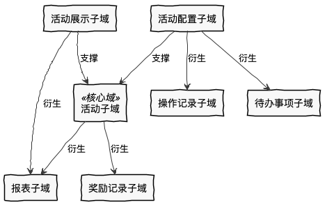
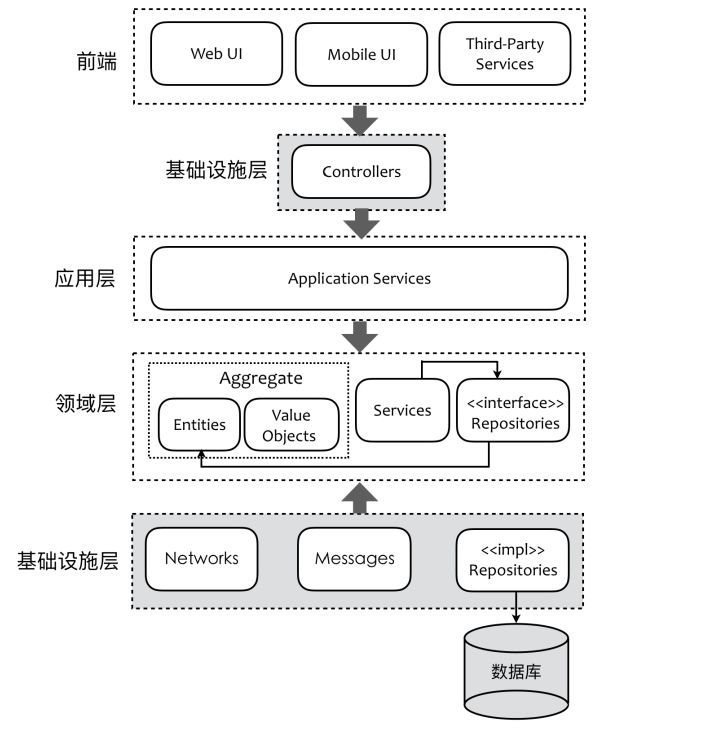
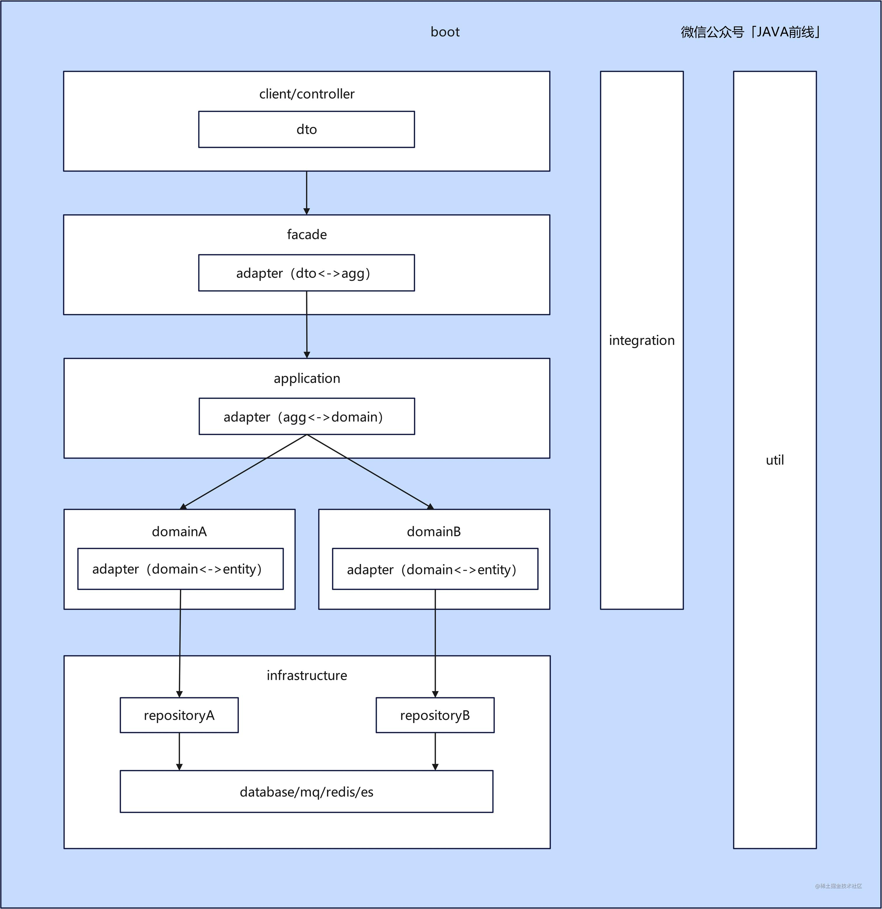

# DDD 入门

## 定义

领域驱动设计分为两个阶段：

1. 以一种领域专家、设计人员、开发人员都能理解的通用语言作为相互交流的工具，在交流的过程中发现领域概念，然后将这些概念设计成一个领域模型；
2. 由领域模型驱动软件设计，用代码来实现该领域模型。

## 问题域与限界上下文

那么，如果要对整个电商网站进行领域驱动设计，应当怎么做呢？它包含那么多场景，每个场景都要包含那么多的领域对象，进而会形成很多的领域对象，并且每个领域对象之间还有那么多复杂的关联关系。这时候，怎样通过领域驱动来设计这个系统呢？怎么去绘制领域模型呢？是绘制一张密密麻麻的大图，还是绘制成一张一张的小图呢？学完本讲后，将能解决这些问题。

假如将整个系统中那么多的场景、涉及的那么多领域对象，全部绘制在一张大图上，可以想象这张大图需要绘制出密密麻麻的领域对象，以及它们之间纷繁复杂的对象间关系。绘制这样的图，绘制的人非常费劲，看这张图的人也非常费劲，这样的图也不利于我们理清思路、交流思想及提高设计质量。

正确的做法就是**将整个系统划分成许多相对独立的业务场景**，在一个一个的业务场景中进行领域分析与建模，这样的业务场景称为 **“问题子域”**，简称“子域”。

**领域驱动核心的设计思想，就是将对软件的分析与设计还原到真实世界中**，那么就要先分析和理解真实世界。

因此，一个复杂系统的领域驱动设计，就是以子域为中心进行领域建模，绘制出一张一张的领域模型设计，然后以此作为基础指导程序设计。这一张一张的领域模型设计，称为 **限界上下文（Bounded Context）**。

## 限界上下文

DDD 中限界上下文的设计，很好地体现了高质量软件设计中 **“单一职责原则”** 的要求，即每个限界上下文中实现的都是软件变化同一个原因的业务。比如，“用户下单”这个限界上下文都是实现用户下单的相关业务。这样，当“用户下单”的相关业务发生变更的时候，只与“用户下单”这个限界上下文有关，只需要对它进行修改就行了，与其他限界上下文无关。这样，需求变更的代码**修改范围缩小了，维护成本也就降低了。**

**所谓“限界上下文内的高内聚”，也就是每个限界上下文内实现的功能，都是软件变化的同一个原因的代码**。因为这个原因的变化才需要修改这个限界上下文，而不是这个原因的变化就不需要修改这个限界上下文，修改与它无关。正是因为限界上下文有如此好的特性，才使得现在很多微服务团队，**运用限界上下文作为微服务拆分的原则**，即每个限界上下文对应一个微服务。

限界上下文的主题是什么呢？我认为是子域。每个限界上下文专注于解决某个特定的子域的问题。每个子域都对应一个明确的问题，提供独立的价值，所以每个子域都相对独立。子域及其对应的限界上下文中的模型会因为其要解决的问题变化而变化，不会因为其他子域的变化而变化，即低耦合；当一个子域发生变化时，只需要修改其对应限界上下文中的模型，不需要变动其他子域的模型，即高内聚。

### 识别核心域

由于核心域是最明显、最容易识别出来的子域，所以我们先从核心域开始。

每一个子域甚至每一个领域模型都是为了产品愿景而存在的。我们分解子域的第一步，就是从产品愿景中获取核心域。**产品愿景包含“相对抽象的产品价值”，以及“实现该价值的主要功能”。**其中，主要功能就是我们寻找核心域的依据。想象一下，如果要做 MVP 的话，我们会挑选最能够提供其核心价值的功能来开发，以验证产品价值。MVP 往往就是核心域。

以上述活动运营系统为例，其产品愿景是通过各种吸引用户的优惠活动，以帮助客户通过活动提升用户量和知名度。其核心域是给客户提供吸引用户的多样的灵活的活动，包括活动形式、活动规则和多种奖励。

### 识别核心域周边的子域

核心域识别出来了，接下来就是识别核心域周边的子域。核心域往往不会独立存在，会有其他子域同核心域一起才能达成业务目标。这里需要回答的问题是：

- 有哪些子域是用来支撑核心域的？

  这些子域是帮助核心域更好的工作。例如提供审批流程以配置核心域，提供各种辅助功能更好的为核心域提供内容。

- 有哪些子域是核心域衍生出来的？

  核心域经常会产生一些数据，这些数据也有其价值。比如产生各种报表，活动奖励的发放记录。

- 有哪些子域是用来支撑或衍生自这些新识别出的子域的？

  用来支撑核心域的子域、以及核心域衍生的子域，也有各自的支撑子域和衍生子域。

[参考配图](https://insights.thoughtworks.cn/wp-content/uploads/2020/06/1-bounded-context-ddd-aggregation-bounded-context-1.png)

活动运营系统

识别出来的每个子域只对应一个问题，子域之间是相互独立的，没有交叉，不是包含关系。所以子域加起来就是整个领域。

也可以通过角色、时间等因素分解子域。解决不同角色的问题可能分属不同子域，比如用户参与活动、运营人员配置活动分属不同子域，两个子域的变化原因不同；**不同时间使用的功能可能属于不同子域**，比如先有运营人员配置活动，再有用户参与活动，配置活动和参与活动分属不同子域。

如果按照聚合分组划分限界上下文，很可能出现“活动上下文”，同时活动模型，即承担运营人员配置的职责，又承担用户参与规则校验的职责，这会导致职责过多，违背了单一职责。另外活动规则校验的模块需要支持高并发，需要使用和配置模块不同的技术架构。如果这些相似的概念和不同的技术实现属于不同的上下文，就可以保持各自模型的完整，技术上也可以做到独立演进。

### 子域的粒度

理论上子域仍然可以被分解。例如活动子域可以分解为活动参与规则子域、奖励子域等。那么子域粒度多大是合适的呢？

我们希望每个子域可以解决某个特定的问题，让这个问题的解决方案都内聚在子域对应的限界上下文内，所以如果问题的再分解**的边界**并不清晰，建议先不分解。随意的拆分会导致成为“分布式单体”。

## 聚合

1. 聚合是用来封装真正的不变性，而不是简单的将对象组合在一起；
2. 聚合应尽量设计的小；
3. 聚合之间的关联通过 ID，而不是对象引用；
4. 聚合内强一致性，聚合之间最终一致性；

淘宝的 DDD 文章

[https://zhuanlan.zhihu.com/p/340911587](https://zhuanlan.zhihu.com/p/340911587)

> ⚠️ 以下案例引用自外部文章，本文件未包含该案例上下文，仅保留原文结论。

在上面那个案例里，核心的问题是由于 Repository 接口规范的限制，让调用方仅能操作 Aggregate Root，而无法单独针对某个非 Aggregate Root 的 Entity 直接操作。这个和直接调用 DAO 的方式很不一样。这个的解决方案是需要能识别到底哪些 Entity 有变更，并且只针对那些变更过的 Entity 做操作，就需要加上变更追踪的能力。换一句话说就是原来很多人为判断的代码逻辑，现在可以通过变更追踪来自动实现，让使用方真正只关心 Aggregate 的操作。在上一个案例里，通过变更追踪，系统可以判断出来只有 LineItem2 和 Order 有变更，所以只需要生成两个 UPDATE 即可。业界有两个主流的变更追踪方案：

1. **基于 Snapshot 的方案：**当数据从 DB 里取出来后，在内存中保存一份 snapshot，然后在数据写入时和 snapshot 比较。常见的实现如 Hibernate。
2. **基于 Proxy 的方案：**当数据从 DB 里取出来后，通过 weaving 的方式将所有 setter 都增加一个切面来判断 setter 是否被调用以及值是否变更，如果变更则标记为 Dirty。在保存时根据 Dirty 判断是否需要更新。常见的实现如 Entity Framework。

