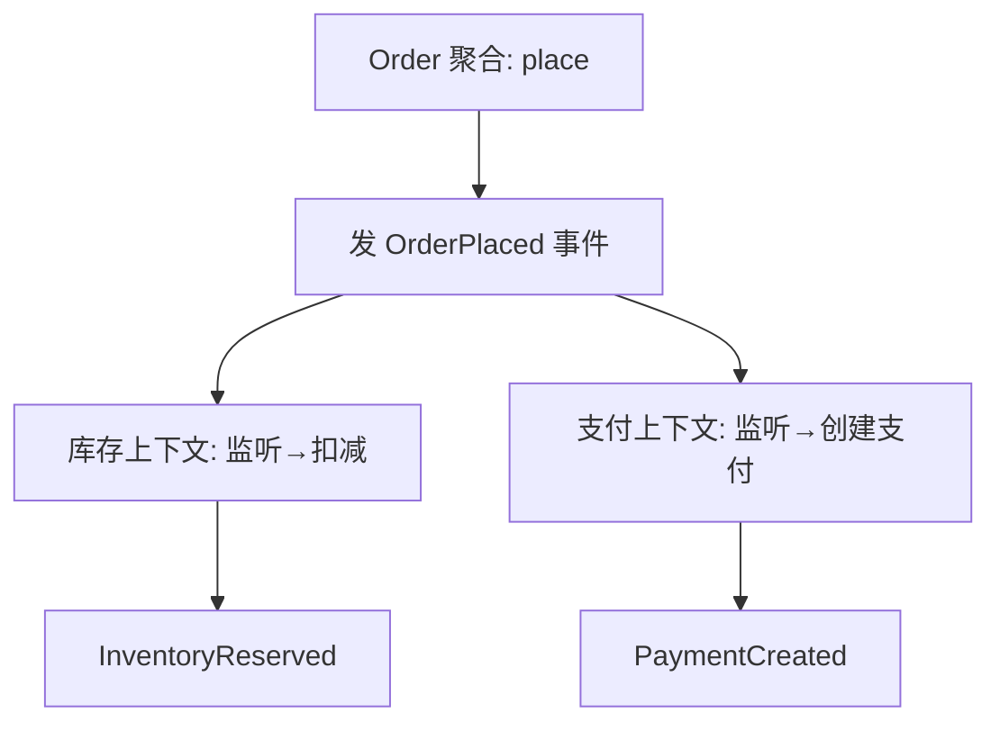

# DDD 聚合设计深度（Aggregate Design）

> 配套：[战术设计](战术设计.md) · [反模式与踩坑](反模式与踩坑.md) · 返回：[板块导航](README.md)
> 聚合（Aggregate）是 DDD 战术设计里**最难拿捏**的概念——划大了事务重、并发冲突多；划小了跨聚合最终一致又把复杂度推给事件。本篇专讲"怎么划、怎么守、怎么设计聚合内部"。

---

## 〇、为什么聚合设计是 DDD 的"胜负手"

聚合是**一致性边界**与**事务边界**的统一体：
- 聚合内：强一致（一个事务保证不变量）；
- 聚合间：最终一致（事件 + 消息）。

聚合设计的好坏，直接决定系统的**并发能力、事务复杂度、演进成本**。Vaughn Vernon 的判准：**"一个事务只改一个聚合"** 是 DDD 性能与正确性的基石。

---

## 一、聚合的四大设计准则

### 准则 1：一个事务只修改一个聚合
跨聚合不要在一个事务里同时改。否则长事务、死锁、扩展受限。

```java
// 反例：一个事务改 Order + Payment + Inventory
@Transactional
void checkout(OrderId oid, PaymentId pid, InvId iid) { ... }  // 灾难

// 正例：只改主聚合 Order，其余发事件
@Transactional
void checkout(OrderId oid) {
    Order o = repo.load(oid);
    o.place();                 // 只改 Order 聚合
    eventBus.publish(new OrderPlaced(o.id()));  // 其余靠事件最终一致
}
```

### 准则 2：聚合边界 = 一致性边界
"哪些对象必须一起保持一致的"放进同一聚合。例如 `Order` 与 `OrderLine` 必须一起一致（订单总额=各明细之和）→ 同聚合；`Order` 与 `Customer` 不需要一起一致 → 拆开，用 `CustomerId` 引用。

### 准则 3：聚合通过 ID 引用，而非对象引用
聚合间用**值对象 ID** 关联，不要持有关联聚合的对象引用（否则容易跨聚合事务、双向依赖）。

```java
class Order {                       // 聚合根
    private OrderId id;
    private CustomerId customerId;  // 引用，不是 Customer 对象
    private List<OrderLine> lines;  // 聚合内实体
}
```

### 准则 4：聚合要小
"小聚合"是 Vernon 的核心主张。大聚合 = 大锁范围 = 高冲突。能拆就拆，跨聚合协作走事件。

---

## 二、聚合根的识别

| 信号 | 说明 | 例子 |
|------|------|------|
| 有独立生命周期 | 可被创建/删除，不依赖父 | `Order` 独立于 `Customer` |
| 有全局唯一标识 | 业务上用 ID 引用 | `OrderId`、`ProductId` |
| 保护不变量 | 需保证内部一致性规则 | 订单总额 = 明细之和 |
| 是事件主体 | 领域事件围绕它发生 | `OrderPlaced` |

> 不是所有实体都是聚合根。很多实体只是聚合内的**内部实体**（如 `OrderLine` 不能脱离 `Order` 独立存在，无全局 ID）。

---

## 三、聚合内部设计

### 3.1 用行为方法替代 setter
聚合内的状态变更必须通过**业务方法**，禁止暴露 `setXxx` 让外部随意改。

```java
// 反例（贫血）
order.setStatus("PAID"); order.setPaidAt(now);

// 正例（富血）
class Order {
    void pay(Money amount, Clock clock) {
        if (status != Status.UNPAID) throw new IllegalStateException("已支付");
        this.status = Status.PAID;
        this.paidAt = clock.now();
        this.addEvent(new OrderPaid(id, amount));
    }
}
```

### 3.2 不变量（Invariant）写在聚合内
"订单取消后不能再支付""库存不能为负"——这些规则必须聚合自己守护，而非散在 Service。

### 3.3 值对象承载无标识概念
`Money`、`Address`、`Quantity` 等无标识、不可变的概念用**值对象**（Value Object），提供行为（如 `Money.add`）与自校验。

```java
record Money(long cents, Currency ccy) {
    Money add(Money o) {
        if (!ccy.equals(o.ccy)) throw new IllegalArgumentException("币种不同");
        return new Money(cents + o.cents, ccy);
    }
}
```

---

## 四、聚合间协作：最终一致



- 主聚合在事务内发布事件（用**事务发件箱 Outbox** 保证不丢）；
- 下游聚合/上下文监听事件、各自在自己的事务里更新；
- 失败靠**补偿事件 / 重试 / 人工对账**兜底。

---

## 五、聚合与持久化（Repository）

- 一个 Repository 只管**一个聚合根**（不提供跨聚合 JOIN 查询）；
- 仓储接口定义在**领域层**，实现在基础设施层（Spring Data / MyBatis）；
- 聚合的加载要"整装"——要么全加载，要么不加载（不要半加载导致不变量失效）。

```java
interface OrderRepository {            // 领域层接口
    Order load(OrderId id);
    void save(Order order);           // 保存整个聚合+发布事件
}
```

---

## 六、常见设计误区

| 误区 | 后果 | 修正 |
|------|------|------|
| 一个超大类当聚合根 | 大事务、高冲突 | 按一致性边界拆小 |
| 聚合间对象引用 | 隐式跨聚合事务 | 改用 ID 引用 |
| 暴露 setter | 不变量被破坏 | 行为方法 + 值对象 |
| Repository 做跨聚合查询 | 聚合边界模糊 | 查询走 CQRS 读模型 |
| 聚合里调外部服务 | 领域层被污染、难测 | 领域事件 + 应用层编排 |

---

## 七、面试高频追问

1. Q：聚合是什么？ A：一致性边界+事务边界；聚合内强一致，聚合间最终一致。
2. Q：一个事务改几个聚合？ A：只改一个；跨聚合靠事件最终一致。
3. Q：聚合根怎么识别？ A：独立生命周期+全局ID+守护不变量+是事件主体。
4. Q：聚合间为什么用 ID 引用？ A：避免对象引用导致跨聚合事务与双向依赖。
5. Q：大聚合的危害？ A：事务重、锁冲突多、难并发、难演进。
6. Q：聚合内状态怎么改？ A：通过行为方法而非 setter，不变量自己守护。
7. Q：Repository 对应什么粒度？ A：一个 Repository 管一个聚合根，不跨聚合 JOIN。
8. Q：聚合与事务发件箱关系？ A：聚合在事务内生成事件，Outbox 保证事件与业务同落库不丢。

---

## 八、Cheat Sheet

| 准则 | 一句话 |
|------|--------|
| 事务 | 一次只改一个聚合 |
| 边界 | 边界=一致性边界 |
| 引用 | 聚合间用 ID，不用对象 |
| 大小 | 聚合要小 |
| 内部 | 行为方法替代 setter，不变量自守 |
| 协作 | 事件 + 最终一致 + Outbox |
| 仓储 | 一个聚合一个 Repository |
