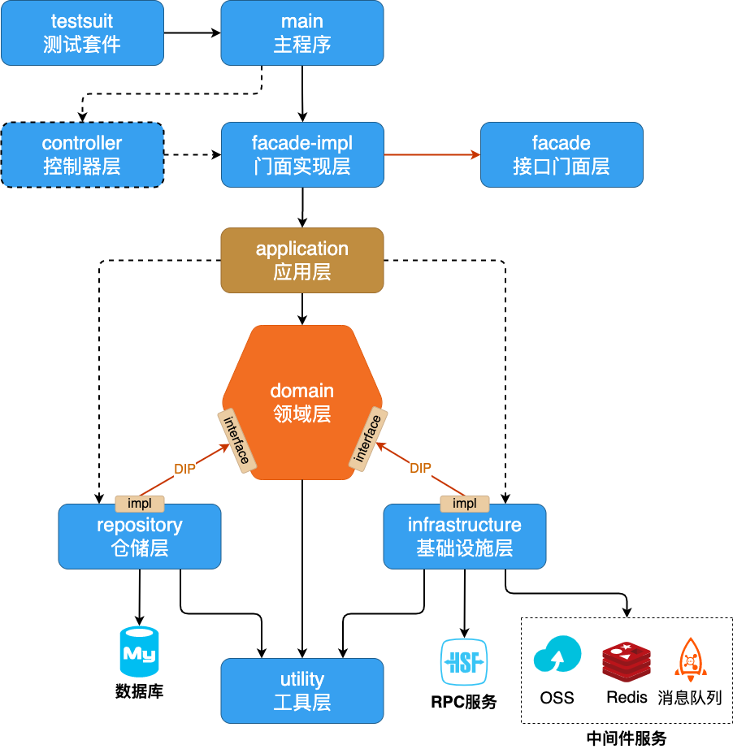
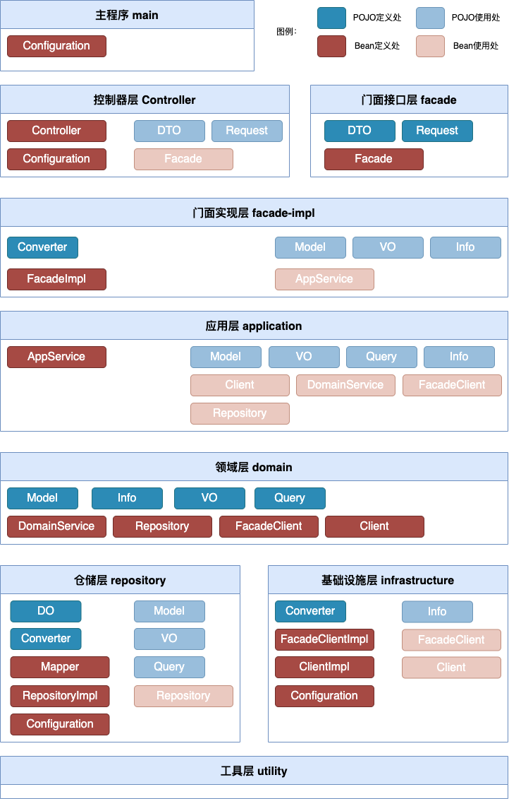
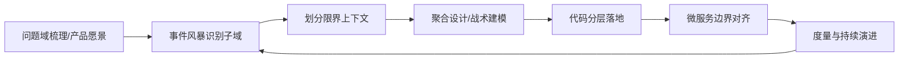
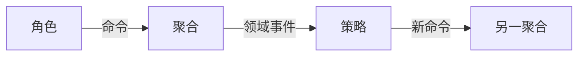
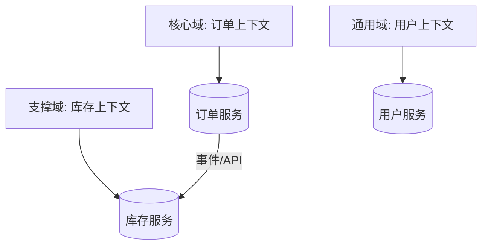
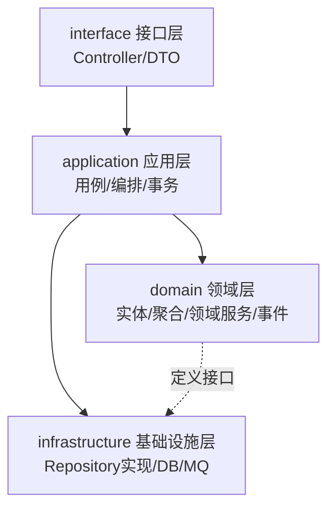

# DDD 落地

> 本页整理 DDD 在真实项目中的落地实践，内容以参考文章与示意图为主，待进一步补充文字笔记。

[https://mp.weixin.qq.com/s/HMLpjcE0UENUTfMK0Z9n8A](https://mp.weixin.qq.com/s/HMLpjcE0UENUTfMK0Z9n8A)





## DDD 落地路线图

真实项目中，DDD 不是一次性设计，而是"战略 → 协作 → 战术 → 演进"的循环：



推荐节奏：先在高价值核心域试点，跑通"建模—编码—上线"闭环，再向支撑域推广，避免全量铺开导致返工。

## 事件风暴 EventStorming 实操

事件风暴是 DDD 中最常用的**协作建模工作坊**，由 Alberto Brandolini 提出。参与者包括领域专家、开发、测试、产品，借助便签在墙上协作。

### 核心元素

| 颜色 | 元素 | 含义 |
|---|---|---|
| 橙色 | 领域事件 (Event) | 已发生的事实，过去时，如"订单已支付" |
| 蓝色 | 命令 (Command) | 触发事件的动作，来自人或系统 |
| 黄色 | 聚合 (Aggregate) | 处理命令、产生事件的边界 |
| 绿色 | 策略/规则 (Policy) | 事件触发的新命令（反应） |
| 紫色 | 角色 (Actor) | 执行命令的人/系统 |
| 红色 | 热点 (Hotspot) | 疑问点/风险点，待澄清 |

### 流程

1. **贴事件**：领域专家口述业务流程，全员把"发生了什么"写成橙色便签铺满墙（时间从左到右）。
2. **补命令与角色**：在每个事件左侧加蓝色命令、左侧加紫色角色，回答"谁、做了什么导致该事件"。
3. **圈聚合**：把能处理一组命令/事件的黄色便签聚成聚合，确定聚合根。
4. **连策略**：用绿色便签标注"某事件发生后自动触发另一命令"。
5. **标热点**：红色便签标记歧义、性能、合规等风险。



产出：一张反映真实业务的"大图"，可直接映射出限界上下文与聚合边界。

## 聚合划分原则

除上文"小、ID 引用、内强外终"外，落地时额外遵循：

1. **不变性优先**：把需要在一个事务内保持一致的实体放进同一聚合。
2. **生命周期一致**：一起创建、一起消亡的对象考虑同聚合。
3. **一致性边界 = 事务边界**：聚合边界决定数据库事务范围，不要跨聚合开事务。
4. **警惕"用户"聚合**：User 往往是被多方引用的共享概念，宜作为 ID 引用而非大聚合。
5. **重构友好**：聚合边界可随业务理解深入调整，不必一次到位。

## 与微服务边界对齐

经典映射：**一个限界上下文 ≈ 一个微服务**。但要注意：

- 限界上下文是**逻辑边界**，微服务是**物理边界**，二者不必 1:1 强制；
- 小团队初期可多个上下文同进程（模块化单体），待真正需要独立部署/扩展再拆；
- 避免"按聚合拆服务"导致聚合间分布式事务——聚合本来就在一上下文内，上下文才是服务边界。



## 代码分层骨架（interface/application/domain/infrastructure）

推荐四层，依赖方向由外向内：



### 各层职责

| 层 | 职责 | 是否依赖框架 |
|---|---|---|
| interface | 接收请求、参数校验、DTO 转换、返回响应 | 是（Web/GraphQL） |
| application | 编排用例、开启事务、发布事件、调用领域 | 尽量少 |
| domain | 纯业务逻辑、不变量、领域事件定义 | 否（纯 Java） |
| infrastructure | 实现 domain 定义的仓储/端口、对接 DB/MQ | 是 |

### 示例代码

interfaces/OrderController.java

```java
@RestController
@RequestMapping("/orders")
public class OrderController {
    private final PlaceOrderService placeOrderService;

    @PostMapping
    public ResponseEntity<OrderDto> place(@RequestBody PlaceOrderRequest req) {
        OrderId id = placeOrderService.place(req.toCommand());
        return ResponseEntity.ok(OrderDto.from(id));
    }
}
```

application/PlaceOrderService.java

```java
@Service
@Transactional
public class PlaceOrderService {
    private final OrderRepository orderRepository;
    private final DomainEventPublisher eventPublisher;

    public OrderId place(PlaceOrderCommand cmd) {
        Order order = Order.create(cmd.getCustomerId(), cmd.getItems());
        orderRepository.save(order);
        eventPublisher.publish(new OrderCreatedEvent(order.getId()));
        return order.getId();
    }
}
```

domain/Order.java（聚合根，见入门篇示例，此处略）

infrastructure/OrderJpaRepository.java

```java
@Repository
public class OrderJpaRepository implements OrderRepository {
    private final JpaOrderDao dao;
    public Order load(OrderId id) { return dao.findById(id).orElseThrow(); }
    public void save(Order order) { dao.save(order); }
}
```

注意：`OrderRepository` 接口定义在 **domain** 层，实现放在 **infrastructure** 层，由 Spring 依赖注入，实现"依赖倒置"。

## 落地中组织与协作

1. **建立通用语言词典**：把关键术语、含义、歧义记录成文档，开发与设计共用，避免"同词不同义"。
2. **联合工作坊**：事件风暴需领域专家到场，开发不能闭门造车。
3. **康威定律对齐**：团队结构会影响架构，按限界上下文组织小队（如"订单小队"负责订单上下文及服务）。
4. **代码评审看边界**：评审时重点检查是否跨聚合直接引用、是否在领域层引入框架注解。
5. **度量与反馈**：以"需求变更影响范围""缺陷密度"验证边界合理性，持续微调子域划分。
