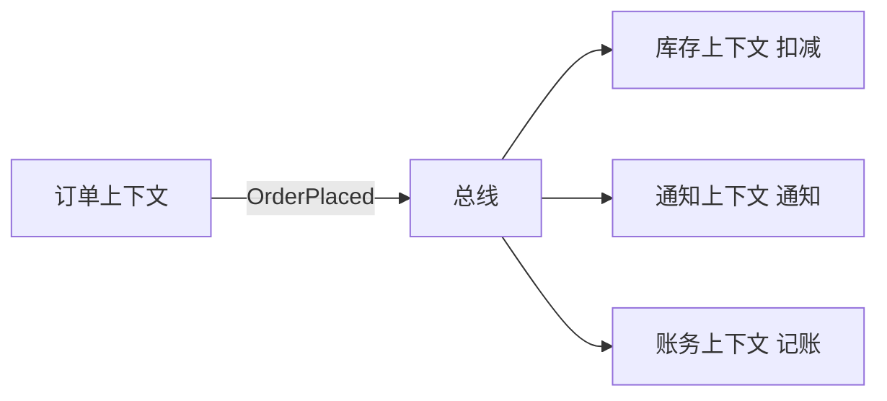

# DDD 领域事件与事件溯源实战

> 领域事件（Domain Event）是领域模型的重要组成部分，表达"已经发生的事实"；事件溯源（Event Sourcing）则用事件流重建状态。本文讲二者的设计与落地。

## 1. 领域事件是什么

- 领域事件是对业务上有意义的事实的显式建模，如 `OrderPlaced`、`PaymentReceived`。
- 命名用过去式，表达"已发生"。
- 作用：解耦限界上下文、触发后续动作、留痕审计。

```java
class OrderPlaced implements DomainEvent {
    String orderId;
    LocalDateTime at;
}
```

## 2. 事件的产生与发布

- 聚合内收集事件，提交时统一发布（不早不晚）。
- 应用层或基础设施层把事件发到消息总线。
- 注意：事件发布应在事务内或事务后（用 Outbox 保证一致）。

```java
Order o = repo.find(id);
o.confirm();                 // 内部 record 事件
repo.save(o);               // 持久化
eventBus.publish(o.events()); // 发布
```

## 3. 事件驱动协作



- 各上下文订阅关心的事件，互不耦合。
- 上下文映射：发布-订阅（Published Language）。

## 4. 事件溯源（Event Sourcing）

- 不存当前状态，只存事件序列；当前状态 = 重放事件。
- 聚合通过 `apply(event)` 重演恢复：

```java
class Order {
    void apply(OrderCreated e){ this.id=e.id; this.status=PENDING; }
    void apply(OrderPaid e){ this.status=PAID; }
    Order load(List<Event> history){ history.forEach(this::apply); return this; }
}
```

## 5. ES 的利弊

| 优点 | 缺点 |
| --- | --- |
| 完整审计轨迹 | 查询需物化视图 |
| 可回放任意时点 | 事件版本迁移复杂 |
| 天然事件源 | 学习曲线陡 |
| 高写入吞吐 | 读需重放/CQRS |

## 6. 快照优化

- 事件过多时重放慢，定期打快照。
- 恢复 = 最近快照 + 其后事件。

## 7. 事件版本与演化

- 事件 schema 会演变：加字段、改结构。
- 用版本号 + 向后兼容反序列化（缺字段给默认）。
- 旧事件重放需兼容新模型。

## 8. 与 CQRS 配合

- 写侧：事件溯源维护聚合。
- 读侧：事件投影到查询模型（见 CQRS 章节）。
- 经典组合：ES + CQRS。

## 9. 常见坑

| 坑 | 现象 | 对策 |
| --- | --- | --- |
| 事件过早发 | 不一致 | 事务后发/Outbox |
| 事件过大 | 耦合 | 只带必要字段 |
| 无版本 | 重放失败 | 事件版本化 |
| 重放慢 | 延迟 | 快照 |

## 10. 面试题

1. 领域事件为何用过去式？
2. 事件何时发布才一致？
3. 事件溯源如何恢复状态？
4. ES 与 CQRS 关系？
5. 事件版本如何演化？

## 11. 小结

领域事件是解耦上下文的纽带；事件溯源用"事件即真相"提供完整可回放的历史。二者与 CQRS 组合，是复杂领域建模的强力工具，但需正视版本演化与查询物化的成本。
