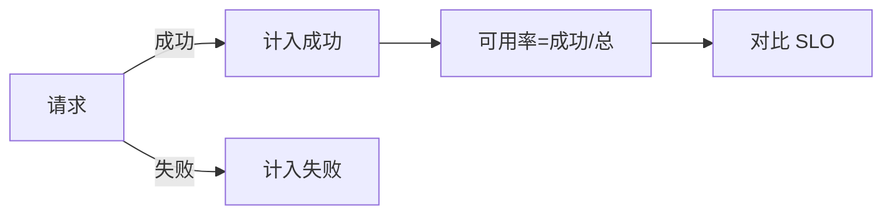
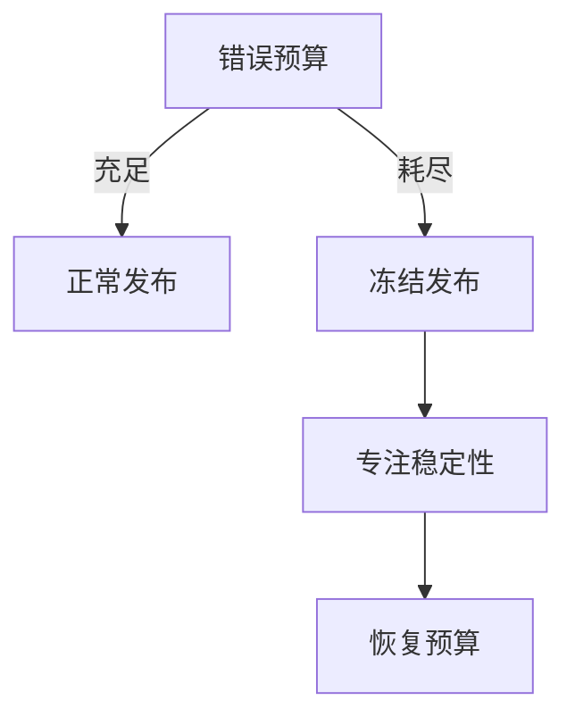

# SLO 驱动的可靠性工程实战

> SLO（服务等级目标）不是 KPI 摆设，而是用"错误预算"把可靠性量化为可决策的数字，统一研发与 SRE 的目标。本文讲清 SLO/SLI/错误预算的设计与落地。

## 1. 核心概念

| 术语 | 含义 |
| --- | --- |
| SLI | 服务等级指标（实际测量，如可用率） |
| SLO | 服务等级目标（目标值，如 99.9%） |
| SLA | 服务等级协议（合同，含违约惩罚） |
| 错误预算 | 1 - SLO，允许失败的量 |

关系：SLI 实测 → 对比 SLO → 剩余错误预算决定发布节奏。

## 2. 如何定义 SLI

SLI 要可测、用户相关。常见：
- 可用率 = 成功请求 / 总请求。
- 延迟达标率 = P99 < 300ms 的比例。
- 数据持久性 = 丢失记录 / 总记录。

## 3. 设定 SLO 的原则

- **用户视角**：SLO 应反映用户真实体验，而非内部指标。
- **可达且有意义**：太松无约束，太紧不可达。
- **分层**：核心交易 SLO 严，内部工具可松。
- **绑定错误预算**：SLO 决定预算，预算驱动行为。

示例：订单服务 SLO = 月度可用率 99.95%（约每月允许 21.9 分钟不可用）。

## 4. 错误预算政策

- 预算充足：快速迭代、敢发布。
- 预算耗尽：冻结功能发布，只修稳定性。
- 这种"自动刹车"统一了"快"与"稳"的矛盾。

## 5. 多窗口多燃烧率告警

避免"瞬时抖动告警"与"慢火烧完无感"：
- 多窗口：短窗口（快燃） + 长窗口（慢燃）。
- 燃烧率 = 实际错误率 / 预算消耗率。
- 快燃（如 1 小时烧 2% 预算）→ 紧急；慢燃（数天烧完）→ 工单。

## 6. SLO 与工作流结合

| 场景 | 动作 |
| --- | --- |
| 预算充足 | 正常发布节奏 |
| 预算告急 | 评审发布、加门禁 |
| 预算耗尽 | 冻结非紧急发布 |
| 事后 | 复盘消耗原因 |

## 7. 与 MTTR/MTBF 关系

- **MTBF**（平均无故障时间）：可靠性体现。
- **MTTR**（平均恢复时间）：故障影响时长。
- SLO 失败常因 MTTR 过大，提升可观测+自动化恢复是关键。

## 8. 常见反模式

| 反模式 | 问题 |
| --- | --- |
| SLO 过松 | 无约束力 |
| SLO 不可测 | 形同虚设 |
| 只看均值 | 长尾用户受损 |
| 预算无政策 | 冲突无解 |
| SLA=SLO | 合同风险 |

## 9. 落地步骤

1. 选关键用户旅程，定义 SLI。
2. 设 SLO（与业务对齐）。
3. 建错误预算政策。
4. 接告警（多窗口燃烧率）。
5. 定期回顾，迭代 SLO。

## 10. 常见坑

| 坑 | 现象 | 对策 |
| --- | --- | --- |
| SLO 不可测 | 无法执行 | 先建 SLI 采集 |
| 预算无约束 | 仍乱发 | 绑定发布政策 |
| 告警噪音 | 无视 | 燃烧率过滤 |
| 内部指标当SLO | 偏离用户 | 用户视角定义 |

## 11. 面试题

1. SLI、SLO、SLA 区别？
2. 错误预算如何驱动发布？
3. 为什么用多窗口燃烧率告警？
4. SLO 设定原则？
5. SLO 与 MTTR 的关系？
6. 常见 SLO 反模式？

## 12. 小结

SLO 把"可靠性"变成可决策的数字。错误预算是核心机制：预算充足快发，耗尽则刹车。配套多窗口燃烧率告警，SLO 才能从纸面落到工程实践，统一研发速度与稳定性。
