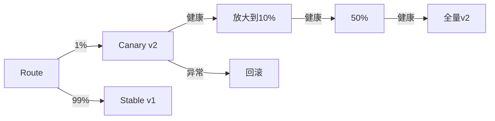

# 变更管理与发布工程实战

> 统计数据表明，绝大多数线上故障由"变更"引起（Google SRE 称约 70% 事故源于变更）。变更管理与发布工程的目标，是用工程化手段让变更"可灰度、可观测、可回滚、低风险"。本文系统讲解。

## 1. 变更是故障第一来源

| 故障来源 | 占比（经验） |
| --- | --- |
| 变更（发布/配置/基础设施） | ~70% |
| 容量/过载 | ~10% |
| 外部依赖 | ~10% |
| 其他 | ~10% |

结论：管住变更，就管住了大部分事故。发布工程（Release Engineering）是 SRE 的核心职能。

## 2. 变更管理的四道防线

1. **评审**：代码评审 + 变更评审（尤其配置/DB/网络）。
2. **灰度**：先小流量验证，再扩大。
3. **自动校验**：发布后自动检查健康（错误率、延迟、核心指标）。
4. **回滚**：异常一键回退。

## 3. 发布策略

| 策略 | 说明 | 适用 |
| --- | --- | --- |
| 蓝绿 | 两套环境切换 | 需快速回滚 |
| 金丝雀 | 小比例引流逐步放大 | 降低风险 |
| 滚动 | 逐步替换实例 | 常规升级 |
| 影子 | 引流不接真实流量 | 压测/验证 |

### 金丝雀示例

## 4. 配置变更管控

- 配置与代码分离（如 ConfigMap/Nacos/Apollo）。
- 配置变更走同一评审与灰度流程，不可"随手改"。
- 动态配置支持热更新，但需校验合法性。
- 配置回滚与代码回滚同等重要。

## 5. 数据库变更

DB 变更是最高风险：
- **向后兼容**：先加字段（不删旧），再改代码，最后清理。
- **Online DDL**：用 gh-ost/pt-osc 避免锁表。
- **大表迁移**：分批、限速、可中断。
- **回滚预案**：DDL 回滚往往难，需提前演练。

## 6. 发布门禁（Gate）

发布流水线中设置自动卡点：
- 单元测试/集成测试通过。
- 安全扫描无高危。
- 灰度期指标无劣化（错误率、P99）。
- 关键变更需人工审批。

## 7. 可观测的发布

- 发布与监控联动，发布标记打在指标/链路上（deployment marker）。
- 发布后对比"发布前 vs 发布后"核心指标。
- 异常自动告警并建议回滚。

## 8. 变更冻结与窗口

- 大促/节假日设变更冻结期，禁止非紧急变更。
- 常规变更走发布窗口，避免随时随意发。
- 紧急变更走紧急流程但必须事后复盘。

## 9. 事后复盘（Postmortem）

- 每次故障/近故障写复盘，聚焦根因与改进，非追责。
- 输出 Action Item 并跟踪闭环。
- 把教训沉淀为发布工程改进（如新增门禁）。

## 10. 常见坑

| 坑 | 现象 | 对策 |
| --- | --- | --- |
| 直接全量 | 故障面广 | 强制灰度 |
| 配置随手改 | 引入故障 | 配置走流程 |
| 无回滚 | 卡死 | 发布前验证回滚 |
| DB 锁表 | 雪崩 | Online DDL |
| 指标无对比 | 发现晚 | 发布标记+对比 |

## 11. 面试题

1. 为什么变更是故障主因？
2. 金丝雀与蓝绿区别？
3. 数据库变更为何高风险？如何降低？
4. 发布门禁应包含哪些？
5. 发布如何与监控联动？
6. 变更冻结的意义？

## 12. 小结

变更管理 = 评审 + 灰度 + 自动校验 + 回滚。发布工程用工程化手段把"变更风险"压到最低：DB 变更重兼容、配置变更走流程、发布打标记做指标对比。70% 的事故来自变更，管住变更就是管住稳定性。
