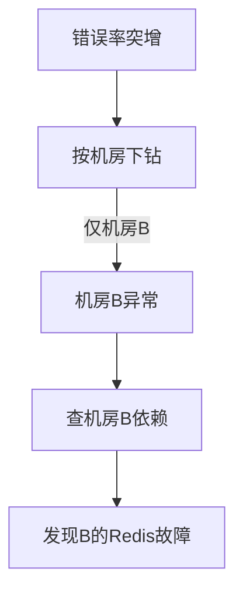

# 根因分析与故障定位实战

> 故障发生时，快速定位根因（RCA）是 SRE 的核心能力。本文讲解故障定位的方法论、工具链、常见信号与系统化排查流程。

## 1. 定位的黄金链路

原则：先止血（止损）再查因；用数据而非猜测；缩小范围再深入。

## 2. 四层信号

| 层 | 信号 | 工具 |
| --- | --- | --- |
| 基础设施 | CPU/内存/磁盘/网络 | node_exporter、top |
| 应用 | 错误率/QPS/GC/线程 | APM、metrics |
| 依赖 | 下游延迟/错误 | 链路追踪 |
| 业务 | 订单跌/登录降 | 业务指标 |

自上而下逐层排查，定位是"哪一层先异常"。

## 3. 指标下钻

- 看黄金信号（延迟/流量/错误/饱和度）哪个先劣化。
- 按维度下钻：哪个机房、哪个集群、哪个接口、哪类用户。
- 对比发布时间线：故障是否紧跟某次变更？

## 4. 链路追踪定位

- 用 traceId 看慢/错调用落在哪个服务。
- 对比正常 trace 与异常 trace 的差异路径。
- 定位"是自身慢还是被下游拖慢"。

## 5. 日志取证

- 结构化日志 + traceId 关联，快速捞出相关日志。
- 关注错误栈、超时、异常码、降级日志。
- 高频错误聚合，找共性（同一参数/同一用户）。

## 6. 依赖与变更

- 查近期变更：发布、配置、DB、网络、基础设施。
- 查依赖健康：下游、中间件、第三方。
- 很多故障是"自己没变，依赖变了"。

## 7. 假设-验证法

1. 基于信号提出假设（如"Redis 慢导致超时"）。
2. 设计验证（查 Redis 延迟、连接数）。
3. 验证或推翻，迭代。
避免"锚定"：不要死抱第一个猜测。

## 8. 止损优先

定位前先止损：
- 回滚最近变更。
- 限流/降级/熔断。
- 切流量到健康单元。
- 扩容临时缓解。

> 先恢复服务，再从容查根因。用户不关心你何时找到根因，只关心何时恢复。

## 9. 工具链

| 用途 | 工具 |
| --- | --- |
| 指标 | Prometheus/Grafana |
| 日志 | ELK/Loki |
| 链路 | Jaeger/Tempo |
| Profiling | pprof/Pyroscope |
| 诊断 | tcpdump/arthas |

## 10. 复盘与预防

- 写复盘：时间线、根因、影响、改进项。
- 改进落到监控/告警/自动化，防复发。
- 把排查经验沉淀为 Runbook。

## 11. 常见坑

| 坑 | 现象 | 对策 |
| --- | --- | --- |
| 不先止血 | 影响扩大 | 回滚/降级优先 |
| 凭猜乱改 | 雪上加霜 | 假设-验证 |
| 锚定偏见 | 走偏 | 多假设 |
| 无 traces | 难定位 | 全链路埋点 |
| 不复盘 | 重复踩 | 沉淀 Runbook |

## 12. 面试题

1. 故障定位的标准流程？
2. 为什么先止血再查因？
3. 如何用 traceId 定位慢调用？
4. 假设-验证法是什么？
5. 常见定位误区？
6. 如何避免故障复发？

## 13. 小结

故障定位 = 信号下钻 + 链路追踪 + 日志取证 + 假设验证。核心纪律：先止损后查因、用数据不靠猜、定位后写复盘沉淀预防。可观测三支柱是定位的物质基础。
