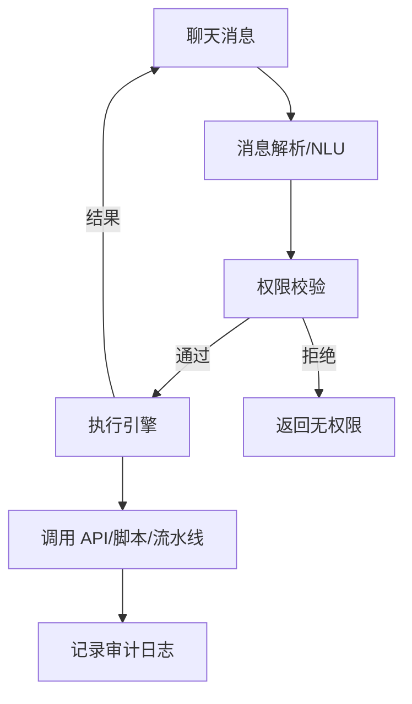

# 自动化运维与 ChatOps 实战

> 当系统规模扩大，靠人工敲命令运维既慢又易错。自动化运维把重复操作代码化、平台化，ChatOps 更进一步把运维动作收敛到聊天窗口，通过对话驱动执行。本文讲解自动化运维的演进、ChatOps 架构、机器人设计与落地坑点。

## 1. 运维自动化的演进

| 阶段 | 特征 | 痛点 |
| --- | --- | --- |
| 手工运维 | SSH 登机器敲命令 | 慢、易错、不可复现 |
| 脚本化 | Shell/Python 脚本 | 散落、难管理、无审计 |
| 平台化 | 运维平台/门户 | 好用但流程固化 |
| ChatOps | 聊天窗口驱动 | 协作透明、低门槛 |

自动化的本质是：把"人脑里的操作知识"固化成"可重复、可审计、可回滚"的代码与流程。

## 2. 自动化的核心原则

- **幂等**：同一操作重复执行结果一致（如 Ansible 的 idempotent）。
- **可观测**：每次自动化执行有日志、有结果、可追踪。
- **可回滚**：变更类操作必须有回滚预案。
- **最小权限**：自动化账号按需在最小范围授权。
- **审计**：谁、何时、执行了什么，留痕。

## 3. ChatOps 是什么

ChatOps 把运维工具接入聊天工具（Slack/飞书/钉钉/企业微信），通过"聊天机器人"执行命令：

```mermaid
flowchart LR
    U[工程师] -->|@bot 部署 v2| C[聊天群]
    C --> B[Bot]
    B -->|调用| A[自动化平台/CI/CD]
    A -->|结果| B
    B -->|回群| C
```

价值：操作在群里可见，团队共享上下文；新人不需记复杂命令；操作自然留痕。

## 4. Bot 架构设计



- **解析层**：识别意图（正则/命令式或 LLM 自然语言）。
- **权限层**：校验"这个人能否执行该操作"。
- **执行层**：对接底层系统（K8s、CI、监控、CMDB）。
- **审计层**：全程记录。

## 5. 典型场景

| 场景 | 命令示例 |
| --- | --- |
| 部署 | `@bot deploy order v2.3 to prod` |
| 查询 | `@bot pods order in ns-foo` |
| 告警处理 | `@bot restart order-7` |
| 审批 | `@bot approve release-123` |
| 值班 | `@bot who is oncall today` |

## 6. 权限与安全

- **危险操作分级**：只读 vs 写操作 vs 高危（删库、生产变更）需二次审批。
- **审批流集成**：高危命令触发审批，主管确认后才执行。
- **防误操作**：生产环境命令加确认/护栏。
- **凭证隔离**：Bot 用独立服务账号，不共享个人密钥。

```python
def handle(cmd, user):
    if cmd.risk == "HIGH" and not approver_ok(user, cmd):
        return "需审批: " + request_approval(cmd)
    if not rbac.check(user, cmd.action):
        return "无权限"
    return executor.run(cmd)
```

## 7. 自然语言 vs 命令式

- **命令式**：`@bot deploy x to y`，解析简单、可控。
- **自然语言**：用 LLM 理解"把订单服务发到生产"，灵活但需护栏（防幻觉执行错误命令）。
- 生产建议：LLM 做"理解+生成候选命令"，最终执行仍需结构化校验与确认。

## 8. 与 CI/CD、监控联动

- Bot 触发流水线（部署/回滚）。
- Bot 查询监控（当前错误率、延迟）。
- 告警自动进群，Bot 提供"一键处理"快捷动作。
- 结合 Runbook，告警附带标准处置建议。

## 9. 落地步骤

1. 先把高频手工操作脚本化（Ansible/Terraform/Python）。
2. 接入 CI/CD 与监控 API，暴露能力。
3. 搭建 Bot，接聊天工具，做命令解析。
4. 加权限与审批，分级管控。
5. 沉淀 Runbook，告警与处置联动。

## 10. 常见坑

| 坑 | 现象 | 对策 |
| --- | --- | --- |
| 权限过宽 | 误删生产 | 分级+审批 |
| 无审计 | 出事查不清 | 全程留痕 |
| 命令幻觉 | LLM 执行错 | 结构化校验 |
| 群里噪音 | 刷屏 | 结果收敛/线程 |
| 单点 Bot | Bot 挂则瘫 | 多入口+降级 |

## 11. 面试题

1. ChatOps 相比传统运维平台的优势？
2. 自动化运维的核心原则？
3. 如何用 LLM 增强 Bot 又不失控？
4. 高危操作如何管控？
5. 自动化为什么必须可回滚？
6. ChatOps 的审计怎么做？

## 12. 小结

自动化运维是"把知识变代码"，ChatOps 是"把执行放进协作流"。核心是幂等、权限分级、审批、审计四件套；LLM 可提升自然语言交互，但生产执行必须结构化护栏，避免幻觉带来事故。
