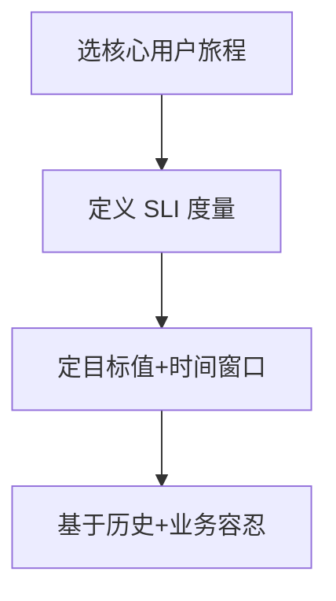
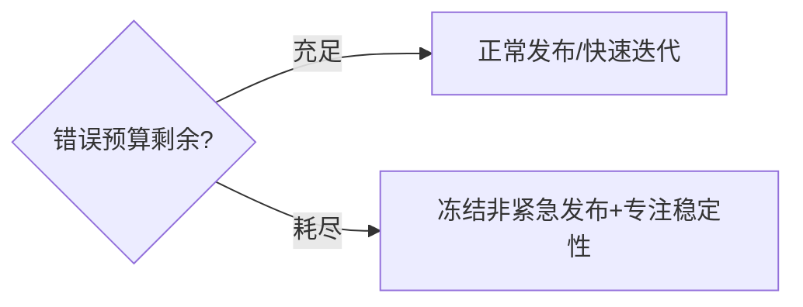

# 01 · SRE 理念与 SLI/SLO/Error Budget

> SRE 不是"高级运维"，而是一套**用工程方法管理稳定性**的体系。这一篇讲清起源、核心理念，以及最关键的度量工具：SLI / SLO / Error Budget。

---

## 一、SRE 是什么

SRE（Site Reliability Engineering）由 Google 提出，核心信条：

> **用软件工程的方法解决运维问题；让开发自己承担系统的可靠性。**

关键实践：
- **SRE 团队中 50% 以上时间做工程（自动化/工具），而非救火**；
- **开发写服务、也负责它的可靠性**（You build it, you run it）；
- **用 SLO 量化可靠性，用错误预算平衡迭代速度**。


---

## 二、SLI / SLO / SLA：三个常被混用的词

| 概念 | 全称 | 含义 | 谁定 |
|------|------|------|------|
| **SLI** | Service Level **Indicator** | 实际度量值（如可用率 99.95%） | 技术 |
| **SLO** | Service Level **Objective** | 内部目标（如"月度可用率 ≥99.9%"） | 技术+产品 |
| **SLA** | Service Level **Agreement** | 对客户的**合同承诺**，含违约赔偿 | 商务 |

> **口诀：SLI 是尺子，SLO 是目标，SLA 是合同（带罚则）。** SLA 通常比 SLO 宽松——给内部留缓冲。

### 2.1 常见 SLI 类型

| 类别 | SLI 例子 |
|------|----------|
| 可用性 | 成功请求 / 总请求 |
| 延迟 | P50/P95/P99 响应时间 |
| 吞吐 | QPS / 每秒处理 |
| 质量 | 错误率、数据准确性 |
| 饱和度 | 资源利用率（CPU/连接） |

### 2.2 好 SLI 的特征

- **用户导向**：从用户视角度量（"成功"是用户认为的成功，不是 HTTP 200）；
- **可聚合**：能按时间窗口计算；
- **少而精**：每个服务 3~5 个核心 SLI，别几百个。

---

## 三、SLO 怎么定



示例：
- 交易核心接口：`成功率 ≥ 99.95%（30天滚动）`
- 商品详情页：`P99 延迟 ≤ 300ms（7天）`

**定 SLO 的参考**（业界经验）：
- 99%（双九）：年停机 ~3.65 天——内部系统可接受
- 99.9%（三九）：年停机 ~8.76 小时——多数对外服务
- 99.95%（3.5 九）：年停机 ~4.38 小时——重要服务
- 99.99%（四九）：年停机 ~52 分钟——核心金融/支付

> **关键**：SLO 不是越高越好。四九比三九成本高一个数量级（冗余/多活/人力）。按业务价值定，别盲目追高。

---

## 四、Error Budget（错误预算）：平衡快慢的钥匙

错误预算 = 1 - SLO 允许的失败额度。

```
SLO 99.9% → 月允许错误 = 0.1% × 30天 × 1440分 = 43.2 分钟
```

### 4.1 错误预算政策（核心机制）



| 预算状态 | 动作 |
|----------|------|
| 剩余 > 50% | 正常节奏，敢发 |
| 剩余 20%~50% | 关注，重要变更加评审 |
| 剩余 < 20% | 冻结非关键发布，优先修稳定性 |
| 已耗尽 | 停发功能，全员稳定性冲刺 |

### 4.2 为什么这套机制好

- **停止"开发 vs 运维"扯皮**：用数据说话，不是"感觉不稳"；
- **给快速迭代以空间**：预算内就大胆发；
- **强制还债**：预算耗尽逼团队停下发新功能、修可靠性。

> **反模式**：手写 SLO 不执行、超预算照常发——等于没定。SLO 必须接**自动告警 + 预算看板**才有意义。

---

## 五、SRE 其他核心理念

| 理念 | 说明 |
|------|------|
| Toil（苦役）管理 | 重复性手动操作要自动化，设"苦役占比 <50%"目标 |
| 自动化优先 | 能脚本化的别人肉，解放人力做工程 |
| 渐进式风险 | 用金丝雀/渐进发布降低每次变更风险（见 05 篇） |
| 无指责复盘 | 事故 blame 人没用，改系统（见 04 篇） |

---

## 六、Cheat Sheet

| 概念 | 要点 |
|------|------|
| SLI | 用户视角的实际度量，少而精 |
| SLO | 内部目标，按业务价值定（别盲目四九） |
| SLA | 合同承诺带罚则，比 SLO 宽松 |
| 错误预算 | 1-SLO 允许失败，耗尽冻结发布 |
| 平衡 | 预算内快速迭代，超预算修稳定 |
| 自动化 | Toil <50%，能脚本别人肉 |

> 下一篇：[02 可观测性与稳定性看护](02-可观测性与稳定性看护.md) —— SLO 要"看得见"，指标/日志/链路三件套与黄金信号。
