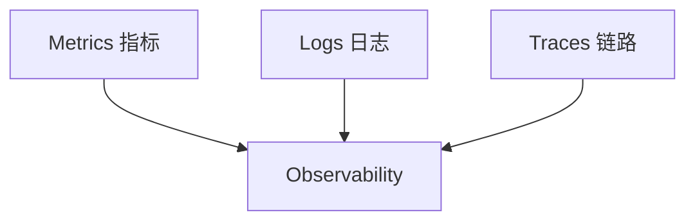
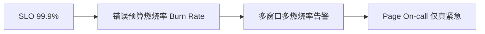
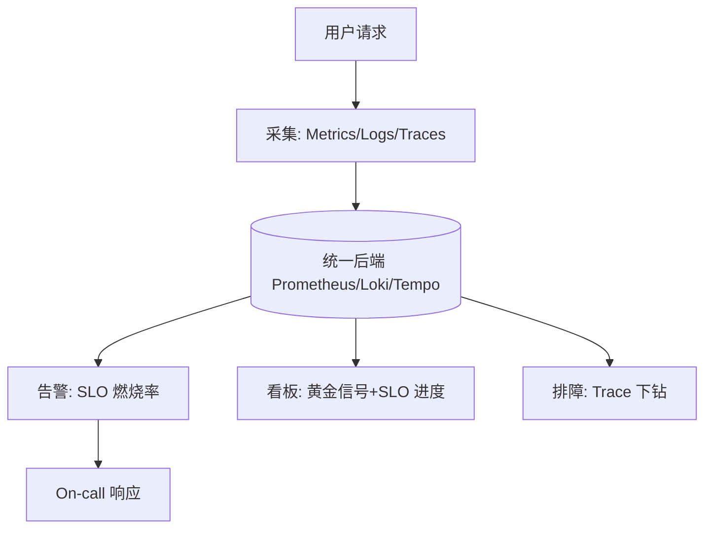

# 02 · 可观测性与稳定性看护

> SLO 定了，但**看不见就救不了**。可观测性（Observability）是 SRE 的"眼睛"——它让你在不改代码的前提下，理解系统内部状态。这一篇讲三件套与"用可观测性看护 SLO"。技术实现细节见 [云原生·可观测性](../云原生/可观测性.md)，本篇侧重 SRE 视角。日志怎么写、告警规则怎么配、阈值怎么定 → 见「[06 日志与告警规则库](06-日志与告警规则库.md)」。

---

## 一、可观测性的三件套

| 信号 | 是什么 | 特点 | 典型工具 |
|------|--------|------|----------|
| **Metrics** | 聚合数值（CPU、QPS、错误率） | 省存储、适合告警、看趋势 | Prometheus、VictoriaMetrics |
| **Logs** | 离散事件文本 | 详细但量大、难聚合 | Loki、ELK |
| **Traces** | 单次请求跨服务调用链 | 定位慢/错在哪一站 | Jaeger、Tempo、SkyWalking |

> **口诀：指标看趋势、日志看细节、链路看路径。** 三者互补，缺一不可。

---

## 二、四大黄金信号（RED / USE）

Google SRE 提出"黄金信号"，最该盯的 4 个：

| 信号 | 含义 | 例子 |
|------|------|------|
| **延迟 Latency** | 请求耗时 | P99 响应时间 |
| **流量 Traffic** | 请求量 | QPS、并发 |
| **错误 Errors** | 失败比例 | 5xx 率、超时率 |
| **饱和度 Saturation** | 资源饱和 | CPU%、连接池占用 |

**RED（请求服务）**：Rate（流量）/ Errors / Duration（延迟）——适合 API 服务。
**USE（资源）**：Utilization / Saturation / Errors——适合主机/中间件。

---

## 三、SLO 驱动的告警（而非"能报就报"）

传统告警的问题：**太吵**（CPU 波动也告警）→ 告警疲劳 → 真事故被淹没。

SLO 驱动的告警三原则：

1. **基于 SLO 而非阈值**：不是"CPU>80% 就报"，而是"按当前燃烧率，30 分钟内会烧光预算才报"；
2. **多窗口多燃烧率（Multi-window Multi-burn-rate）**：快速燃烧（如 14.4 倍）立刻 Page，慢速燃烧（如 1 倍）仅工单；
3. **降噪**：非 SLO 相关的波动不 Page，进 dashboard 自查。

> 燃烧率 = 实际错误率 / SLO 允许错误率。>1 即在消耗预算。

---

## 四、可观测性如何看护稳定性

- **事前**：SLO 进度看板，随时知道预算还剩多少；
- **事中**：燃烧率告警 Page On-call，Trace 秒级定位故障服务；
- **事后**：日志/Trace 复盘根因（见 04 篇）。

---

## 五、常见陷阱

| 陷阱 | 危害 |
|------|------|
| 只采集不告警/只看板 | 测到了但没人看 |
| 告警阈值乱设 | 告警疲劳，真事故被忽略 |
| 链路采样过低 | 慢请求漏采，难定位 |
| 日志打满敏感信息 | 合规风险（见 安全工程·数据安全） |
| 指标无标签维度 | 无法下钻（如按接口/地域） |

---

## 六、Cheat Sheet

| 主题 | 要点 |
|------|------|
| 三件套 | Metrics 趋势、Logs 细节、Traces 路径 |
| 黄金信号 | 延迟/流量/错误/饱和度（RED/USE） |
| 告警 | SLO 燃烧率驱动、多窗口多燃烧率、降噪 |
| 看护 | 进度看板 + 燃烧告警 + Trace 下钻 |
| 陷阱 | 告警疲劳、采样过低、日志泄密 |

> 下一篇：[03 容量规划与冗余容灾](03-容量规划与冗余容灾.md) —— 可观测性让你"看见"风险，容量与容灾让你"扛住"风险。
