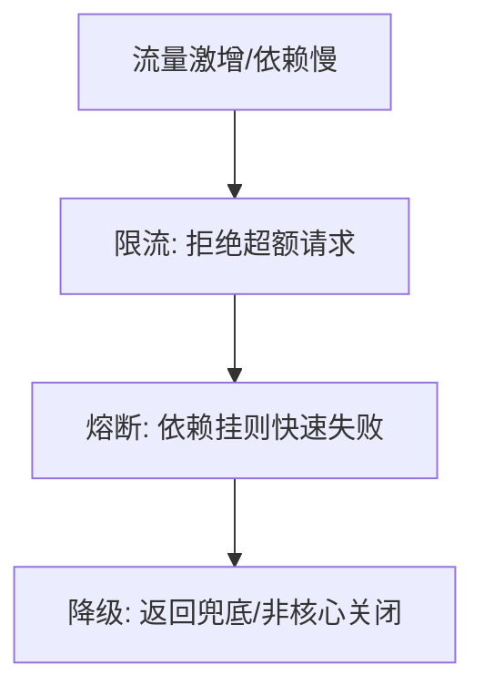

# 03 · 容量规划与冗余容灾

> 可观测性让你"看见"风险，这一篇让你"扛住"风险：容量规划保证**够用不浪费**，冗余与容灾保证**挂了能活**。

---

## 一、容量规划：既要够，又不浪费

### 1.1 容量模型

```
所需实例数 ≈ 峰值QPS × 单请求耗时(s) / 单实例最大并发 + 冗余系数(N+1~N+2)
```

| 输入 | 来源 |
|------|------|
| 峰值 QPS | 历史 + 业务增长预测 + 大促预案 |
| 单实例吞吐 | 压测得出（见 [测试·性能](../测试与代码质量/05-性能与负载测试.md)） |
| 冗余 | N+1（容忍 1 台挂）、N+2（容忍 2 台/可用区） |

### 1.2 容量规划流程


> **Headroom（余量）**：别压到 100%，留 20~30% 缓冲应对突发与实例不均。

### 1.3 容量陷阱

| 陷阱 | 后果 |
|------|------|
| 按均值规划 | 峰值打满，雪崩 |
| 无自动扩缩 | 闲时浪费、峰时不够 |
| 只算应用层 | DB/缓存/连接数成瓶颈 |

---

## 二、冗余设计：假设硬件会坏

| 冗余级别 | 做法 | 扛什么 |
|----------|------|--------|
| 实例级 N+1 | 多副本 | 单实例挂 |
| 机架/可用区级 | 跨 AZ 部署 | 单 AZ 故障 |
| 地域级 | 异地多活/冷备 | 地域级灾难 |

> 与 [场景设计·异地多活](../场景设计/异地多活.md) 联动：单元化、流量调度、数据同步是地域级冗余的工程实现。

---

## 三、容灾：RTO / RPO

| 指标 | 含义 | 例子 |
|------|------|------|
| **RTO** | 恢复时间目标（多久恢复服务） | 30 分钟 |
| **RPO** | 恢复点目标（丢多少数据） | 5 分钟（容忍丢 5 分数据） |

容灾等级（业界）：
- **冷备**：备份异地，恢复慢（RTO 小时级）
- **温备**：部分热，中速
- **热备/多活**：实时同步，秒级切换（RTO 分钟）

**备份铁律**：
- 3-2-1：3 份副本、2 种介质、1 份异地；
- **备份要定期演练恢复**——没演练的备份 = 没备份。

---

## 四、降级、限流、熔断：稳定性的三道战术防线

> 详细战术见 [场景设计·稳定性三板斧](../场景设计/稳定性三板斧：限流-熔断-降级.md)，这里从 SRE 视角串一下。



| 手段 | 作用 | SRE 关注点 |
|------|------|-----------|
| 限流 | 保护自身不被冲垮 | 阈值随容量调整 |
| 熔断 | 防级联雪崩 | 半开探测恢复 |
| 降级 | 保核心弃非核心 | 降级开关可热配 |

---

## 五、为失败设计（Design for Failure）

| 原则 | 做法 |
|------|------|
| 超时 | 每个外部调用必须超时（防挂死） |
| 重试 + 退避 | 幂等前提下指数退避 + 抖动 |
| 舱壁隔离 | 线程池/连接池隔离，防一处挤占全部 |
| 优雅降级 | 依赖挂时返回缓存/默认值 |
| 混沌验证 | 主动注入故障验证上述是否成立（见 [测试·混沌](../测试与代码质量/08-测试数据Mock服务与混沌工程.md)） |

---

## 六、Cheat Sheet

| 主题 | 要点 |
|------|------|
| 容量 | 峰值QPS×耗时/单实例 + N+1 + 20~30% Headroom |
| 冗余 | 实例→AZ→地域 三级，假设会坏 |
| 容灾 | RTO/RPO 量化；3-2-1 备份 + 演练恢复 |
| 三板斧 | 限流/熔断/降级，保核心 |
| 设计 | 超时/退避/舱壁/降级/混沌验证 |

---

## 七、容量评估实操（案例）

假设某接口峰值 10 万 QPS，压测单实例可抗 2000 QPS：

```
基础实例 = 100000 / 2000 = 50 台
N+1 冗余 → 50 × 1.25 = 63 台（可用性要求高可 N+2）
再加 20~30% Headroom → 63 × 1.25 ≈ 79 台
```

| 环节 | 常被忽略的坑 |
|------|--------------|
| 单实例压测口径 | 压测要含真实 DB/依赖，纯本机压测虚高 |
| 实例均匀性 | 新扩实例预热期吞吐低，需预扩容提前拉流量 |
| 存储容量 | 磁盘/连接数随数据增长，按「存量+增速」估算 |
| 突发尖峰 | 限流值要低于容量上限（给雪崩留缓冲） |

> 大促容量预案四步：预测峰值 → 压测核容量 → 预扩容到位 → 演练/全链路压测验证。

---

## 八、多活 vs 主备（选型视角）

| 维度 | 主备（Active-Standby） | 同城双活/异地多活 |
|------|------------------------|--------------------|
| 切换时间 | 分钟级（需人工/脚本） | 秒级或自动 |
| RPO | 分钟级（同步复制可趋零） | 趋零（同步链路） |
| 复杂度 | 低 | 高（路由/数据一致/脑裂） |
| 成本 | 低 | 高（双倍资源+人力） |

选型建议：
- 中小规模、成本敏感 → 主备 + 定期切换演练；
- 核心链路、可接受高成本 → 多活，且**多活必须演练切换**（详 [场景设计·异地多活](../场景设计/异地多活.md)）；
- 数据一致性要求极端（支付/交易）→ 同步复制 + 双写一致性校验。

> 面试高频题「你们怎么容灾的」按此框架答：RTO/RPO 指标 → 级别选择 → 备份/复制策略 → 演练频次，四段式讲完。

---

> 下一篇：[04 On-call 与事故管理](04-On-call与事故管理.md) —— 风险真的发生时，人怎么响应、怎么复盘、怎么不再犯。
