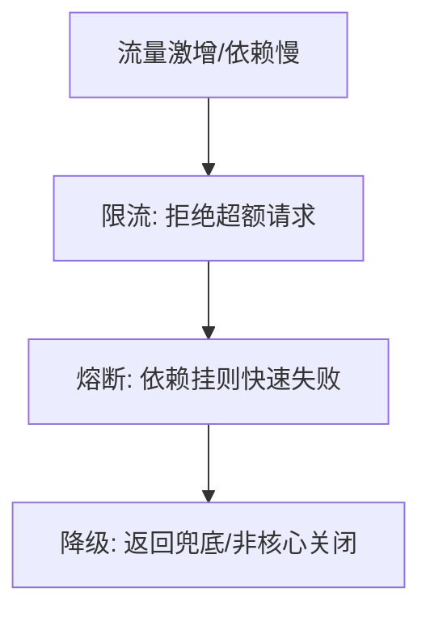
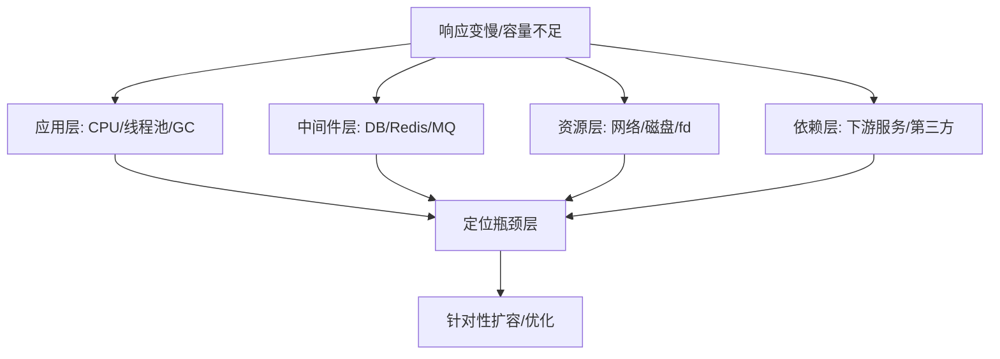
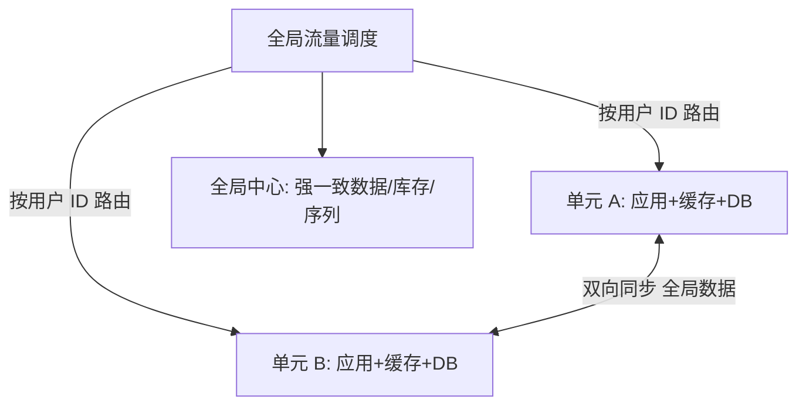

# 03 · 容量规划与冗余容灾

> 可观测性让你"看见"风险，这一篇让你"扛住"风险：容量规划保证**够用不浪费**，冗余与容灾保证**挂了能活**。

---

## 一、容量规划：既要够，又不浪费

### 1.1 容量模型

```
所需实例数 ≈ 峰值QPS × 单请求耗时(s) / 单实例最大并发 + 冗余系数(N+1~N+2)
```

| 输入 | 来源 |
|------|------|
| 峰值 QPS | 历史 + 业务增长预测 + 大促预案 |
| 单实例吞吐 | 压测得出（见 [测试·性能](../测试与代码质量/05-性能与负载测试.md)） |
| 冗余 | N+1（容忍 1 台挂）、N+2（容忍 2 台/可用区） |

### 1.2 容量规划流程


> **Headroom（余量）**：别压到 100%，留 20~30% 缓冲应对突发与实例不均。

### 1.3 容量陷阱

| 陷阱 | 后果 |
|------|------|
| 按均值规划 | 峰值打满，雪崩 |
| 无自动扩缩 | 闲时浪费、峰时不够 |
| 只算应用层 | DB/缓存/连接数成瓶颈 |

---

## 二、冗余设计：假设硬件会坏

| 冗余级别 | 做法 | 扛什么 |
|----------|------|--------|
| 实例级 N+1 | 多副本 | 单实例挂 |
| 机架/可用区级 | 跨 AZ 部署 | 单 AZ 故障 |
| 地域级 | 异地多活/冷备 | 地域级灾难 |

> 与 [场景设计·异地多活](../场景设计/异地多活.md) 联动：单元化、流量调度、数据同步是地域级冗余的工程实现。

---

## 三、容灾：RTO / RPO

| 指标 | 含义 | 例子 |
|------|------|------|
| **RTO** | 恢复时间目标（多久恢复服务） | 30 分钟 |
| **RPO** | 恢复点目标（丢多少数据） | 5 分钟（容忍丢 5 分数据） |

容灾等级（业界）：
- **冷备**：备份异地，恢复慢（RTO 小时级）
- **温备**：部分热，中速
- **热备/多活**：实时同步，秒级切换（RTO 分钟）

**备份铁律**：
- 3-2-1：3 份副本、2 种介质、1 份异地；
- **备份要定期演练恢复**——没演练的备份 = 没备份。

---

## 四、降级、限流、熔断：稳定性的三道战术防线

> 详细战术见 [场景设计·稳定性三板斧](../场景设计/稳定性三板斧：限流-熔断-降级.md)，这里从 SRE 视角串一下。



| 手段 | 作用 | SRE 关注点 |
|------|------|-----------|
| 限流 | 保护自身不被冲垮 | 阈值随容量调整 |
| 熔断 | 防级联雪崩 | 半开探测恢复 |
| 降级 | 保核心弃非核心 | 降级开关可热配 |

---

## 五、为失败设计（Design for Failure）

| 原则 | 做法 |
|------|------|
| 超时 | 每个外部调用必须超时（防挂死） |
| 重试 + 退避 | 幂等前提下指数退避 + 抖动 |
| 舱壁隔离 | 线程池/连接池隔离，防一处挤占全部 |
| 优雅降级 | 依赖挂时返回缓存/默认值 |
| 混沌验证 | 主动注入故障验证上述是否成立（见 [测试·混沌](../测试与代码质量/08-测试数据Mock服务与混沌工程.md)） |

---

## 六、Cheat Sheet

| 主题 | 要点 |
|------|------|
| 容量 | 峰值QPS×耗时/单实例 + N+1 + 20~30% Headroom |
| 冗余 | 实例→AZ→地域 三级，假设会坏 |
| 容灾 | RTO/RPO 量化；3-2-1 备份 + 演练恢复 |
| 三板斧 | 限流/熔断/降级，保核心 |
| 设计 | 超时/退避/舱壁/降级/混沌验证 |

---

## 七、容量评估实操（案例）

假设某接口峰值 10 万 QPS，压测单实例可抗 2000 QPS：

```
基础实例 = 100000 / 2000 = 50 台
N+1 冗余 → 50 × 1.25 = 63 台（可用性要求高可 N+2）
再加 20~30% Headroom → 63 × 1.25 ≈ 79 台
```

| 环节 | 常被忽略的坑 |
|------|--------------|
| 单实例压测口径 | 压测要含真实 DB/依赖，纯本机压测虚高 |
| 实例均匀性 | 新扩实例预热期吞吐低，需预扩容提前拉流量 |
| 存储容量 | 磁盘/连接数随数据增长，按「存量+增速」估算 |
| 突发尖峰 | 限流值要低于容量上限（给雪崩留缓冲） |

> 大促容量预案四步：预测峰值 → 压测核容量 → 预扩容到位 → 演练/全链路压测验证。

---

## 八、多活 vs 主备（选型视角）

| 维度 | 主备（Active-Standby） | 同城双活/异地多活 |
|------|------------------------|--------------------|
| 切换时间 | 分钟级（需人工/脚本） | 秒级或自动 |
| RPO | 分钟级（同步复制可趋零） | 趋零（同步链路） |
| 复杂度 | 低 | 高（路由/数据一致/脑裂） |
| 成本 | 低 | 高（双倍资源+人力） |

选型建议：
- 中小规模、成本敏感 → 主备 + 定期切换演练；
- 核心链路、可接受高成本 → 多活，且**多活必须演练切换**（详 [场景设计·异地多活](../场景设计/异地多活.md)）；
- 数据一致性要求极端（支付/交易）→ 同步复制 + 双写一致性校验。

> 面试高频题「你们怎么容灾的」按此框架答：RTO/RPO 指标 → 级别选择 → 备份/复制策略 → 演练频次，四段式讲完。

---

## 九、容量的数学基础：为什么"利用率不能拉满"

### 9.1 Little's Law（利特尔法则）

排队论最有用的一条结论，容量估算的理论根基：

```
L = λ × W

L = 系统内并发请求数（在途请求）
λ = 到达速率（QPS）
W = 单请求平均驻留时间（响应时间，秒）
```

反过来用，就得到了容量公式：

```
所需并发能力 = QPS × 平均RT
例：QPS=5000，RT=40ms → 需要 5000 × 0.04 = 200 个并发处理位
若单实例线程池 50 → 至少 4 个实例（再叠冗余与 Headroom）
```

| 用法 | 场景 |
|------|------|
| 已知 QPS + RT → 算线程池/连接池大小 | 容量规划、连接池调参 |
| 已知并发上限 + RT → 反推可承载 QPS | 压测结果外推 |
| 观测到 L 持续上涨 | 说明 W 变长（依赖变慢）或 λ 超载 → 快要雪崩 |

> **实战意义**：线上「线程池活跃数持续接近最大值」= L 顶到天花板，此时 QPS 再涨就直接排队 → 超时 → 雪崩。所以**线程池活跃度是最灵敏的过载前兆指标**（见 [06 告警规则库](06-日志与告警规则库.md)）。

### 9.2 排队论：利用率与延迟的非线性关系

M/M/1 模型下平均等待时间：

```
W = S / (1 - ρ)

S = 服务时间，ρ = 利用率（0~1）
ρ=0.5 → W = 2S
ρ=0.8 → W = 5S
ρ=0.9 → W = 10S
ρ=0.95 → W = 20S
```

| 利用率 ρ | 延迟放大倍数 | 结论 |
|---------|-------------|------|
| 50% | ×2 | 舒适区 |
| 70% | ×3.3 | 正常运行区 |
| 80% | ×5 | 警戒区 |
| 90% | ×10 | 危险区，抖动即超时 |
| 95%+ | ×20+ | 已在雪崩边缘 |


> **这就是"Headroom 20~30%"的数学解释**：不是拍脑袋留余量，而是**利用率超过 70~80% 后延迟呈指数上升**，SLO 会先于容量耗尽而破线。
>
> 口诀：**「容量看的不是能不能跑完，而是跑得快不快——70% 是延迟的拐点。」**

### 9.3 Amdahl / USL：为什么加机器不是线性提速

```
加机器的收益会被三件事吃掉：
1. 串行部分（单点：分布式锁、单主库写、全局序列）
2. 一致性开销（节点间协调、锁竞争）
3. 共享资源饱和（DB 连接数、网络带宽、下游限额）
```

| 现象 | 根因 | 对策 |
|------|------|------|
| 应用扩容一倍，QPS 只涨 20% | 瓶颈在 DB，不在应用 | 先做瓶颈定位再扩容 |
| 扩容后延迟反而变高 | DB 连接数被打满/锁竞争加剧 | 连接池总量控制 + 读写分离 |
| 扩容后错误率上升 | 下游被打爆（下游未同步扩容） | 全链路扩容 + 下游限流保护 |

> **铁律：扩容前必须先定位瓶颈层**。盲目扩应用层，只会把压力更快地传导给数据库，把"应用慢"变成"数据库挂"。

---

## 十、瓶颈定位：容量规划的前置动作

### 10.1 分层排查清单



| 层 | 关键指标 | 打满的表现 |
|----|----------|-----------|
| 应用 CPU | 使用率、load、上下文切换 | CPU >85%，RT 随 QPS 线性恶化 |
| 应用内存/GC | 堆使用率、FGC 频率与耗时 | FGC 频繁，出现秒级 STW 毛刺 |
| 线程池 | 活跃数、队列深度、拒绝数 | 活跃=最大、队列涨、开始拒绝 |
| 连接池 | 活跃连接、等待获取连接耗时 | 等连接耗时上升（RT 全面变长） |
| DB | QPS、慢查询、连接数、锁等待 | 慢查询突增、连接数逼近上限 |
| Redis | QPS、内存、大 key、慢日志 | 单分片热点、CPU 单核打满 |
| MQ | 生产/消费速率、堆积 lag | lag 持续增长（消费能力不足） |
| 网络 | 带宽、重传率、连接数 | 带宽打满、TIME_WAIT 堆积 |

> 具体命令与定位手法见 [基础知识·Linux 排查](../基础知识/Linux排查.md) 与 [场景设计·问题定位](../场景设计/问题定位.md)。

### 10.2 容量瓶颈的常见"隐形天花板"

| 隐形上限 | 说明 | 排查方式 |
|----------|------|----------|
| DB `max_connections` | 应用实例数 × 连接池大小 > DB 上限 → 连接被拒 | 算总连接数：实例数 × pool size |
| 文件描述符 fd | 长连接多的服务先撞 fd 上限 | `ulimit -n` / `/proc/<pid>/limits` |
| 端口耗尽 | 大量短连接出网，本地端口不够 | 看 TIME_WAIT 数量、端口范围 |
| 下游配额 | 第三方 API 有 QPS 配额 | 提前对齐配额，本地限流保护 |
| 单分片热点 | Redis/DB 分片不均，单片打满 | 看单分片指标而非集群均值 |
| 云盘 IOPS 上限 | 磁盘 IOPS 有档位上限 | 看 IO util 与 await |

> **关键教训：集群平均值会骗人**。集群 CPU 均值 40%，可能其中一个分片已经 100%。容量看板必须能看到**单实例/单分片的最大值（max），而不是只看 avg**。

---

## 十一、自动扩缩容（Autoscaling）

### 11.1 三种扩缩容维度

| 维度 | 含义 | K8s 对应 |
|------|------|---------|
| **水平（HPA）** | 加/减实例数 | HorizontalPodAutoscaler |
| **垂直（VPA）** | 调单实例规格（CPU/内存） | VerticalPodAutoscaler |
| **节点（CA）** | 加/减集群节点 | Cluster Autoscaler |

### 11.2 HPA 配置示例（含防抖）

```yaml
apiVersion: autoscaling/v2
kind: HorizontalPodAutoscaler
metadata:
  name: order-service
spec:
  scaleTargetRef:
    apiVersion: apps/v1
    kind: Deployment
    name: order-service
  minReplicas: 6            # 下限：保证基础冗余（勿设 1）
  maxReplicas: 60           # 上限：防止失控扩容打爆下游/账单
  metrics:
    - type: Resource
      resource:
        name: cpu
        target:
          type: Utilization
          averageUtilization: 60   # 目标 60%，给 Headroom
    - type: Pods                    # 业务指标更贴合真实负载
      pods:
        metric:
          name: http_inflight_requests
        target:
          type: AverageValue
          averageValue: "30"
  behavior:
    scaleUp:
      stabilizationWindowSeconds: 30    # 扩容要快
      policies:
        - type: Percent
          value: 100                    # 每次最多翻倍
          periodSeconds: 60
    scaleDown:
      stabilizationWindowSeconds: 600   # 缩容要慢（防抖动来回震荡）
      policies:
        - type: Percent
          value: 20                     # 每次最多缩 20%
          periodSeconds: 120
```

### 11.3 自动扩缩容的六个坑

| 坑 | 现象 | 对策 |
|----|------|------|
| **扩容不够快** | 突发流量 30s 内打满，扩容要 2 分钟（拉镜像+预热） | 预留 buffer 实例、镜像预热、大促前预扩容 |
| **抖动（thrashing）** | 扩了又缩，反复震荡 | 缩容 stabilizationWindow 拉长（5~10min） |
| **冷启动打垮自己** | 新实例 JIT 未预热，接流量就超时 | readinessProbe + 慢启动权重（逐步加流量） |
| **扩了应用，压垮 DB** | 应用实例翻倍 → DB 连接数翻倍 → DB 挂 | 连接池总量控制、下游同步评估 |
| **指标选错** | 用 CPU 扩 IO 密集型服务，CPU 不高但已排队 | 用「在途请求数/队列深度」等饱和度指标 |
| **minReplicas 太小** | 缩到 1~2 台，单点 + 无法应对突发 | minReplicas ≥ 冗余要求（N+1） |

> **口诀：扩容要快、缩容要慢；按饱和度扩、别只按 CPU；应用扩容先问下游扛不扛。**

---

## 十二、压测：容量数字的唯一可信来源

### 12.1 四种压测类型

| 类型 | 目的 | 做法 |
|------|------|------|
| **基准（Benchmark）** | 摸单实例基线容量 | 固定配置，逐步加压到拐点 |
| **负载（Load）** | 验证目标容量下 SLO 是否达标 | 按预期峰值持续压 |
| **压力（Stress）** | 找极限与失效模式 | 压到崩，观察怎么崩、能否自愈 |
| **稳定性（Soak）** | 找泄漏与慢性劣化 | 中等压力跑数小时~数天 |

### 12.2 找拐点（Knee Point）

```
逐步加压：QPS ↑ → 观察 RT 与错误率
- 阶段一：QPS 涨，RT 平稳       → 未饱和
- 阶段二：QPS 涨，RT 缓慢上升   → 接近饱和（这里是"可用容量"）
- 阶段三：QPS 涨，RT 陡增        → 拐点（饱和）
- 阶段四：QPS 不再涨甚至下降，错误率飙升 → 过载崩塌
```

> **容量取值取"阶段二末端"，不是"阶段三峰值"**。很多团队把压出来的最大 QPS 当容量，结果线上一到这个值 SLO 已经破了。
>
> **限流阈值应设在拐点之前**（如拐点的 80%），给系统留自救空间。

### 12.3 全链路压测的关键要素

| 要素 | 说明 |
|------|------|
| **流量染色** | 压测流量打标（header `x-test-flag`），全链路透传 |
| **影子表/影子库** | 压测数据写影子表，不污染生产数据 |
| **下游 Mock 策略** | 第三方（支付/短信）必须 Mock，不能真调用 |
| **数据准备** | 压测账号/商品预置，避免热点集中在少数几条数据 |
| **一键停止** | 压测必须有紧急刹车开关（影响真实用户立刻停） |
| **限流白名单** | 压测流量不能被自身限流误杀（否则压不出真实容量） |

> 压测方法论细节见 [测试·性能与负载测试](../测试与代码质量/05-性能与负载测试.md)；大促备战全流程见 [场景设计·大促容量规划与备战](../场景设计/大促容量规划与备战.md)。

### 12.4 压测踩坑实录

| 坑 | 后果 | 正解 |
|----|------|------|
| 压测数据只用 1 个用户/商品 | 全部命中同一行/同一缓存 key，结果虚高 10 倍 | 数据打散，模拟真实分布 |
| 只压单接口 | 上线后混合流量下互相抢资源，容量不达标 | 按真实流量比例做混合场景压测 |
| 压测机成瓶颈 | 压不上去，误判服务容量不足 | 先确认压测端 CPU/网络未打满 |
| 压测环境规格小于生产 | 数字不可外推 | 同规格，或按比例外推并留更大余量 |
| 压完不看依赖指标 | 只看应用 RT，没发现 DB 已 90% | 压测期间全链路指标一起看 |
| 缓存预热后压 | 命中率 100%，掩盖了缓存穿透风险 | 补一轮"冷缓存"场景压测 |

---

## 十三、冗余的工程细节

### 13.1 N+1 / N+2 到底怎么算

```
N   = 承载峰值所需的最小实例数
N+1 = 允许 1 个实例（或 1 个故障域）失效仍满足 SLO
N+2 = 允许 2 个同时失效（如 AZ 故障 + 一台宕机）

关键：+1 的单位是「故障域」，不是「一台机器」
- 若 3 AZ 部署，挂一个 AZ = 挂掉 1/3 实例
- 那么单 AZ 必须能被剩下 2 个 AZ 吸收 → 每 AZ 利用率 ≤ 约 66%
```

| 部署形态 | 单域失效损失 | 平时每域最大利用率 |
|----------|-------------|-------------------|
| 2 AZ | 50% | ≤ 50%（很浪费） |
| 3 AZ | 33% | ≤ 66% |
| 4 AZ | 25% | ≤ 75% |

> **这解释了为什么"多 AZ 越多越省"**：故障域越多，为容灾预留的冗余比例越低。3 AZ 是成本与可用性的常见平衡点。

### 13.2 反亲和性（Anti-Affinity）：别让副本挤一台机

```yaml
affinity:
  podAntiAffinity:
    requiredDuringSchedulingIgnoredDuringExecution:   # 硬约束：同节点不放两个
      - labelSelector:
          matchLabels:
            app: order-service
        topologyKey: kubernetes.io/hostname
    preferredDuringSchedulingIgnoredDuringExecution:  # 软约束：尽量跨 AZ 均衡
      - weight: 100
        podAffinityTerm:
          labelSelector:
            matchLabels:
              app: order-service
          topologyKey: topology.kubernetes.io/zone
```

配合 `topologySpreadConstraints` 做跨 AZ 均衡：

```yaml
topologySpreadConstraints:
  - maxSkew: 1                                  # 各 AZ 实例数差值 ≤1
    topologyKey: topology.kubernetes.io/zone
    whenUnsatisfiable: ScheduleAnyway
    labelSelector:
      matchLabels:
        app: order-service
```

> **经典事故**：副本数配了 6 个看着很安全，实际调度到同 2 台物理机上——一台宕机掉一半容量。**冗余数量 ≠ 冗余效果，必须验证"实际分布"**。

### 13.3 PodDisruptionBudget：防运维操作打穿冗余

```yaml
apiVersion: policy/v1
kind: PodDisruptionBudget
metadata:
  name: order-service-pdb
spec:
  minAvailable: 80%        # 自愿驱逐时至少保留 80% 可用
  selector:
    matchLabels:
      app: order-service
```

> 没有 PDB 时，节点批量升级/排空（drain）可能一次性驱逐大量副本 → **不是故障，是运维自己造成的容量事故**。

---

## 十四、备份与恢复：演练才算数

### 14.1 备份策略矩阵

| 类型 | 说明 | 恢复速度 | 存储成本 |
|------|------|----------|----------|
| 全量备份 | 完整快照 | 快（直接还原） | 高 |
| 增量备份 | 只备变化部分 | 慢（需叠加） | 低 |
| 差异备份 | 相对上次全量的变化 | 中 | 中 |
| binlog / WAL | 事务日志持续归档 | 可做**任意时间点恢复 PITR** | 低 |

> 生产典型组合：**每周全量 + 每日增量 + binlog 持续归档** → 可恢复到任意时间点（PITR），RPO 接近分钟级。

### 14.2 备份的六个致命坑

| 坑 | 后果 |
|----|------|
| **备份从没恢复过** | 真出事发现备份损坏/格式不兼容 → 等于没备份 |
| **备份和生产同一账号/同一区域** | 账号被攻破或区域灾难，备份一起没 |
| **备份未加密** | 备份文件泄露 = 全量数据泄露（见 [安全·数据安全](../安全工程/05-数据安全与密码学基础.md)） |
| **只备数据不备 Schema/配置** | 数据回来了，服务起不来 |
| **误删被"同步"到备份** | 逻辑删除同步过去；需要**保留历史版本**而非只镜像 |
| **恢复步骤只在某人脑子里** | 那人休假就完蛋 → 必须有 Runbook |

### 14.3 恢复演练剧本（季度执行）

```text
恢复演练 · 检查单
[ ] 1. 从备份仓库拉取指定时间点的备份（记录耗时）
[ ] 2. 在隔离环境还原（绝不在生产还原！）
[ ] 3. 应用 binlog 到目标时间点（验证 PITR 可行）
[ ] 4. 数据校验：行数、关键表 checksum、抽样业务校验
[ ] 5. 记录实际 RTO（还原总耗时）与实际 RPO（可恢复到的时间点）
[ ] 6. 对比 SLA 目标，差距超标 → 提改进项（带 owner + 截止）
[ ] 7. 更新恢复 Runbook（步骤/命令/坑）
```

> **核心指标：实测 RTO/RPO，而不是文档写的 RTO/RPO。** 没有演练数据的容灾方案，只是一份 PPT。

---

## 十五、多活的深水区：数据一致与脑裂

### 15.1 单元化（Set 化）思想



| 数据类型 | 处理方式 |
|----------|----------|
| **单元内数据**（用户订单） | 按分片键路由到固定单元，单元内闭环读写 |
| **全局数据**（商品、配置） | 中心写，各单元只读副本（可接受秒级延迟） |
| **强一致数据**（库存、余额） | 中心单点写 或 分单元预分配额度 |

> 关键设计：**流量必须"路由正确"**。一个用户的请求在 A 单元写、在 B 单元读，就会读到旧数据。所以路由规则要在**入口层统一执行且不可绕过**。

### 15.2 脑裂（Split-Brain）与仲裁

```
脑裂：网络分区导致两侧都认为自己是主，各自接受写入 → 数据冲突无法合并

防护：
1. 多数派仲裁（Quorum）：只有拿到 N/2+1 票的一侧可写
2. 独立第三方仲裁点（放在第三个 AZ/地域，避免 2 节点对等僵局）
3. Fencing（隔离）：老主被降级时强制断其写权限（改配置/撤 token/关网络）
4. 租约（Lease）：主身份带 TTL，续不上自动失效
```

| 反模式 | 风险 |
|--------|------|
| 双节点主备自动切换，无第三方仲裁 | 网络抖动即双主，必脑裂 |
| 切换后不 fence 老主 | 老主恢复后继续写，数据分叉 |
| 靠人肉判断切不切 | 慢（RTO 拉长），且深夜易误判 |

> **一致性取舍**：CAP 下网络分区时只能选一个——**要么拒绝写（保一致，牺牲可用）**，**要么双写后修复（保可用，牺牲一致）**。支付/库存类必须选前者。详见 [场景设计·异地多活](../场景设计/异地多活.md)。

### 15.3 切换演练（Failover Drill）

```text
切流演练 · 检查单
[ ] 提前公告 + 选低峰期 + 准备一键回切
[ ] 1. 灰度切 1% 流量到目标单元，观察 SLI
[ ] 2. 逐步放大 10% → 50% → 100%
[ ] 3. 观察：错误率、RT、数据同步延迟、对账差异
[ ] 4. 记录切换总耗时（= 真实 RTO）
[ ] 5. 回切验证（双向都要能切，否则只是"单向逃生"）
[ ] 6. 输出报告：耗时、问题、改进项
```

> **没演练过的多活，出事时没人敢按那个按钮**——这是多活最大的失败模式：设施建好了，关键时刻不敢用。

---

## 十六、成本与容量的平衡

| 手段 | 省钱原理 | 风险 |
|------|----------|------|
| 自动扩缩容 | 闲时缩容 | 突发扩不及时 |
| 混合部署（在线+离线） | 用在线服务的空闲资源跑离线任务 | 离线任务抢资源影响在线（需强隔离+优先级） |
| 分级 SLO | 非核心服务降低冗余标准 | 需明确服务分级 |
| 弹性资源（竞价实例） | 单价低 | 可能被回收（只放无状态、可中断负载） |
| 存储分层 | 冷数据转低频/归档存储 | 恢复慢（需评估访问模式） |
| 请求合并/缓存 | 从源头减少容量需求 | 一致性与复杂度 |

> **省钱的正确顺序**：先优化（降低单请求成本）→ 再弹性（按需付费）→ 最后砍冗余（有风险，需 SLO 支撑）。
>
> **反面教训**：为了降本把冗余从 N+2 砍到 N，平时没事，一次 AZ 故障就全站不可用——省下的钱远不够赔。**降本不能降在故障域冗余上。**

---

## 十七、常见误区（面试高频）

| 误区 ❌ | 正解 ✅ |
|---------|---------|
| 容量按平均 QPS 规划 | 按峰值 + 冗余 + Headroom；均值会让你在峰值裸奔 |
| CPU 到 90% 才算满 | 70~80% 后延迟指数上升，SLO 先破 |
| 扩容能解决一切慢 | 先定位瓶颈层，盲目扩应用会压垮 DB |
| 副本数够就是高可用 | 要看实际分布（反亲和 + 跨 AZ + PDB） |
| 有备份就有容灾 | 没演练恢复 = 没备份；要实测 RTO/RPO |
| 多活就一定比主备好 | 多活复杂度与成本高，且必须常演练才有效 |
| 集群平均值看容量 | 必须看单实例/单分片 max，热点会被均值掩盖 |
| 限流阈值设成压测峰值 | 应设在拐点之前（约 80%），留自救空间 |

---

## 十八、面试速答框架

1. **容量怎么算？** → Little's Law：并发 = QPS × RT；再叠故障域冗余（N+1/N+2）与 20~30% Headroom；数字来自压测拐点而非峰值。
2. **为什么留 Headroom？** → 排队论：ρ>0.8 后延迟指数上升，容量没耗尽 SLO 已破。
3. **扩容没效果怎么查？** → 分层定位（应用/中间件/资源/依赖），找真瓶颈；常见是 DB 连接数或单分片热点。
4. **HPA 怎么配才稳？** → 目标利用率 60%、扩快缩慢（缩容窗口 5~10min）、minReplicas 满足冗余、用饱和度指标而非只用 CPU。
5. **RTO/RPO 怎么保障？** → 全量+增量+binlog 归档做 PITR；季度恢复演练实测 RTO/RPO；差距超标提改进项。
6. **多活怎么防脑裂？** → 多数派仲裁 + 第三方仲裁点 + fencing 老主 + 租约；强一致业务分区时宁可拒写。
7. **怎么证明系统扛得住大促？** → 容量模型 + 全链路压测（染色/影子表/混合场景）+ 预扩容 + 切换演练 + 限流兜底，五件套齐才敢说扛得住。

---

## 十九、口诀与小结

> **容量口诀：并发=QPS×RT，七成是拐点；先找瓶颈再扩容，扩快缩慢别抖动。**
>
> **冗余口诀：冗余按故障域算，三 AZ 六成六；反亲和加 PDB，副本才真分散。**
>
> **容灾口诀：RTO/RPO 先量化，全量增量加日志；不演练的备份是废纸，不敢切的多活是摆设。**

| 主题 | 一句话 |
|------|--------|
| 容量数学 | Little's Law 算并发，排队论解释为何 70% 是拐点 |
| 瓶颈定位 | 应用→中间件→资源→依赖分层排查，看 max 不看 avg |
| 隐形天花板 | DB 连接数、fd、端口、下游配额、单分片热点、IOPS |
| 自动扩缩 | 扩快缩慢、饱和度指标、min 满足冗余、评估下游 |
| 压测 | 取拐点前的可用容量，限流设在拐点 80% |
| 冗余 | 故障域为单位；3 AZ 每域 ≤66%；反亲和+PDB |
| 备份 | 全量+增量+binlog=PITR；季度演练实测 RTO/RPO |
| 多活 | 单元化闭环 + 全局数据中心写 + 仲裁防脑裂 + 双向演练 |
| 成本 | 先优化、再弹性、最后才碰冗余（谨慎） |

---

## 二十、延伸阅读

| 想深入 | 去这里 |
|--------|--------|
| 限流熔断降级战术细节 | [场景设计·稳定性三板斧](../场景设计/稳定性三板斧：限流-熔断-降级.md) |
| 异地多活工程实现 | [场景设计·异地多活](../场景设计/异地多活.md) |
| 大促备战全流程 | [场景设计·大促容量规划与备战](../场景设计/大促容量规划与备战.md) |
| 压测方法与工具 | [测试·性能与负载测试](../测试与代码质量/05-性能与负载测试.md) |
| 混沌注入验证韧性 | [测试·混沌工程](../测试与代码质量/08-测试数据Mock服务与混沌工程.md) |
| 底层资源指标定位 | [基础知识·Linux 排查](../基础知识/Linux排查.md) |
| K8s 调度与运维 | [云原生·K8s 运维实战](../云原生/K8s运维实战.md) |
| 容量与告警阈值联动 | [06 日志与告警规则库](06-日志与告警规则库.md) |

---

> 下一篇：[04 On-call 与事故管理](04-On-call与事故管理.md) —— 风险真的发生时，人怎么响应、怎么复盘、怎么不再犯。
