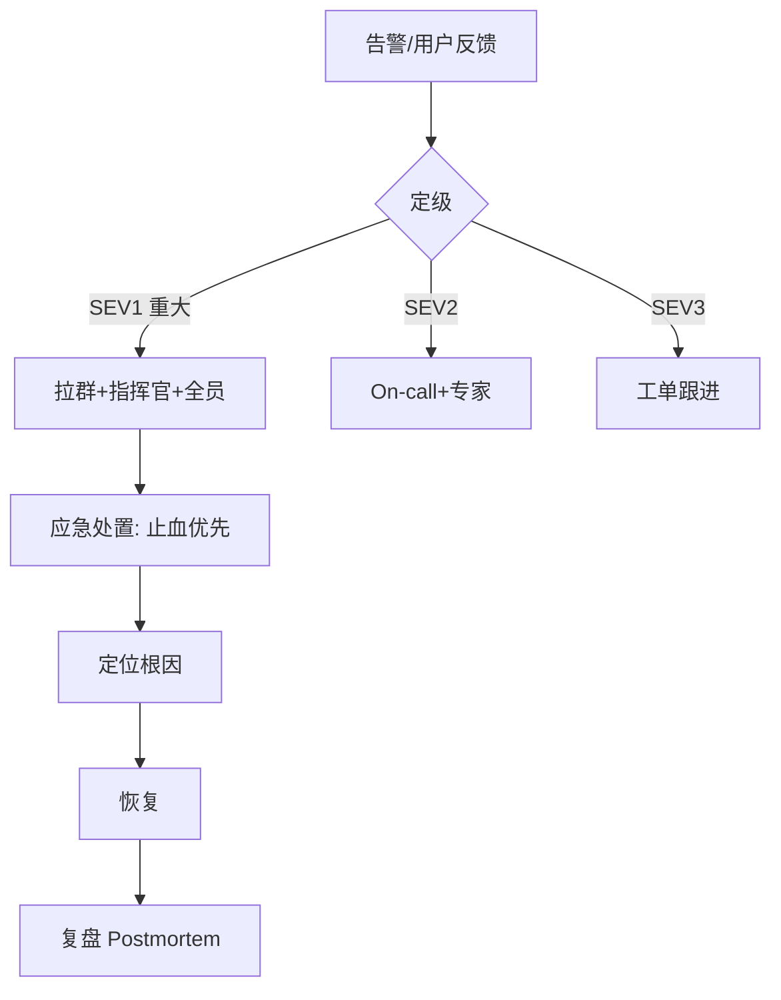

# 04 · On-call 与事故管理

> 再好的预防也有失手时。这一篇讲"事故真的发生，人该怎么响应、怎么复盘、怎么让同样的错不再犯"——这是 SRE 文化里最值钱的部分。

---

## 一、On-call：谁在夜里接电话

### 1.1 轮值设计

| 要素 | 做法 |
|------|------|
| 轮换 | 小队轮值（如每周一人），避免长期疲劳 |
| 主备 | 主 On-call + 备援，防主忙线 |
| 负载上限 | 单次 On-call 期 Incident 数设上限，超限减压 |
| 补偿 | 夜间 page 给调休/补贴，否则没人愿意 |

### 1.2 好的 On-call 前提

> **On-call 不是"人肉监控"。** 没有自动化告警 + 预案，On-call 只是在熬夜看屏幕。

- 告警必须** actionable**（响了就该动，不是"看看"）；
- 有 **Runbook / 预案**（常见故障一键或几步处理）；
- 系统本身可靠（见 01~03）。

---

## 二、事故分级与应急响应

| 级别 | 定义 | 响应 |
|------|------|------|
| SEV1 | 核心不可用/数据丢失/大面积 | 立即 Page，启动应急群，指定 IC（事故指挥官） |
| SEV2 | 部分降级/单区域 | On-call + 相关专家 |
| SEV3 | 轻微/无用户影响 | 工单，工作时间处理 |

### 角色分工（大事故）

| 角色 | 职责 |
|------|------|
| IC（Incident Commander） | 指挥协调，不做具体排查 |
| 沟通者 | 对内对外同步进展 |
| 排查者 | 定位根因、执行恢复 |

> **关键：止血优先于根因。** 先恢复服务（降级/回滚/扩容），再查为什么。

---

## 三、复盘 Postmortem：SRE 文化的灵魂

### 3.1 无指责（Blameless）

> **事故是系统的失败，不是人的失败。** 找系统漏洞，不找替罪羊——否则没人敢报、不敢写真话。

复盘文档要素：
- 时间线（发生了什么、何时发现、何时恢复）
- 影响面（用户/营收/数据）
- 根因（直接 + 深层）
- 经验教训
- 改进行动（带负责人+截止，且**可验证**）

### 3.2 改进行动要闭环

| 坏复盘 | 好复盘 |
|--------|--------|
| "加强监控"（不可验证） | "给支付接口加 P99>500ms 告警，8/10 前上线" |
| "大家小心点" | "增加发布前自动回归，CI 卡住" |
| 无跟进 | 行动进 tracker，定期复查 |

### 3.3 复盘与混沌的闭环

- 被动事故暴露的漏洞 → 补**混沌用例**防复发；
- 主动混沌发现的脆弱点 → 提前修复，不等职发。

> 与 [测试·混沌工程](../测试与代码质量/08-测试数据Mock服务与混沌工程.md)、[生产问题排查实战](../场景设计/生产问题排查实战：常见故障与处置步骤.md) 形成"攻防+复盘"闭环。

---

## 四、事故管理的反模式

| 反模式 | 危害 |
|--------|------|
| 无分级，全 Page | 告警疲劳，真事故被忽略 |
| 追责个人 | 隐瞒、不写真因，同样的错反复犯 |
| 止血前狂查根因 | 恢复慢，影响扩大 |
| 复盘无行动/不可验证 | 走过场，下次还崩 |
| On-call 无 Runbook | 半夜靠记忆救火，易错 |

---

## 五、Cheat Sheet

| 主题 | 要点 |
|------|------|
| On-call | 轮换+主备+补偿；前提是自动化告警+预案 |
| 定级 | SEV1 拉群指 IC，SEV2 专家，SEV3 工单 |
| 响应 | 止血优先于根因，回滚/降级/扩容 |
| 复盘 | 无指责、时间线+根因+可验证行动 |
| 闭环 | 事故补混沌、混沌提前修 |

> 下一篇：[05 变更管理与渐进式发布](05-变更管理与渐进式发布.md) —— 多数事故来自变更，如何从源头大幅降低风险。
