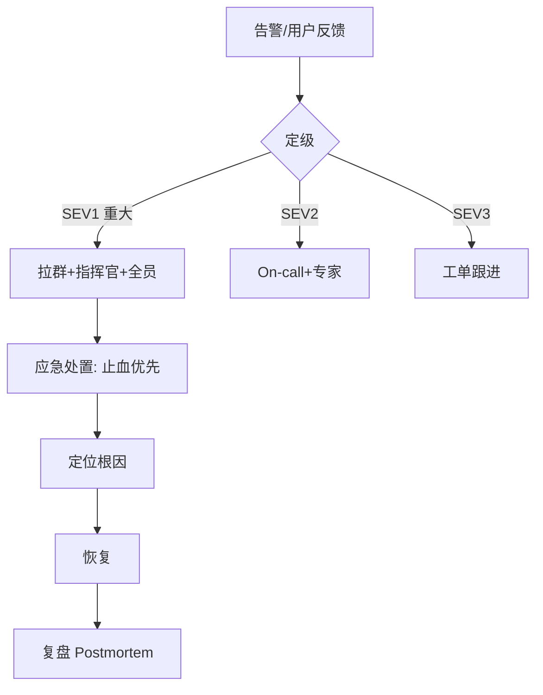
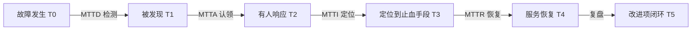

# 04 · On-call 与事故管理

> 再好的预防也有失手时。这一篇讲"事故真的发生，人该怎么响应、怎么复盘、怎么让同样的错不再犯"——这是 SRE 文化里最值钱的部分。

---

## 一、On-call：谁在夜里接电话

### 1.1 轮值设计

| 要素 | 做法 |
|------|------|
| 轮换 | 小队轮值（如每周一人），避免长期疲劳 |
| 主备 | 主 On-call + 备援，防主忙线 |
| 负载上限 | 单次 On-call 期 Incident 数设上限，超限减压 |
| 补偿 | 夜间 page 给调休/补贴，否则没人愿意 |

### 1.2 好的 On-call 前提

> **On-call 不是"人肉监控"。** 没有自动化告警 + 预案，On-call 只是在熬夜看屏幕。

- 告警必须** actionable**（响了就该动，不是"看看"）；
- 有 **Runbook / 预案**（常见故障一键或几步处理）；
- 系统本身可靠（见 01~03）。

---

## 二、事故分级与应急响应



| 级别 | 定义 | 响应 |
|------|------|------|
| SEV1 | 核心不可用/数据丢失/大面积 | 立即 Page，启动应急群，指定 IC（事故指挥官） |
| SEV2 | 部分降级/单区域 | On-call + 相关专家 |
| SEV3 | 轻微/无用户影响 | 工单，工作时间处理 |

### 角色分工（大事故）

| 角色 | 职责 |
|------|------|
| IC（Incident Commander） | 指挥协调，不做具体排查 |
| 沟通者 | 对内对外同步进展 |
| 排查者 | 定位根因、执行恢复 |

> **关键：止血优先于根因。** 先恢复服务（降级/回滚/扩容），再查为什么。

---

## 三、复盘 Postmortem：SRE 文化的灵魂

### 3.1 无指责（Blameless）

> **事故是系统的失败，不是人的失败。** 找系统漏洞，不找替罪羊——否则没人敢报、不敢写真话。

复盘文档要素：
- 时间线（发生了什么、何时发现、何时恢复）
- 影响面（用户/营收/数据）
- 根因（直接 + 深层）
- 经验教训
- 改进行动（带负责人+截止，且**可验证**）

### 3.2 改进行动要闭环

| 坏复盘 | 好复盘 |
|--------|--------|
| "加强监控"（不可验证） | "给支付接口加 P99>500ms 告警，8/10 前上线" |
| "大家小心点" | "增加发布前自动回归，CI 卡住" |
| 无跟进 | 行动进 tracker，定期复查 |

### 3.3 复盘与混沌的闭环

- 被动事故暴露的漏洞 → 补**混沌用例**防复发；
- 主动混沌发现的脆弱点 → 提前修复，不等职发。

> 与 [测试·混沌工程](../测试与代码质量/08-测试数据Mock服务与混沌工程.md)、[生产问题排查实战](../场景设计/生产问题排查实战：常见故障与处置步骤.md) 形成"攻防+复盘"闭环。

---

## 四、事故管理的反模式

| 反模式 | 危害 |
|--------|------|
| 无分级，全 Page | 告警疲劳，真事故被忽略 |
| 追责个人 | 隐瞒、不写真因，同样的错反复犯 |
| 止血前狂查根因 | 恢复慢，影响扩大 |
| 复盘无行动/不可验证 | 走过场，下次还崩 |
| On-call 无 Runbook | 半夜靠记忆救火，易错 |

---

## 五、Cheat Sheet

| 主题 | 要点 |
|------|------|
| On-call | 轮换+主备+补偿；前提是自动化告警+预案 |
| 定级 | SEV1 拉群指 IC，SEV2 专家，SEV3 工单 |
| 响应 | 止血优先于根因，回滚/降级/扩容 |
| 复盘 | 无指责、时间线+根因+可验证行动 |
| 闭环 | 事故补混沌、混沌提前修 |

---

## 六、应急响应的动作清单（SEV1 实战）

**前 5 分钟**
1. 确认事故范围（哪些服务/地域/用户受影响）；
2. 定级 + 拉应急群 + 指定 IC；
3. 立即评估三个止血选项：回滚 / 降级 / 扩容，选最快的。

**中段（10~60 分钟）**
4. IC 分工：沟通者对外同步，排查者并行定位；
5. 每 15~30 分钟对外同步一次进展（模板：现状/影响/预期）；
6. 恢复后不立即撤群——先观察稳定期（如 30 分钟）。

**收尾**
7. 记录时间线与操作（谁、何时、做了什么）；
8. 复盘会排期（SEV1 24~48h 内）；
9. 行动项落 tracker，验证方式写死（见 3.2）。

> **沟通纪律**：对外说「恢复时间预估」要留余量，宁可保守；对外不说内部猜测根因，避免二次舆情。

---

## 七、复盘模板（可直接套用）

```text
# 事故复盘：#2026-08-XX 支付超时
- 影响：支付成功率 99.8%→92%，时长 35 分钟，涉及约 2 万单
- 时间线：
  14:02 告警（燃烧率 14.4x）
  14:05 定级 SEV1，建群，IC=张三
  14:12 定位：DB 慢查询（新索引未生效）
  14:20 降级为只读 + 加索引，恢复
  14:50 观察期结束
- 根因：直接=新 SQL 未走索引；深层=发布未做慢查询巡检、压测未覆盖
- 教训：变更清单要含 SQL 变更检查项；压测脚本覆盖新接口
- 行动：
  [ ] 慢查询巡检接入 CI（李四，8/15）
  [ ] 新接口上线前必压测（王五，8/12）
```

> 复盘不是「写文档」，是「让下一次事故更晚来」——行动项闭环是唯一产出。

---

## 八、事故生命周期与 MTTx 分解

### 8.1 一次事故的完整时间轴



| 指标 | 全称 | 含义 | 缩短手段 |
|------|------|------|----------|
| **MTTD** | Mean Time To Detect | 故障发生 → 被发现 | 告警覆盖率、SLO 燃烧率告警、业务指标兜底 |
| **MTTA** | Mean Time To Acknowledge | 发现 → 有人认领 | 值班可达性、自动升级、多通道（电话） |
| **MTTI** | Mean Time To Identify | 认领 → 找到止血办法 | 可观测性、Runbook、变更事件流 |
| **MTTR** | Mean Time To Recover | 发现 → 恢复 | 一键回滚、降级开关、预案自动化 |
| **MTBF** | Mean Time Between Failures | 两次故障间隔 | 变更管理、容量冗余、混沌加固 |

> **关键洞察：多数团队的时间浪费在 MTTD 和 MTTI 上，而不是修复动作本身。**
>
> - MTTD 长 → 监控盲区（往往是业务指标缺失，技术指标全绿）
> - MTTI 长 → 不知道该看哪、变更信息不透明、没有 Runbook
>
> 可用性 = MTBF / (MTBF + MTTR)。想提升可用性有两条路：**少坏（MTBF↑，靠变更管理与冗余）** 和 **快修（MTTR↓，靠可观测性与预案）**。对成熟系统而言，**降 MTTR 通常比提 MTBF 便宜得多**。

### 8.2 缩短 MTTI 的三件套

| 手段 | 说明 |
|------|------|
| **变更事件流** | 把所有发布/配置变更/DDL 打到一条时间线上，与监控图叠加 → 「什么时候变了什么」一眼可见 |
| **服务依赖拓扑** | 出事时先看拓扑图上哪一段红，避免全链路盲查 |
| **Runbook 索引** | 告警直接携带 Runbook 链接，点开就是处置步骤 |

> 排查第一问永远是：**「刚才有什么变更？」**——70% 的事故答案在这里（见 [05 变更管理](05-变更管理与渐进式发布.md)）。

---

## 九、Runbook（处置手册）：把专家经验写成步骤

### 9.1 一个合格 Runbook 的结构

```text
# Runbook：MQ 消费堆积（consumer lag 持续增长）

## 1. 影响判断
- 影响：订单状态更新延迟；lag > 10 万时下游超时率上升
- 定级参考：lag < 1 万 → P2；持续增长且 > 10 万 → P1

## 2. 快速确认（3 分钟内）
- [ ] 看 lag 曲线：是「生产突增」还是「消费下降」？
      Grafana 面板：MQ / consumer-lag（按 topic + group）
- [ ] 看消费实例：是否有实例挂掉/重启？Pod 数量是否正常？
- [ ] 看消费 RT：单条处理耗时是否变长（依赖变慢）？
- [ ] 看错误日志：是否有反复失败重试（毒消息）？

## 3. 止血动作（按优先级）
- A. 消费能力不足 → 扩容消费实例（命令见下），观察 lag 是否转降
     kubectl scale deploy order-consumer --replicas=20
- B. 依赖慢导致处理慢 → 依赖降级开关（配置中心 key: order.dep.degrade=true）
- C. 毒消息死循环 → 将该消息投递到死信队列，跳过（操作见 4.2）
- D. 生产端突增且非必要 → 上游限流（网关限流规则 order-produce）

## 4. 常见坑
- 4.1 扩容消费者但分区数不足 → 并发上不去，需先扩分区
- 4.2 手动跳过消息必须记录 messageId，事后补偿，不能默默丢

## 5. 恢复验证
- [ ] lag 持续下降且回到基线
- [ ] 下游订单状态更新延迟恢复正常
- [ ] 观察 30 分钟无反弹

## 6. 升级路径
- 15 分钟内 lag 未转降 → 升级 P1，拉 MQ 负责人 @xxx
```

### 9.2 Runbook 的质量标准

| 标准 | 说明 |
|------|------|
| **可在半夜执行** | 命令可复制粘贴，不需要思考推导 |
| **有判断分支** | 不同现象走不同处置，而不是一条直线流程 |
| **有验证步骤** | 怎么确认恢复了（而不是"应该好了"） |
| **有升级路径** | 多久没解决就升级、找谁 |
| **定期演练/更新** | 环境变了 Runbook 就过期，命令跑不通比没有更坑 |

> **反面案例**：Runbook 里写着 `重启服务`，但没写怎么重启、重启会不会丢数据、重启后要看什么——半夜值班的人照着做，把有状态服务重启了，故障从 5 分钟变成 2 小时。
>
> 口诀：**「Runbook 写给凌晨三点、脑子不清醒、且没做过这个系统的人看。」**

---

## 十、值班交接与知识沉淀

### 10.1 交接清单（Handoff）

```text
On-call 交接 · 检查单
- 本班次告警：共 N 条，其中真实故障 M 条
- 未闭环问题：
  · [进行中] 支付服务偶发超时，已加临时监控，怀疑连接池，跟进人 @张三
  · [观察中] 昨日扩容后 DB 连接数偏高，观察至今日 18:00
- 已知抑制/静默：silence #123（MQ 维护窗口，到期 8/12 10:00）← 到期务必确认
- 高风险变更预告：今晚 22:00 订单服务发布（金丝雀），注意关注
- 新增/修改的 Runbook：MQ 堆积 Runbook 已更新扩分区步骤
```

| 交接反模式 | 危害 |
|-----------|------|
| 只说"没事" | 下一班不知道有观察中的隐患 |
| 静默不交接 | 静默到期后告警突然涌入，或静默永久生效掩盖故障 |
| 临时改动不记录 | 下一班看到奇怪配置，不敢动也不敢改 |

### 10.2 值班健康度指标（衡量 On-call 是否可持续）

| 指标 | 健康区间参考 | 说明 |
|------|-------------|------|
| 单班次告警数 | 越少越好，夜间 page 应罕见 | 超标说明系统或告警规则有问题 |
| 告警有效率（真实故障/总告警） | 越高越好 | 低说明噪音多，需治理告警 |
| 夜间被叫醒次数 | 应接近 0 | 持续被叫醒 = 团队会流失 |
| Runbook 覆盖率 | 高频告警应 100% 有 Runbook | 没 Runbook 的告警靠运气处置 |
| 事故改进项按期完成率 | 高 | 低说明复盘走过场 |

> **On-call 疲劳是稳定性的头号隐性风险**：疲劳 → 响应变慢 → 误操作 → 更大事故 → 更疲劳。这是一个正反馈的恶性循环。
>
> 治理入口只有两个：**减少告警数量（治理噪音）** 和 **提高自动化程度（自愈）**。加人只是延缓崩溃。

### 10.3 告警自愈：能自动的别叫人

| 场景 | 自愈动作 | 风险控制 |
|------|----------|----------|
| 单实例 OOM / 健康检查失败 | 自动重启/替换实例 | 限制单位时间重启次数（防无限重启掩盖问题） |
| 磁盘日志占满 | 自动清理过期日志 | 只清白名单目录，保留最近 N 天 |
| 消费堆积 | 自动扩容消费者 | 上限约束 + 通知值班（自愈也要留痕） |
| 下游异常 | 自动触发熔断降级 | 半开探测恢复，恢复后通知 |

> **原则：自愈必须留痕并通知**。静默自愈会掩盖系统性问题——"每天自动重启 20 次"这种事必须被看见。

---

## 十一、事故指挥体系（ICS）深入

### 11.1 为什么需要 IC（事故指挥官）

```
没有 IC 的典型现场：
- 5 个人在群里同时问"什么情况"
- 3 个人同时在改配置（互相覆盖）
- 老板在群里追问进度，排查的人在回消息而不是排查
- 没人对外通知，客服被投诉淹没
→ 故障时间被沟通和混乱拉长一倍
```

| 角色 | 做什么 | **不做什么** |
|------|--------|-------------|
| **IC 指挥官** | 定级、分派、决策、控制节奏 | 不亲自敲命令排查（会失去全局视角） |
| **Ops Lead 处置负责人** | 执行止血、协调技术动作 | 不对外沟通 |
| **Comms 沟通者** | 对内对外同步、挡住无关追问 | 不做技术决策 |
| **Scribe 记录员** | 记时间线、决策、操作 | 不参与操作 |
| **专家/SME** | 特定领域排查 | 不擅自做全局变更 |

> **IC 的核心价值不是"技术最强"，而是"让整体有序"**。所以 IC 可以是不懂细节的人，重点是会问：现在最坏情况是什么？止血选项有哪些？谁负责？多久回报？

### 11.2 单一写权限原则（避免多人乱操作）

```
事故中的操作纪律：
1. 所有生产变更操作必须先在群里"声明 + 得到 IC 确认"
2. 同一时间只允许一个人做变更（避免并行改动互相干扰）
3. 每个操作都要报：我要做什么 → 做完了 → 效果如何
4. 禁止"我先试一下"——未经确认的试探会污染判断
```

> **真实踩坑**：两个人同时处理同一个故障，A 在回滚，B 在扩容，C 在改配置。最后服务恢复了，但**没人知道是哪个动作起作用**，复盘无法定位根因，下次照样犯。

### 11.3 状态同步模板（对内 / 对外）

**对内（技术群，每 15 分钟）**

```text
【状态更新 14:35】
- 现状：支付成功率 92%（正常 99.8%），仍在下降
- 已知：DB 主库慢查询突增，与 14:00 发布相关性高
- 正在做：@李四 正在回滚发布（预计 5 分钟）
- 下一步：回滚后 5 分钟内若无改善 → 启动只读降级
- 需要支援：需要 DBA 确认是否存在锁等待 @DBA
```

**对外（客服/业务方）**

```text
【服务状态通知 14:35】
部分用户支付可能失败，我们已定位问题并正在恢复中。
建议：稍后重试；已扣款未成功的订单将在恢复后自动处理，不会重复扣款。
下次更新时间：15:00 前。
```

| 对外沟通纪律 | 原因 |
|-------------|------|
| 不说未确认的根因 | 说错了要二次更正，损害信任 |
| 不承诺过于乐观的恢复时间 | 承诺 10 分钟结果 1 小时，比一开始说"正在评估"更糟 |
| 主动给用户可执行建议 | 减少客服压力与用户焦虑 |
| 承诺下次更新时间并守时 | 沉默会让人以为你放弃了 |

---

## 十二、复盘的深度：从"根因"到"系统性原因"

### 12.1 5 Whys：别停在第一层

```
现象：支付接口大面积超时
Why 1：DB 慢查询把连接池占满
Why 2：新上线的 SQL 没走索引
Why 3：Code Review 时没人注意到这条 SQL
Why 4：CI 没有慢查询/执行计划检查
Why 5：团队没有"SQL 变更需评审"的规范

→ 真正的改进点在第 4、5 层（流程与自动化），不是"这次改一下 SQL"。
```

| 停在哪层 | 改进效果 |
|----------|----------|
| 第 1~2 层（技术表象） | 只修这一次，下次换个 SQL 照样出事 |
| 第 3 层（人的疏忽） | 变成"以后注意点"，无效 |
| 第 4~5 层（机制缺失） | 加自动检查/流程门禁，**同类问题不再发生** |

> **判断复盘质量的一句话**：如果改进项里全是"加强""注意""提高意识"，说明没挖到系统性原因。**好的改进项应该是让人不注意也不会犯错的机制。**

### 12.2 事故的三类根因分布

| 类型 | 占比感知 | 典型 | 对策方向 |
|------|----------|------|----------|
| **变更引入** | 最多 | 发布、配置、DDL、开关 | 渐进发布、门禁、可回滚（05 篇） |
| **容量/依赖** | 次之 | 流量突增、下游故障、资源耗尽 | 容量规划、限流降级（03 篇） |
| **潜伏缺陷被触发** | 较少但难查 | 边界条件、并发、时钟、闰秒 | 混沌工程、Fuzzing、压测长稳 |

### 12.3 复盘会怎么开（避免变成批斗会）

| 做 ✅ | 不做 ❌ |
|-------|---------|
| 先一起过时间线（对齐事实） | 一开始就问"谁干的" |
| 问"当时的信息条件下，为什么这个决定是合理的" | 用事后视角批评"你怎么没想到" |
| 关注"系统为什么允许这个错误发生" | 关注"这个人为什么犯错" |
| 邀请一线操作者讲述真实过程 | 只让 leader 汇报 |
| 明确改进项 owner + 截止 + 验证方式 | 留一堆无主行动项 |

> **Blameless 不是"不追责"，而是"不追个人责任，追系统责任"**。如果一个人的误操作能搞挂全站，那问题在系统没有防护，而不在这个人手滑。
>
> **反向也要注意**：Blameless 不等于放弃标准——反复不做改进项、明知有风险仍绕过流程，这属于流程问题，需要机制约束（而非个人指责）。

### 12.4 复盘的量化补充项

| 补充项 | 为什么重要 |
|--------|-----------|
| **是否有告警？告警多久才响？** | 检验监控覆盖（MTTD） |
| **告警响了多久才有人处理？** | 检验值班机制（MTTA） |
| **有 Runbook 吗？管用吗？** | 检验知识沉淀 |
| **止血选了哪个方案？有更快的吗？** | 检验预案完备度 |
| **这个故障能被混沌演练提前发现吗？** | 转化为混沌用例 |
| **同类故障历史上发生过吗？** | 若是重复故障 → 上次改进项没落地，需要升级处理 |

> **重复故障是最严重的信号**：说明复盘闭环失效。重复故障应该单独立项，由更高层跟踪。

---

## 十三、演练：把事故变成可预期的事

### 13.1 三类演练

| 类型 | 内容 | 频率 |
|------|------|------|
| **桌面推演（Tabletop）** | 不动真系统，口头走一遍"如果 X 挂了怎么办" | 月度，成本最低 |
| **Game Day / 故障注入** | 真实注入故障（杀实例、断网、延迟） | 季度 |
| **应急流程演练** | 演练"人"的流程：告警→认领→定级→拉群→IC | 季度 |

### 13.2 On-call 新人上岗流程


| 阶段 | 目标 |
|------|------|
| 影子值班 | 熟悉告警长什么样、去哪看板 |
| 副值班 | 敢动手，但有人兜底 |
| 推演 | 覆盖低频高危场景（数据库切主、地域切流） |
| 独立值班 | 具备完整判断与升级能力 |

> **新人第一次独立值班就遇到 SEV1，是团队的失败，不是新人的失败**——上岗前应确保其已在演练中处置过同类场景。

### 13.3 演练的成功标准

```
演练不是"没出问题就成功"，而是要有明确发现：
✅ 发现 3 个 Runbook 命令已过期
✅ 发现告警到达值班手机延迟了 4 分钟（通道问题）
✅ 发现切流开关需要两个人的权限，深夜找不到第二个人
✅ 发现监控面板缺少下游依赖视图

→ 每条都变成带 owner 的改进项。零发现的演练，通常是演练设计得太轻。
```

---

## 十四、事故管理的组织指标

| 指标 | 说明 | 用途 |
|------|------|------|
| 事故数量（按级别） | SEV1/2/3 各多少 | 趋势判断，非考核个人 |
| MTTD / MTTA / MTTR | 各阶段耗时 | 定位改进重点 |
| 重复故障率 | 同类根因再次发生占比 | 检验复盘闭环 |
| 改进项按期完成率 | 复盘行动落地情况 | 检验执行力 |
| 变更相关事故占比 | 多少事故来自变更 | 指导是否加强发布护栏 |
| 告警有效率 | 真实故障 / 总告警 | 检验告警质量 |

> **警告：这些指标绝不能用于考核个人或"事故数归零"的行政目标**。一旦考核，结果必然是**不上报事故**——数据变好了，风险却在积累。指标只用于**发现改进方向**。

---

## 十五、常见误区（面试高频）

| 误区 ❌ | 正解 ✅ |
|---------|---------|
| 事故时先查根因 | 先止血（回滚/降级/扩容），根因事后查 |
| IC 应该是技术最强的人 | IC 负责秩序与决策，技术最强的人应该去排查 |
| 大家一起上手更快 | 多人并行乱改会污染判断；单一写权限 + IC 确认 |
| Blameless 就是不追究 | 追系统责任而非个人责任；重复不落实要机制约束 |
| 复盘写完就结束 | 改进项闭环才是产出；重复故障=复盘失效 |
| 事故数归零是好目标 | 会导致隐瞒；应关注 MTTR 与重复故障率 |
| 告警越多越安全 | 噪音导致疲劳与漏报，告警必须可行动 |
| Runbook 写好就一直有用 | 不演练会过期，过期 Runbook 比没有更危险 |

---

## 十六、面试速答框架

1. **线上出故障你的处理流程？** → 确认影响面 → 定级 → 拉群定 IC → 评估三个止血选项（回滚/降级/扩容）选最快 → 恢复后观察期 → 24~48h 内复盘出可验证行动项。
2. **止血和根因谁先？** → 止血优先。根因排查在恢复后做，边恢复边保留现场（日志/堆栈/快照）。
3. **怎么快速判断是不是变更引起的？** → 看变更事件流与监控叠加时间点；有相关性先回滚验证（回滚是最快的假设检验）。
4. **MTTR 怎么降？** → 拆成 MTTD/MTTA/MTTI/MTTR 分别优化：补业务告警降 MTTD、自动升级降 MTTA、变更流+Runbook 降 MTTI、一键回滚/降级降修复时间。
5. **Blameless 复盘怎么落地？** → 只谈事实与机制，不谈个人；改进项要"让人不注意也不出错"；重复故障单独升级跟踪。
6. **On-call 太累怎么办？** → 治告警噪音（有效率）+ 加自愈 + 提 Runbook 覆盖 + 上限保护与补偿；根因是系统与告警质量，不是人不够。
7. **怎么保证预案真的能用？** → 季度演练（桌面推演 + 故障注入 + 流程演练），每次演练必须产出改进项。

---

## 十七、口诀与小结

> **响应口诀：先定级后拉群，止血优先查根因；单人改动 IC 确认，十五分钟报一次。**
>
> **复盘口诀：无指责问机制，五问挖到流程层；行动带人带日期，重复故障要升级。**
>
> **值班口诀：告警要能动手，动手要有手册；手册要常演练，演练要有发现。**

| 主题 | 一句话 |
|------|--------|
| MTTx | MTTD/MTTA/MTTI/MTTR 分段优化，降 MTTR 通常比提 MTBF 便宜 |
| Runbook | 写给凌晨三点的陌生人；要有分支、验证、升级路径 |
| 交接 | 未闭环问题 + 静默到期 + 高风险变更预告 |
| ICS | IC 管秩序不敲命令；单一写权限；定时同步 |
| 复盘 | 5 Whys 挖到机制层；改进项可验证；重复故障=闭环失效 |
| 自愈 | 能自动的别叫人，但必须留痕通知 |
| 演练 | 零发现 = 演练太轻；每次都要产出改进项 |
| 指标 | 只用于找改进方向，绝不用于考核个人 |

---

## 十八、延伸阅读

| 想深入 | 去这里 |
|--------|--------|
| 告警规则与治理模板 | [06 日志与告警规则库](06-日志与告警规则库.md) |
| SLO 与错误预算政策 | [01 SRE 理念与 SLI/SLO/Error Budget](01-SRE理念与SLI-SLO-ErrorBudget.md) |
| 可观测性三支柱 | [02 可观测性与稳定性看护](02-可观测性与稳定性看护.md) |
| 具体故障处置手册 | [场景设计·生产问题排查实战](../场景设计/生产问题排查实战：常见故障与处置步骤.md) |
| 问题定位方法论 | [场景设计·问题定位](../场景设计/问题定位.md) |
| 混沌注入与演练 | [测试·混沌工程](../测试与代码质量/08-测试数据Mock服务与混沌工程.md) |
| K8s 故障排查 | [云原生·K8s 故障排查手册](../云原生/K8s故障排查手册.md) |

---

> 下一篇：[05 变更管理与渐进式发布](05-变更管理与渐进式发布.md) —— 多数事故来自变更，如何从源头大幅降低风险。
