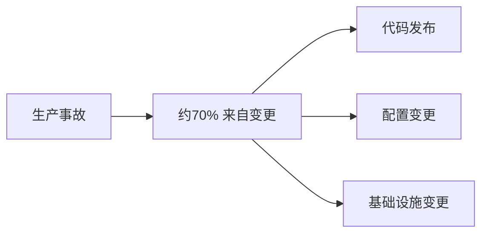
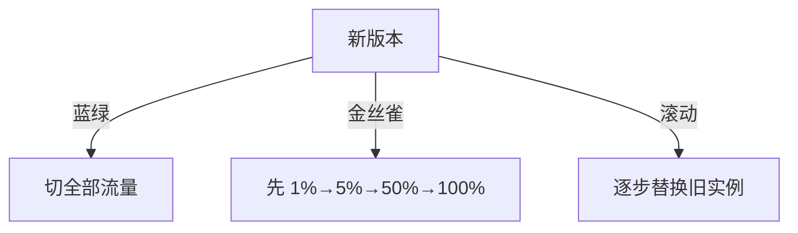
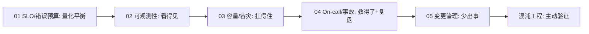

# 05 · 变更管理与渐进式发布

> Google SRE 数据：**约 70% 的生产事故源于变更**。功能越改越错，是稳定性最大的敌人。这一篇讲如何从"变更"这个最大风险源上，系统性地降风险。

---

## 一、变更是头号风险源

**启示**：与其事后救火，不如让每次变更"小、可控、可回退"。

---

## 二、变更管理的基本原则

| 原则 | 做法 |
|------|------|
| 小批量 | 一次变更影响面小，出事好定位好回滚 |
| 可回退 | 每次发布必须有**快速回滚**方案 |
| 可观测 | 变更后立刻看 SLI/SLO（见 02 篇） |
| 有护栏 | 渐进放量 + 自动熔断 |
| 防配置漂移 | 配置版本化、审批、与代码同审 |

> **铁律：配置变更和代码发布同等危险**，甚至更常见（改个超时、改个开关就崩）。配置必须走版本化 + 评审。

---

## 三、渐进式发布：把风险摊薄

### 3.1 三种主流策略

| 策略 | 做法 | 回滚 | 适用 |
|------|------|------|------|
| **蓝绿 Blue-Green** | 备一套新环境，流量整体切 | 切回旧（秒级） | 需整环境验证 |
| **金丝雀 Canary** | 先放小比例真实流量，逐步放大 | 缩回旧比例 | 最常用，风险最低 |
| **滚动 Rolling** | 逐批替换实例 | 停发+回滚批次 | 简单，但中途混版 |

### 3.2 金丝雀最佳实践

- **自动放量**：1% → 5% → 25% → 50% → 100%，每步看 SLO；
- **自动回滚**：某步错误率/延迟超阈值 → 自动缩回；
- **对比验证**：新旧版本同时跑，新版本 SLI 异常即停。

> 与 [CI/CD·部署策略](../基础知识/CI-CD/10-部署策略.md) 联动：部署策略的工程实现细节在那里。

---

## 四、特性开关（Feature Flag）：发布与上线解耦

价值：
- **部署 ≠ 上线**：代码先上但功能关着，验证环境后再开；
- **秒级回退**：出问题关开关，不必回滚代码；
- **灰度定向**：按用户/地域/白名单放量。

陷阱：开关堆积成"技术债"，需定期清理（见 [测试·代码质量](../测试与代码质量/06-代码质量与静态分析.md) 技术债管理）。

---

## 五、发布护栏（Release Guardrails）

| 护栏 | 作用 |
|------|------|
| CI 门禁全绿 | 单测/静态/契约（见 [测试·门禁](../测试与代码质量/07-质量门禁度量与持续测试.md)） |
| 自动化回归 | 合并前跑关键 E2E |
| 渐进放量 + 自动回滚 | 限制爆炸半径 |
| 变更窗口 | 高风险变更避开业务高峰 |
| 一键回滚 | 预案就绪 |

---

## 六、Cheat Sheet

| 主题 | 要点 |
|------|------|
| 风险源 | ~70% 事故来自变更，含配置 |
| 原则 | 小批量、可回退、可观测、有护栏 |
| 策略 | 金丝雀最常用（1%→100% 自动放量回滚）；蓝绿秒级切；滚动简单 |
| 特性开关 | 部署≠上线，秒级回退，记得清理 |
| 护栏 | CI 门禁 + 自动回归 + 渐进回滚 + 变更窗口 |

---

## 七、板块收尾 · SRE 全貌

> 回到：[SRE 与稳定性工程总览](SRE与稳定性工程总览.md)
