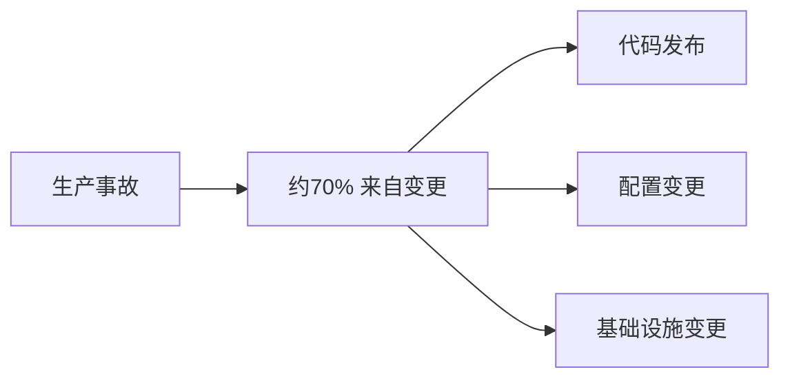
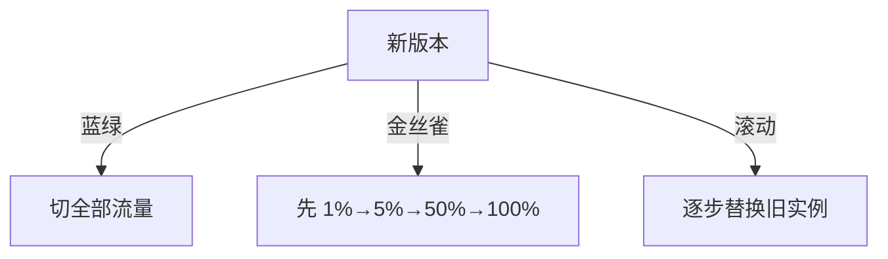
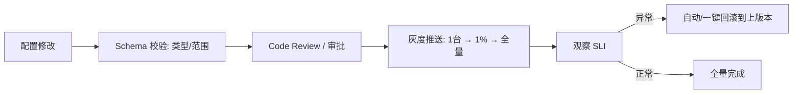

# 05 · 变更管理与渐进式发布

> Google SRE 数据：**约 70% 的生产事故源于变更**。功能越改越错，是稳定性最大的敌人。这一篇讲如何从"变更"这个最大风险源上，系统性地降风险。

---

## 一、变更是头号风险源



**启示**：与其事后救火，不如让每次变更"小、可控、可回退"。

---

## 二、变更管理的基本原则

| 原则 | 做法 |
|------|------|
| 小批量 | 一次变更影响面小，出事好定位好回滚 |
| 可回退 | 每次发布必须有**快速回滚**方案 |
| 可观测 | 变更后立刻看 SLI/SLO（见 02 篇） |
| 有护栏 | 渐进放量 + 自动熔断 |
| 防配置漂移 | 配置版本化、审批、与代码同审 |

> **铁律：配置变更和代码发布同等危险**，甚至更常见（改个超时、改个开关就崩）。配置必须走版本化 + 评审。

---

## 三、渐进式发布：把风险摊薄

### 3.1 三种主流策略



| 策略 | 做法 | 回滚 | 适用 |
|------|------|------|------|
| **蓝绿 Blue-Green** | 备一套新环境，流量整体切 | 切回旧（秒级） | 需整环境验证 |
| **金丝雀 Canary** | 先放小比例真实流量，逐步放大 | 缩回旧比例 | 最常用，风险最低 |
| **滚动 Rolling** | 逐批替换实例 | 停发+回滚批次 | 简单，但中途混版 |

### 3.2 金丝雀最佳实践

- **自动放量**：1% → 5% → 25% → 50% → 100%，每步看 SLO；
- **自动回滚**：某步错误率/延迟超阈值 → 自动缩回；
- **对比验证**：新旧版本同时跑，新版本 SLI 异常即停。

> 与 [CI/CD·部署策略](../基础知识/CI-CD/10-部署策略.md) 联动：部署策略的工程实现细节在那里。

---

## 四、特性开关（Feature Flag）：发布与上线解耦


价值：
- **部署 ≠ 上线**：代码先上但功能关着，验证环境后再开；
- **秒级回退**：出问题关开关，不必回滚代码；
- **灰度定向**：按用户/地域/白名单放量。

陷阱：开关堆积成"技术债"，需定期清理（见 [测试·代码质量](../测试与代码质量/06-代码质量与静态分析.md) 技术债管理）。

---

## 五、发布护栏（Release Guardrails）

| 护栏 | 作用 |
|------|------|
| CI 门禁全绿 | 单测/静态/契约（见 [测试·门禁](../测试与代码质量/07-质量门禁度量与持续测试.md)） |
| 自动化回归 | 合并前跑关键 E2E |
| 渐进放量 + 自动回滚 | 限制爆炸半径 |
| 变更窗口 | 高风险变更避开业务高峰 |
| 一键回滚 | 预案就绪 |

---

## 六、Cheat Sheet

| 主题 | 要点 |
|------|------|
| 风险源 | ~70% 事故来自变更，含配置 |
| 原则 | 小批量、可回退、可观测、有护栏 |
| 策略 | 金丝雀最常用（1%→100% 自动放量回滚）；蓝绿秒级切；滚动简单 |
| 特性开关 | 部署≠上线，秒级回退，记得清理 |
| 护栏 | CI 门禁 + 自动回归 + 渐进回滚 + 变更窗口 |

---

## 七、板块收尾 · SRE 全貌


---

## 八、发布指标与量化（用数据管发布）

| 指标 | 含义 | 目标示例 |
|------|------|----------|
| 变更成功率 | 发布后观察期无回滚/无事故 | > 99% |
| 平均回滚时间（MTTR-rollback） | 从发现异常到流量回退 | < 5 分钟 |
| 发布频率 | 每服务每周发布次数 | 与迭代速度匹配 |
| 金丝雀放量时长 | 小流量→全量的平均时长 | 30~120 分钟 |
| 事故率/变更 | 每百次变更引发的事故数 | < 1 |

> 把「发布」本身变成可度量、可改进的工程对象——发布成功率和回滚速度是 SRE 团队最该盯的两块。

---

## 九、发布事故的常见现场（避坑）

| 场景 | 根因 | 预防 |
|------|------|------|
| 发布后 DB 慢查询打垮库 | 新 SQL 无索引/压测不足 | SQL 变更检查项进 CI + 预发全链路压测 |
| 配置变更全局生效 | 配置无灰度、无版本 | 配置也走金丝雀 + 版本化 + 审批 |
| 凌晨发布没人盯 | 变更窗口无守护 | 高风险变更配值守或避开深夜 |
| 回滚才发现没备份/迁移不可逆 | 未提前验证回滚路径 | 每次发布演练「回滚路线」 |
| 特性开关忘删，逻辑成迷宫 | 开关债累积 | 开关设 TTL + 定期清理清单 |

---

## 十、变更风险分级：不是所有变更都该同样严格

### 10.1 风险评估维度

```
风险 = 影响面 × 可回退性 × 变更复杂度 × 时机
```

| 维度 | 低风险 | 高风险 |
|------|--------|--------|
| **影响面** | 单服务、非核心链路 | 核心链路、全站共用组件 |
| **可回退性** | 一键回滚，秒级生效 | 不可逆（数据迁移、删字段） |
| **复杂度** | 单文件改动、参数调整 | 跨服务协议变更、架构重构 |
| **时机** | 工作日低峰、有人值守 | 大促期间、深夜、节假日 |
| **依赖协同** | 独立发布 | 需与上下游同时上线 |

### 10.2 分级与对应管控

| 级别 | 特征 | 管控要求 |
|------|------|----------|
| **L1 常规** | 单服务、可回滚、非核心 | CI 门禁 + 金丝雀自动放量，无需人工审批 |
| **L2 重要** | 核心链路、可回滚 | 金丝雀 + 值守 + 变更公告 + 回滚预案确认 |
| **L3 高危** | 不可逆 / 跨服务协同 / 数据变更 | 评审会 + 演练 + 双人复核 + 分步执行 + 窗口限制 |
| **L4 禁止期变更** | 大促/封网期 | 原则禁止；紧急必要走应急审批（IC 级别决策） |

> **反模式：一刀切的重审批**。所有变更都要走三级审批，结果是：
> - 开发为了少审批一次，把 10 个改动攒成 1 个大发布 → **批量变大，风险反而上升**
> - 审批变成盖章，审的人根本不看内容 → **假安全感**
>
> **正解：低风险自动化放行，高风险重管控**。审批资源应该集中在真正危险的变更上。

### 10.3 变更三问（提交前自查）

```
1. 出问题多久能发现？   → 有对应的监控/告警吗？观察哪个指标？
2. 出问题多久能回退？   → 回滚步骤是什么？验证过吗？有不可逆部分吗？
3. 最坏情况影响多大？   → 影响哪些用户/多少比例/是否资损？
```

> 三问答不上来的变更，不允许发布。这三个问题的答案就是「变更单」的核心内容。

---

## 十一、数据库变更：最危险的一类变更

### 11.1 为什么 DB 变更特别危险

| 特点 | 后果 |
|------|------|
| **难回滚** | 代码能回滚，删掉的列回不来 |
| **锁表风险** | 大表 DDL 可能锁表，全站写入阻塞 |
| **主从延迟** | 大事务/大 DDL 导致从库延迟，读到旧数据 |
| **无法灰度** | Schema 是全局的，不能只对 1% 用户生效 |
| **影响面大** | 一个库通常被多个服务共用 |

### 11.2 扩展-收缩模式（Expand-Contract）

这是**兼容性 DB 变更的标准姿势**，核心思想：任何时刻新旧代码都能正常工作。


| 步骤 | 关键点 | 可回滚性 |
|------|--------|----------|
| 1 加字段 | **必须可为 NULL 或有默认值**，否则旧代码插入失败 | 可回滚 |
| 2 双写 | 新代码同时写新旧字段 | 可回滚 |
| 3 回填 | 分批小批量回填（每批限流），避免打垮主库 | 可中断 |
| 4 切读 | 先影子对比（读新旧都读，比较是否一致），再正式切 | 可回滚 |
| 5 停旧写 | 观察一段时间（如 1~2 周）确认无人再读旧字段 | 可回滚 |
| 6 删字段 | **不可逆**，删前必须确认无引用 + 备份 | **不可回滚** |

> **铁律：加字段和删字段绝不能在同一次发布里做**。步骤 1 和步骤 6 之间应该隔数天到数周，中间必须有充分的观察窗口。
>
> **重命名字段 = 删 + 加**，同样必须走扩展-收缩，不能直接 rename。

### 11.3 危险 DDL 与安全替代

| 危险操作 | 风险 | 安全做法 |
|----------|------|----------|
| 大表 `ALTER TABLE ADD COLUMN` | 老版本 MySQL 锁表 | 用在线 DDL 工具（gh-ost / pt-online-schema-change）或确认 Online DDL 支持 |
| 大表加索引 | 长时间占用资源、主从延迟 | 低峰期 + 在线工具 + 分批 |
| `UPDATE` 全表无 WHERE 分批 | 大事务、锁行多、binlog 暴涨、主从延迟 | 分批（每批 500~1000 行）+ 批间 sleep + 限流 |
| `DELETE` 大量数据 | 同上，且难恢复 | 分批 + 先逻辑删除 + 归档表 |
| 改字段类型（int→bigint） | 需重建表 | 在线 DDL 工具 + 充分测试 |
| 加 NOT NULL 无默认值 | 旧代码插入报错 | 先加可空 → 回填 → 再加约束 |

```sql
-- 反面：一把梭全表更新（大事务，锁+延迟+binlog 暴涨）
UPDATE orders SET status_new = status WHERE status_new IS NULL;

-- 正面：分批 + 主键游标 + 限流
-- 应用侧循环执行，每批之间 sleep 50~200ms，并观察主从延迟
UPDATE orders
SET status_new = status
WHERE status_new IS NULL AND id > ? AND id <= ?    -- 主键区间，走索引
LIMIT 1000;
-- 每批结束检查：SHOW SLAVE STATUS 的 Seconds_Behind_Master
-- 延迟 > 阈值（如 10s）则暂停回填，等延迟恢复
```

### 11.4 DB 变更检查清单

```text
DB 变更 · 上线前检查单
[ ] 执行计划已看（EXPLAIN），新 SQL 走索引
[ ] 表数据量已确认（万级/千万级/亿级 → 决定用不用在线 DDL 工具）
[ ] 是否锁表已确认（版本 + 操作类型）
[ ] 主从延迟影响已评估，有暂停机制
[ ] 变更可回滚吗？不可回滚部分单独拆开、延后
[ ] 新旧代码兼容性（扩展-收缩的哪一步）
[ ] 备份已确认可用（且知道恢复要多久）
[ ] 执行窗口：低峰期 + 有人值守
[ ] 回填任务有限流、可暂停、有进度可观测
[ ] 变更后观察指标：慢查询数、主从延迟、连接数、错误率
```

> 相关：[基础知识·MySQL](../基础知识/mysql知识.md)、[数据迁移双写与平滑扩容](../分库分表与数据迁移/03-数据迁移双写与平滑扩容.md)。

---

## 十二、配置变更：最容易被低估的杀手

### 12.1 为什么配置比代码更危险

| 原因 | 说明 |
|------|------|
| **生效快** | 配置中心推送秒级全量生效，没有金丝雀缓冲 |
| **无 CI 保护** | 代码有编译/单测/门禁，配置往往是"改个值点保存" |
| **无评审** | 代码要 Code Review，配置常常一个人改 |
| **无版本** | 改完不知道之前是什么值，回滚靠记忆 |
| **影响全局** | 一个超时值、一个开关影响所有实例 |

### 12.2 配置变更的护栏



| 护栏 | 实现 |
|------|------|
| **配置即代码（GitOps）** | 配置存 Git，走 PR 评审与版本历史 |
| **类型与范围校验** | 超时不能为 0 或负数、线程数有上下限、枚举白名单 |
| **灰度推送** | 配置中心支持按实例/分组灰度（先推 1 台） |
| **版本与一键回滚** | 保留历史版本，一键回退 |
| **变更审计** | 谁、何时、改了什么、从什么改成什么 |
| **危险配置双人复核** | 限流阈值、开关、连接池等关键项 |

### 12.3 经典配置事故模式

| 事故 | 机理 |
|------|------|
| 超时从 3s 改成 30s | 慢请求不再快速失败 → 线程池被占满 → 服务假死 |
| 超时从 3s 改成 30ms | 正常请求全部超时 → 错误率飙升 |
| 限流阈值多敲一个 0 | 限流形同失效 → 峰值直接打垮 |
| 限流阈值少敲一个 0 | 正常流量被大面积拒绝（自己 DDoS 自己） |
| 连接池 max 从 20 改成 200 | 实例数 × 200 > DB max_connections → DB 拒连，全站故障 |
| 缓存 TTL 改成 0 | 缓存失效 → 请求全打 DB → 击穿 |
| 日志级别改成 DEBUG | 日志暴涨 → 磁盘满 / IO 打满 / 采集链路崩 |
| 开关名拼错 | 读到默认值，行为与预期相反（且很难发现） |

> **口诀：改配置前先问"这个值的合理区间是多少、改错会怎样、几秒能回退"。**
>
> **强烈建议**：把上述危险配置项加**范围校验**，让改错在校验层就被拦住——依赖人小心是不可靠的。

---

## 十三、金丝雀发布的工程实现

### 13.1 Argo Rollouts 金丝雀配置示例

```yaml
apiVersion: argoproj.io/v1alpha1
kind: Rollout
metadata:
  name: order-service
spec:
  replicas: 20
  strategy:
    canary:
      canaryService: order-service-canary     # 金丝雀流量入口
      stableService: order-service-stable
      trafficRouting:
        istio:
          virtualService:
            name: order-vs
      steps:
        - setWeight: 5                        # 先 5%
        - pause: { duration: 5m }             # 观察 5 分钟
        - analysis:                           # 自动化指标分析
            templates:
              - templateName: success-rate-check
        - setWeight: 20
        - pause: { duration: 10m }
        - analysis:
            templates:
              - templateName: success-rate-check
        - setWeight: 50
        - pause: { duration: 10m }
        - setWeight: 100
      analysis:
        templates:
          - templateName: success-rate-check
---
apiVersion: argoproj.io/v1alpha1
kind: AnalysisTemplate
metadata:
  name: success-rate-check
spec:
  metrics:
    - name: success-rate
      interval: 1m
      count: 5
      successCondition: result[0] >= 0.995    # 成功率 ≥ 99.5% 才继续
      failureLimit: 1                          # 失败 1 次即回滚
      provider:
        prometheus:
          address: http://prometheus:9090
          query: |
            sum(rate(http_requests_total{app="order-service",canary="true",code!~"5.."}[2m]))
            /
            sum(rate(http_requests_total{app="order-service",canary="true"}[2m]))
    - name: latency-p99
      interval: 1m
      count: 5
      successCondition: result[0] <= 0.8       # p99 ≤ 800ms
      provider:
        prometheus:
          address: http://prometheus:9090
          query: |
            histogram_quantile(0.99,
              sum(rate(http_duration_seconds_bucket{app="order-service",canary="true"}[2m])) by (le))
```

### 13.2 金丝雀分析的关键：对比而非绝对阈值

| 方式 | 问题 / 优势 |
|------|------------|
| **绝对阈值**（错误率 < 1%） | 简单，但业务本身波动时误判（大促时基线本来就高） |
| **同期对比**（vs 昨日同时段） | 排除日内周期，但受活动影响 |
| **A/B 对比**（canary vs stable 同时刻） | ✅ **最可靠**：同时刻同流量，差异只来自版本 |

```
判断逻辑（推荐）：
if canary.error_rate > stable.error_rate × 1.5 + 容差  →  回滚
if canary.p99 > stable.p99 × 1.3 + 容差               →  回滚
```

> **样本量陷阱**：5% 流量下如果 QPS 很低，10 分钟可能只有几十个请求——**统计不显著，看不出差异**。
>
> 对策：低流量服务把金丝雀比例调高（如 20%）或延长观察时间，甚至用定向流量（内部账号）先验证。

### 13.3 金丝雀的常见失效场景

| 场景 | 为什么金丝雀没拦住 | 对策 |
|------|-------------------|------|
| 慢性问题（内存泄漏） | 观察期太短，泄漏要几小时才显现 | 保留一批金丝雀实例长期运行（长尾金丝雀） |
| 只有特定用户触发 | 小流量随机采样没覆盖到 | 定向灰度（按用户特征/地域） |
| 定时任务类问题 | 金丝雀期间没到执行时间 | 单独验证定时任务，或延长观察 |
| 数据写坏 | 错误率没变，但数据脏了 | 加数据一致性校验/对账指标 |
| 缓存共享 | 金丝雀写了新格式缓存，稳定版读不懂 | 缓存 key 带版本，或保证格式兼容 |
| 下游被小流量打挂 | 新版本调用量放大（N+1 查询） | 监控下游调用量，不只看自身 RT |

> **最隐蔽的一类：金丝雀实例本身指标正常，但它把共享资源搞坏了**（缓存污染、DB 连接占用、消息格式不兼容）。所以金丝雀期间要**同时观察稳定版实例的指标**——如果稳定版也开始异常，说明是共享资源被污染。

---

## 十四、发布中的兼容性设计

### 14.1 滚动发布必然出现"新旧混跑"

```
滚动/金丝雀期间，同一时刻线上同时存在 v1 和 v2：
- v1 写的数据，v2 要能读
- v2 写的数据，v1 要能读（因为可能回滚！）
- v1 发的消息，v2 要能消费
- v2 发的消息，v1 要能消费
```

| 兼容方向 | 名称 | 场景 |
|----------|------|------|
| 新代码能处理旧数据 | **向后兼容** | 正常升级 |
| 旧代码能处理新数据 | **向前兼容** | **回滚时需要**（最常被忽略） |

> **踩坑高频**：只测了"新版本能读旧数据"，回滚时发现旧版本读不懂新版本写的数据 → **回滚失败，故障时间被拉长数倍**。
>
> **口诀：能上不能下的发布，等于没有回滚方案。**

### 14.2 各类协议的兼容规则

| 对象 | 兼容做法 | 禁止 |
|------|----------|------|
| **接口字段** | 只增不删；新增字段可选（有默认值） | 删字段、改字段类型、改语义 |
| **JSON 反序列化** | 配置"忽略未知字段" | 遇未知字段就报错 |
| **消息格式** | 带版本号；消费端兼容多版本 | 直接改结构 |
| **枚举值** | 新增值时，旧代码要有 default 分支 | 旧代码 switch 无 default → 抛异常 |
| **缓存** | key 带版本或保证 value 结构兼容 | 直接改 value 结构 |
| **DB Schema** | 扩展-收缩（见十一章） | 一次发布内加删并存 |

### 14.3 优雅上下线

```
下线（缩容/滚动替换）必须做的事：
1. 从注册中心/负载均衡摘除（先摘流量）
2. 等待 in-flight 请求处理完（graceful shutdown timeout）
3. 关闭消费者（先停拉取，处理完已拉取消息）
4. 释放资源（连接池、文件句柄）
5. 进程退出

上线必须做的事：
1. readinessProbe 通过前不接流量
2. 预热（JIT 编译、缓存加载、连接池建连）
3. 慢启动（权重逐步提升），避免冷实例被打爆
```

```yaml
# K8s 优雅下线配置
spec:
  terminationGracePeriodSeconds: 45     # 给足处理时间
  containers:
    - name: app
      lifecycle:
        preStop:
          exec:
            # 先摘流量并等待 LB 感知（关键！否则仍有请求打进来）
            command: ["sh", "-c", "curl -X POST localhost:8080/actuator/offline && sleep 15"]
      readinessProbe:
        httpGet: { path: /health/ready, port: 8080 }
        periodSeconds: 3
        failureThreshold: 2
      startupProbe:                      # 慢启动应用用 startupProbe，别用长 initialDelay
        httpGet: { path: /health/live, port: 8080 }
        failureThreshold: 30
        periodSeconds: 5
```

> **经典坑**：没有 `preStop` 的 sleep —— Pod 收到 SIGTERM 立即关闭，但**负载均衡还没感知到摘除**，这段时间的请求全部 502。表现为"每次发布都有一小波 5xx"。

---

## 十五、回滚：最重要的能力

### 15.1 回滚的三种形态

| 形态 | 速度 | 适用 |
|------|------|------|
| **流量回退**（金丝雀缩回 / 蓝绿切回） | 秒级 | 最快，首选 |
| **开关关闭**（Feature Flag） | 秒级 | 功能级问题 |
| **版本回滚**（重新部署旧版本） | 分钟级 | 兜底手段 |

### 15.2 回滚不可行的情况（必须提前识别）

| 情况 | 为什么不能回滚 | 应对 |
|------|---------------|------|
| 已执行不可逆 DDL | 旧代码不认识新 Schema | 走扩展-收缩，保证旧代码兼容 |
| 数据已按新格式写入 | 旧代码读不懂 | 保证向前兼容，或双写 |
| 消息已按新格式发出 | 旧消费者处理不了 | 消息带版本，消费端兼容 |
| 外部系统已同步新状态 | 第三方无法回退 | 拆分发布顺序，外部交互最后开 |

> **发布顺序原则：先发"能兼容旧的"，后发"依赖新的"。**
> 例如接口提供方先上（同时支持新旧协议），调用方后上。这样任一环节回滚都安全。

### 15.3 回滚演练清单

```text
回滚演练（每个高风险发布前）
[ ] 明确回滚触发条件（错误率 > X% / p99 > Y ms / 人工判断）
[ ] 明确回滚决策人（谁有权拍板，不需要等审批链）
[ ] 回滚命令/操作已写清（可复制粘贴）
[ ] 已在预发实际执行过一次回滚（不是"应该能回"）
[ ] 回滚耗时已实测（写进变更单）
[ ] 回滚后的验证步骤（看哪个指标恢复）
[ ] 不可逆部分已识别并单独处理
```

> **实测数据比信念可靠**：很多团队"以为"能一键回滚，真到用时发现镜像被清理了、旧配置对不上、回滚脚本半年没跑过已经失效。

---

## 十六、特性开关的工程治理

### 16.1 四类开关（生命周期不同）

| 类型 | 用途 | 存活时间 |
|------|------|----------|
| **发布开关（Release Toggle）** | 新功能灰度上线 | 短期（上线稳定后删） |
| **实验开关（Experiment）** | A/B 测试 | 实验周期 |
| **运维开关（Ops Toggle）** | 降级/限流/关非核心功能 | **长期保留**（应急用） |
| **权限开关（Permission）** | 按用户/租户开放功能 | 长期（业务逻辑） |

> **只有"发布开关"是需要清理的技术债**；运维降级开关是**资产**，必须长期保留并定期演练。混淆这两类会导致"清理开关时把降级能力删了"。

### 16.2 开关治理规范

| 规范 | 说明 |
|------|------|
| 开关必须登记 | 名称、用途、类型、owner、预计下线时间 |
| 发布开关设 TTL | 超期自动告警提醒清理 |
| 默认值必须安全 | 读不到配置时的默认行为 = 旧行为（保守） |
| 开关判断集中封装 | 不要在 20 个地方写 `if (flag)`，封装成一个方法 |
| 避免开关组合爆炸 | N 个开关有 2^N 种状态，测不完；限制同时在飞的开关数 |
| 运维开关定期演练 | 每季度真实触发一次，确认还能用 |

```java
// 反面：散落各处的开关判断，且默认值不安全
if (config.getBoolean("new.pricing.enabled")) {   // 读不到 → false？还是异常？
    return newPricing(order);
}
return oldPricing(order);

// 正面：集中封装 + 默认安全 + 异常兜底
public boolean useNewPricing(String userId) {
    try {
        // 默认 false = 旧行为，配置中心异常时保持保守
        if (!featureFlags.isEnabled("new.pricing", false)) return false;
        return featureFlags.inWhitelistOrPercentage("new.pricing", userId);
    } catch (Exception e) {
        log.warn("feature flag read failed, fallback to old pricing", e);
        return false;   // 关键：异常也要有确定行为，不能抛出去
    }
}
```

> **踩坑**：开关判断代码本身抛异常（配置中心不可用），把正常请求也搞挂了——**开关是为了降风险，不能自己成为风险源**。

---

## 十七、封网期与变更冻结

| 场景 | 策略 |
|------|------|
| 大促/重要活动前 | 提前 N 天封网，只允许 P0 修复 |
| 错误预算耗尽 | 冻结功能变更，只做稳定性工作（见 [01 SLO](01-SRE理念与SLI-SLO-ErrorBudget.md)） |
| 节假日/长假 | 原则不发布（出事没人在） |

**封网期的正确姿势**：

| 做 ✅ | 不做 ❌ |
|-------|---------|
| 提前公告封网时间与例外流程 | 临时通知，导致大量变更挤在封网前 |
| 例外走应急审批（明确谁能批） | 完全禁止 → 紧急 bug 也修不了 |
| 封网前留出稳定观察期（如 3 天） | 封网前最后一天大批量上线（风险最高） |
| 封网期加强值守与监控 | 以为不发布就没事（依赖变化、流量变化仍会出事） |

> **最危险的时刻是"封网前最后一个窗口"**：所有人抢着上，批量巨大、评审不足、观察期为零。**封网的收益常常被"封网前大发布"抵消掉。**
>
> 对策：封网前 N 天开始**逐步收紧**（只允许 L1 → 只允许修复 → 完全封网），而不是一刀切。

---

## 十八、变更管理的度量与改进闭环


| 分析维度 | 能发现什么 |
|----------|-----------|
| 按变更类型（代码/配置/DDL） | 哪类变更最容易出事 → 优先补护栏 |
| 按时间（工作日/深夜/周末） | 是否需要限制变更窗口 |
| 按批量大小 | 大批量是否显著更容易出事（通常是） |
| 按是否走金丝雀 | 量化金丝雀的实际收益 |
| 按服务/团队 | 哪些服务需要专项加固 |

> 与 DORA 四指标呼应（部署频率、变更前置时间、变更失败率、MTTR），详见 [CI/CD·DORA 度量与 DevSecOps](../基础知识/CI-CD/13-可观测性DORA度量与DevSecOps.md)。
>
> **重要认知：高频小批量发布的团队，稳定性反而更好**。因为每次变更小、易定位、易回滚，且发布流程被反复演练。**"少发布=更稳定"是错觉**——攒大版本才是真正的高风险。

---

## 十九、常见误区（面试高频）

| 误区 ❌ | 正解 ✅ |
|---------|---------|
| 发布次数越少越稳定 | 高频小批量更稳定；攒大版本才危险 |
| 所有变更都严格审批 | 低风险自动化放行，审批资源给高危变更 |
| 配置变更不算发布 | 配置生效更快、更少保护，往往更危险 |
| 有金丝雀就安全 | 慢性问题/低样本量/共享资源污染都能绕过金丝雀 |
| 能回滚代码就能回滚一切 | DDL、数据格式、消息、外部状态可能不可逆 |
| 只需向后兼容 | 回滚需要向前兼容（旧代码读新数据） |
| 特性开关都是技术债 | 运维降级开关是长期资产，要保留并演练 |
| 封网就安全了 | 封网前的抢发窗口风险最高，要逐步收紧 |
| 发布完看一眼没报错就行 | 要有明确观察期与指标，慢性问题需长尾观察 |

---

## 二十、面试速答框架

1. **怎么降低发布风险？** → 小批量 + 可回滚 + 渐进放量（金丝雀自动分析）+ CI 门禁 + 观察期，配合变更三问（多久发现/多久回退/最坏影响）。
2. **金丝雀怎么判断该不该继续放量？** → 与稳定版同时刻 A/B 对比（错误率、p99），而非绝对阈值；注意样本量是否足够。
3. **DB 加字段怎么安全上线？** → 扩展-收缩：加可空字段 → 双写 → 分批回填（限流+看主从延迟）→ 切读 → 停旧写 → 隔期删除。
4. **发布回滚失败过吗，为什么？** → 常见是向前兼容没做（旧代码读不懂新数据）、DDL 不可逆、镜像被清理、回滚脚本未演练。
5. **配置变更怎么管？** → 配置即代码走 Git/PR、类型与范围校验、灰度推送、版本化一键回滚、关键项双人复核。
6. **发布时有一小波 5xx 怎么解？** → 优雅下线：preStop 先摘流量再 sleep 等 LB 感知；上线用 readiness/startupProbe + 慢启动预热。
7. **特性开关怎么不变成债？** → 分类（发布/实验/运维/权限）、登记 owner+TTL、集中封装、默认值安全、限制同时在飞数量。

---

## 二十一、口诀与小结

> **变更口诀：小批量可回退，先问三句再上线；配置和代码同危，DDL 拆成六步走。**
>
> **发布口诀：金丝雀对比看，样本不够别放量；能上要能下，向前兼容才敢回。**
>
> **护栏口诀：门禁卡合入，灰度控半径；开关分四类，运维开关留着别删。**

| 主题 | 一句话 |
|------|--------|
| 风险分级 | 低风险自动放行，高危重管控；一刀切审批反而增大批量 |
| 变更三问 | 多久发现、多久回退、最坏多大 |
| DB 变更 | 扩展-收缩六步；分批回填看主从延迟；加删不同期 |
| 配置变更 | 配置即代码 + 范围校验 + 灰度推送 + 版本回滚 |
| 金丝雀 | A/B 同时刻对比；注意样本量、慢性问题、共享资源污染 |
| 兼容性 | 向后 + **向前**兼容都要，否则无法回滚 |
| 优雅上下线 | preStop 摘流量再退出；readiness + 慢启动预热 |
| 回滚 | 流量回退 > 开关关闭 > 版本回滚；必须实测演练 |
| 开关治理 | 四类分开；发布开关设 TTL，运维开关长期保留 |
| 封网 | 逐步收紧而非一刀切；提防封网前抢发窗口 |
| 度量 | 变更成功率 + 事故率/变更；高频小批量更稳 |

---

## 二十二、板块收尾 · SRE 全貌


| 想深入 | 去这里 |
|--------|--------|
| 部署策略工程细节 | [CI/CD·部署策略](../基础知识/CI-CD/10-部署策略.md) |
| 流水线设计模式 | [CI/CD·流水线设计模式](../基础知识/CI-CD/09-流水线设计模式与最佳实践.md) |
| 密钥与环境配置 | [CI/CD·环境配置与密钥管理](../基础知识/CI-CD/12-环境配置与密钥管理.md) |
| DORA 度量 | [CI/CD·DORA 与 DevSecOps](../基础知识/CI-CD/13-可观测性DORA度量与DevSecOps.md) |
| 质量门禁 | [测试·质量门禁与持续测试](../测试与代码质量/07-质量门禁度量与持续测试.md) |
| GitOps 声明式发布 | [云原生·GitOps](../云原生/GitOps.md) |
| 数据迁移专题 | [数据迁移双写与平滑扩容](../分库分表与数据迁移/03-数据迁移双写与平滑扩容.md) |

---

> 回到：[SRE 与稳定性工程总览](SRE与稳定性工程总览.md)
