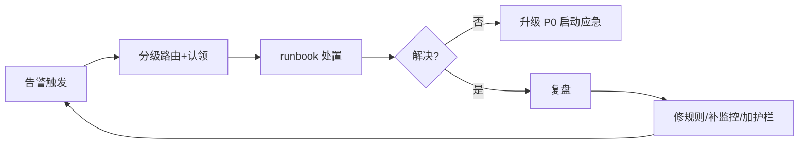

# 06 · 日志规范与监控告警规则库

> 02 篇讲了可观测性的"道"（三大支柱、黄金信号、SLO 告警），本文补"术"：**可抄即用的日志规范、指标埋点规范、告警规则模板与告警治理**。目标是一套规则拿过去就能落地，避免"日志随便打、告警随便报"的混乱。
>
> 前置阅读：「[02 可观测性与稳定性看护](02-可观测性与稳定性看护.md)」（三件套与 SLO 理论）、「[云原生/可观测性](../云原生/可观测性.md)」（Prometheus/Grafana/Loki 工具）、「[04 On-call 与事故管理](04-On-call与事故管理.md)」（告警触发后的响应流程）、「[基础知识/Linux排查](../基础知识/Linux排查.md)」（底层指标定位）。

---

## 一、日志规范（统一日志规范）

### 1.1 日志分级标准（别乱用）

| 级别 | 含义 | 什么时候打 | 生产要求 |
|------|------|-----------|----------|
| TRACE | 链路级细节 | 本地调试 | 生产关闭 |
| DEBUG | 调试信息 | 开发环境/临时排查 | 生产关闭（可动态开关） |
| INFO | 关键业务事件 | 请求完成、状态变更、任务执行 | 保留 |
| WARN | 可恢复异常 | 重试成功、降级触发、限流 | 保留，需监控 |
| ERROR | 功能异常 | 业务失败、异常捕获、调用失败 | 保留 + 告警 + 当日处理 |
| FATAL | 进程不可用 | 启动失败、致命错误 | 保留 + 电话告警 |

> 口诀：**"INFO 记业务、WARN 记可恢复、ERROR 记功能失败；堆栈只在 ERROR/FATAL 打。"**

### 1.2 日志格式规范（统一模板）

```text
2026-08-06 10:32:15.123 [http-nio-8080-exec-3] ERROR com.demo.order.service - traceId=0a1b2c3d4e5f spanId=abc method=createOrder orderId=2026080610001 costMs=342 msg=库存扣减失败 err=StockNotEnoughException: 库存不足
```

| 字段 | 说明 | 强制 |
|------|------|------|
| 时间戳 | 精确到毫秒，ISO8601 | ✅ |
| 线程名 | 排查并发问题 | ✅ |
| 日志级别 | 分级 | ✅ |
| logger | 类名，定位代码 | ✅ |
| **traceId/spanId** | 全链路串联 | ✅ |
| 业务关键字段 | orderId/userId/方法名 | 建议 |
| costMs | 耗时 | 建议 |
| 错误信息 | 类型 + message | ✅（ERROR 必有堆栈） |

### 1.3 结构化日志（JSON）与上下文传递

- **结构化日志**：输出 JSON，字段可检索、可聚合（Logstash/Loki 直接消费）：

```json
{"ts":"2026-08-06T10:32:15.123+08:00","level":"ERROR","logger":"OrderService","traceId":"0a1b2c","userId":"u_10086","method":"createOrder","costMs":342,"msg":"库存扣减失败","errType":"StockNotEnough","errMsg":"库存不足"}
```

- **traceId 透传**：入口生成 → 存入 **MDC（Mapped Diagnostic Context）** → 异步线程需**手动传递**（`MDC.put`/装饰器），输出到每条日志：

```java
MDC.put("traceId", TraceIdGenerator.next());
try {
    // 业务逻辑：所有同线程日志自动携带 traceId
} finally {
    MDC.remove("traceId"); // 线程池复用线程，必须清理，防串号
}
```

> 链路打通是排查神器：**报障给 traceId → 一搜全部日志按时间轴串起来**（配合「[场景设计/问题定位](../场景设计/问题定位.md)」）。

### 1.4 日志该打什么、不该打什么

| 该打 | 不该打 |
|------|--------|
| 请求入口/出口（参数+耗时） | **敏感数据**：密码、token、验证码、身份证、完整手机号 |
| 业务关键状态变更 | 每行循环打 DEBUG（日志风暴） |
| 异常发生点（带上下文+堆栈） | 只 `printStackTrace()` 不记录 |
| 外部依赖调用结果（降级/重试） | **吞异常**（catch 后打都不打） |
| 慢请求/慢 SQL 标记 | 大对象 toString（如整个 Response 超长） |

- **脱敏**：手机号 `138****8000`、身份证、卡号；日志脱敏组件（如 logstash-logback-encoder 的 mask 或自研）。
- **防日志风暴**：`while` 循环内 ERROR、异常重试循环打印 → 设频率限制/采样（如 1s 最多 N 条）。

### 1.5 切分、保留与采集链路

- **切分**：按天/大小滚动（logback `SizeAndTimeBasedRollingPolicy`）；生产常见：保留 **30 天热数据 + 归档**（合规另算）。
- **采集链路**：`应用 stdout/文件 → Filebeat → Kafka（缓冲削峰）→ Logstash/Fluentd（清洗）→ ES/Loki → Kibana/Grafana`。
- **丢日志纪律**：采集端挂掉不能阻塞业务 → 异步采集、buffer 限长、**日志采集失败不影响主链路**。
- **容量估算**：单条 500B × 每秒万级 × 24h ≈ 数百 GB/天，提前规划存储与采样策略。

---

## 二、指标与埋点规范

### 2.1 指标命名规范

```
<namespace>_<子系统>_<资源/操作>_<单位|状态>
示例: app_order_http_request_total、jvm_heap_used_bytes、mysql_slave_seconds_behind_master
```

- 统一命名空间（`app_`/`infra_`/`biz_`）、单位进名字（`_bytes`/`_seconds`/`_total`）、Prometheus 规范（`_total` 结尾为 counter）。

### 2.2 指标类型（Prometheus）

| 类型 | 语义 | 例子 |
|------|------|------|
| **Counter** | 只增不减的计数 | 请求总数、错误总数 |
| **Gauge** | 可增可减的瞬时值 | 在线人数、CPU、队列深度 |
| **Histogram** | 分位数分布（客户端聚合） | 请求延迟 p50/p99 |
| **Summary** | 同 Histogram，服务端聚合 | 调用延迟分布 |

### 2.3 黄金信号埋点清单（照抄清单）

| 层 | 必埋指标 |
|----|----------|
| 入口（HTTP/网关） | QPS、错误率、延迟分位、请求体大小 |
| 下游调用（RPC/DB/Redis/MQ） | 调用量、失败率、耗时、超时数 |
| 线程池 | 活跃线程、队列深度、拒绝数、最大等待 |
| JVM | 堆使用、GC 次数/耗时、线程数、FGC、类加载 |
| 容器/机器 | CPU、内存、磁盘、网络、fd 数 |

---

## 三、告警规则库（模板可直接抄）

### 3.1 告警分级与响应时限

| 级别 | 定义 | 例子 | 通知方式 | 响应时限 |
|------|------|------|----------|----------|
| **P0 紧急** | 核心功能不可用/资损/安全 | 支付接口全挂、DB 主库不可写 | 电话 + IM 双发 | 5~15 分钟 |
| **P1 严重** | 部分功能受损/即将越界 | 错误率>5%、MQ 堆积持续增长 | IM + 电话 | 30 分钟 |
| **P2 警告** | 有劣化趋势但未破红线 | 磁盘>80%、慢查询增多 | IM | 当日 |
| **P3 提醒** | 一般性状态变化 | 某指标小幅波动 | 邮件/群 | 可批量处理 |

> 分级原则：**先按"用户影响"定级，再按技术指标；P0 用自动升级（5 分钟没人认领自动电话）。**

### 3.2 资源类告警模板（PromQL）

| 指标 | PromQL 表达式 | 阈值 | 级别 |
|------|---------------|------|------|
| CPU 使用率 | `100 - avg(rate(node_cpu_seconds_total{mode="idle"}[5m])) * 100` | >85% 持续 10m | P2 |
| 内存使用率 | `(1 - node_memory_MemAvailable_bytes / node_memory_MemTotal_bytes) * 100` | >90% | P2 |
| 磁盘使用率 | `(1 - node_filesystem_avail_bytes / node_filesystem_size_bytes) * 100` | >85% | P2 |
| load 平均 | `node_load15 / count(node_cpu_seconds_total{mode="idle"})` | >核数 持续 15m | P2 |
| fd 使用率 | `node_filefd_allocated / node_filefd_maximum` | >80% | P2 |
| 磁盘 IO util | `rate(node_disk_io_time_seconds_total[5m])` | >90% | P2 |

### 3.3 应用类告警模板

| 指标 | PromQL | 阈值 | 级别 |
|------|--------|------|------|
| 接口错误率 | `sum(rate(app_http_request_total{code=~"5.."}[5m])) / sum(rate(app_http_request_total[5m]))` | >1%（核心接口） | P1 |
| 接口延迟 p99 | `histogram_quantile(0.99, sum(rate(app_http_duration_seconds_bucket[5m])) by (le))` | >基线 ×3 或 >1s | P1 |
| QPS 突降 | `sum(rate(app_http_request_total[5m])) < 基线 × 0.3` | 突降 70% | P1 |
| 线程池拒绝 | `rate(app_threadpool_rejected_total[5m])` | >0 | P1 |
| 活跃线程满 | `app_threadpool_active == app_threadpool_max` | 持续 5m | P2 |
| GC 频繁 | `rate(jvm_gc_pause_seconds_count[5m])` / FGC 次数 | FGC >1/5m | P2 |
| 堆使用率 | `jvm_memory_used_bytes{area="heap"} / jvm_memory_max_bytes{area="heap"}` | >85% 持续 15m | P2 |

### 3.4 中间件告警模板

| 中间件 | 指标 | 阈值 | 级别 |
|--------|------|------|------|
| MySQL | 连接数（`mysql_global_status_threads_connected`） | >max_connections 80% | P1 |
| MySQL | 主从延迟（`seconds_behind_master`） | >30s | P1 |
| MySQL | 慢查询数（`slow_queries`） | 突增 >2× 基线 | P2 |
| MySQL | 死锁（`innodb_row_lock_waits`） | 持续增长 | P2 |
| Redis | 内存使用率 | >80% | P1 |
| Redis | 连接数/阻塞命令 | 突增 | P2 |
| Redis | 命中率 | 突降（说明缓存失效风暴） | P1 |
| MQ | 堆积量（`consumer_lag`） | >1 万条且持续增长 | P1 |
| MQ | 消费失败率 | >1% | P2 |
| ES | 集群状态（green/yellow/red） | yellow 30m / red 即时 | P1 |
| ES | 堆使用率 | >85% | P2 |
| K8s | Pod 重启次数 / 节点 NotReady | 突增 | P1/P2 |

### 3.5 业务告警模板（示例）

| 指标 | 规则 | 阈值 | 级别 |
|------|------|------|------|
| 下单量 | 环比 5 分钟均值 | 突降 >50% | P1 |
| 支付成功率 | 滑动窗口成功率 | <99.5% | P1 |
| 订单状态机异常率 | 异常状态占比 | >0.1% | P2 |
| 对账差异 | 订单 vs 支付对账条数 | >0 | P0 |

> **业务告警是防"系统全绿、业务已挂"的关键**——技术指标没报警，但下单量腰斩，说明有逻辑/数据问题。SLO 与业务告警联动见「[01 SRE 理念与 SLI/SLO/Error Budget](01-SRE理念与SLI-SLO-ErrorBudget.md)」。

---

## 四、告警治理（防告警风暴与疲劳）

### 4.1 告警风暴的成因与对策

| 成因 | 对策 |
|------|------|
| 同因多指标各报一次 | **分组聚合**：按"故障域/服务"聚合一条告警 |
| 抖动瞬间触发 | 加**持续时长**（`for: 5m`）与**抑制窗口** |
| 根因引起连锁 | **抑制（Inhibition）**：父级 P0 触发时抑制下游子告警 |
| 依赖系统报警 | 主告警 + 依赖标记，依赖告警降级提醒 |
| 值班乱处理 | 告警必须有 **runbook（处置手册）** 链接 |

### 4.2 Alertmanager 关键配置思想

- **Grouping**：同标签（service/alertname）合并成一条通知，防刷屏。
- **Inhibition**：高等级抑制低等级（如 `infra=mysql` 挂了抑制其上层应用告警）。
- **Silence**：维护窗口/已知故障预静默，**必须有到期时间**（防永久静默）。
- **路由**：按团队/系统分发不同通道；P0 走电话，P1 走 IM@人。

### 4.3 告警质量三问（上线规则前自查）

1. **有行动吗？** 收到告警能明确"做什么"（否则降级为记录，别发告警）。
2. **会误报吗？** 阈值/基线校验：历史 7 天是否误触发 >5%。
3. **有人看吗？** 无人认领的告警 = 噪音，删除或改日志。

### 4.4 告警与事故闭环



- 联动：「[04 On-call 与事故管理](04-On-call与事故管理.md)」（值班、应急、无指责复盘）；每次事故复盘都应产出**新告警规则或规则修订**，形成"事故→规则"的正循环。

---

## 五、与其他板块的关系

- **02 可观测性**：本文是其落地的"规则层"；三大支柱的采集/工具在那边。
- **云原生/可观测性**：Prometheus/Grafana/Loki/OTel 的配置实操。
- **04 On-call 与事故管理**：告警触发后的响应与复盘流程。
- **01 SLI/SLO**：告警阈值应与 SLO/错误预算对齐（超预算 = P0）。
- **场景设计/问题定位**：日志与 traceId 的排查方法论落地。
- **测试与代码质量/07**：质量门禁与监控门禁同理（发布前看监控 vs 发布后看告警）。
- **CI-CD/13**：DORA 度量与可观测性联动。

---

## 六、速查表

| 主题 | 一句话 |
|------|--------|
| 日志分级 | INFO 记业务、WARN 记可恢复、ERROR 记失败 |
| 日志必带 | traceId + 线程 + 时间 + 级别 + logger |
| 结构化 | JSON 输出，字段可检索可聚合 |
| MDC | 入口放 traceId，异步线程要手动传递，用完清理 |
| 日志禁忌 | 不打敏感信息、不吞异常、防日志风暴 |
| 指标命名 | 命名空间_子系统_资源_单位 |
| 黄金信号 | RED（入口）+ USE（资源） |
| 告警分级 | P0 电话即时 / P1 IM+电话 / P2 当日 |
| 阈值思路 | 资源 85~90%、错误率 1%、延迟超基线 3 倍 |
| 防风暴 | 聚合 + 持续时长 + 抑制 + 静默（带到期） |
| 告警三问 | 有行动吗？会误报吗？有人看吗？ |
| 闭环 | 事故→复盘→补规则→新告警 |

---

## 面试高频问题（20+ 条）

1. **日志分级怎么定？** TRACE/DEBUG/INFO/WARN/ERROR/FATAL；INFO 记业务、WARN 可恢复、ERROR 功能失败，DEBUG 生产关。
2. **一条好日志长什么样？** 时间/线程/级别/logger/traceId/业务字段/耗时/错误信息。
3. **traceId 怎么贯穿全链路？** 入口生成，MDC 存储；下游通过请求头/消息属性传递。
4. **线程池里 traceId 为什么丢？怎么解决？** MDC 是线程私有，任务切换到其他线程丢了；用装饰器（TaskDecorator）或显式 put/remove。
5. **日志应该打什么、不该打什么？** 入口出口+耗时+状态变更；不打密码/token/完整手机号。
6. **什么是日志脱敏？** 敏感字段掩码（手机号/身份证/卡号）；日志组件或自研 mask。
7. **日志风暴怎么防？** 频率限制/采样；循环内禁止打 ERROR；异步采集限长。
8. **日志采集链路？** 文件→Filebeat→Kafka→Logstash→ES/Loki→Kibana；采集失败不能阻塞业务。
9. **日志保留多久？** 热数据 30 天 + 归档；合规要求另定。
10. **指标有哪几种类型？** Counter 只增、Gauge 可增减、Histogram/Summary 分位分布。
11. **黄金信号是什么？** RED：速率/错误/延迟；USE：利用率/饱和度/错误。
12. **告警怎么分级？** 按用户影响：P0 核心不可用电话，P1 部分受损，P2 劣化趋势，P3 提醒。
13. **错误率阈值怎么定？** 核心接口 >1% P1；更严谨按 SLO/错误预算推。
14. **延迟告警用什么指标？** p99/p95，阈值=基线×3 或绝对值；用 Histogram 计算。
15. **怎么发现"系统绿但业务挂了"？** 业务指标告警：下单量、支付成功率、对账差异。
16. **告警风暴怎么治？** 分组聚合、持续时长 for、抑制依赖告警、静默带到期。
17. **抑制和静默区别？** 抑制=自动降级关联告警；静默=手动屏蔽已知问题/维护窗口。
18. **告警上线前怎么验收？** 三问：有行动吗、会误报吗、有人看吗；历史数据回放验证。
19. **MQ 堆积怎么告警？** consumer_lag 超过阈值且持续增长；先于积压引发下游问题。
20. **告警和 SLO 什么关系？** 告警阈值应源于错误预算；超预算即 P0，避免拍脑袋阈值。
21. **值班收到 P0 怎么办？** 认领→按 runbook 处置→超时未解自动升级→事后复盘补规则。
22. **复盘要产出什么？** 根因、行动项，以及**新告警/规则修订**，形成闭环。
