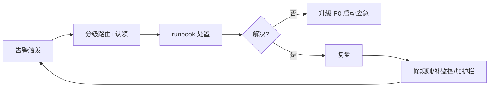

# 06 · 日志规范与监控告警规则库

> 02 篇讲了可观测性的"道"（三大支柱、黄金信号、SLO 告警），本文补"术"：**可抄即用的日志规范、指标埋点规范、告警规则模板与告警治理**。目标是一套规则拿过去就能落地，避免"日志随便打、告警随便报"的混乱。
>
> 前置阅读：「[02 可观测性与稳定性看护](02-可观测性与稳定性看护.md)」（三件套与 SLO 理论）、「[云原生/可观测性](../云原生/可观测性.md)」（Prometheus/Grafana/Loki 工具）、「[04 On-call 与事故管理](04-On-call与事故管理.md)」（告警触发后的响应流程）、「[基础知识/Linux排查](../基础知识/Linux排查.md)」（底层指标定位）。

---

## 一、日志规范（统一日志规范）

### 1.1 日志分级标准（别乱用）

| 级别 | 含义 | 什么时候打 | 生产要求 |
|------|------|-----------|----------|
| TRACE | 链路级细节 | 本地调试 | 生产关闭 |
| DEBUG | 调试信息 | 开发环境/临时排查 | 生产关闭（可动态开关） |
| INFO | 关键业务事件 | 请求完成、状态变更、任务执行 | 保留 |
| WARN | 可恢复异常 | 重试成功、降级触发、限流 | 保留，需监控 |
| ERROR | 功能异常 | 业务失败、异常捕获、调用失败 | 保留 + 告警 + 当日处理 |
| FATAL | 进程不可用 | 启动失败、致命错误 | 保留 + 电话告警 |

> 口诀：**"INFO 记业务、WARN 记可恢复、ERROR 记功能失败；堆栈只在 ERROR/FATAL 打。"**

### 1.2 日志格式规范（统一模板）

```text
2026-08-06 10:32:15.123 [http-nio-8080-exec-3] ERROR com.demo.order.service - traceId=0a1b2c3d4e5f spanId=abc method=createOrder orderId=2026080610001 costMs=342 msg=库存扣减失败 err=StockNotEnoughException: 库存不足
```

| 字段 | 说明 | 强制 |
|------|------|------|
| 时间戳 | 精确到毫秒，ISO8601 | ✅ |
| 线程名 | 排查并发问题 | ✅ |
| 日志级别 | 分级 | ✅ |
| logger | 类名，定位代码 | ✅ |
| **traceId/spanId** | 全链路串联 | ✅ |
| 业务关键字段 | orderId/userId/方法名 | 建议 |
| costMs | 耗时 | 建议 |
| 错误信息 | 类型 + message | ✅（ERROR 必有堆栈） |

### 1.3 结构化日志（JSON）与上下文传递

- **结构化日志**：输出 JSON，字段可检索、可聚合（Logstash/Loki 直接消费）：

```json
{"ts":"2026-08-06T10:32:15.123+08:00","level":"ERROR","logger":"OrderService","traceId":"0a1b2c","userId":"u_10086","method":"createOrder","costMs":342,"msg":"库存扣减失败","errType":"StockNotEnough","errMsg":"库存不足"}
```

- **traceId 透传**：入口生成 → 存入 **MDC（Mapped Diagnostic Context）** → 异步线程需**手动传递**（`MDC.put`/装饰器），输出到每条日志：

```java
MDC.put("traceId", TraceIdGenerator.next());
try {
    // 业务逻辑：所有同线程日志自动携带 traceId
} finally {
    MDC.remove("traceId"); // 线程池复用线程，必须清理，防串号
}
```

> 链路打通是排查神器：**报障给 traceId → 一搜全部日志按时间轴串起来**（配合「[场景设计/问题定位](../场景设计/问题定位.md)」）。

### 1.4 日志该打什么、不该打什么

| 该打 | 不该打 |
|------|--------|
| 请求入口/出口（参数+耗时） | **敏感数据**：密码、token、验证码、身份证、完整手机号 |
| 业务关键状态变更 | 每行循环打 DEBUG（日志风暴） |
| 异常发生点（带上下文+堆栈） | 只 `printStackTrace()` 不记录 |
| 外部依赖调用结果（降级/重试） | **吞异常**（catch 后打都不打） |
| 慢请求/慢 SQL 标记 | 大对象 toString（如整个 Response 超长） |

- **脱敏**：手机号 `138****8000`、身份证、卡号；日志脱敏组件（如 logstash-logback-encoder 的 mask 或自研）。
- **防日志风暴**：`while` 循环内 ERROR、异常重试循环打印 → 设频率限制/采样（如 1s 最多 N 条）。

### 1.5 切分、保留与采集链路

- **切分**：按天/大小滚动（logback `SizeAndTimeBasedRollingPolicy`）；生产常见：保留 **30 天热数据 + 归档**（合规另算）。
- **采集链路**：`应用 stdout/文件 → Filebeat → Kafka（缓冲削峰）→ Logstash/Fluentd（清洗）→ ES/Loki → Kibana/Grafana`。
- **丢日志纪律**：采集端挂掉不能阻塞业务 → 异步采集、buffer 限长、**日志采集失败不影响主链路**。
- **容量估算**：单条 500B × 每秒万级 × 24h ≈ 数百 GB/天，提前规划存储与采样策略。

---

## 二、指标与埋点规范

### 2.1 指标命名规范

```
<namespace>_<子系统>_<资源/操作>_<单位|状态>
示例: app_order_http_request_total、jvm_heap_used_bytes、mysql_slave_seconds_behind_master
```

- 统一命名空间（`app_`/`infra_`/`biz_`）、单位进名字（`_bytes`/`_seconds`/`_total`）、Prometheus 规范（`_total` 结尾为 counter）。

### 2.2 指标类型（Prometheus）

| 类型 | 语义 | 例子 |
|------|------|------|
| **Counter** | 只增不减的计数 | 请求总数、错误总数 |
| **Gauge** | 可增可减的瞬时值 | 在线人数、CPU、队列深度 |
| **Histogram** | 分位数分布（客户端聚合） | 请求延迟 p50/p99 |
| **Summary** | 同 Histogram，服务端聚合 | 调用延迟分布 |

### 2.3 黄金信号埋点清单（照抄清单）

| 层 | 必埋指标 |
|----|----------|
| 入口（HTTP/网关） | QPS、错误率、延迟分位、请求体大小 |
| 下游调用（RPC/DB/Redis/MQ） | 调用量、失败率、耗时、超时数 |
| 线程池 | 活跃线程、队列深度、拒绝数、最大等待 |
| JVM | 堆使用、GC 次数/耗时、线程数、FGC、类加载 |
| 容器/机器 | CPU、内存、磁盘、网络、fd 数 |

---

## 三、告警规则库（模板可直接抄）

### 3.1 告警分级与响应时限

| 级别 | 定义 | 例子 | 通知方式 | 响应时限 |
|------|------|------|----------|----------|
| **P0 紧急** | 核心功能不可用/资损/安全 | 支付接口全挂、DB 主库不可写 | 电话 + IM 双发 | 5~15 分钟 |
| **P1 严重** | 部分功能受损/即将越界 | 错误率>5%、MQ 堆积持续增长 | IM + 电话 | 30 分钟 |
| **P2 警告** | 有劣化趋势但未破红线 | 磁盘>80%、慢查询增多 | IM | 当日 |
| **P3 提醒** | 一般性状态变化 | 某指标小幅波动 | 邮件/群 | 可批量处理 |

> 分级原则：**先按"用户影响"定级，再按技术指标；P0 用自动升级（5 分钟没人认领自动电话）。**

### 3.2 资源类告警模板（PromQL）

| 指标 | PromQL 表达式 | 阈值 | 级别 |
|------|---------------|------|------|
| CPU 使用率 | `100 - avg(rate(node_cpu_seconds_total{mode="idle"}[5m])) * 100` | >85% 持续 10m | P2 |
| 内存使用率 | `(1 - node_memory_MemAvailable_bytes / node_memory_MemTotal_bytes) * 100` | >90% | P2 |
| 磁盘使用率 | `(1 - node_filesystem_avail_bytes / node_filesystem_size_bytes) * 100` | >85% | P2 |
| load 平均 | `node_load15 / count(node_cpu_seconds_total{mode="idle"})` | >核数 持续 15m | P2 |
| fd 使用率 | `node_filefd_allocated / node_filefd_maximum` | >80% | P2 |
| 磁盘 IO util | `rate(node_disk_io_time_seconds_total[5m])` | >90% | P2 |

### 3.3 应用类告警模板

| 指标 | PromQL | 阈值 | 级别 |
|------|--------|------|------|
| 接口错误率 | `sum(rate(app_http_request_total{code=~"5.."}[5m])) / sum(rate(app_http_request_total[5m]))` | >1%（核心接口） | P1 |
| 接口延迟 p99 | `histogram_quantile(0.99, sum(rate(app_http_duration_seconds_bucket[5m])) by (le))` | >基线 ×3 或 >1s | P1 |
| QPS 突降 | `sum(rate(app_http_request_total[5m])) < 基线 × 0.3` | 突降 70% | P1 |
| 线程池拒绝 | `rate(app_threadpool_rejected_total[5m])` | >0 | P1 |
| 活跃线程满 | `app_threadpool_active == app_threadpool_max` | 持续 5m | P2 |
| GC 频繁 | `rate(jvm_gc_pause_seconds_count[5m])` / FGC 次数 | FGC >1/5m | P2 |
| 堆使用率 | `jvm_memory_used_bytes{area="heap"} / jvm_memory_max_bytes{area="heap"}` | >85% 持续 15m | P2 |

### 3.4 中间件告警模板

| 中间件 | 指标 | 阈值 | 级别 |
|--------|------|------|------|
| MySQL | 连接数（`mysql_global_status_threads_connected`） | >max_connections 80% | P1 |
| MySQL | 主从延迟（`seconds_behind_master`） | >30s | P1 |
| MySQL | 慢查询数（`slow_queries`） | 突增 >2× 基线 | P2 |
| MySQL | 死锁（`innodb_row_lock_waits`） | 持续增长 | P2 |
| Redis | 内存使用率 | >80% | P1 |
| Redis | 连接数/阻塞命令 | 突增 | P2 |
| Redis | 命中率 | 突降（说明缓存失效风暴） | P1 |
| MQ | 堆积量（`consumer_lag`） | >1 万条且持续增长 | P1 |
| MQ | 消费失败率 | >1% | P2 |
| ES | 集群状态（green/yellow/red） | yellow 30m / red 即时 | P1 |
| ES | 堆使用率 | >85% | P2 |
| K8s | Pod 重启次数 / 节点 NotReady | 突增 | P1/P2 |

### 3.5 业务告警模板（示例）

| 指标 | 规则 | 阈值 | 级别 |
|------|------|------|------|
| 下单量 | 环比 5 分钟均值 | 突降 >50% | P1 |
| 支付成功率 | 滑动窗口成功率 | <99.5% | P1 |
| 订单状态机异常率 | 异常状态占比 | >0.1% | P2 |
| 对账差异 | 订单 vs 支付对账条数 | >0 | P0 |

> **业务告警是防"系统全绿、业务已挂"的关键**——技术指标没报警，但下单量腰斩，说明有逻辑/数据问题。SLO 与业务告警联动见「[01 SRE 理念与 SLI/SLO/Error Budget](01-SRE理念与SLI-SLO-ErrorBudget.md)」。

---

## 四、告警治理（防告警风暴与疲劳）

### 4.1 告警风暴的成因与对策

| 成因 | 对策 |
|------|------|
| 同因多指标各报一次 | **分组聚合**：按"故障域/服务"聚合一条告警 |
| 抖动瞬间触发 | 加**持续时长**（`for: 5m`）与**抑制窗口** |
| 根因引起连锁 | **抑制（Inhibition）**：父级 P0 触发时抑制下游子告警 |
| 依赖系统报警 | 主告警 + 依赖标记，依赖告警降级提醒 |
| 值班乱处理 | 告警必须有 **runbook（处置手册）** 链接 |

### 4.2 Alertmanager 关键配置思想

- **Grouping**：同标签（service/alertname）合并成一条通知，防刷屏。
- **Inhibition**：高等级抑制低等级（如 `infra=mysql` 挂了抑制其上层应用告警）。
- **Silence**：维护窗口/已知故障预静默，**必须有到期时间**（防永久静默）。
- **路由**：按团队/系统分发不同通道；P0 走电话，P1 走 IM@人。

### 4.3 告警质量三问（上线规则前自查）

1. **有行动吗？** 收到告警能明确"做什么"（否则降级为记录，别发告警）。
2. **会误报吗？** 阈值/基线校验：历史 7 天是否误触发 >5%。
3. **有人看吗？** 无人认领的告警 = 噪音，删除或改日志。

### 4.4 告警与事故闭环



- 联动：「[04 On-call 与事故管理](04-On-call与事故管理.md)」（值班、应急、无指责复盘）；每次事故复盘都应产出**新告警规则或规则修订**，形成"事故→规则"的正循环。

---

## 五、与其他板块的关系

- **02 可观测性**：本文是其落地的"规则层"；三大支柱的采集/工具在那边。
- **云原生/可观测性**：Prometheus/Grafana/Loki/OTel 的配置实操。
- **04 On-call 与事故管理**：告警触发后的响应与复盘流程。
- **01 SLI/SLO**：告警阈值应与 SLO/错误预算对齐（超预算 = P0）。
- **场景设计/问题定位**：日志与 traceId 的排查方法论落地。
- **测试与代码质量/07**：质量门禁与监控门禁同理（发布前看监控 vs 发布后看告警）。
- **CI-CD/13**：DORA 度量与可观测性联动。

---

## 六、速查表

| 主题 | 一句话 |
|------|--------|
| 日志分级 | INFO 记业务、WARN 记可恢复、ERROR 记失败 |
| 日志必带 | traceId + 线程 + 时间 + 级别 + logger |
| 结构化 | JSON 输出，字段可检索可聚合 |
| MDC | 入口放 traceId，异步线程要手动传递，用完清理 |
| 日志禁忌 | 不打敏感信息、不吞异常、防日志风暴 |
| 指标命名 | 命名空间_子系统_资源_单位 |
| 黄金信号 | RED（入口）+ USE（资源） |
| 告警分级 | P0 电话即时 / P1 IM+电话 / P2 当日 |
| 阈值思路 | 资源 85~90%、错误率 1%、延迟超基线 3 倍 |
| 防风暴 | 聚合 + 持续时长 + 抑制 + 静默（带到期） |
| 告警三问 | 有行动吗？会误报吗？有人看吗？ |
| 闭环 | 事故→复盘→补规则→新告警 |

---

## 面试高频问题（20+ 条）

1. **日志分级怎么定？** TRACE/DEBUG/INFO/WARN/ERROR/FATAL；INFO 记业务、WARN 可恢复、ERROR 功能失败，DEBUG 生产关。
2. **一条好日志长什么样？** 时间/线程/级别/logger/traceId/业务字段/耗时/错误信息。
3. **traceId 怎么贯穿全链路？** 入口生成，MDC 存储；下游通过请求头/消息属性传递。
4. **线程池里 traceId 为什么丢？怎么解决？** MDC 是线程私有，任务切换到其他线程丢了；用装饰器（TaskDecorator）或显式 put/remove。
5. **日志应该打什么、不该打什么？** 入口出口+耗时+状态变更；不打密码/token/完整手机号。
6. **什么是日志脱敏？** 敏感字段掩码（手机号/身份证/卡号）；日志组件或自研 mask。
7. **日志风暴怎么防？** 频率限制/采样；循环内禁止打 ERROR；异步采集限长。
8. **日志采集链路？** 文件→Filebeat→Kafka→Logstash→ES/Loki→Kibana；采集失败不能阻塞业务。
9. **日志保留多久？** 热数据 30 天 + 归档；合规要求另定。
10. **指标有哪几种类型？** Counter 只增、Gauge 可增减、Histogram/Summary 分位分布。
11. **黄金信号是什么？** RED：速率/错误/延迟；USE：利用率/饱和度/错误。
12. **告警怎么分级？** 按用户影响：P0 核心不可用电话，P1 部分受损，P2 劣化趋势，P3 提醒。
13. **错误率阈值怎么定？** 核心接口 >1% P1；更严谨按 SLO/错误预算推。
14. **延迟告警用什么指标？** p99/p95，阈值=基线×3 或绝对值；用 Histogram 计算。
15. **怎么发现"系统绿但业务挂了"？** 业务指标告警：下单量、支付成功率、对账差异。
16. **告警风暴怎么治？** 分组聚合、持续时长 for、抑制依赖告警、静默带到期。
17. **抑制和静默区别？** 抑制=自动降级关联告警；静默=手动屏蔽已知问题/维护窗口。
18. **告警上线前怎么验收？** 三问：有行动吗、会误报吗、有人看吗；历史数据回放验证。
19. **MQ 堆积怎么告警？** consumer_lag 超过阈值且持续增长；先于积压引发下游问题。
20. **告警和 SLO 什么关系？** 告警阈值应源于错误预算；超预算即 P0，避免拍脑袋阈值。
21. **值班收到 P0 怎么办？** 认领→按 runbook 处置→超时未解自动升级→事后复盘补规则。
22. **复盘要产出什么？** 根因、行动项，以及**新告警/规则修订**，形成闭环。

---

## 八、SLO 燃烧率告警：告警阈值的正确来源

### 8.1 为什么"错误率 > 1%"这种阈值不够好

| 问题 | 说明 |
|------|------|
| 阈值拍脑袋 | 1% 从哪来的？和业务目标什么关系？ |
| 短时抖动误报 | 5 秒内错误率 5%，其实只影响了 3 个请求 |
| 慢性消耗漏报 | 持续 0.8% 错误率不触发，但一个月能烧掉全部错误预算 |

> **正解：把告警建立在"错误预算消耗速度（Burn Rate）"上**——它同时解决了误报和漏报。

### 8.2 燃烧率定义

```
Burn Rate = 实际错误率 / 允许错误率

例：SLO = 99.9% → 允许错误率 0.1%
   实际错误率 1.44% → Burn Rate = 14.4
   含义：以这个速度，30 天的预算会在 30/14.4 ≈ 2 天内烧完
```

| Burn Rate | 30 天预算耗尽时间 | 含义 |
|-----------|------------------|------|
| 1 | 30 天 | 刚好用完（符合预期） |
| 2 | 15 天 | 偏快 |
| 6 | 5 天 | 明显异常 |
| 14.4 | 约 2 天 | 严重事故级 |

### 8.3 多窗口多燃烧率告警（Google SRE 推荐）

核心思想：**快烧用短窗口（快速发现大故障），慢烧用长窗口（发现慢性劣化）**，并用「长短双窗口同时满足」来抑制抖动误报。

| 严重度 | 长窗口 | 短窗口 | Burn Rate 阈值 | 预算消耗 | 通知 |
|--------|--------|--------|---------------|----------|------|
| P0 紧急 | 1h | 5m | 14.4 | 1h 烧 2% | 电话 |
| P1 严重 | 6h | 30m | 6 | 6h 烧 5% | 电话 + IM |
| P2 警告 | 24h | 2h | 3 | 1d 烧 10% | IM |
| P3 提醒 | 3d | 6h | 1 | 3d 烧 10% | 工单/群 |

```yaml
# Prometheus 告警规则：多窗口燃烧率（以 99.9% SLO 为例）
groups:
  - name: slo-burn-rate
    rules:
      # 先用 recording rule 预计算错误率（降低查询成本）
      - record: job:slo_error_ratio:rate5m
        expr: |
          sum(rate(http_requests_total{job="order-api",code=~"5.."}[5m]))
          /
          sum(rate(http_requests_total{job="order-api"}[5m]))
      - record: job:slo_error_ratio:rate1h
        expr: |
          sum(rate(http_requests_total{job="order-api",code=~"5.."}[1h]))
          /
          sum(rate(http_requests_total{job="order-api"}[1h]))
      - record: job:slo_error_ratio:rate30m
        expr: |
          sum(rate(http_requests_total{job="order-api",code=~"5.."}[30m]))
          /
          sum(rate(http_requests_total{job="order-api"}[30m]))
      - record: job:slo_error_ratio:rate6h
        expr: |
          sum(rate(http_requests_total{job="order-api",code=~"5.."}[6h]))
          /
          sum(rate(http_requests_total{job="order-api"}[6h]))

      # P0：1h 与 5m 双窗口同时超 14.4 倍燃烧率
      - alert: SLOBurnRateCritical
        expr: |
          job:slo_error_ratio:rate1h > (14.4 * 0.001)
          and
          job:slo_error_ratio:rate5m > (14.4 * 0.001)
        for: 2m
        labels:
          severity: P0
          team: order
        annotations:
          summary: "订单 API 错误预算高速燃烧（14.4x）"
          description: "1h 错误率 {{ $value | humanizePercentage }}，约 2 天将耗尽 30 天预算"
          runbook: "https://runbook.internal/order-api-5xx"

      # P1：6h 与 30m 双窗口同时超 6 倍
      - alert: SLOBurnRateHigh
        expr: |
          job:slo_error_ratio:rate6h > (6 * 0.001)
          and
          job:slo_error_ratio:rate30m > (6 * 0.001)
        for: 5m
        labels:
          severity: P1
          team: order
        annotations:
          summary: "订单 API 错误预算燃烧偏快（6x）"
          runbook: "https://runbook.internal/order-api-5xx"
```

### 8.4 为什么要"长短双窗口"

```
只用短窗口（5m）：
  → 灵敏，但抖动就报（一次 GC 毛刺、一次网络重传都可能触发）→ 误报多

只用长窗口（1h）：
  → 稳，但发现慢（大故障要等 1 小时才报）→ MTTD 太长

长 AND 短：
  → 短窗口保证"现在还在烧"（问题未自愈）
  → 长窗口保证"烧得确实多"（不是瞬时抖动）
  → 既快又准，且故障恢复后短窗口先降 → 告警自动关闭（不会一直挂着）
```

> 口诀：**「短窗口管快，长窗口管准，双窗口相与才发。」**

### 8.5 延迟 SLO 的告警写法

延迟 SLO 通常表述为「99% 的请求在 300ms 内完成」，对应的"错误"是「超过 300ms 的请求」：

```promql
# 慢请求比例（用 histogram bucket，比 quantile 更准确且更便宜）
1 - (
  sum(rate(http_duration_seconds_bucket{job="order-api",le="0.3"}[5m]))
  /
  sum(rate(http_duration_seconds_count{job="order-api"}[5m]))
)
```

> **重要**：`histogram_quantile` 算出来的 p99 是**插值估算**，bucket 边界设得不合适会有很大误差。
>
> **做 SLO 判定时优先用「阈值 bucket 的占比」**（上式），它是精确计数，不受插值影响。p99 只用于看趋势和展示。

---

## 九、Prometheus 规则工程化

### 9.1 Recording Rules：预计算降本

```yaml
groups:
  - name: app-aggregations
    interval: 30s          # 计算周期
    rules:
      # 服务级 QPS（避免每次查询都做大范围聚合）
      - record: service:request_rate:5m
        expr: sum(rate(app_http_request_total[5m])) by (service)

      # 服务级错误率
      - record: service:error_ratio:5m
        expr: |
          sum(rate(app_http_request_total{code=~"5.."}[5m])) by (service)
          /
          sum(rate(app_http_request_total[5m])) by (service)

      # 服务级 p99（供看板使用）
      - record: service:latency_p99:5m
        expr: |
          histogram_quantile(0.99,
            sum(rate(app_http_duration_seconds_bucket[5m])) by (le, service))
```

| 何时该用 Recording Rule | 原因 |
|------------------------|------|
| 表达式被多个告警/面板复用 | 避免重复计算 |
| 聚合范围大（跨大量 series） | 查询慢、容易超时 |
| 长时间窗口查询（如 30d SLO） | 直接查原始数据代价极高 |

> **命名约定**：`<聚合级别>:<指标名>:<操作与窗口>`，如 `service:error_ratio:5m`——一眼看出粒度与含义。

### 9.2 标签设计：告警可路由的前提

| 标签 | 作用 | 示例 |
|------|------|------|
| `severity` | 分级路由 | P0/P1/P2/P3 |
| `team` / `owner` | 找到责任人 | order / payment |
| `service` | 定位服务 | order-api |
| `env` | 区分环境 | prod / staging |
| `alert_type` | 分类聚合 | resource / app / business |

**基数（Cardinality）红线**：

```
❌ 绝对不要把这些放进 label：
   userId、orderId、traceId、requestId、完整 URL（含参数）、IP（大量）
   → 每个唯一值创建一条新 time series，几万个 label 值就能打爆 Prometheus 内存

✅ 高基数信息应该放在：
   日志（ES/Loki 按字段检索）
   链路追踪（trace 系统）
```

> **经典事故**：给指标加了 `userId` 标签，上线后 series 数从 10 万涨到 2000 万，Prometheus OOM，监控整体失明——**监控系统自己成了故障源，且此时你没有监控可用来排查监控**。
>
> 口诀：**「指标看趋势用低基数，查个体用日志和链路。」**

### 9.3 告警规则的自测方法

```yaml
# promtool 单元测试（rules_test.yml）
rule_files:
  - alerts.yml

evaluation_interval: 1m

tests:
  - interval: 1m
    input_series:
      - series: 'http_requests_total{job="order-api",code="500"}'
        values: '0+10x60'          # 每分钟 10 个 500
      - series: 'http_requests_total{job="order-api",code="200"}'
        values: '0+100x60'         # 每分钟 100 个 200
    alert_rule_test:
      - eval_time: 30m
        alertname: SLOBurnRateCritical
        exp_alerts:
          - exp_labels:
              severity: P0
              team: order
```

```bash
promtool check rules alerts.yml      # 语法校验
promtool test rules rules_test.yml   # 逻辑测试
```

> **告警规则也是代码**：应该进 Git、走 PR 评审、有 CI 校验（`promtool check`）、有单元测试。
>
> **反面**：在 Grafana UI 上手改告警阈值，没人知道改了什么、为什么改、上次是多少——这是"配置漂移"的典型（见 [05 变更管理](05-变更管理与渐进式发布.md)）。

---

## 十、Alertmanager 完整配置示例

```yaml
global:
  resolve_timeout: 5m

# 抑制规则：高等级抑制低等级，根因抑制表象
inhibit_rules:
  # 节点宕机时，抑制该节点上所有应用告警
  - source_matchers: [alertname="NodeDown"]
    target_matchers: [alert_type="app"]
    equal: ['instance']

  # 同服务已有 P0 时，抑制其 P1/P2
  - source_matchers: [severity="P0"]
    target_matchers: [severity=~"P1|P2"]
    equal: ['service']

  # DB 挂了，抑制依赖它的应用错误率告警
  - source_matchers: [alertname="MySQLDown"]
    target_matchers: [alertname="HighErrorRate"]
    equal: ['db_cluster']

route:
  receiver: default-im
  group_by: ['alertname', 'service', 'severity']   # 聚合维度
  group_wait: 30s          # 首次等待，攒一批一起发（防刷屏）
  group_interval: 5m       # 同组新增告警的发送间隔
  repeat_interval: 4h      # 未解决告警的重复提醒间隔
  routes:
    # P0 走电话 + IM 双通道，且不等待攒批
    - matchers: [severity="P0"]
      receiver: phone-and-im
      group_wait: 0s
      repeat_interval: 30m
      continue: true       # 继续匹配后续路由（也发给团队群）

    # 按团队路由
    - matchers: [team="payment"]
      receiver: payment-im
    - matchers: [team="order"]
      receiver: order-im

    # 非生产环境只发群，不打扰值班
    - matchers: [env!="prod"]
      receiver: dev-im
      repeat_interval: 24h

receivers:
  - name: default-im
    webhook_configs:
      - url: 'http://alert-gateway/im/default'
  - name: phone-and-im
    webhook_configs:
      - url: 'http://alert-gateway/phone'      # 电话网关（含自动升级）
      - url: 'http://alert-gateway/im/oncall'
  - name: payment-im
    webhook_configs:
      - url: 'http://alert-gateway/im/payment'
  - name: order-im
    webhook_configs:
      - url: 'http://alert-gateway/im/order'
  - name: dev-im
    webhook_configs:
      - url: 'http://alert-gateway/im/dev'
```

### 10.1 关键参数辨析（最容易配错的三个）

| 参数 | 含义 | 配错的后果 |
|------|------|-----------|
| `group_wait` | 首条告警等多久再发（攒批） | 配太大 → P0 延迟；配 0 → 刷屏 |
| `group_interval` | 同组内**有新告警**时的最小发送间隔 | 配太小 → 同一故障反复通知 |
| `repeat_interval` | 告警**一直未恢复**时的重复提醒间隔 | 配太小 → 骚扰；太大 → 忘了还没解决 |

> `for` 在 Prometheus 规则里（持续多久才触发），`group_wait` 在 Alertmanager 里（触发后等多久才发）。**两者叠加才是真实的告警延迟**：`for: 5m` + `group_wait: 30s` = 最快 5.5 分钟才收到。
>
> **P0 的 `for` 不要设太长**，否则 MTTD 直接被拉长。

### 10.2 静默（Silence）纪律

| 规则 | 原因 |
|------|------|
| **必须有到期时间** | 永久静默 = 永久失明；曾有团队静默了三个月才发现 |
| **必须写原因** | "谁静默的、为什么"是复盘必查项 |
| **到期前提醒** | 到期后告警涌入会打人一脸 |
| **交接时必须交代** | 见 [04 On-call 交接清单](04-On-call与事故管理.md) |
| **定期审计静默列表** | 每周看一次有哪些静默还在生效 |

> **真实事故**：为了做数据库维护静默了 MySQL 全部告警，维护完忘了解除。两周后主从延迟持续增长无人知晓，最终从库数据落后数小时，读到严重过期数据引发资损。
>
> 口诀：**「静默必带到期，静默必写原因，静默必须交接。」**

---

## 十一、日志成本与采样治理

### 11.1 日志成本从哪来

```
日志总成本 = 采集带宽 + 传输(Kafka) + 处理(Logstash CPU) + 存储(ES/Loki) + 索引开销

ES 的隐性成本最高：
  倒排索引膨胀（可能是原始数据 1~2 倍）
  副本翻倍（1 副本 = 存储 ×2）
  热节点内存（每 GB 索引需一定堆内存）
```

### 11.2 分级治理策略

| 日志类型 | 保留策略 | 存储介质 |
|----------|----------|----------|
| ERROR / FATAL | 全量保留 30~90 天 | 热存储（可检索） |
| WARN | 全量保留 7~30 天 | 热存储 |
| INFO 业务关键事件 | 全量保留 7~30 天 | 热存储 |
| INFO 普通请求日志 | **采样**（如 10%）或短期保留 | 热 3~7 天 → 冷归档 |
| DEBUG | 生产默认关闭，按需动态开启 | 不落长期存储 |
| 审计日志 | 按合规要求（可能数年） | 冷存储 + 加密 + 防篡改 |

### 11.3 智能采样：保留有价值的那部分

```
朴素采样（10% 随机）的问题：
  错误日志也被丢了 90% → 排查时缺关键信息

推荐策略（尾部采样 / Tail-based）：
  1. 请求正常且快          → 采样 1%~10%
  2. 请求出错（5xx/异常）  → 100% 保留
  3. 请求慢（超过 p99）    → 100% 保留
  4. 关键业务链路（支付）  → 100% 保留
  5. 同一 traceId 的日志要么全留要么全丢（保证链路完整）
```

> **第 5 点最容易被忽略**：如果按单条日志随机采样，一条链路只留下零散几条，**串不起来等于没用**。采样决策必须以 **trace 为单位**，不是以日志行为单位。

### 11.4 日志治理踩坑

| 坑 | 现象 | 对策 |
|----|------|------|
| 循环内打 ERROR | 一次故障产生千万条日志，打满磁盘/打挂 ES | 日志限流（每 key 每秒 N 条）+ 聚合计数 |
| 打印大对象 | 单条日志几 MB，传输与索引成本爆炸 | 限制单条长度（截断），只打关键字段 |
| 异常堆栈重复打 | 同一异常在每层 catch 都打一次全栈 | 只在最外层打全栈，中间层打上下文 |
| 日志同步写磁盘 | IO 阻塞业务线程，RT 抖动 | 异步 Appender + 有界队列 + 丢弃策略 |
| 异步队列满了阻塞 | 队列满时默认阻塞业务线程 → 全站卡死 | 配置为**丢弃**而非阻塞（日志重要，但不能拖垮业务） |
| ES 索引无生命周期 | 索引无限增长，集群崩 | ILM 策略：热→温→冷→删 |

```xml
<!-- logback 异步 Appender：队列满时丢弃而非阻塞 -->
<appender name="ASYNC" class="ch.qos.logback.classic.AsyncAppender">
    <queueSize>8192</queueSize>
    <!-- 关键：discardingThreshold=0 表示队列满也不丢 INFO 以下（谨慎）
         默认 20% 时会丢弃 TRACE/DEBUG/INFO，保留 WARN/ERROR -->
    <discardingThreshold>20</discardingThreshold>
    <!-- 关键：不阻塞业务线程 -->
    <neverBlock>true</neverBlock>
    <appender-ref ref="FILE"/>
</appender>
```

> **`neverBlock=true` 是生产必配项**。默认 false 时，日志队列满会阻塞业务线程——**日志系统故障直接演变成业务故障**，这是最讽刺的一类事故。

---

## 十二、日志、指标、链路的三方关联

### 12.1 关联的三把钥匙


| 从 → 到 | 关联键 | 用途 |
|---------|--------|------|
| 指标 → 链路 | 时间窗口 + service + 状态码 | 从"错误率涨了"到"哪些请求错了" |
| 链路 → 日志 | traceId | 从"这个请求慢"到"慢在哪一行" |
| 日志 → 指标 | 日志中的 service/接口维度 | 从"这个异常"到"影响面多大" |
| 告警 → 全部 | 告警携带 service + 时间 + 面板/日志链接 | 一键跳转，省掉手动拼查询 |

### 12.2 让告警"自带排查入口"

```yaml
annotations:
  summary: "订单 API 5xx 错误率 {{ $value | humanizePercentage }}"
  # 直接给出对应时间窗的看板链接
  dashboard: "https://grafana.internal/d/order-api?from=now-1h&to=now&var-service=order-api"
  # 直接给出日志查询链接（已带好过滤条件）
  logs: "https://kibana.internal/app/discover#/?_a=(query:(query:'service:order-api AND level:ERROR'))"
  # 直接给出链路查询
  traces: "https://jaeger.internal/search?service=order-api&tags=%7B%22error%22%3A%22true%22%7D"
  runbook: "https://runbook.internal/order-api-5xx"
```

> **值班效率的最大杠杆点**：把"收到告警 → 手动打开 3 个系统 → 手动拼查询条件 → 才开始看数据"这段时间（往往 3~5 分钟）压缩到点一下链接。
>
> 这直接降低 MTTI（见 [04 On-call · MTTx 分解](04-On-call与事故管理.md)）。

### 12.3 异步场景的 traceId 传递

```java
// 线程池场景：用 TaskDecorator 复制 MDC（Spring）
@Bean
public TaskDecorator mdcTaskDecorator() {
    return runnable -> {
        Map<String, String> context = MDC.getCopyOfContextMap();  // 提交线程的上下文
        return () -> {
            try {
                if (context != null) MDC.setContextMap(context);
                runnable.run();
            } finally {
                MDC.clear();   // 必须清理：线程池复用，否则串号
            }
        };
    };
}

// MQ 场景：traceId 放消息属性/Header，消费端取出放入 MDC
// 生产：message.putUserProperty("traceId", MDC.get("traceId"));
// 消费：MDC.put("traceId", message.getUserProperty("traceId"));
```

| 易丢 traceId 的场景 | 处理 |
|--------------------|------|
| 线程池 / CompletableFuture | TaskDecorator 或包装 Runnable |
| MQ 生产消费 | 写入消息属性，消费端还原 |
| 定时任务 | 入口生成新 traceId（标记来源为 job） |
| RPC 调用 | 框架拦截器透传 header（一般框架已支持） |
| 跨语言调用 | 遵循 W3C Trace Context（`traceparent` header） |

> **踩坑**：MDC 用完不清理 → 线程池复用时，下一个请求继承了上一个请求的 traceId → **日志串号，排查时看到完全不相关的日志混在一条链路里**，比没有 traceId 更误导。

---

## 十三、告警质量的度量与治理闭环

### 13.1 告警质量指标

| 指标 | 计算 | 健康方向 |
|------|------|----------|
| **告警有效率** | 真实故障告警数 / 总告警数 | 越高越好 |
| **告警行动率** | 有人执行了处置动作的告警 / 总告警 | 越高越好 |
| **误报率** | 无需处理的告警 / 总告警 | 越低越好 |
| **漏报率** | 事故中"没有告警先发现"的比例 | 越低越好 |
| **告警覆盖率** | 有对应告警的 SLO / 全部 SLO | 应接近 100% |
| **平均认领时长（MTTA）** | 告警触发 → 有人认领 | 越短越好 |
| **静默中的告警数** | 当前被静默的规则数 | 应很少且都有到期 |

### 13.2 告警治理的季度动作

```text
告警季度体检 · 检查单
[ ] 导出本季度全部告警，按 alertname 统计触发次数
[ ] TOP 10 高频告警：逐条判断——是真问题（去修系统）还是噪音（去改规则）
[ ] 零触发告警：确认还有意义吗？规则是否已失效（指标改名了？）
[ ] 无人认领告警：直接降级为日志或删除
[ ] 无 Runbook 的高频告警：补 Runbook
[ ] 所有静默项：审计原因与到期时间
[ ] 本季度事故：有几起是"用户先发现"？→ 补告警
[ ] 阈值复核：与当前容量/SLO 是否还匹配（扩容后阈值该调）
```

> **两个最重要的信号**：
> - **零触发的告警**：可能规则写错了（指标名变了、label 变了），出事时不会响 → **假安全感，比没有告警更危险**
> - **高频且无人处理的告警**：纯噪音，且会训练值班"忽略告警"的习惯 → 真事故也被忽略

### 13.3 告警规则的生命周期


> **新告警必须先"观察期"**：先只发到群里不打电话，观察 1~2 周误报情况，稳定后再升级为 page。
>
> **反面**：新规则直接上 P0 电话，第一天误报 20 次，值班被折磨一晚，从此对所有告警失去信任。

---

## 十四、常见误区

| 误区 ❌ | 正解 ✅ |
|---------|---------|
| 阈值靠经验拍 | 从 SLO/错误预算反推（燃烧率告警） |
| 告警越灵敏越好 | 可行动才发；噪音导致疲劳与漏报 |
| 只用短窗口 | 长短双窗口相与，既快又准 |
| p99 用 quantile 做 SLO 判定 | quantile 是插值估算；判定用阈值 bucket 占比 |
| 指标加 userId 便于排查 | 高基数打爆 Prometheus；查个体用日志/链路 |
| 静默一下先安静 | 静默必带到期+原因+交接，否则永久失明 |
| 日志越全越好 | 成本与风险并存；分级 + 按 trace 采样 |
| 异步日志队列满就阻塞 | `neverBlock=true`，日志不能拖垮业务 |
| 告警在 UI 上手改 | 规则即代码，进 Git + promtool 测试 + PR 评审 |
| 告警建好就不管 | 季度体检；零触发与高频无人理都是危险信号 |

---

## 十五、面试速答框架

1. **告警阈值怎么定？** → 从 SLO 反推错误预算燃烧率，多窗口多阈值（1h/5m×14.4 → P0；6h/30m×6 → P1），而非拍脑袋定绝对值。
2. **为什么长短双窗口？** → 短窗口保证问题还在发生（防抖动误报、恢复后自动关闭），长窗口保证消耗确实大（防瞬时毛刺）。
3. **告警风暴怎么治？** → Alertmanager grouping 聚合 + `for` 持续时长 + inhibition（根因抑制表象、P0 抑制 P1）+ 带到期的 silence。
4. **Prometheus 指标为什么不能加 userId？** → 高基数导致 series 爆炸、内存 OOM；个体维度信息应放日志与链路。
5. **日志成本怎么降？** → 分级保留 + 按 trace 尾部采样（错误/慢/关键链路 100% 留）+ ES ILM 生命周期 + 限制单条长度。
6. **traceId 在异步场景怎么不丢？** → TaskDecorator 复制 MDC、MQ 放消息属性、跨服务用 W3C traceparent；用完必须 `MDC.clear()`。
7. **怎么衡量告警做得好不好？** → 有效率/行动率/漏报率/覆盖率 + MTTA；季度体检看 TOP 高频与零触发规则。
8. **日志系统故障会影响业务吗？** → 不应该：异步 Appender + `neverBlock` + 有界队列 + 采集端失败不阻塞主链路。

---

## 十六、口诀与小结

> **告警口诀：阈值出自 SLO，燃烧率算快慢；长短双窗口相与，聚合抑制静默三件套。**
>
> **日志口诀：INFO 记业务 ERROR 带栈，traceId 全链路串；异步不阻塞，采样按 trace 不按行。**
>
> **治理口诀：三问上线（能动手、会误报、有人看），季度体检（高频要修、零触发要查）。**

| 主题 | 一句话 |
|------|--------|
| 燃烧率告警 | Burn Rate = 实际错误率/允许错误率；多窗口多阈值 |
| 长短双窗口 | 短管快、长管准，相与才发，恢复自动关 |
| SLO 判定 | 用阈值 bucket 占比，不用 quantile 插值 |
| Recording Rule | 复用表达式/大聚合/长窗口时预计算 |
| 标签基数 | 禁 userId/traceId/URL 参数进 label |
| Alertmanager | group_wait/group_interval/repeat_interval 三参数别配错 |
| 抑制 | 根因抑制表象、P0 抑制 P1、节点抑制其上应用 |
| 静默 | 必带到期 + 原因 + 交接 + 周审计 |
| 日志成本 | 分级保留 + 尾部采样（按 trace）+ ILM |
| 日志安全 | 异步 + neverBlock + 有界队列 + 单条长度限制 |
| 三方关联 | 指标定位时间 → 链路定位请求 → 日志定位代码 |
| 告警自带入口 | 告警里放看板/日志/链路/Runbook 链接，直降 MTTI |
| 质量度量 | 有效率/行动率/漏报率/覆盖率；零触发最危险 |

---

## 十七、延伸阅读

| 想深入 | 去这里 |
|--------|--------|
| SLO 与错误预算原理 | [01 SRE 理念与 SLI/SLO/Error Budget](01-SRE理念与SLI-SLO-ErrorBudget.md) |
| 可观测性三支柱 | [02 可观测性与稳定性看护](02-可观测性与稳定性看护.md) |
| 容量与阈值联动 | [03 容量规划与冗余容灾](03-容量规划与冗余容灾.md) |
| 告警后的响应流程 | [04 On-call 与事故管理](04-On-call与事故管理.md) |
| 规则即代码与配置管理 | [05 变更管理与渐进式发布](05-变更管理与渐进式发布.md) |
| Prometheus/Grafana 实操 | [云原生·可观测性](../云原生/可观测性.md) |
| ELK 日志体系 | [中间件·ELK 日志体系](../基础知识/中间件/ELK日志体系.md) |
| Loki 轻量日志 | [中间件·Loki](../基础知识/中间件/Loki.md) |
| 链路追踪 | [中间件·Jaeger 链路追踪](../基础知识/中间件/Jaeger链路追踪.md) |
| 底层指标定位 | [基础知识·Linux 排查](../基础知识/Linux排查.md) |

---

> 回到：[SRE 与稳定性工程总览](SRE与稳定性工程总览.md)
