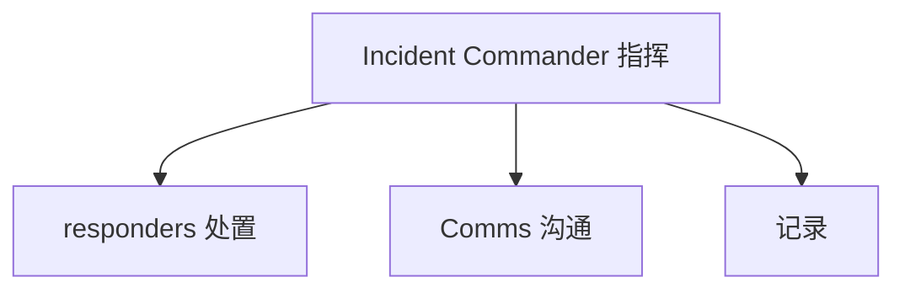

# OnCall 与事故管理进阶实战

> OnCall 是稳定性的"最后一道人防线"。好的事故管理不是"谁接电话"，而是**角色清晰、信息同步、处置有章、复盘有果**。进阶在于把混乱的故障现场变成可协作、可学习的过程。

## 1. 角色分工

| 角色 | 职责 |
| --- | --- |
| 指挥 IC | 决策、分工、升级 |
| 处置 | 排查、执行修复 |
| 沟通 | 对用户/内部同步 |
| 记录 | 时间线、动作留痕 |

## 2. 事故分级

| 级别 | 标准 | 响应 |
| --- | --- | --- |
| SEV1 | 核心不可用 | 立即、全员 |
| SEV2 | 部分降级 | 快速 |
| SEV3 | 轻微 | 工作时间内 |

- 明确升级路径：多久未恢复升级到谁。
- 自动拉群、自动通知、自动建时间线。

## 3. 处置流程

1. 检测：监控/用户报告触发。
2. 定级：按影响定 SEV。
3. 指挥就位，分工。
4. 止血：优先恢复（回滚/扩容/切流）。
5. 根治：定位根因。
6. 复盘：无指责（blameless）复盘。

## 4. 复盘文化

- **无指责**：聚焦系统而非个人。
- **行动项**：每个问题有 owner、有期限。
- **沉淀**：转 Runbook，避免再犯。
- **度量**：MTTR、事故数趋势。

## 5. 常见坑

| 坑 | 现象 | 对策 |
| --- | --- | --- |
| 无指挥 | 混乱 | 角色固定 |
| 信息孤岛 | 重复排查 | 统一时间线 |
| 不敢升级 | 拖大 | 明确升级线 |
| 问责文化 | 隐瞒 | 无指责 |
| 不复盘 | 反复犯 | 行动项闭环 |

## 6. 面试题

1. 事故指挥角色为什么重要？
2. SEV 如何分级？
3. 无指责复盘是什么？
4. 如何缩短 MTTR？
5. 复盘行动项如何闭环？

## 7. 小结

OnCall 与事故管理 = 角色清晰 + 分级升级 + 优先止血 + 无指责复盘。核心是把"人的协作"工程化，让故障可控、可学、可防。
