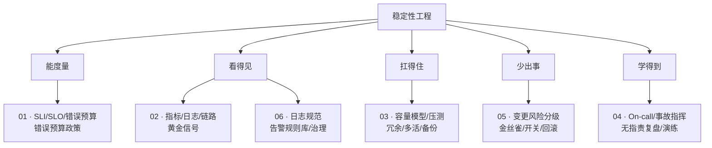
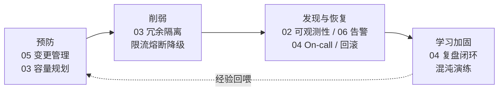
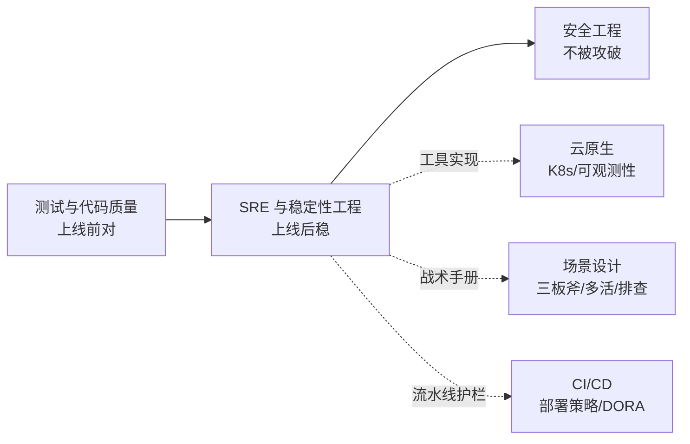

# SRE 与稳定性工程 · 板块导航

> 用软件工程方法做运维：SLI/SLO/错误预算量化稳定性，可观测性看护，日志规范与告警规则库，容量规划与冗余容灾，On-call 与事故管理，变更管理与渐进发布。

本板块回答一个问题：**「系统的稳定性，怎么从玄学变成工程？」**

答案是四件事——**能度量**（SLO）、**看得见**（可观测性）、**扛得住**（容量与冗余）、**少出事**（变更管理），再加上**出事后能学到东西**（复盘闭环）。

---

## 文档列表

- 📝 [SRE 与稳定性工程总览（概念地图+学习路径）](SRE与稳定性工程总览.md)
- 📝 [01 SRE 理念与 SLI/SLO/Error Budget](01-SRE理念与SLI-SLO-ErrorBudget.md)
- 📝 [02 可观测性与稳定性看护](02-可观测性与稳定性看护.md)
- 📝 [03 容量规划与冗余容灾](03-容量规划与冗余容灾.md)
- 📝 [04 On-call 与事故管理](04-On-call与事故管理.md)
- 📝 [05 变更管理与渐进式发布](05-变更管理与渐进式发布.md)
- 📝 [06 日志规范与告警规则库（分级/阈值模板/治理）](06-日志与告警规则库.md)

---

## 一、板块知识地图



---

## 二、每篇讲什么（一句话 + 核心产出）

| 编号 | 文档 | 一句话 | 读完你能产出 |
|------|------|--------|-------------|
| 00 | [总览](SRE与稳定性工程总览.md) | 稳定性工程的全貌与落地路线图 | 一份团队 SRE 成熟度自评 + 落地路线 |
| 01 | [SLI/SLO/Error Budget](01-SRE理念与SLI-SLO-ErrorBudget.md) | 把稳定性变成可谈判的数字 | 核心链路的 SLO 定义 + 错误预算政策 |
| 02 | [可观测性](02-可观测性与稳定性看护.md) | 测不到就救不了 | 黄金信号埋点清单 + 核心看板 |
| 03 | [容量与容灾](03-容量规划与冗余容灾.md) | 够用不浪费、挂了能活 | 容量模型 + 压测计划 + 恢复演练剧本 |
| 04 | [On-call 与事故管理](04-On-call与事故管理.md) | 出事怎么响应、怎么不再犯 | 值班机制 + Runbook + 复盘模板 |
| 05 | [变更管理与渐进发布](05-变更管理与渐进式发布.md) | 70% 事故来自变更，从源头降风险 | 变更分级规范 + 金丝雀配置 + 回滚清单 |
| 06 | [日志与告警规则库](06-日志与告警规则库.md) | 可抄即用的规范与阈值模板 | 日志规范 + 燃烧率告警规则 + 告警治理机制 |

---

## 三、推荐阅读路径

### 路径 A · 后端工程师（3 篇最小集）

```
01 SLI/SLO  →  02 可观测性  →  05 变更管理
```

**理由**：作为写代码的人，你最需要知道的是——你的服务好不好（SLO）、怎么看它好不好（可观测性）、怎么改它才不出事（变更管理）。

### 路径 B · SRE / 运维（全量）

```
01  →  02  →  06 告警规则库  →  03 容量容灾  →  04 On-call/事故  →  05 变更
```

**理由**：先建立度量与看护能力（01/02/06），再补韧性（03），最后完善响应与预防机制（04/05）。

### 路径 C · 技术负责人（治理视角）

```
01 错误预算政策  →  03 容灾选型  →  04 事故文化  →  05 发布护栏  →  总览·落地路线图
```

**理由**：你的抓手是**机制**而不是操作——预算政策决定资源投向，事故文化决定团队能否持续改进。

### 路径 D · 面试突击（按高频度）

```
01（SLO/错误预算，必问）
05（发布与回滚，必问）
04（事故处理流程，必问）
03（容量与容灾，高频）
06（告警阈值怎么定，加分项）
```

---

## 四、按问题查文档（速查索引）

### 度量与目标

| 问题 | 去哪 |
|------|------|
| 稳定性怎么量化？SLI 怎么选 | [01](01-SRE理念与SLI-SLO-ErrorBudget.md) |
| SLO 定 99.9% 还是 99.99% | [01](01-SRE理念与SLI-SLO-ErrorBudget.md) |
| SLO / SLA / SLI 有什么区别 | [01](01-SRE理念与SLI-SLO-ErrorBudget.md) · [总览 11.1](SRE与稳定性工程总览.md) |
| 错误预算烧完了怎么办 | [01](01-SRE理念与SLI-SLO-ErrorBudget.md) · [总览·预算政策模板](SRE与稳定性工程总览.md) |
| 怎么说服业务方停下来修稳定性 | [总览·错误预算政策模板](SRE与稳定性工程总览.md) |

### 可观测性与告警

| 问题 | 去哪 |
|------|------|
| 该埋哪些指标（黄金信号） | [02](02-可观测性与稳定性看护.md) · [06 埋点清单](06-日志与告警规则库.md) |
| 日志该怎么打、不该打什么 | [06 日志规范](06-日志与告警规则库.md) |
| traceId 在线程池/MQ 里丢了 | [06 异步 traceId 传递](06-日志与告警规则库.md) |
| 告警阈值到底设多少 | [06 燃烧率告警](06-日志与告警规则库.md) |
| 告警太多，团队疲劳 | [06 告警治理](06-日志与告警规则库.md) · [04 值班健康度](04-On-call与事故管理.md) |
| Prometheus 内存爆了 / series 太多 | [06 标签基数](06-日志与告警规则库.md) |
| 日志存储费用太高 | [06 日志成本治理](06-日志与告警规则库.md) |
| 系统全绿但业务已经挂了 | [06 业务告警模板](06-日志与告警规则库.md) |

### 容量与容灾

| 问题 | 去哪 |
|------|------|
| 大促要几台机器 | [03 容量模型](03-容量规划与冗余容灾.md) |
| 为什么 CPU 才 80% 就开始超时 | [03 排队论](03-容量规划与冗余容灾.md) |
| 扩容了但没变快 | [03 瓶颈定位](03-容量规划与冗余容灾.md) |
| HPA 配置抖动来回扩缩 | [03 自动扩缩容](03-容量规划与冗余容灾.md) |
| 压测数字怎么才可信 | [03 压测](03-容量规划与冗余容灾.md) · [测试·性能测试](../测试与代码质量/05-性能与负载测试.md) |
| 副本数够了为什么还是全挂 | [03 反亲和与 PDB](03-容量规划与冗余容灾.md) |
| 备份到底靠不靠得住 | [03 恢复演练](03-容量规划与冗余容灾.md) |
| 多活还是主备？怎么防脑裂 | [03 多活深水区](03-容量规划与冗余容灾.md) · [场景设计·异地多活](../场景设计/异地多活.md) |

### 事故与值班

| 问题 | 去哪 |
|------|------|
| 线上出故障，第一步做什么 | [04 应急动作清单](04-On-call与事故管理.md) |
| 事故现场一团乱，谁指挥 | [04 事故指挥体系](04-On-call与事故管理.md) |
| 怎么写 Runbook | [04 Runbook](04-On-call与事故管理.md) |
| 复盘写完没人跟进 | [04 复盘深度](04-On-call与事故管理.md) |
| MTTR 怎么降 | [04 MTTx 分解](04-On-call与事故管理.md) |
| 值班交接要说什么 | [04 交接清单](04-On-call与事故管理.md) |
| 怎么做故障演练 | [04 演练](04-On-call与事故管理.md) · [测试·混沌](../测试与代码质量/08-测试数据Mock服务与混沌工程.md) |

### 变更与发布

| 问题 | 去哪 |
|------|------|
| 每次发布都出事 | [05 变更管理原则](05-变更管理与渐进式发布.md) |
| 金丝雀怎么判断能不能继续放量 | [05 金丝雀分析](05-变更管理与渐进式发布.md) |
| DB 加字段/删字段怎么安全上 | [05 扩展-收缩模式](05-变更管理与渐进式发布.md) |
| 改个配置就挂了 | [05 配置变更护栏](05-变更管理与渐进式发布.md) |
| 每次发布都有一小波 5xx | [05 优雅上下线](05-变更管理与渐进式发布.md) |
| 回滚失败过，为什么 | [05 兼容性设计](05-变更管理与渐进式发布.md) |
| 特性开关堆成迷宫 | [05 开关治理](05-变更管理与渐进式发布.md) |
| 封网期该怎么管 | [05 封网期](05-变更管理与渐进式发布.md) |

---

## 五、10 条最该记住的结论

| # | 结论 | 出处 |
|---|------|------|
| 1 | **SLO 不是越高越好**——过高等于没有错误预算，团队会被迫不敢发版 | 01 |
| 2 | **测不到就救不了**——可观测性是一切稳定性工作的前置条件 | 02 |
| 3 | **利用率超过 70~80% 后延迟指数上升**，所以必须留 Headroom | 03 |
| 4 | **冗余按"故障域"算，不是按机器算**——3 AZ 意味着每域只能用到约 66% | 03 |
| 5 | **没演练过恢复的备份 = 没有备份**；没演练过切流的多活 = 摆设 | 03 |
| 6 | **止血优先于根因**——先恢复服务，再查为什么 | 04 |
| 7 | **复盘的唯一产出是可验证的改进项**；重复故障 = 复盘闭环失效 | 04 |
| 8 | **约 70% 事故来自变更**，其中配置变更常被低估（更快生效、更少保护） | 05 |
| 9 | **能上不能下的发布等于没有回滚方案**——向前兼容和向后兼容都要做 | 05 |
| 10 | **告警阈值应源自 SLO 燃烧率**，而不是拍脑袋的绝对值 | 06 |

---

## 六、口诀速记

> **总纲：SLO 先定红线，预算平衡快慢；可观测才救得了火，容灾演练才扛得住，变更慢发才少崩。**

| 主题 | 口诀 |
|------|------|
| SLO | 用户视角选 SLI，SLO 严于 SLA，预算决定发不发 |
| 可观测 | 指标看趋势、日志查细节、链路串全程 |
| 日志 | INFO 记业务、WARN 记可恢复、ERROR 记失败；堆栈只在 ERROR 打 |
| 容量 | 并发 = QPS × RT，七成是拐点；先找瓶颈再扩容 |
| 扩缩容 | 扩容要快、缩容要慢；按饱和度扩，别只看 CPU |
| 冗余 | 冗余按故障域算，三 AZ 六成六；反亲和加 PDB |
| 容灾 | RTO/RPO 先量化；不演练的备份是废纸 |
| 响应 | 先定级后拉群，止血优先查根因；十五分钟报一次 |
| 复盘 | 无指责问机制，五问挖到流程层；行动带人带日期 |
| 变更 | 小批量可回退，先问三句（多久发现/多久回退/最坏多大） |
| 发布 | 能上要能下，向前兼容才敢回 |
| 告警 | 阈值出自 SLO，长短双窗口相与；聚合抑制静默三件套 |
| 值班 | 告警要能动手，动手要有手册，手册要常演练 |
| Runbook | 写给凌晨三点、脑子不清醒、没做过这个系统的人看 |

---

## 七、四层防线模型（一图理解全板块）



**怎么用这张图诊断团队短板**：

| 症状 | 短板层 | 优先补 |
|------|--------|--------|
| 故障太频繁 | 预防 | 变更管理（05）——性价比最高 |
| 一出事就全站挂 | 削弱 | 冗余与隔离（03） |
| 恢复太慢、定位靠猜 | 发现恢复 | 可观测性（02/06）+ Runbook（04） |
| 同一个坑反复踩 | 学习 | 复盘闭环（04）——它决定其他三层能否持续改进 |
| 什么都缺 | — | 先做「看得见」（02/06），否则一切改进都是盲改 |

---

## 八、落地成熟度自评（快速打分）

给每项打 0（没有）/ 1（部分）/ 2（完善）：

```
【度量】
[ ] 核心链路有明确的 SLI/SLO 定义
[ ] 有错误预算，且有"超预算怎么办"的书面政策
[ ] SLO 达成情况有定期回顾

【可观测】
[ ] 日志有统一规范，traceId 全链路可串
[ ] 黄金信号（RED/USE）埋点齐全
[ ] 有业务指标告警（不只有技术指标）
[ ] 告警都可行动，且有 Runbook 链接

【容量与韧性】
[ ] 有容量模型，数字来自压测而非估算
[ ] 冗余做到故障域级别（多 AZ + 反亲和 + PDB）
[ ] 限流/熔断/降级已就位且有开关
[ ] 备份恢复做过实测演练（有 RTO/RPO 实测数据）

【响应】
[ ] 有值班机制、分级标准、升级路径
[ ] 高频故障有 Runbook 且定期更新
[ ] 事故有无指责复盘，改进项有 owner + 截止 + 验证方式
[ ] 重复故障会被单独跟踪

【变更】
[ ] 变更有风险分级，低风险自动化放行
[ ] 核心服务用金丝雀 + 自动指标分析 + 自动回滚
[ ] 配置走版本化与灰度推送
[ ] DB 变更走扩展-收缩，回滚路径已演练

【主动验证】
[ ] 定期做故障注入/混沌演练
[ ] 定期做切流与恢复演练
[ ] 复盘经验会转化为混沌用例
```

| 总分区间 | 阶段 | 下一步 |
|---------|------|--------|
| 0~10 | 救火期 | 先建「看得见」：日志规范 + 黄金信号 + 基础告警 |
| 11~20 | 起步期 | 定 SLO 与错误预算政策，建值班与复盘机制 |
| 21~30 | 成型期 | 补容量模型与冗余，把告警升级为燃烧率 |
| 31~40 | 成熟期 | 强化发布护栏（金丝雀自动分析、配置灰度） |
| 41~48 | 领先期 | 混沌常态化、自愈自动化、Toil 持续消除 |

---

## 九、与其他板块的关系



| 方向 | 去这里 |
|------|--------|
| 上线前的质量保证 | [测试与代码质量](../测试与代码质量/测试与代码质量总览.md) |
| 应用安全与合规 | [安全工程](../安全工程/安全工程总览.md) |
| 可观测性工具实操（Prometheus/Grafana/Loki） | [云原生·可观测性](../云原生/可观测性.md) |
| K8s 故障排查 | [云原生·K8s 故障排查手册](../云原生/K8s故障排查手册.md) |
| K8s 运维实战 | [云原生·K8s 运维实战](../云原生/K8s运维实战.md) |
| GitOps 声明式发布 | [云原生·GitOps](../云原生/GitOps.md) |
| 限流熔断降级战术 | [场景设计·稳定性三板斧](../场景设计/稳定性三板斧：限流-熔断-降级.md) |
| 异地多活工程实现 | [场景设计·异地多活](../场景设计/异地多活.md) |
| 大促备战全流程 | [场景设计·大促容量规划与备战](../场景设计/大促容量规划与备战.md) |
| 生产故障处置手册 | [场景设计·生产问题排查实战](../场景设计/生产问题排查实战：常见故障与处置步骤.md) |
| 问题定位方法论 | [场景设计·问题定位](../场景设计/问题定位.md) |
| 部署策略工程细节 | [CI/CD·部署策略](../基础知识/CI-CD/10-部署策略.md) |
| DORA 度量与 DevSecOps | [CI/CD·DORA 与 DevSecOps](../基础知识/CI-CD/13-可观测性DORA度量与DevSecOps.md) |
| 密钥与环境配置 | [CI/CD·环境配置与密钥管理](../基础知识/CI-CD/12-环境配置与密钥管理.md) |
| 混沌工程 | [测试·混沌工程](../测试与代码质量/08-测试数据Mock服务与混沌工程.md) |
| 压测方法与工具 | [测试·性能与负载测试](../测试与代码质量/05-性能与负载测试.md) |
| 底层资源指标定位 | [基础知识·Linux 排查](../基础知识/Linux排查.md) |
| JVM 层稳定性 | [基础知识·JVM 调优实战](../基础知识/JVM调优实战.md) |
| ELK 日志体系 | [中间件·ELK 日志体系](../基础知识/中间件/ELK日志体系.md) |
| 链路追踪 | [中间件·Jaeger 链路追踪](../基础知识/中间件/Jaeger链路追踪.md) |

---

## 十、术语速查

| 术语 | 含义 |
|------|------|
| SLI | 服务质量指标（实测：可用率/延迟/成功率） |
| SLO | 服务质量目标（内部承诺，如 99.9%） |
| SLA | 服务等级协议（对外合同，违约赔偿） |
| Error Budget | 错误预算 = 100% − SLO |
| Burn Rate | 错误预算燃烧率 = 实际错误率 / 允许错误率 |
| MTTD | 故障发生 → 被发现 |
| MTTA | 被发现 → 有人认领 |
| MTTI | 认领 → 定位到止血手段 |
| MTTR | 发现 → 恢复 |
| MTBF | 平均故障间隔 |
| RTO | 恢复时间目标（多久恢复服务） |
| RPO | 恢复点目标（可容忍丢多少数据） |
| PITR | 任意时间点恢复（依赖 binlog/WAL 归档） |
| Headroom | 容量余量（刻意不用满的那部分） |
| IC | 事故指挥官（管秩序与决策，不敲命令） |
| Postmortem | 无指责事故复盘 |
| Runbook | 处置手册（可照做的步骤） |
| Toil | 手工、重复、可自动化、无长期价值的运维劳动 |
| PDB | PodDisruptionBudget（自愿驱逐时的可用性下限） |
| Blast Radius | 爆炸半径（故障影响范围） |
| Canary | 金丝雀发布（小流量先行） |
| Blue-Green | 蓝绿发布（整环境切换） |
| Feature Flag | 特性开关（部署与上线解耦） |
| Expand-Contract | 扩展-收缩（兼容式 DB 变更模式） |
| Chaos Engineering | 混沌工程（主动注入故障验证韧性） |
| Golden Signals | 黄金信号（RED：速率/错误/延迟；USE：利用率/饱和度/错误） |
| Cardinality | 基数（指标 label 唯一值数量，过高会打爆监控） |

---

## 十一、全板块反模式清单（自查用）

| 反模式 | 为什么错 | 正解出处 |
|--------|----------|----------|
| SLO 定成 99.999% 显得专业 | 错误预算几乎为零，团队被迫不敢发版 | [01](01-SRE理念与SLI-SLO-ErrorBudget.md) |
| 可用率用月度/年度平均汇报 | 长周期平均会掩盖短时严重故障 | [01](01-SRE理念与SLI-SLO-ErrorBudget.md) |
| 指标里加 userId 方便排查 | 高基数打爆 Prometheus，监控自己成故障源 | [06](06-日志与告警规则库.md) |
| 告警先都配上，多总比少好 | 噪音训练值班忽略告警，真事故被漏 | [06](06-日志与告警规则库.md) |
| 静默一下先安静，回头再说 | 忘记解除 = 长期失明 | [06](06-日志与告警规则库.md) |
| 容量按平均 QPS 规划 | 峰值直接打满 | [03](03-容量规划与冗余容灾.md) |
| 看集群平均利用率判断容量 | 单分片热点被均值掩盖 | [03](03-容量规划与冗余容灾.md) |
| 慢就加机器 | 瓶颈在 DB 时，扩应用只会更快压垮 DB | [03](03-容量规划与冗余容灾.md) |
| 有备份就等于有容灾 | 没演练过恢复的备份不可信 | [03](03-容量规划与冗余容灾.md) |
| 两地主备自动切换，无第三方仲裁 | 网络抖动即双主，必脑裂 | [03](03-容量规划与冗余容灾.md) |
| 事故时先查根因再处理 | 恢复被拖慢，影响扩大 | [04](04-On-call与事故管理.md) |
| 大家一起上手改，人多快 | 并行改动互相干扰，事后无法定位 | [04](04-On-call与事故管理.md) |
| 复盘写"加强监控、大家注意" | 不可验证，等于没有改进 | [04](04-On-call与事故管理.md) |
| 把事故数纳入个人考核 | 结果是不上报，风险积累 | [04](04-On-call与事故管理.md) |
| Runbook 写完就归档 | 环境变了命令失效，过期比没有更危险 | [04](04-On-call与事故管理.md) |
| 减少发布次数来提升稳定性 | 攒大版本才是真高风险 | [05](05-变更管理与渐进式发布.md) |
| 所有变更一律三级审批 | 逼开发攒大批量，风险反升 | [05](05-变更管理与渐进式发布.md) |
| 配置改动不算发布 | 生效更快、保护更少，往往更危险 | [05](05-变更管理与渐进式发布.md) |
| 加字段和删字段一起发 | 回滚即崩，必须走扩展-收缩 | [05](05-变更管理与渐进式发布.md) |
| 只验证新版本能读旧数据 | 回滚时旧代码读不懂新数据 | [05](05-变更管理与渐进式发布.md) |
| 特性开关一律清理干净 | 会误删运维降级开关（那是资产） | [05](05-变更管理与渐进式发布.md) |
| 没有可观测性就先搞混沌工程 | 蒙眼砸系统，看不出影响 | [总览·落地路线图](SRE与稳定性工程总览.md) |
| SRE 当运维背锅侠，开发扔过墙 | 质量与责任脱钩，问题永远修不完 | [总览·协作模式](SRE与稳定性工程总览.md) |
| SRE 100% 时间救火 | 永远没时间做自动化，陷入死循环 | [总览·Toil](SRE与稳定性工程总览.md) |

---

## 十二、如何使用本板块

| 你的情境 | 建议做法 |
|----------|----------|
| 团队刚开始做稳定性 | 先做第八节自评 → 按得分找阶段 → 只做那个阶段的事，别跳级 |
| 刚接手一个陌生系统 | 先读 02 + 06，把「看得见」建起来；再读 03 摸容量底线 |
| 刚出了一次大事故 | 读 04 复盘章节，按 5 Whys 挖到机制层；把结论转成 05 的护栏 |
| 准备面试 | 走路径 D，重点准备 01（SLO/预算）、05（发布回滚）、04（事故流程） |
| 要给团队做分享 | 用第七节四层防线图开场，配第五节 10 条结论收尾 |
| 要写团队规范文档 | 直接抄 06 的日志/告警模板 + 05 的变更检查单 + 总览的预算政策模板 |

> **一句话总结本板块**：稳定性不是靠人守出来的，是靠**度量（SLO）、看见（可观测）、扛住（冗余）、少改坏（变更管理）、学得到（复盘）** 这五件事工程化出来的。

---

[← 返回首页](../README.md)

---

## 十三、相关板块与延伸阅读

本板块解决"系统稳不稳、怎么度量、怎么扛住"，与之强相关的相邻板块：

- **安全工程**（[../安全工程/README.md](../安全工程/README.md)）：稳定性被攻破也是事故。限流是抗 DDoS 第一道防线的同时是容量保护；零信任的授权粒度直接决定爆炸半径；安全事件应与本板块共用同一套事故/复盘流程。
- **数据与安全交叉**：密钥管理、日志脱敏、审计日志不可篡改，见 [安全工程·数据安全与密码学](../安全工程/05-数据安全与密码学基础.md)。
- **身份与授权**：服务身份（mTLS/Workload Identity）即"谁能调我"，见 [安全工程·零信任](../安全工程/07-零信任架构.md)。

> 使用建议：如果你是 SRE/稳定性负责人，至少读一遍安全板块的**总览**与**零信任**两篇——它会改变你对"爆炸半径"和"依赖可信边界"的判断方式，而这两件事正是容量与容灾规划的前提。
