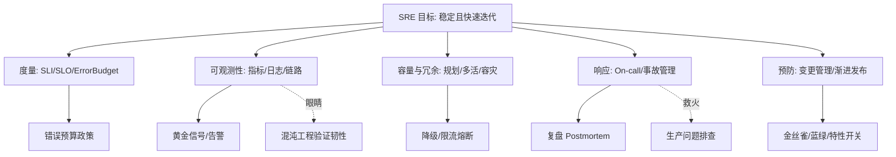

# 🛡️ SRE 与稳定性工程 · 板块总览

> *「系统不是不崩，而是崩了能多快恢复、以及我们有没有为崩做好准备。」* SRE（Site Reliability Engineering）用**软件工程的方法**做运维，把稳定性从"救火"变成"可度量、可规划、可演练"的工程学科。

本板块是**研发效能（卷五）**的第二支柱，与已建的 [测试与代码质量](../测试与代码质量/测试与代码质量总览.md) 互补：测试保证"上线前对"，SRE 保证"上线后稳"。

**互链模块**：
- [测试与代码质量·混沌工程](../测试与代码质量/08-测试数据Mock服务与混沌工程.md) —— 混沌是 SRE 主动验证韧性的手段
- [云原生·可观测性](../云原生/可观测性.md) —— 可观测性是 SRE 的眼睛
- [场景设计·生产问题排查实战](../场景设计/生产问题排查实战：常见故障与处置步骤.md) —— SRE 被动救火的实战手册
- [场景设计·稳定性三板斧](../场景设计/稳定性三板斧：限流-熔断-降级.md) —— 稳定性保障的战术工具

---

## 一、为什么需要 SRE

传统运维 vs SRE：

| 维度 | 传统运维 | SRE |
|------|----------|-----|
| 目标 | 不出事 | 可接受风险下最大化迭代速度 |
| 手段 | 人肉操作、工单 | 自动化、软件工程 |
| 度量 | "还行吧" | SLI/SLO/Error Budget 量化 |
| 开发关系 | 对立（开发甩锅运维） | 同一团队、共享责任 |

核心价值：**用错误预算平衡"快速迭代"与"系统稳定"**——预算内大胆发，超预算踩刹车。

---

## 二、概念地图



---

## 三、文章导航（6 篇 + 本总览）

| 编号 | 文档 | 核心内容 |
|------|------|----------|
| 00 | [SRE 与稳定性工程总览](SRE与稳定性工程总览.md)（本页） | 概念地图、学习路径、定位 |
| 01 | [SRE 理念与 SLI/SLO/Error Budget](01-SRE理念与SLI-SLO-ErrorBudget.md) | SRE 起源、软件工程做运维、SLI/SLO、错误预算与政策 |
| 02 | [可观测性与稳定性看护](02-可观测性与稳定性看护.md) | Metrics/Logging/Tracing、黄金信号、SLO 告警、与云原生互链 |
| 03 | [容量规划与冗余容灾](03-容量规划与冗余容灾.md) | 容量模型、冗余 N+1、多活、备份、降级、限流熔断 |
| 04 | [On-call 与事故管理](04-On-call与事故管理.md) | 轮值、事故分级、应急响应、无指责复盘 |
| 05 | [变更管理与渐进式发布](05-变更管理与渐进式发布.md) | 变更是故障主因、变更管理、金丝雀/蓝绿、特性开关 |
| 06 | [日志与告警规则库](06-日志与告警规则库.md) | 日志规范、指标埋点、分级与阈值模板、告警治理 |

---

## 四、推荐学习路径

**路径一 · 工程师（先懂度量与看护）**
`01 SLI/SLO` → `02 可观测性` → `05 变更管理`

**路径二 · SRE / 运维（全栈）**
`01` → `02` → `03 容量容灾` → `04 On-call/事故` → `05 变更`

**路径三 · 技术负责人（稳定性治理）**
`01（错误预算平衡）` → `03（容灾）` → `04（事故文化）` → `05（发布护栏）`

---

## 五、贯穿全板块的 5 条原则（口诀）

> **口诀：SLO 先定红线，预算平衡快慢；可观测才救得了火，容灾演练才扛得住，变更慢发才少崩。**

1. **度量先行**：没有 SLI/SLO，稳定性就是玄学。
2. **错误预算平衡**：预算内快速迭代，超预算踩刹车——用数据而不是拍脑袋决定发不发。
3. **可观测性是一切前提**：测不到就救不了。
4. **为失败设计**：冗余、降级、多活、备份——假设硬件/人会出错。
5. **变更是最大风险源**：大多数事故来自变更，渐进发布 + 护栏是核心防线。

---

## 六、与其他模块的关联

| 方向 | 去这里 |
|------|--------|
| 测试如何保证质量 | [测试与代码质量](../测试与代码质量/测试与代码质量总览.md) |
| 可观测性技术细节 | [云原生·可观测性](../云原生/可观测性.md) |
| 具体故障怎么处置 | [生产问题排查实战](../场景设计/生产问题排查实战：常见故障与处置步骤.md) |
| 限流熔断降级战术 | [稳定性三板斧](../场景设计/稳定性三板斧：限流-熔断-降级.md) |
| 混沌主动验证 | [测试·混沌工程](../测试与代码质量/08-测试数据Mock服务与混沌工程.md) |

---

## 七、SRE 核心工作流（闭环）

```
定义目标 → 度量现状 → 规划容量 → 变更与发布 → 监控告警 → 事故响应 → 复盘改进
   ↑                                                        ↓
   └──────────────── 错误预算反馈调节 ←──────────────────────┘
```

| 环节 | 关键动作 | 对应文章 |
|------|----------|----------|
| 定义目标 | 定 SLI/SLO、错误预算政策 | 01 |
| 度量现状 | 埋点、黄金信号、告警 | 02 |
| 规划容量 | 容量模型、冗余多活、备份 | 03 |
| 变更发布 | 金丝雀/蓝绿/特性开关 | 05 |
| 事故响应 | On-call、分级、无指责复盘 | 04 |
| 复盘改进 | 行动项闭环，回喂预算与流程 | 04 |

> 闭环的关键不是「流程有没有」，而是**每一起事故都能反向改进流程/预算/告警**——复盘的产出必须落到可追踪的行动项。

---

## 八、常见误区（面试高频）

| 误区 ❌ | 正解 ✅ |
|---------|---------|
| SLO 定 99.999% 越高越好 | 错误预算应为迭代留空间，过高等于没预算 |
| 告警越灵敏越好 | 告警要可行动，噪音告警导致告警疲劳、被无视 |
| 可用率用「月」「年」平均 | 长周期平均掩盖故障，要看 P95/P99 与分时段 |
| 稳定性靠加班「死守」 | 靠自动化、冗余、预案、演练 |
| 变更全手工审批 | 手工审批挡不住人为失误，要自动化门禁 + 渐进发布 |
| 复盘走形式 | 复盘要定位根因、产出行动项、限期跟踪 |

---

## 九、面试速答框架（附送）

1. **你们 SLO 怎么定的？** → 先选用户可感知的 SLI（可用性/延迟/成功率），再按错误预算反推可接受不可用时间。
2. **错误预算烧完了怎么办？** → 冻结高风险变更、优先稳定性工作、必要时扩容/降级，用数据说服业务方。
3. **告警为什么不准？** → 告警从「阈值」升级为「SLO 燃烧率 + 多信号关联」，并定期复盘每条告警的「行动率」。
4. **多活 vs 主备怎么选？** → 看 RPO/RTO 要求与复杂度预算：主备简单 RPO 分钟级，多活复杂但 RPO≈0。
5. **怎么证明系统扛得住？** → 容量模型 + 压测 + 混沌演练 + 大促预案，缺一不可。

---

> 下一篇：[01 SRE 理念与 SLI/SLO/Error Budget](01-SRE理念与SLI-SLO-ErrorBudget.md) —— 先把"稳定性怎么度量、如何平衡快慢"这套核心认知打牢。
