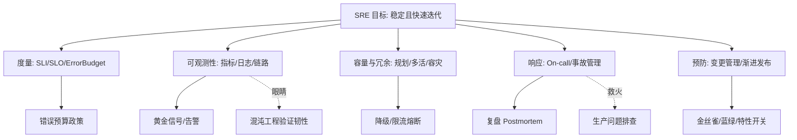
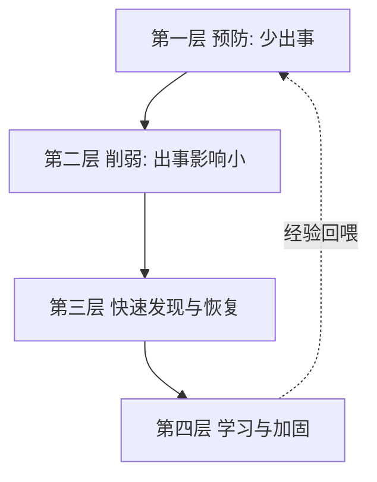

# 🛡️ SRE 与稳定性工程 · 板块总览

> *「系统不是不崩，而是崩了能多快恢复、以及我们有没有为崩做好准备。」* SRE（Site Reliability Engineering）用**软件工程的方法**做运维，把稳定性从"救火"变成"可度量、可规划、可演练"的工程学科。

本板块是**研发效能（卷五）**的第二支柱，与已建的 [测试与代码质量](../测试与代码质量/测试与代码质量总览.md) 互补：测试保证"上线前对"，SRE 保证"上线后稳"。

**互链模块**：
- [测试与代码质量·混沌工程](../测试与代码质量/08-测试数据Mock服务与混沌工程.md) —— 混沌是 SRE 主动验证韧性的手段
- [云原生·可观测性](../云原生/可观测性.md) —— 可观测性是 SRE 的眼睛
- [场景设计·生产问题排查实战](../场景设计/生产问题排查实战：常见故障与处置步骤.md) —— SRE 被动救火的实战手册
- [场景设计·稳定性三板斧](../场景设计/稳定性三板斧：限流-熔断-降级.md) —— 稳定性保障的战术工具

---

## 一、为什么需要 SRE

传统运维 vs SRE：

| 维度 | 传统运维 | SRE |
|------|----------|-----|
| 目标 | 不出事 | 可接受风险下最大化迭代速度 |
| 手段 | 人肉操作、工单 | 自动化、软件工程 |
| 度量 | "还行吧" | SLI/SLO/Error Budget 量化 |
| 开发关系 | 对立（开发甩锅运维） | 同一团队、共享责任 |

核心价值：**用错误预算平衡"快速迭代"与"系统稳定"**——预算内大胆发，超预算踩刹车。

---

## 二、概念地图



---

## 三、文章导航（6 篇 + 本总览）

| 编号 | 文档 | 核心内容 |
|------|------|----------|
| 00 | [SRE 与稳定性工程总览](SRE与稳定性工程总览.md)（本页） | 概念地图、学习路径、定位 |
| 01 | [SRE 理念与 SLI/SLO/Error Budget](01-SRE理念与SLI-SLO-ErrorBudget.md) | SRE 起源、软件工程做运维、SLI/SLO、错误预算与政策 |
| 02 | [可观测性与稳定性看护](02-可观测性与稳定性看护.md) | Metrics/Logging/Tracing、黄金信号、SLO 告警、与云原生互链 |
| 03 | [容量规划与冗余容灾](03-容量规划与冗余容灾.md) | 容量模型、冗余 N+1、多活、备份、降级、限流熔断 |
| 04 | [On-call 与事故管理](04-On-call与事故管理.md) | 轮值、事故分级、应急响应、无指责复盘 |
| 05 | [变更管理与渐进式发布](05-变更管理与渐进式发布.md) | 变更是故障主因、变更管理、金丝雀/蓝绿、特性开关 |
| 06 | [日志与告警规则库](06-日志与告警规则库.md) | 日志规范、指标埋点、分级与阈值模板、告警治理 |

---

## 四、推荐学习路径

**路径一 · 工程师（先懂度量与看护）**
`01 SLI/SLO` → `02 可观测性` → `05 变更管理`

**路径二 · SRE / 运维（全栈）**
`01` → `02` → `03 容量容灾` → `04 On-call/事故` → `05 变更`

**路径三 · 技术负责人（稳定性治理）**
`01（错误预算平衡）` → `03（容灾）` → `04（事故文化）` → `05（发布护栏）`

---

## 五、贯穿全板块的 5 条原则（口诀）

> **口诀：SLO 先定红线，预算平衡快慢；可观测才救得了火，容灾演练才扛得住，变更慢发才少崩。**

1. **度量先行**：没有 SLI/SLO，稳定性就是玄学。
2. **错误预算平衡**：预算内快速迭代，超预算踩刹车——用数据而不是拍脑袋决定发不发。
3. **可观测性是一切前提**：测不到就救不了。
4. **为失败设计**：冗余、降级、多活、备份——假设硬件/人会出错。
5. **变更是最大风险源**：大多数事故来自变更，渐进发布 + 护栏是核心防线。

---

## 六、与其他模块的关联

| 方向 | 去这里 |
|------|--------|
| 测试如何保证质量 | [测试与代码质量](../测试与代码质量/测试与代码质量总览.md) |
| 可观测性技术细节 | [云原生·可观测性](../云原生/可观测性.md) |
| 具体故障怎么处置 | [生产问题排查实战](../场景设计/生产问题排查实战：常见故障与处置步骤.md) |
| 限流熔断降级战术 | [稳定性三板斧](../场景设计/稳定性三板斧：限流-熔断-降级.md) |
| 混沌主动验证 | [测试·混沌工程](../测试与代码质量/08-测试数据Mock服务与混沌工程.md) |

---

## 七、SRE 核心工作流（闭环）

```
定义目标 → 度量现状 → 规划容量 → 变更与发布 → 监控告警 → 事故响应 → 复盘改进
   ↑                                                        ↓
   └──────────────── 错误预算反馈调节 ←──────────────────────┘
```

| 环节 | 关键动作 | 对应文章 |
|------|----------|----------|
| 定义目标 | 定 SLI/SLO、错误预算政策 | 01 |
| 度量现状 | 埋点、黄金信号、告警 | 02 |
| 规划容量 | 容量模型、冗余多活、备份 | 03 |
| 变更发布 | 金丝雀/蓝绿/特性开关 | 05 |
| 事故响应 | On-call、分级、无指责复盘 | 04 |
| 复盘改进 | 行动项闭环，回喂预算与流程 | 04 |

> 闭环的关键不是「流程有没有」，而是**每一起事故都能反向改进流程/预算/告警**——复盘的产出必须落到可追踪的行动项。

---

## 八、常见误区（面试高频）

| 误区 ❌ | 正解 ✅ |
|---------|---------|
| SLO 定 99.999% 越高越好 | 错误预算应为迭代留空间，过高等于没预算 |
| 告警越灵敏越好 | 告警要可行动，噪音告警导致告警疲劳、被无视 |
| 可用率用「月」「年」平均 | 长周期平均掩盖故障，要看 P95/P99 与分时段 |
| 稳定性靠加班「死守」 | 靠自动化、冗余、预案、演练 |
| 变更全手工审批 | 手工审批挡不住人为失误，要自动化门禁 + 渐进发布 |
| 复盘走形式 | 复盘要定位根因、产出行动项、限期跟踪 |

---

## 九、面试速答框架（附送）

1. **你们 SLO 怎么定的？** → 先选用户可感知的 SLI（可用性/延迟/成功率），再按错误预算反推可接受不可用时间。
2. **错误预算烧完了怎么办？** → 冻结高风险变更、优先稳定性工作、必要时扩容/降级，用数据说服业务方。
3. **告警为什么不准？** → 告警从「阈值」升级为「SLO 燃烧率 + 多信号关联」，并定期复盘每条告警的「行动率」。
4. **多活 vs 主备怎么选？** → 看 RPO/RTO 要求与复杂度预算：主备简单 RPO 分钟级，多活复杂但 RPO≈0。
5. **怎么证明系统扛得住？** → 容量模型 + 压测 + 混沌演练 + 大促预案，缺一不可。

---

---

## 十、稳定性的四层防线模型

理解 SRE 全貌最好的方式，是把所有手段按「事故发生的时间轴」排列成四层防线：



| 防线 | 目标 | 主要手段 | 对应文章 |
|------|------|----------|----------|
| **一 · 预防** | 减少故障发生（提高 MTBF） | 变更管理、渐进发布、CI 门禁、容量规划、代码质量 | 03 / 05 |
| **二 · 削弱** | 故障发生但影响面小（限制爆炸半径） | 冗余、多 AZ/多活、限流熔断降级、舱壁隔离、金丝雀 | 03 / 05 |
| **三 · 发现恢复** | 快速发现并止血（降低 MTTR） | 可观测性、告警、Runbook、On-call、一键回滚 | 02 / 04 / 06 |
| **四 · 学习** | 同类问题不再发生 | 无指责复盘、改进项闭环、混沌演练、告警规则迭代 | 04 |

> **这个模型能帮你回答一切稳定性问题的"我该做什么"**：
> - 故障太频繁 → 补第一层（变更管理是首选，70% 事故来自变更）
> - 一出事就全站挂 → 补第二层（冗余与隔离不足）
> - 恢复太慢 → 补第三层（可观测性与预案）
> - 同一个坑反复踩 → 补第四层（复盘没闭环）
>
> **投入优先级判断**：如果同类故障重复发生，先补第四层（因为它决定其他三层能否持续改进）；如果是新系统，先补第三层（先要"看得见"，否则一切改进都是盲改）。

---

## 十一、稳定性的三组核心指标

### 11.1 用户视角：SLI / SLO / 错误预算

| 概念 | 含义 | 谁关心 |
|------|------|--------|
| **SLI** | 实际测出来的服务质量指标（可用率、延迟、成功率） | 工程师 |
| **SLO** | 我们承诺的目标（如 99.9%） | 团队 + 业务方 |
| **SLA** | 对外合同承诺（违约要赔） | 商务/法务 |
| **错误预算** | 100% - SLO，允许"不好"的额度 | 决定发不发版 |

> 关系：**SLI 是温度计，SLO 是体温标准，SLA 是赔偿条款，错误预算是可花的额度。**
> SLA 应该**严于宽于** SLO——即 SLO 定得比 SLA 更高（留缓冲），这样内部先破线，还有时间修复，不至于直接违约。

### 11.2 响应视角：MTTx 家族

| 指标 | 含义 | 改进抓手 |
|------|------|----------|
| MTTD | 多久发现 | 告警覆盖率、业务指标兜底 |
| MTTA | 多久有人响应 | 值班可达、自动升级 |
| MTTI | 多久定位 | 可观测性、变更事件流、Runbook |
| MTTR | 多久恢复 | 一键回滚、降级开关、预案自动化 |
| MTBF | 多久坏一次 | 变更管理、冗余、混沌加固 |

> 可用性 = MTBF / (MTBF + MTTR)。**对成熟系统，降 MTTR 通常比提 MTBF 更划算**——因为故障不可能归零，但恢复速度可以持续压缩。

### 11.3 工程视角：DORA 四指标

| 指标 | 含义 | 与稳定性的关系 |
|------|------|---------------|
| 部署频率 | 多久发一次 | 高频小批量 → 风险更可控 |
| 变更前置时间 | 提交到上线多久 | 短 → 修复也快 |
| 变更失败率 | 多少次发布出事 | 直接反映发布护栏质量 |
| 恢复时长（MTTR） | 出事多久恢复 | 同上 |

> **反直觉但重要的结论**：DORA 研究显示高效能团队**同时**做到"发布更频繁"和"故障更少、恢复更快"。速度与稳定不是对立的——**它们共同来自"小批量 + 自动化 + 快反馈"这一组能力**。
>
> 详见 [CI/CD·DORA 度量与 DevSecOps](../基础知识/CI-CD/13-可观测性DORA度量与DevSecOps.md)。

---

## 十二、按问题查文档（速查索引）

| 我遇到的问题 | 去哪篇 |
|-------------|--------|
| 老板问"我们系统稳定性怎么样"，不知道怎么答 | [01 SLI/SLO](01-SRE理念与SLI-SLO-ErrorBudget.md) |
| 稳定性目标定多少合适？99.9 还是 99.99？ | [01 SLI/SLO](01-SRE理念与SLI-SLO-ErrorBudget.md) |
| 该不该冻结发布？凭什么说服业务方 | [01 错误预算政策](01-SRE理念与SLI-SLO-ErrorBudget.md) |
| 线上慢，但不知道从哪看 | [02 可观测性](02-可观测性与稳定性看护.md) |
| 该埋哪些指标？黄金信号是什么 | [02 可观测性](02-可观测性与稳定性看护.md) / [06 埋点规范](06-日志与告警规则库.md) |
| 大促要几台机器？怎么算 | [03 容量规划](03-容量规划与冗余容灾.md) |
| 扩容了但没变快 | [03 瓶颈定位](03-容量规划与冗余容灾.md) |
| HPA 怎么配才不抖 | [03 自动扩缩容](03-容量规划与冗余容灾.md) |
| 备份到底靠不靠得住 | [03 备份与恢复演练](03-容量规划与冗余容灾.md) |
| 多活还是主备？怎么防脑裂 | [03 多活深水区](03-容量规划与冗余容灾.md) |
| 半夜告警太多，团队要崩了 | [04 值班健康度](04-On-call与事故管理.md) / [06 告警治理](06-日志与告警规则库.md) |
| 事故现场一团乱，谁指挥 | [04 事故指挥体系](04-On-call与事故管理.md) |
| 复盘写完没人跟进 | [04 复盘深度](04-On-call与事故管理.md) |
| 怎么写 Runbook | [04 Runbook](04-On-call与事故管理.md) |
| 每次发布都出事 | [05 变更管理](05-变更管理与渐进式发布.md) |
| DB 加字段/删字段怎么安全上 | [05 扩展-收缩模式](05-变更管理与渐进式发布.md) |
| 改了个配置就挂了 | [05 配置变更护栏](05-变更管理与渐进式发布.md) |
| 发布时总有一小波 5xx | [05 优雅上下线](05-变更管理与渐进式发布.md) |
| 回滚失败过，为什么 | [05 兼容性设计](05-变更管理与渐进式发布.md) |
| 告警阈值到底设多少 | [06 燃烧率告警](06-日志与告警规则库.md) |
| Prometheus 内存爆了 | [06 标签基数](06-日志与告警规则库.md) |
| 日志费用太高 | [06 日志成本治理](06-日志与告警规则库.md) |
| traceId 丢了串不起来 | [06 异步 traceId 传递](06-日志与告警规则库.md) |

---

## 十三、SRE 落地路线图（从零到成熟）

### 阶段一 · 看得见（0 → 1，最优先）

```
目标：出事能知道、能定位
- 统一日志规范（traceId 全链路）
- 黄金信号埋点（RED + USE）
- 基础资源与应用告警（能报 + 可行动）
- 建立值班机制（有人接、有升级路径）

判断做到了：出事时是"监控先告警"而不是"用户先投诉"
```

### 阶段二 · 说得清（1 → 2）

```
目标：稳定性可量化、可谈判
- 定核心链路 SLI/SLO
- 建错误预算与政策（超预算怎么办，提前和业务方约定）
- 告警从阈值升级为燃烧率
- 事故分级与复盘机制（无指责 + 行动闭环）

判断做到了：能用数据回答"该不该发版""稳定性投入够不够"
```

### 阶段三 · 扛得住（2 → 3）

```
目标：故障影响可控
- 容量模型 + 定期压测
- 冗余到故障域级别（多 AZ、反亲和、PDB）
- 限流熔断降级三板斧就位且有开关
- 备份可恢复（实测 RTO/RPO）

判断做到了：单 AZ 故障、单依赖故障不会导致全站不可用
```

### 阶段四 · 少出事（3 → 4）

```
目标：从源头降低故障率
- 渐进式发布（金丝雀 + 自动分析 + 自动回滚）
- 配置即代码 + 变更风险分级
- DB 变更走扩展-收缩
- CI 质量门禁

判断做到了：变更失败率显著下降，且失败也能秒级回退
```

### 阶段五 · 主动验证（4 → 5）

```
目标：不等事故来验证韧性
- 混沌工程常态化（故障注入）
- 切流/恢复/应急流程定期演练
- 复盘经验转化为混沌用例
- 自愈自动化

判断做到了：敢在工作日白天做故障演练
```

> **常见落地错误：跳过阶段一直接搞混沌工程**。没有可观测性的混沌演练 = 蒙眼砸系统——你注入了故障，但看不出影响，也不知道系统是不是真的自愈了。
>
> **顺序不可跳**：看得见 → 说得清 → 扛得住 → 少出事 → 主动验证。

---

## 十四、SRE 与开发团队的协作模式

| 模式 | 说明 | 适用 |
|------|------|------|
| **嵌入式** | SRE 进业务团队，共同负责 | 核心业务、规模大 |
| **平台型** | SRE 建平台/工具，业务团队自助 | 服务数量多、需规模化 |
| **咨询型** | SRE 提方法论与评审，不接手运维 | 团队小、SRE 人少 |
| **兜底型（反模式）** | SRE 当"运维背锅侠"，开发扔过墙 | ❌ 应避免 |

**健康协作的三条约定**：

| 约定 | 内容 |
|------|------|
| **共享责任** | 开发也要 On-call 自己的服务（"谁写谁值班"是最强的质量激励） |
| **接管有标准** | SRE 接管运维前，服务必须满足门槛（有 SLO、有告警、有 Runbook、有回滚方案） |
| **可以退回** | 服务稳定性长期不达标，SRE 有权把运维职责退回开发团队 |

> **"谁写谁值班"的威力**：当开发工程师半夜被自己写的代码叫起来两次之后，他会主动去加日志、加告警、改超时、写 Runbook——**这是任何流程规范都比不上的质量驱动力**。

---

## 十五、错误预算政策模板（可直接套用）

```text
# 服务错误预算政策 · 订单服务

## 1. SLO 定义
- 可用性 SLO：99.9%（30 天滚动窗口）
- 延迟 SLO：99% 的请求 < 300ms
- 错误预算：30 天内允许约 0.1% 的请求失败

## 2. 预算消耗分级与动作
| 预算剩余 | 状态 | 动作 |
|---------|------|------|
| > 50%   | 健康 | 正常发布，可承担实验性变更 |
| 25%~50% | 注意 | 正常发布，高风险变更需值守 |
| 10%~25% | 警戒 | 冻结非必要功能变更，优先修稳定性问题 |
| < 10%   | 冻结 | 只允许稳定性修复与 P0 缺陷修复 |
| 已耗尽  | 停止 | 全面冻结功能上线，稳定性专项，直到预算恢复 |

## 3. 例外机制
- 安全漏洞修复、资损止损：不受冻结限制，但需 IC 级别确认
- 业务方要求破例：需书面确认承担风险，并记录

## 4. 争议解决
- 预算冻结如与业务节奏冲突，由技术负责人 + 业务负责人共同决策
- 决策必须书面记录（用于后续复盘）

## 5. 复核
- 每季度复核 SLO 是否合理（过松=没约束，过严=频繁冻结）
```

> **政策的意义不在惩罚，而在"提前约定"**。事前定好规则，事后就不用在故障压力下吵架——**这是错误预算最大的组织价值**。

---

## 十六、口诀总汇（全板块）

> **总纲：SLO 先定红线，预算平衡快慢；可观测才救得了火，容灾演练才扛得住，变更慢发才少崩。**

| 主题 | 口诀 |
|------|------|
| SLO | 用户视角选 SLI，SLO 严于 SLA，预算决定发不发 |
| 可观测 | 指标看趋势、日志查细节、链路串全程 |
| 容量 | 并发=QPS×RT，七成是拐点；先找瓶颈再扩容 |
| 冗余 | 冗余按故障域算，三 AZ 六成六；反亲和加 PDB |
| 容灾 | 不演练的备份是废纸，不敢切的多活是摆设 |
| 响应 | 先定级后拉群，止血优先查根因 |
| 复盘 | 无指责问机制，五问挖到流程层，行动带人带日期 |
| 变更 | 小批量可回退，先问三句再上线 |
| 发布 | 能上要能下，向前兼容才敢回 |
| 告警 | 阈值出自 SLO，长短双窗口相与 |
| 值班 | 告警要能动手，动手要有手册，手册要常演练 |

---

## 十七、术语表

| 术语 | 全称 / 含义 |
|------|------------|
| SLI | Service Level Indicator，服务质量指标（实测值） |
| SLO | Service Level Objective，服务质量目标（承诺值） |
| SLA | Service Level Agreement，服务等级协议（含赔偿） |
| Error Budget | 错误预算 = 100% - SLO |
| Burn Rate | 错误预算燃烧率 = 实际错误率 / 允许错误率 |
| MTTD/MTTA/MTTI/MTTR | 检测/认领/定位/恢复平均时长 |
| MTBF | 平均故障间隔 |
| RTO / RPO | 恢复时间目标 / 恢复点目标（可容忍数据丢失量） |
| Headroom | 容量余量（不把利用率拉满的那部分） |
| IC | Incident Commander，事故指挥官 |
| Postmortem | 事故复盘（无指责） |
| Runbook | 处置手册 |
| Toil | 重复性、手工、无长期价值的运维劳动（SRE 要消灭它） |
| PDB | PodDisruptionBudget，自愿驱逐时的可用性保障 |
| PITR | Point-In-Time Recovery，任意时间点恢复 |
| Canary | 金丝雀发布 |
| Feature Flag | 特性开关 |
| Chaos Engineering | 混沌工程（主动注入故障验证韧性） |
| Blast Radius | 爆炸半径（故障影响范围） |
| Toil 消除 | 用自动化替代人工重复操作 |

---

## 十八、关于 Toil（琐务）：SRE 的隐形敌人

| 特征 | 说明 |
|------|------|
| 手工的 | 需要人一步步操作 |
| 重复的 | 同样的事反复做 |
| 可自动化的 | 本可以写成脚本/工具 |
| 无持久价值 | 做完系统没变好 |
| 随规模线性增长 | 服务翻倍，工作量翻倍 |

> **Google SRE 的经典约定：Toil 占比应控制在 50% 以下**，剩余时间用于工程改进。
>
> **为什么这条约定重要**：如果 SRE 100% 时间都在救火和做重复操作，就永远没时间做自动化，于是永远救火——**这是一个陷阱式的死循环**。强制留出工程时间，是打破循环的唯一方法。

**Toil 消除的优先级判断**：

```
优先自动化：频率高 × 单次耗时长 × 易出错
例：
- 每天 10 次的手工扩容      → 高频，优先
- 每季度一次的复杂迁移      → 低频但易错，写检查单 + 半自动化
- 每次发布的手工回归        → 高频且易漏，必须自动化
```

---

> 下一篇：[01 SRE 理念与 SLI/SLO/Error Budget](01-SRE理念与SLI-SLO-ErrorBudget.md) —— 先把"稳定性怎么度量、如何平衡快慢"这套核心认知打牢。

---

## 十九、与其他板块的衔接

稳定性不是孤岛。把本板块放进整个知识库的坐标系：

| 本板块概念 | 在其它板块的落点 | 链接 |
|-----------|----------------|------|
| 错误预算耗尽 = 加固窗口 | 趁冻结期升依赖、打补丁、做供应链体检 | [安全工程·供应链](../安全工程/06-供应链安全与SBOM.md) |
| 爆炸半径 / 冗余 | 授权粒度越细，单点失陷影响越小 | [安全工程·零信任](../安全工程/07-零信任架构.md) |
| 容量与限流 | 限流同时是抗资源耗尽类攻击的防线 | [安全工程·常见 Web 漏洞](../安全工程/03-常见Web安全漏洞与防护.md) |
| 可观测性采集 | 日志脱敏、审计日志不可篡改、PII 最小化 | [安全工程·数据安全](../安全工程/05-数据安全与密码学基础.md) |
| 事故响应 / 复盘 | 安全事件响应同源：无指责、可验证、闭环 | [安全工程·总览](../安全工程/安全工程总览.md) |

> 一句话衔接：**SRE 负责"系统按预期运行"，安全负责"系统只按被授权的预期运行"——前者度量可用性，后者度量可信性，二者共用度量、告警、复盘这一整套工程化底座。**
