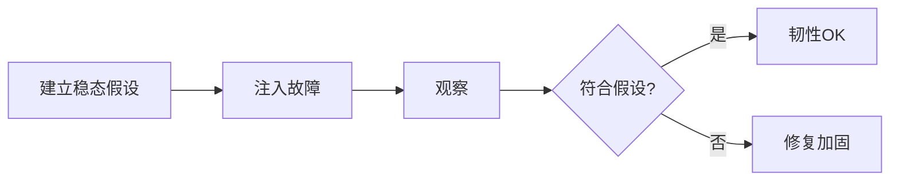

# 混沌工程实战

> 系统的韧性不能在故障时才验证。混沌工程主动注入故障（杀节点、断网络、加延迟），在可控范围内暴露薄弱点，验证系统的"失败预案"是否真的有效。它是主动可靠性工程，而非破坏。

## 1. 方法论

- **稳态假设**：正常时关键指标（如错误率<1%）应稳定。
- **注入**：小范围、可控、可终止。
- **观察**：对比注入前后稳态。
- **加固**：发现弱点就修，闭环。

## 2. 常见故障注入

| 类型 | 示例 |
| --- | --- |
| 实例 | 杀 Pod / 进程 |
| 网络 | 延迟、丢包、分区 |
| 资源 | CPU/内存打满 |
| 依赖 | 下游超时、错误 |

## 3. 落地要点

- **生产环境做**（或高仿真预发），否则发现不了真问题。
- **小爆炸半径**：先单实例、单可用区。
- **自动终止**：异常超阈值自动停止实验。
- **红蓝对抗**：定期演练，形成肌肉记忆。

## 4. 常见坑

| 坑 | 现象 | 对策 |
| --- | --- | --- |
| 范围失控 | 全站受影响 | 小半径 + 自动停 |
| 只在测试 | 发现不了 | 上生产 |
| 无假设 | 不知是否成功 | 先定稳态 |
| 不闭环 | 反复出 | 修后再验 |
| 吓到人 | 恐慌 | 知会 + 演练 |

## 5. 面试题

1. 混沌工程目的是什么？
2. 为什么要在生产做？
3. 如何控制爆炸半径？
4. 稳态假设如何定义？
5. 实验结果如何闭环？

## 6. 小结

混沌工程 = 假设 + 受控注入 + 观察 + 闭环加固。核心是"主动暴露弱点、在小爆炸半径内把韧性验证变成日常"。
