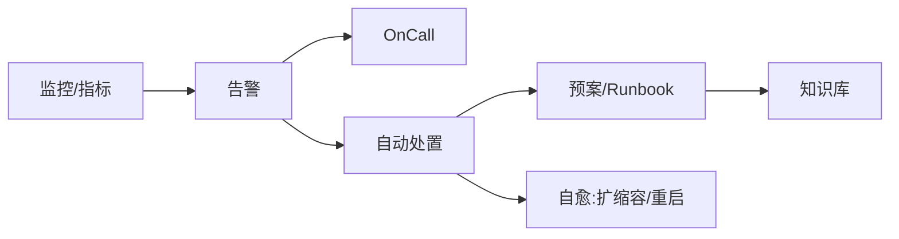

# 自动化 SRE 工具链实战

> SRE 的精髓是"用软件工程解决运维问题"。自动化工具链把日常巡检、容量、发布、故障处置从手工变成自愈，把人从重复劳动中解放出来，专注于可靠性工程本身。

## 1. 工具链全景



## 2. 核心能力

| 能力 | 工具关注 |
| --- | --- |
| 巡检 | 定时健康检查、配置漂移检测 |
| 容量 | 自动扩缩容、预测 |
| 发布 | 自动灰度、回滚 |
| 故障处置 | 预案编排、自动执行 |
| 报告 | 事故复盘、SLO 看板 |

## 3. 自愈示例

```yaml
# 自动扩缩容（概念）
apiVersion: autoscaling/v2
kind: HorizontalPodAutoscaler
spec:
  scaleTargetRef: {kind: Deployment, name: api}
  minReplicas: 3
  maxReplicas: 20
  metrics:
    - type: Resource
      resource: {name: cpu, target: {type: Utilization, averageUtilization: 70}}
```

- 告警触发 Runbook 自动执行（如重启、切流）。
- 处置结果回写工单，人工可干预。
- 所有自动动作留审计日志。

## 4. 自动化边界

- **可预测、低风险**动作可全自动（扩缩容、重启）。
- **高风险**动作需人确认（数据删除、切主）。
- 任何自动处置都要可回退、可观测。

## 5. 常见坑

| 坑 | 现象 | 对策 |
| --- | --- | --- |
| 自动化误伤 | 误删 | 二次确认 |
| 循环触发 | 反复扩缩 | 冷却 + 阈值滞回 |
| 黑盒 | 不知做了啥 | 审计 + 通知 |
| 依赖脆弱 | 工具挂了 | 降级手动 |
| 过度自动化 | 掩盖根因 | 复盘优先 |

## 6. 面试题

1. SRE 自动化优先级怎么定？
2. 哪些动作适合全自动？
3. 自动扩缩容如何防抖动？
4. 自动化误伤如何防护？
5. 自动处置如何可观测？

## 7. 小结

自动化 SRE = 监控驱动 + Runbook 编排 + 自愈 + 审计。核心是"低风险自动、高风险确认"，用自动化放大人的判断力而非替代它。
