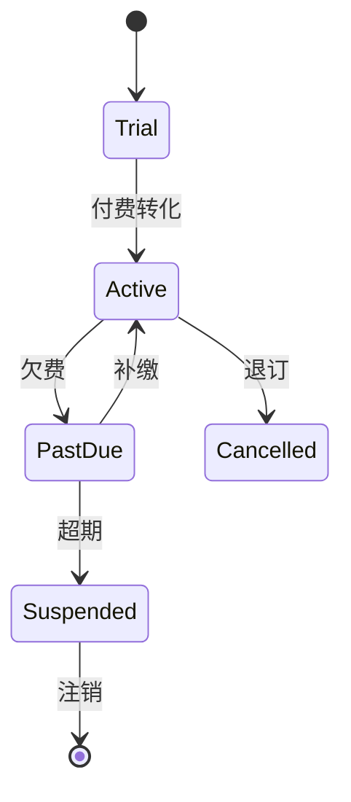

# B2B SaaS 计费业务模型

> B2B SaaS 面向企业客户，其计费比 C 端复杂得多：席位、用量、阶梯、订阅、合同账期。本文梳理其计量计费结构与系统实现。

## 1. 计费维度

| 维度 | 说明 |
| --- | --- |
| 订阅费 | 按月/年固定订阅（包版） |
| 席位费 | 按用户数（seat）计费 |
| 用量费 | API 调用、存储、流量等计量 |
| 阶梯价 | 用量越大单价越低 |
| 增值模块 | 单独付费功能包 |

## 2. 计费流程


1. **计量（Metering）**：埋点采集用量（调用次数、用户数、存储）。
2. **聚合**：按月/账期汇总。
3. **计费（Rating）**：套用价格表（阶梯、折扣、合同价）。
4. **出账**：生成账单，支持账期（Net 30）。
5. **收款/对账**：对接企业支付、合同账期。

## 3. 价格模型示例

```
基础版: ￥999/月, 含 10 席位 + 10万次API
超出席位: ￥80/席位/月
超出API: 阶梯
  10万~50万: ￥0.005/次
  50万~200万: ￥0.003/次
  200万+: ￥0.002/次
```

## 4. 技术挑战

- **计量准确性**：用量事件不丢不重，幂等采集。
- **计费可解释**：客户质疑时能追溯每项费用明细。
- **价格灵活性**：支持合同定制价、临时调价、促销。
- **账期与对账**：企业账期、部分付款、开票合规。
- **升降级**： mid-cycle 升降级如何按比例计费（proration）。

## 5. 订阅生命周期



## 6. 常见坑

| 坑 | 风险 | 对策 |
| --- | --- | --- |
| 计量丢失 | 少收 | 可靠采集+对账 |
| 计费争议 | 客诉 | 明细可追溯 |
| 升降级错账 | 纠纷 | proration 规则明确 |
| 账期混乱 | 坏账 | 合同+财务系统对接 |

## 7. 面试题（业务侧）

1. B2B SaaS 有哪些计费维度？
2. 用量计费如何保证准确？
3. 升降级如何按比例计费？
4. 企业账期如何对接？

## 8. 小结

B2B SaaS 计费 = 多维计量 + 灵活费率 + 账期对账。准确性与可解释性是客户信任基础，价格引擎需支持合同级定制。
