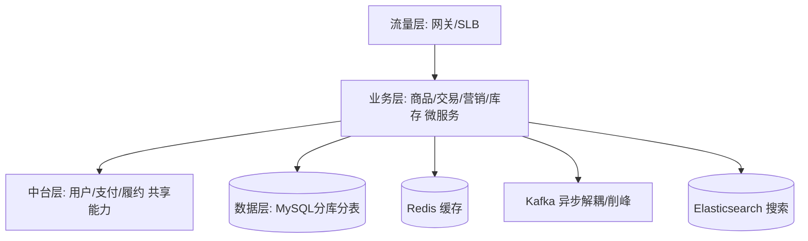
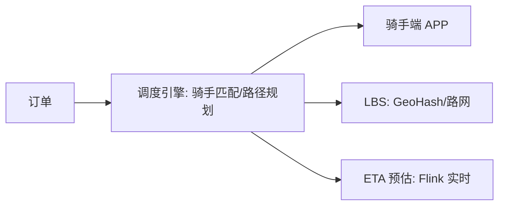
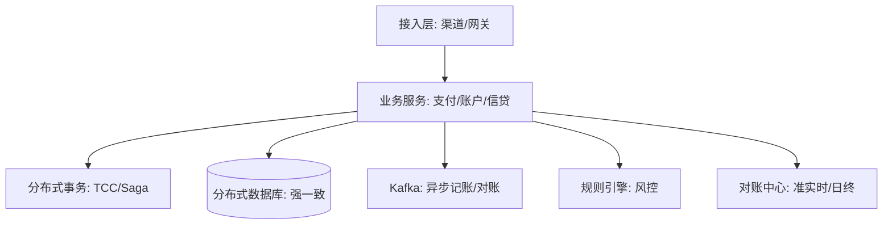
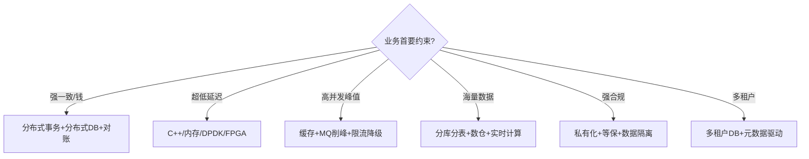

# 业务模型总览

> 后端工程师的价值，一半在"技术"，一半在"懂业务"。同一套技术（Spring Cloud、MySQL、Kafka、Redis）落到不同行业，要解决的问题、系统划分、架构取舍、技术栈侧重**完全不同**。
>
> 本文做一件事：**把市面上常见行业，按"行业 → 业务 → 系统 → 架构 → 技术栈"逐层拆解，形成一份可查阅的完整分类**。先给全景总表，再逐个行业梳理，最后归纳跨行业共性技术栈与选型指南。
>
> 深扒示例见「[电商业务模型](电商业务模型.md)」「[金融业务模型](金融业务模型.md)」「[储能业务模型](储能业务模型.md)」；架构与高并发设计见「[架构](../架构)」「[场景设计](../场景设计)」，领域建模见「[DDD](../DDD)」。

---

## 一、行业全景总分类

| 行业 | 核心业务 | 代表性系统 | 架构主特征 | 典型技术栈 |
|------|----------|------------|------------|------------|
| 电商/零售 | 交易、营销、履约 | 商品/订单/购物车/营销/库存/支付/搜索推荐 | 高并发、分布式事务、中台 | Spring Cloud、Redis、ES、Kafka、Seata |
| 本地生活/外卖 | 到店/到家、调度 | 商家/骑手调度/派单/LBS/营销 | 实时调度、LBS、峰值 | GeoHash、Redis、Kafka、Flink |
| 出行/打车 | 供需匹配、行程 | 派单/地图/计价/司机端/风控 | 低延迟匹配、LBS、实时 | 地图引擎、Redis、Kafka、调度算法 |
| 物流/供应链 | 仓储、运输、履约 | OMS/WMS/TMS/轨迹/清关 | 海量单据、链路追踪 | MySQL分库、Kafka、Flink、GIS |
| 金融/银行 | 存贷、支付清算 | 核心银行/支付/账务/信贷/风控 | 强一致、高可用、对账 | 分布式数据库、消息队列、规则引擎 |
| 保险 | 投保、核保、理赔 | 保单/承保/理赔/精算/收付 | 长周期、合规、影像 | 工作流、规则引擎、对象存储 |
| 证券/基金/交易 | 行情、撮合、结算 | 行情/交易/清结算/风控 | 超低延迟、高吞吐 | C++/低延迟、内存库、FPGA、Kafka |
| 内容/短视频/直播 | 生产、分发、消费 | 生产/审核/推荐/播放/CDN/弹幕 | 海量存储、推荐、带宽 | 对象存储、CDN、Flink、推荐系统 |
| 社交/IM | 关系、消息、互动 | 好友/消息/动态/推送/社群 | 长连接、高并发读 | 长连接网关、Redis、写扩散/读扩散 |
| 游戏 | 对战、社交、付费 | 登录/匹配/战斗/支付/运营 | 状态同步、低延迟 | 自研引擎、Redis、消息推送 |
| 在线教育 | 教学、运营 | 课程/直播/作业/考试/营销 | 直播低延迟、高并发 | 直播CDN、RTC、MySQL、Redis |
| 医疗健康 | 诊疗、医保、管理 | HIS/EMR/PACS/医保/互联网医院 | 合规、数据隔离、影像 | 私有云、对象存储、工作流 |
| 企业服务/SaaS | 协同、管理 | ERP/CRM/HR/OA/审批流 | 多租户、可配置、集成 | 多租户DB、工作流引擎、OpenAPI |
| 广告/营销 | 投放、竞价、归因 | DSP/SSP/ADX/DMP/归因 | 高并发竞价、实时 | Flink、Redis、KV存储、实时计算 |
| 制造/工业互联网 | 生产、设备、数字孪生 | MES/ERP/SCADA/数字孪生 | 边缘、时序、OT/IT融合 | 时序库、MQTT、边缘计算、Kafka |
| 储能（电化学） | 充放电套利、调频、备电 | BMS/PCS/EMS/SCADA/交易/VPP | 强实时控制、海量时序、安全 | 时序库、MQTT、Flink、优化求解器 |

---

## 二、按行业逐项梳理

### 2.1 电商 / 零售

**业务特征**：流量大、峰值高（大促）、交易链路长、强一致性要求（钱/库存）。

**核心价值链**：`逛（搜索推荐）→ 加购 → 下单 → 支付 → 履约（发货/退货）→ 售后`。

**核心系统**
| 系统 | 职责 |
|------|------|
| 商品中心 | SPU/SKU、类目、属性、价格 |
| 购物车 | 暂存、合并、促销计算 |
| 订单中心 | 下单、状态机、拆单 |
| 营销中心 | 优惠券、满减、秒杀、拼团 |
| 库存中心 | 库存扣减、预占、回滚 |
| 支付中心 | 收银台、渠道、对账 |
| 履约/仓储 | 发货、物流跟踪、退货 |
| 搜索推荐 | 商品检索、个性化推荐 |
| 会员/用户 | 账号、等级、积分 |

**典型架构**（中台化 + 微服务）

**技术栈**
| 技术 | 用途 |
|------|------|
| Spring Cloud / Dubbo | 微服务 |
| Redis | 缓存、库存扣减、购物车 |
| MySQL（分库分表） | 订单/商品主存 |
| Elasticsearch | 商品搜索 |
| Kafka / RocketMQ | 异步化、削峰、binlog 同步 |
| Seata | 分布式事务（下单-扣库存-扣款） |
| 对象存储 OSS | 商品图片 |

**关键挑战**：超卖（库存一致性）、分布式事务、大促峰值（热点账户/缓存击穿）、搜索推荐实时性。深扒见「[电商业务模型](电商业务模型.md)」。

---

### 2.2 本地生活 / 外卖

**业务特征**：实时性极强（下单到送达 30 分钟内）、供需时空匹配、强 LBS。

**核心系统**：商家系统、用户端、骑手端、调度/派单系统、LBS 地理服务、营销、客服。

**典型架构**：核心是**实时调度系统**——将"订单"匹配"附近骑手"，考虑距离、载具、负载、路况。

**技术栈**：GeoHash/Redis Geo（地理索引）、Flink（实时 ETA/热力）、Kafka（订单事件）、路径规划（高德/自研）、Redis（骑手在线状态）。

---

### 2.3 出行 / 打车

**业务特征**：比外卖更强调**低延迟供需匹配**与**全局运力调度**。

**核心系统**：乘客端、司机端、派单引擎、地图/路网、计价、风控（刷单识别）、账单。

**技术栈**：地图引擎（高德/百度）、Redis（司机位置实时）、Kafka（轨迹流）、实时计算（Flink 做热力/ETA）、调度算法（强化学习/运筹优化）。峰值可达百万级并发在线。

---

### 2.4 物流 / 供应链

**业务特征**：单据海量、链路长（揽收→中转→派送→签收）、跨系统协同。

**核心系统**：OMS（订单）、WMS（仓储）、TMS（运输）、轨迹追踪、清关（跨境）、计费结算。

**技术栈**：MySQL 分库分表（单据）、Kafka（状态流转事件）、Flink（实时轨迹/时效预测）、GIS（路由）、Elasticsearch（运单查询）。挑战在**全链路状态一致性**与**海量运单检索**。

---

### 2.5 金融 / 银行

**业务特征**：**强一致性、高可用、不可丢、可审计、强合规**。钱相关的系统容不得半点不一致。

**核心系统**
| 系统 | 职责 |
|------|------|
| 核心 banking | 账户、存取、记账 |
| 支付清算 | 跨行/三方支付、清算对账 |
| 信贷 | 授信、放款、还款 |
| 风控 | 实时反欺诈、信用评分 |
| 账务/总账 | 复式记账、日终结算 |
| 理财/财富 | 产品、申购赎回 |

**典型架构**（两地三中心 + 分布式）

**技术栈**：分布式数据库（OceanBase/TiDB）、消息队列（RocketMQ 事务消息）、规则引擎（Drools）、Flink（实时风控）、Seata/TCC（分布式事务）、HSM（加密机）。深扒见「[金融业务模型](金融业务模型.md)」。

**关键挑战**：分布式事务与最终一致、对账、热点账户（如大促红包）、容灾（RPO≈0）。

---

### 2.6 保险

**业务特征**：长周期（保单多年）、强合规、大量非结构化（影像/单证）、复杂规则（核保/理赔）。

**核心系统**：投保、核保引擎、保单管理、理赔、精算、收付、再保。

**技术栈**：工作流引擎（Activiti/Flowable，核保理赔流程）、规则引擎（核保规则）、对象存储（单证影像）、OCR（单证识别）、数仓（精算）。

---

### 2.7 证券 / 基金 / 交易

**业务特征**：**超低延迟（微秒级）、超高吞吐、撮合公平**。

**核心系统**：行情系统（推送 tick）、交易撮合引擎、清结算、风控、资管。

**技术栈**：C++/Rust（撮合核心，纳秒优化）、内存数据库/共享内存、FPGA（行情解码）、Kafka（订单流）、低延迟网络（内核旁路/DPDK）。强调**确定性延迟**而非高并发Web。

---

### 2.8 内容 / 短视频 / 直播

**业务特征**：海量 UGC、带宽成本极高、推荐驱动留存、审核合规。

**核心系统**：内容生产（上传/转码）、内容审核（机审+人审）、推荐系统、播放（CDN）、互动（弹幕/评论）、直播。

**技术栈**：对象存储（视频）、CDN（分发）、FFmpeg/转码集群、Flink（实时特征/审核）、推荐系统（召回/排序/重排）、Elasticsearch（内容检索）。挑战在**带宽成本**与**推荐实时性**。

---

### 2.9 社交 / IM

**业务特征**：关系链复杂、消息高并发、实时性（在线状态）、读扩散 vs 写扩散权衡。

**核心系统**：账号/关系链、消息服务、长连接网关、推送、动态/朋友圈、社群。

**技术栈**：长连接网关（Netty/自研，百万长连）、Redis（在线状态/消息缓存）、Kafka（消息异步落库）、写扩散/读扩散选型（大群用读扩散）。挑战在**万人群消息扇出**与**消息时序/已读**。

---

### 2.10 游戏

**业务特征**：状态同步（实时对战）、强交互、付费运营、反外挂。

**核心系统**：登录/区服、匹配、战斗服务、社交、支付/商城、运营后台、客服。

**技术栈**：自研游戏引擎/状态同步框架、Redis（缓存/排行榜）、消息推送（长连）、Kafka（日志/行为）。强调**低延迟状态同步**与**分区（区服）隔离**。

---

### 2.11 在线教育

**业务特征**：直播低延迟、课程高并发、互动（连麦/答题）、营销获客。

**核心系统**：课程/内容、直播（RTC）、作业/考试、营销、学情分析。

**技术栈**：RTC（声网/腾讯云）、直播 CDN、MySQL/Redis（选课/作业）、Flink（学情实时）、推荐（课程推荐）。挑战在**直播稳定性**与**开课峰值**。

---

### 2.12 医疗健康

**业务特征**：**严格合规（等保/数据不出院）、数据隔离、大量影像**。

**核心系统**：HIS（医院信息）、EMR（电子病历）、PACS（影像）、LIS（检验）、医保对接、互联网医院。

**技术栈**：私有云/专有云、对象存储（PACS 影像）、工作流（诊疗流程）、数据中台（科研）。强调**数据安全与合规**，多采用院内私有部署。

---

### 2.13 企业服务 / SaaS / ERP / CRM

**业务特征**：**多租户、高可配置、强集成（OpenAPI）、长流程**。

**核心系统**：ERP（进销存/财务）、CRM（客户）、HR、OA/审批流、BI。

**技术栈**：多租户数据库（行级/库级隔离）、工作流引擎（审批流）、OpenAPI/集成平台、元数据驱动（低代码配置）。挑战在**多租户资源隔离**与**可配置性**。

---

### 2.14 广告 / 营销

**业务特征**：**毫秒级竞价（RTB）、海量请求、实时归因**。

**核心系统**：DSP（需求方）、SSP（供给方）、ADX（交易所）、DMP（数据管理）、归因/反作弊。

**技术栈**：Flink（实时竞价/特征）、Redis/KV（用户画像）、实时计算（低延迟检索）、对象存储（素材）。挑战在**竞价延迟（<100ms）**与**归因准确性**。

---

### 2.15 制造 / 工业互联网

**业务特征**：OT（运营技术）与 IT 融合、海量设备时序数据、边缘计算。

**核心系统**：MES（制造执行）、ERP、SCADA/PLC（设备控制）、数字孪生、质量管理。

**技术栈**：时序数据库（InfluxDB/TDengine/Lindorm，见「[基础知识/时序库](../基础知识/时序库)」）、MQTT（设备接入）、边缘计算（网关）、Kafka（数据总线）、数字孪生（3D 可视化）。

---

### 2.16 储能（电化学）

**业务特征**：重资产 + 强实时 + 强政策；让"电"可时空转移，商业模式靠**多市场收益组合**（容量租赁 + 现货套利 + 辅助服务）。横跨 OT（电池/电力设备）与 IT（云平台/交易）。

**核心系统**：BMS（电池管理/ SOC·SOH/均衡）、PCS（储能变流器/双向 DC-AC/并离网）、EMS（能量管理/本地+云端调度）、SCADA/云平台（海量遥测/数字孪生/运维）、电力交易与 VPP（现货/辅助服务/虚拟电厂聚合）。

**技术栈**：时序库（TDengine/InfluxDB/Lindorm）、MQTT/EMQX、Modbus/CAN/OPC-UA/IEC104 协议接入、Kafka、Flink（实时告警）、边缘计算（低延迟闭环控制）、优化求解器（OR-Tools/Gurobi，充放电计划与套利）、数字孪生。

**关键挑战**：安全（电池热失控→消防联动，头号风险）、电池衰减/一致性（SOH 估算）、收益优化（电价预测 + 多市场组合）、海量遥测、调频亚秒级实时性、协议碎片化、政策依赖。深扒见「[储能业务模型](储能业务模型.md)」。

---

## 三、跨行业共性技术栈

无论哪个行业，后端底座高度重合：

| 层 | 通用技术 | 说明 |
|----|----------|------|
| 接入 | Nginx / API Gateway / SLB | 负载均衡、限流 |
| 服务 | Spring Cloud / Dubbo / gRPC | 微服务 |
| 缓存 | Redis / Caffeine | 多级缓存 |
| 存储 | MySQL（分库分表）/ PostgreSQL | 关系主存 |
| 检索 | Elasticsearch | 全文/商品检索 |
| 消息 | Kafka / RocketMQ | 异步、削峰、解耦 |
| 计算 | Flink / Spark | 实时/离线 |
| 对象 | OSS / S3 / MinIO | 文件/影像/视频 |
| 容器 | K8s / Docker | 部署编排 |
| 可观测 | Prometheus / Grafana / SkyWalking | 监控链路 |
| 安全 | OAuth2 / JWT / 加密机 | 认证鉴权 |

> 行业差异主要体现在：**一致性要求（金融强一致 vs 内容最终一致）、延迟要求（交易微秒 vs Web 毫秒）、数据规模（日志海量 vs 交易精确）、合规要求（医疗/金融最严）**。

## 四、技术栈选型指南

| 业务约束 | 优先技术 | 规避 |
|----------|----------|------|
| 钱/账强一致 | TCC/Saga、分布式 DB、对账 | 仅靠最终一致 |
| 大促峰值 | 预扣库存、MQ 削峰、限流 | 同步长事务 |
| 实时竞价/行情 | 内存计算、C++、DPDK | JVM GC 抖动 |
| 海量设备时序 | 时序库、MQTT、边缘 | 关系库存时序 |
| 多租户 SaaS | 行/库隔离、配置化 | 硬编码租户逻辑 |

---

## 五、与其他模块的关联

- **架构设计**：行业架构落地见「[架构](../架构)」「[场景设计](../场景设计)」（限流/熔断/缓存/分布式锁）。
- **领域建模**：把行业业务拆成系统，本质是 DDD 的「限界上下文」划分，见「[DDD](../DDD)」。
- **数据底座**：金融/证券的实时计算、物流的轨迹、制造的时序，见「[基础知识/大数据](../基础知识/大数据)」「[基础知识/时序库](../基础知识/时序库)」。
- **高并发实战**：电商秒杀、金融热点账户，见「[场景设计/生产问题排查实战](../场景设计/生产问题排查实战：常见故障与处置步骤.md)」。

> 参考：行业架构多来自公开技术博客（阿里/美团/字节/腾讯技术团队）、各公司技术白皮书；《企业 IT 架构转型之道（中台战略）》《数据密集型应用系统设计（DDIA）》对跨行业架构有系统性论述。
