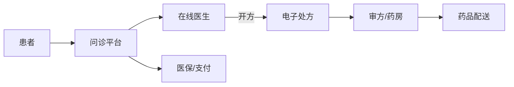
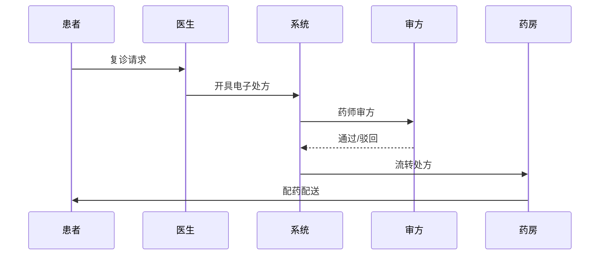

# 互联网医院业务模型

> 互联网医院是在线复诊、问诊、开方、药品配送的医疗服务形态，受严格监管。本文梳理其业务结构、核心流程、合规边界与系统挑战。

## 1. 业务全景



| 参与方 | 角色 |
| --- | --- |
| 患者 | 发起问诊、付费、收货 |
| 平台 | 撮合、合规、结算 |
| 医生 | 在线接诊、开方（需执业资质） |
| 药房/医药 | 审方、配药、配送 |
| 监管 | 卫健委、医保局 |

## 2. 核心业务边界

- **可在线**：常见病/慢性病复诊、健康咨询、处方流转、药品配送。
- **不可在线**：首诊（多数地区严禁）、急诊、需触诊的疾病。
- **处方红线**：处方药须有医师电子处方，平台不得自行售药替代诊疗。

## 3. 关键流程

### 3.1 在线问诊
1. 患者选择科室/医生，描述病情（文字/图文/视频）。
2. 医生调阅历史病历（若已授权），给出诊断建议。
3. 形成问诊记录，存档可追溯。

### 3.2 电子处方流转


## 4. 盈利模式

| 模式 | 说明 |
| --- | --- |
| 问诊服务费 | 按次/按时长收费 |
| 药品加成/配送费 | 药品供应链收益 |
| 会员/套餐 | 包年家庭医生 |
| 保险合作 | 与商保结合赔付 |
| B2B 赋能 | 向线下机构输出系统 |

## 5. 技术挑战

- **实名与资质核验**：医生执业证、患者实名、电子签名。
- **处方安全**：防篡改、可追溯（区块链存证可增强可信）。
- **隐私合规**：病历属敏感个人信息，需加密、最小化、授权访问（符合《个人信息保护法》与医疗数据规范）。
- **高并发问诊**：大流量时段弹性扩容，IM/视频链路稳定。
- **医保对接**：部分地区支持线上医保，需对接医保网关。

## 6. 合规要点

- 必须取得《互联网医院执业许可证》或与实体医疗机构合作。
- 医生须在本机构注册备案。
- 处方、问诊记录留存不少于规定年限。
- 数据与网络安全等级保护（等保）要求。

## 7. 领域模型（简化）

```
Patient(患者) 1—* Consulation(问诊) *—1 Doctor(医生)
Consulation 1—1 Prescription(处方)
Prescription *—* Medicine(药品)
Patient 1—* Order(订单) 1—* OrderItem
```

## 8. 常见坑

| 坑 | 风险 | 对策 |
| --- | --- | --- |
| 首诊违规 | 监管处罚 | 严格首诊拦截 |
| 处方篡改 | 医疗风险 | 电子签名+存证 |
| 隐私泄露 | 法律追责 | 加密+授权 |
| 医保套现 | 合规风险 | 风控+审计 |

## 9. 面试题（业务侧）

1. 互联网医院哪些业务不能在线做？
2. 电子处方流转如何保证安全合规？
3. 线上问诊与线下医疗如何衔接？
4. 互联网医院的盈利点有哪些？

## 10. 小结

互联网医院 = 合规优先的医疗服务线上化。业务边界清晰（复诊可、首诊不可），技术重点是资质核验、处方安全、隐私合规与医保对接，监管是生命线。
