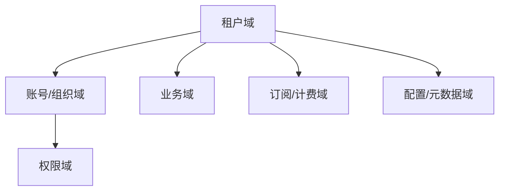
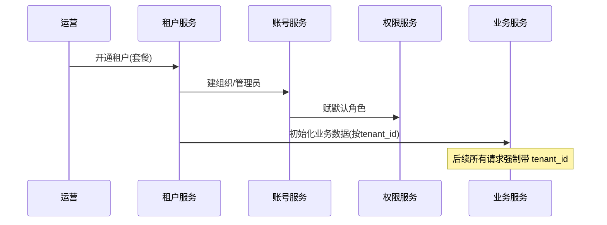

# 企业服务 / SaaS / ERP / CRM 业务模型（深扒）

> SaaS 的核心是「**一套系统服务 N 个租户**」，技术难点在**多租户隔离、计费订阅、复杂权限、可配置化**。它不求峰值极致，但求稳定、隔离、可演进。
>
> 配套总览见「[业务模型总览](业务模型总览.md)」；权限/隔离见「[架构](../架构)」「[安全工程·认证与授权体系](../安全工程/02-认证与授权体系.md)」。

---

## 一、业务全景与领域划分

| 域 | 核心职责 | 关键实体 |
|----|----------|----------|
| 租户域 | 租户开通、隔离 | 租户、租户配额 |
| 组织域 | 部门、用户、角色 | 组织、用户、部门 |
| 权限域 | RBAC/ABAC、数据范围 | 角色、权限、策略 |
| 业务域 | CRM/ERP 各自流程 | 客户、订单、工单 |
| 订阅域 | 套餐、订阅、用量 | 订阅、套餐、账单 |
| 配置域 | 字段/流程自定义 | 元数据、表单 |

---

## 二、核心系统架构

### 2.1 多租户隔离（三种粒度）
- **独立库（DB per tenant）**：隔离最强、成本高，适合大客户/强合规。
- **共享库 + 租户ID 行隔离（Schema/Row）**：成本低、需严防越权，主流 SaaS 选择。
- **共享表 + tenant_id 过滤**：所有查询强制带 `tenant_id`，由中间件统一注入。

### 2.2 权限模型
- **RBAC**：角色 → 权限，简单直观；**ABAC**：基于属性（部门/数据范围）细粒度，适合复杂组织。
- 数据权限：同角色不同人可见不同数据范围（如销售只看自己客户）。

### 2.3 订阅与计费
- 套餐（按席位/功能/用量）→ 订阅周期 → 续费/升降级 → 用量计费（API 调用、存储）。
- 计量（Metering）需准确，超额提醒与封顶。

### 2.4 可配置化（低代码趋势）
- 自定义字段、自定义表单、自定义流程，靠**元数据驱动**而非改代码。

---

## 三、关键链路：租户开通到使用

---

## 四、场景要点

| 场景 | 挑战 | 方案 |
|------|------|------|
| 租户数据越权 | 串数据事故 | 中间件统一注入 tenant_id + 行级过滤 |
| 某租户拖垮全局 | 噪声邻居 | 配额/限流/资源隔离 |
| 计费争议 | 用量不清 | 精确计量 + 账单明细 |
| 多版本并存 | 升级难 | 灰度 + 兼容窗口 |

---

## 五、技术栈详表

| 技术 | 用途 | 备注 |
|------|------|------|
| 多租户数据层 | 隔离 | DB/行级 |
| RBAC/ABAC 引擎 | 权限 | 框架 |
| 计量/计费 | 订阅 | 精确 |
| 元数据/低代码 | 配置化 | 表单引擎 |
| Kubernetes | 租户级资源隔离 | 命名空间 |
| 审计日志 | 合规 | 必做 |

---

## 六、SaaS 特有坑

- **忘记强制 tenant_id**：任一查询漏带 → 串租户严重事故，必须用统一拦截强制注入。
- **噪声邻居**：大租户吃满资源 → 配额 + 限流 + 独立库分级。
- **权限过于粗**：无法表达「只看自己客户」→ ABAC 数据范围。
- **计费计量不准**：超用未察觉 → 实时计量 + 告警。
- **升级破坏性**：多租户版本不一致 → 灰度 + 兼容期。

> 口诀：**"SaaS 一条线：租户隔离严，tenant_id 必带；权限分两层，计费要计量，配置靠元数据，升级走灰度。"**
