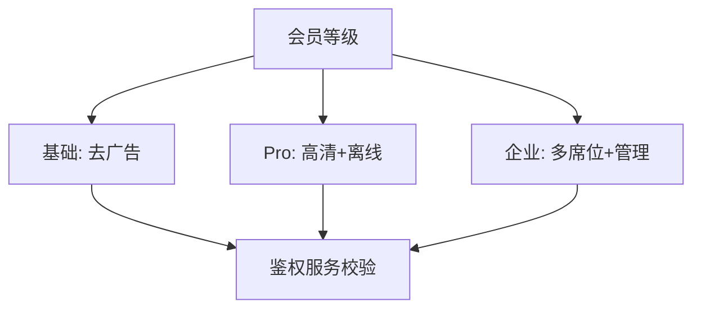

# 会员与订阅业务模型

> 板块：业务模型 　|　 返回：[README](README.md)
> 适用：视频/音乐/工具/SaaS 的会员订阅、连续包月、权益体系。

订阅制把"一次交易"变成"持续关系"，核心价值是**可预测的经常性收入（MRR）与高 LTV**。难点在权益设计、周期性计费、续费留存与合规。

## 一、订阅模式

| 模式 | 说明 | 例子 |
|------|------|------|
| 连续包月/包年 | 自动续费，可取消 | 视频/音乐会员 |
| 单月/单年 | 到期不自动续 | 部分工具 |
| 阶梯订阅 | 多档权益（基础/Pro/企业） | SaaS |
| 试用转付费 | 免费试用后收费 | 大多数 SaaS |
| 权益叠加 | 基础会员 + 增值包 | 电商 PLUS |

## 二、权益体系设计

权益是订阅的"价值锚点"，需与价格匹配：

- **等级权益**：不同档位对应不同权益（如基础去广告、Pro 高清、企业多席位）。
- **权益映射表**：把会员等级映射到具体能力，系统按等级鉴权。
- **权益成本控制**：高权益（如免费配送、云空间）有成本，需算清毛利。



## 三、订阅生命周期

```
拉新(渠道/试用) → 转化(首单/首月) → 留存(持续使用) → 续费(自动扣费)
                                                            ↓ 否
                                                        流失 → 召回(优惠/触达)
```

- **拉新**：免费试用、首月优惠。
- **转化**：首单低价（如 1 元体验）。
- **留存**：持续价值交付（内容/功能更新）。
- **续费**：到期前提醒 + 自动扣费。
- **流失召回**：沉默用户定向优惠。

## 四、周期性计费

- **扣费流程**：到期前按支付方式（免密/绑卡）自动扣费，失败重试。
- **宽限期（Grace Period）**：扣费失败给数天宽限，期间保留权益。
- **重试策略**：失败按退避重试（如 D+1, D+3, D+7），避免一次性放弃。
- **对账**：扣费流水与订单系统对账，防止多扣/漏扣。

```java
// 简化续费调度
if (subscription.isDue() && subscription.status == ACTIVE) {
    PaymentResult r = paymentClient.charge(subscription.getMethod(), subscription.getAmount());
    if (!r.success()) {
        scheduleRetry(subscription, backoffDays());  // 退避重试
    } else {
        subscription.renew();   // 延长有效期
    }
}
```

## 五、流失与召回

- **流失预警**：行为模型（活跃下降、功能少用）预测流失，提前干预。
- **召回手段**：折扣券、专属内容、客服触达。
- **NPS/满意度**：衡量权益满意度，指导迭代。

## 六、合规要点

- **自动续费明示**：必须显著告知"到期自动续费"与取消方式（监管强要求）。
- **便捷取消**：取消入口清晰，不得故意设置障碍（"幽灵订阅"投诉来源）。
- **扣费前提醒**：到期前通知，避免用户"被扣费"投诉。
- **未成年人/大额**：额外保护。

## 七、与内容付费的关系

- 订阅是"持续关系"，内容付费是"单次解锁"，常组合（如会员免费看 + 单买新课）。
- 会员权益往往包含内容付费的免费额度（见[内容付费与知识付费业务模型](内容付费与知识付费业务模型.md)）。

## 八、关键指标

| 指标 | 含义 |
|------|------|
| MRR/ARR | 月度/年度经常性收入 |
| 续费率 | 到期续费比例（核心健康度） |
| 流失率（Churn） | 取消比例 |
| 转化率 | 试用→付费 |
| LTV/CAC | 生命周期价值 / 获客成本（>3 健康） |

## 九、常见坑

1. **权益成本失控** → 高权益烧钱；权益毛利测算。
2. **自动续费不告知** → 投诉/监管；明示 + 提醒 + 易取消。
3. **扣费失败不重试** → 收入流失；退避重试 + 宽限。
4. **取消入口藏深** → 用户愤怒；便捷取消。
5. **重拉新轻留存** → 漏斗漏底；投入留存与召回。
6. **档位混乱** → 用户选择困难；少而清晰的档位。
7. **对账缺失** → 资金差错；扣费对账自动化。

## 十、延伸阅读

- [业务模型/内容付费与知识付费业务模型](内容付费与知识付费业务模型.md)
- [业务模型/企业服务SaaS业务模型](企业服务SaaS业务模型.md)
- [场景设计/计费与计量系统设计](../场景设计/计费与计量系统设计.md)
- [业务模型/支付清结算与账务模型](../业务模型/支付清结算与账务模型.md)
