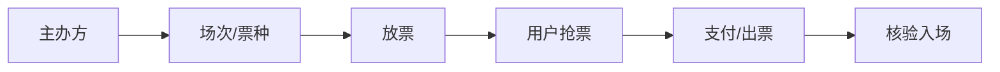

# 会展票务业务模型

> 会展/演出/赛事票务是"强时效 + 高并发 + 强风控"业务：开票瞬间流量洪峰，黄牛与渠道串货是顽疾，座位图与票种管理复杂。其命脉是**防黄牛**与**库存精确**。

## 1. 业务结构

## 2. 核心模块

| 模块 | 关键 |
| --- | --- |
| 场次管理 | 时间、场馆、座位图 |
| 票种 | 档位、价格、限购 |
| 库存 | 座位级精确占用 |
| 渠道 | 直营/分销/代理 |
| 核验 | 二维码/人脸入场 |

## 3. 防黄牛

- **实名购票**：人证票一致。
- **限购**：单用户/单证件限张数。
- **风控识别**：异常 IP/设备/行为拦截。
- **动态放票**：分批放，拉长抢购窗口。
- **转赠限制**：限制流通防止炒票。

## 4. 高并发

- 座位库存 Redis 预占，支付超时释放。
- 排队削峰，按序放票。
- 余票缓存 + 准实时。

## 5. 常见坑

| 坑 | 现象 | 对策 |
| --- | --- | --- |
| 超卖 | 座位冲突 | 座位级锁 |
| 黄牛 | 炒高 | 实名 + 限购 |
| 开闸崩 | 系统挂 | 排队削峰 |
| 串货 | 渠道乱价 | 渠道管控 |
| 假票 | 入场失败 | 加密核验 |

## 6. 面试题

1. 票务如何防超卖？
2. 黄牛防控有哪些手段？
3. 开票洪峰如何削峰？
4. 座位库存怎么精确管理？

## 7. 小结

会展票务 = 座位级库存 + 实名风控 + 削峰放票 + 加密核验。核心是"精确不出错、黄牛防得住、洪峰扛得住"。
