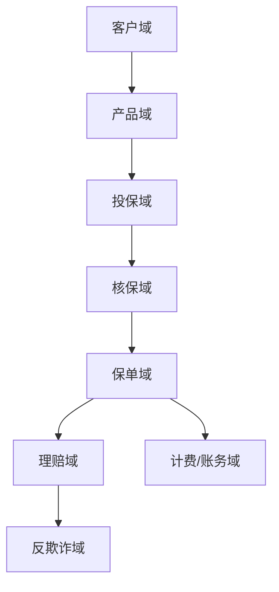
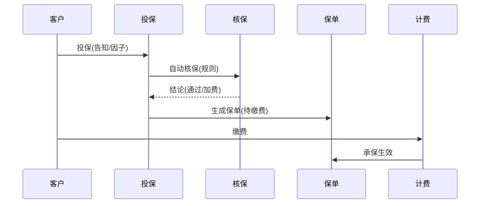

# 保险业务模型（深扒）

> 保险是金融里「**长周期、强精算、重合规**」的异类：交易不是即时买卖，而是「投保 → 核保 → 承保 → 理赔」的长链条，核心在**风险定价（精算）与反欺诈理赔**。
>
> 配套总览见「[业务模型总览](业务模型总览.md)」；金融一致/合规见「[证券基金交易](证券基金交易业务模型.md)」「[企业服务SaaS](企业服务SaaS业务模型.md)」。

---

## 一、业务全景与领域划分

| 域 | 核心职责 | 关键实体 |
|----|----------|----------|
| 客户域 | 投保人、被保人 | 客户、关系 |
| 产品域 | 险种、条款、费率 | 产品、费率表 |
| 投保域 | 录单、报价 | 投保单、报价 |
| 核保域 | 风险评估、决策 | 核保规则、结论 |
| 保单域 | 承保、变更、续期 | 保单、状态机 |
| 理赔域 | 报案、定损、赔付 | 理赔单、赔付 |
| 反欺诈 | 识别骗保 | 规则、模型 |

---

## 二、核心系统架构

### 2.1 产品与费率（精算驱动）
- 产品由**条款 + 费率表 + 责任**配置化定义，新险种尽量不硬编码。
- 费率由精算模型给出，支持因子（年龄/车型/健康）动态计算保费。

### 2.2 核保（风险把关）
- 自动核保：规则引擎（健康告知、职业、历史）实时出结论（通过/加费/拒保）。
- 人工核保：复杂件转核保员，需留痕。

### 2.3 保单生命周期
- 状态机：`投保 → 核保通过 → 已承保 → 已缴费/逾期 → 失效/退保 → 理赔/满期`。
- 长周期：续期缴费、复效、批改（变更被保人/受益人）。

### 2.4 理赔与反欺诈
- 报案 → 查勘/定损 → 理算 → 核赔 → 赔付；医疗险需单证 OCR + 审核。
- 反欺诈：识别团伙骗保、夸大损失，用关系图谱 + 行为模型。

---

## 三、关键链路：投保到承保

---

## 四、场景要点

| 场景 | 挑战 | 方案 |
|------|------|------|
| 长链路状态 | 易错乱 | 严格状态机 + 事件驱动 |
| 核保实时性 | 体验 | 规则引擎自动核 |
| 理赔欺诈 | 资损 | 图谱 + 模型前置 |
| 合规留痕 | 监管 | 全链路审计 |

---

## 五、技术栈详表

| 技术 | 用途 | 备注 |
|------|------|------|
| 规则引擎 | 核保/理赔 | 可配 |
| 精算/费率计算 | 定价 | 模型 |
| 状态机 | 保单生命周期 | 持久化 |
| 关系图谱 | 反欺诈 | 图数据库 |
| OCR / 单证 | 理赔审核 | AI |
| 审计日志 | 合规 | 必做 |

---

## 六、保险特有坑

- **状态机错乱**：长周期手动改状态 → 事件驱动 + 不可跳变校验。
- **核保规则硬编码**：新险种改代码 → 规则引擎配置化。
- **骗保漏检**：事后才发现 → 反欺诈前置 + 图谱识别团伙。
- **保单数据不一致**：缴费与承保不同步 → 事务/事件最终一致 + 对账。
- **合规缺失**：无审计 → 监管风险，全链路留痕必做。

> 口诀：**"保险长链条：产品配置化，核保规则引擎，保单状态机；理赔反欺诈，图谱先识别，合规全留痕，长周期对账。"**
