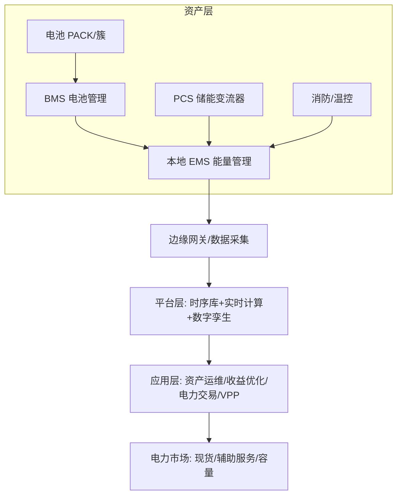
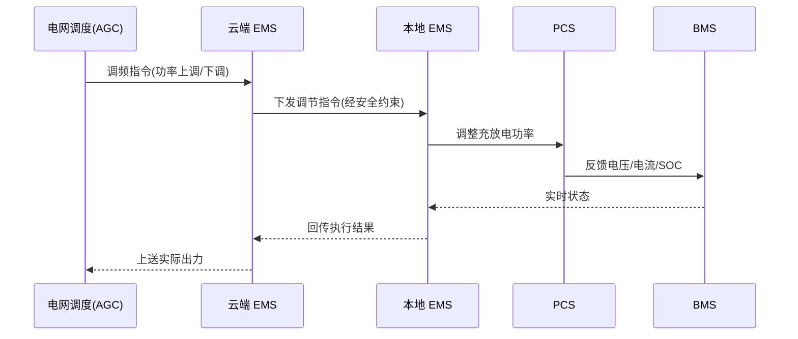
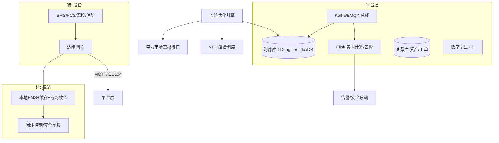

# 储能业务模型（深度完整版）

> 储能（Energy Storage，电化学为主）是能源革命的核心枢纽：让"电"从即发即用变成可时空转移的"资产"。它的软件系统横跨 **OT（电池/电力设备）与 IT（云平台/交易）**，数据上是**海量设备时序 + 强实时控制**，商业上是**多市场收益优化**——是工业互联网里最"重资产 + 强实时 + 强政策"的范本。
>
> 配套总览见「[业务模型总览](业务模型总览.md)」；时序数据底座见「[基础知识/时序库](../基础知识/时序库)」，OT/IT 融合见「[业务模型总览#二-15-制造工业互联网](业务模型总览.md)」。
>
> **政策大背景（截至 2026）**：以 136 号文（2025.2，取消强制配储）和 114 号文（2026.1，国家层面首建独立储能容量电价"底薪"）为标志，行业从"政策驱动"全面转向"市场价值驱动"，收益结构升级为 **电能量 + 辅助服务 + 容量电价** 三元。

---

## 一、行业背景与政策驱动

### 1.1 双碳定位：从"补充"到"关键支柱"

新型电力系统 = 高比例新能源 + 弱惯量 + 强波动，必须靠储能提供**灵活性调节**与**惯量/电压支撑**。官方定位已从"补充角色"上升为"新型能源体系的关键支柱/战略性新兴产业"。截至 2025.9，全国新型储能累计装机约 **1 亿 kW（100 GW）**，约为"十三五"末的 20 倍；2025–2027 专项行动方案剑指 **2027 年 1.8 亿 kW** 装机、带动约 2500 亿元直接投资。

### 1.2 政策演进：强制配储 → 市场驱动

| 时间 | 文件 | 核心变化 | 影响 |
|------|------|----------|------|
| 2025.2 | 发改价格〔2025〕136号 | 取消新能源项目**强制配储**，储能可作为独立主体参与市场 | 终结"建而不用"，逼出真实价值 |
| 2026.1 | 发改价格〔2026〕114号 | 国家层面**首建电网侧独立新型储能容量电价**（"底薪"） | 稳定收益压舱石，利好长时储能 |
| 2025–2027 | 新型储能规模化建设专项行动方案 | 推动技术多元化、独立主体入市、辅助服务扩容 | 1.8 亿 kW 目标、多元技术路线 |

**114 号文"底薪"怎么算**：容量电价水平以当地煤电容量电价为基础，按**顶峰能力**折算，折算比例最高不超过 1。公式隐含：储能既要看**功率（爆发力）**，也要看**时长（耐力，越接近高峰缺电时长越高）**。实行**清单制管理**——必须是"未参与配储的电网侧独立新型储能"且上榜，劣质/无法响应调度的产能被出清。

### 1.3 三元收益结构

```
        电能量收益  ── 现货市场低买高卖（峰谷/现货套利）
收益 =  辅助服务    ── 调频(AGC)/调峰/备用/爬坡/黑启动，按性能补偿
        容量电价    ── 114 号文"底薪"，按有效容量/顶峰能力给
        (+ 容量租赁 / 需求响应 / 绿证，视场景)
```

地方补偿样例：内蒙古放电量补偿 **0.35 元/kWh**；湖北电网侧独立储能年度容量补偿 **165 元/kW·年**；甘肃纳入可靠容量补偿基础标准 **330 元/kW·年**。预计更多省份跟进。

### 1.4 行业痛点转折

"强制配储"时代留下"建而不用、利用率偏低、产能过剩"。政策切换后，竞争标准从"装了多少"转向"有效容量 + 可用能力 + 经济效益"——**软件的可用率、调度响应、收益优化能力成为核心竞争力**。

---

## 二、储能技术路线全景

### 2.1 分类

- **电化学**：锂离子（LFP/三元）、钠离子、液流（全钒/铁铬）、铅炭、固态（示范）
- **机械**：抽水蓄能、压缩空气（CAES/LAES）、重力、飞轮
- **电磁**：超级电容、超导（短时高功率）
- **热**：熔盐储热（耦合光热）
- **氢/化学**：氢储能（电-氢-电）、合成氨

### 2.2 主流技术参数对比（2025 行业数据）

| 技术 | 能量密度 (Wh/kg) | 功率密度 | 循环寿命 | 往返效率 | 初始投资 (4h系统) | LCOS (元/kWh) | 寿命 | 适用 |
|------|------------------|----------|----------|----------|-------------------|---------------|------|------|
| 磷酸铁锂 LFP | 90–160 | 高 | 6k–10k+ 次(部分>1万) | **85–95%（最高）** | 1500–2000 元/kWh | 0.3–0.55 | 8–15年 | 2–4h 短时高频，**主流95%+** |
| 三元 NCM | 150–250 | 高 | 2k–4k 次 | 90% | 较高 | — | 较短 | 高能量密度、车储 |
| 钠离子 SIB | 130–175 | 中 | 5k–10k 次 | 85% | 2025约0.52元/Wh(↓) | 趋近锂电 | — | 4–12h、**低温-40℃保持90%**、资源广 |
| 全钒液流 VRFB | 25–50 | 中 | **1.5万–2万次** | 70–80% | 2000–2800 元/kWh(≈锂电2倍) | 全生命0.48(低于锂电0.8) | **20年+** | 长时、本征安全(水系)、功率/能量解耦 |
| 铅炭 | 30–50 | 低 | 2k–4k 次 | 80% | 低 | 中 | 中 | 备电、低速 |
| 压缩空气 CAES | 5–10 | 低 | — | 60–75% | 高(回收10–12年) | **0.28–0.42(长时优)** | **30–50年** | GW级长时、无稀缺资源、分钟级响应 |
| 抽水蓄能 | — | 高 | — | 70–85% | 高(选址受限) | **最低0.21–0.40** | **40–60年** | 长时调峰、电网级 |
| 熔盐储热 | — | — | — | — | 中 | 0.24 | — | 耦合光热电站 |
| 飞轮/超级电容 | 极低 | **极高** | 近乎无限 | 90%+ | 高 | 高 | — | 秒级高频、功率型 |
| 氢储能 | — | 低 | — | **35–45%（最低）** | 高 | 0.8 | — | 季节/跨日、长周期 |

> 数据来源综合：CQC 2025 LCA 报告、CNESA、行业测算、BNEF。锂电仍是"一超"（占新型储能 95%+），钠电/液流/压缩空气为"多强"，呈"多元互补"格局。

### 2.3 选型决策

```mermaid
flowchart TD
    Q1{放电时长?} -->|≤4h 高频调频| LFP[磷酸铁锂: 毫秒响应/效率最高]
    Q1 -->|4–12h| MID[钠离子(低温)/ 锂电长时]
    Q1 -->|≥8–12h 长时| LONG[液流/压缩空气/抽水]
    Q1 -->|秒级 功率型| PW[飞轮/超级电容]
    Q2{环境?} -->|北方严寒| NA[钠离子: -40℃保持90%]
    Q2 -->|电网侧安全敏感| VRFB[全钒液流: 本征安全]
    Q3{场景?} -->|GW级基地| CAES[压缩空气/抽水]
    Q3 -->|分布式工商储| LFP2[锂电/钠电]
```

### 2.4 混合储能趋势

"技术互补"成主流：**锂电 + 液流**（功率+能量）、**锂电 + 压缩空气**（响应+长时成本）。同一站点用功率型调频、能量型套利，提升综合 ROI。

---

## 三、商业模式与收益模型

### 3.1 三大应用侧与收益

| 应用侧 | 场景 | 核心收益模式 |
|--------|------|--------------|
| 发电侧 | 新能源（风/光）配储、火储联合 | 减少弃风弃光、跟踪计划、调频补偿 |
| 电网侧 | **独立储能**（市场主体）、电网调峰/调频/备用 | 容量租赁 + 现货套利 + 辅助服务 + **容量电价** |
| 用户侧 | 工商业削峰填谷、需量管理、光储充 | 峰谷价差套利、降需量电费、备电/增容延缓 |

### 3.2 收益来源拆解

- **容量租赁**：新能源场站/电网向独立储能租容量（配储责任转移）。
- **现货套利**：日前/日内/实时低买（充电）高卖（放电），依赖电价预测。
- **辅助服务**：调频（AGC，按 Kp 性能×调用量补偿，单价最高）、调峰、备用、爬坡、黑启动。
- **需求响应/需量管理**：用户侧按电网邀约削峰，或降低最大需量电费。
- **绿证/绿电**：配储提升绿电消纳与认证价值。
- **容量电价（114 号文）**：稳定"底薪"，改善回收固定成本能力。

### 3.3 电价机制要点

- **分时电价**：峰/平/谷 + 尖峰（夏冬高峰） + 深谷（风光大发时段），价差即套利空间。
- **两部制电价**：基本电价（按容量/需量）+ 电度电价，储能降需量直接省钱。
- **现货市场出清价**：节点边际电价（LMP）波动大，价差高则套利收益高但风险大。

### 3.4 经济性测算（核心指标）

- **LCOS（平准化度电成本）**：全生命周期总成本 / 总放电量。受循环寿命、DoD、衰减、效率、利率影响。锂电全生命 LCOS 约 0.3–0.55 元/kWh；液流靠长寿命可压到 0.48。
- **IRR / 回收期**：现金流 = 各市场收益 − 运维 − 电池更换。电池占初始投资 60%+，是敏感性最大项。
- **敏感性**：电价差↓、循环寿命↓、PCS 故障停机↑、衰减↑ 都会显著拉低 IRR。

> 简化测算直觉：`年收益 ≈ 可用容量 × 日循环次数 × 价差 × 年天数 × 可用率`；`回收期 ≈ 初始投资 / 年净收益`。做投资决策必须叠加**多市场组合 + 政策不确定性**情景。

### 3.5 共享储能 / 独立储能

独立储能 = 拥有独立市场主体身份、独立计量/控制/核算，直接听调度。共享储能 = 一份容量服务多个新能源业主，提升利用率。**清单制 + 容量电价**下，独立储能成为最优选型。

---

## 四、业务全景与领域划分



| 域 | 核心职责 | 关键实体 |
|----|----------|----------|
| 资产域 | 电池、BMS、PCS、温控、消防 | 电池簇、PACK、电芯 |
| 采集域 | 遥测采集、协议转换、边缘控制 | 网关、RTU、SCADA 点表 |
| 运维域 | 告警、巡检、工单、安全 | 告警、工单、消防事件 |
| 交易域 | 现货/辅助服务申报、结算 | 申报单、结算单、账单 |
| 优化域 | 充放电计划、套利、调度 | 调度计划、收益模型 |
| 聚合域（VPP） | 虚拟电厂聚合分布式资源 | 聚合体、可调容量 |

---

## 五、核心系统架构（深度）

### 5.1 BMS（电池管理系统）深度

- **三层架构**：电芯级采集板（电压/温度采样）→ 模组/簇级 BMU → 总控 BCU（簇均衡、总压总流、对外通信）。
- **采样**：AFE 模拟前端，电压精度 ±2mV 级、温度 NTC、霍尔/分流器电流；采样延迟与同步性直接影响 SOC/SOH 精度。
- **SOC（荷电状态）估算**：
  - 安时积分（简单但有累积误差）
  - OCV（开路电压查表，需静置）
  - **EKF/UKF 卡尔曼滤波**（融合模型+噪声，工程主流）
  - 数据驱动（神经网络，需大量数据）
- **SOH（健康状态）**：容量衰减（可用容量 vs 额定）、内阻增长；方法含循环计数、模型法、数据驱动。估算不准 → 可用容量虚高 → 实际收益缩水。
- **SOP（功率状态）**：当前可充/可放最大功率，受 SOC/温度/内阻约束，是实时调度边界。
- **均衡**：
  - 被动均衡（电阻耗散，简单便宜，能量浪费）
  - 主动均衡（电容/电感/变压器转移，效率高，拓扑复杂）
- **热管理**：风冷（便宜）vs 液冷（均温好、适配大倍率），抑制热失控与衰减。
- **热失控预警（头号安全）**：多特征融合——温升速率(dT/dt)、特征气体（CO/H₂/VOC）、单体压差、壳体形变；早期探测比灭火更关键。
- **故障诊断**：内短路检测（自放电率）、绝缘检测（直流侧漏电流）、接触器粘连。
- **安全保护**：过充/过放/过温/过流/短路硬件+软件双重保护，越限即闭锁。

### 5.2 PCS（储能变流器）深度

- **拓扑**：两电平 / 三电平（效率/谐波权衡）、隔离/非隔离、集中式（大单机）/组串式（一簇一机，避免簇间环流）。
- **跟网型 vs 构网型（2025 关键分水岭）**：

| 维度 | 跟网型 Grid-Following | 构网型 Grid-Forming |
|------|----------------------|---------------------|
| 控制本质 | 受控**电流源**（PLL 锁相） | 稳定**电压源**（VSG/下垂/虚拟惯量） |
| 电网依赖 | 强依赖，无网不能运行 | 可离网/孤岛，自建电压频率 |
| 电网支撑 | 无惯量/电压支撑能力 | 提供惯量、电压、短路容量支撑 |
| 黑启动 | 不支持 | 支持 |
| 弱网/离网 | 性能退化甚至脱网 | 强韧性 |
| 成本 | 低（比构网型低 10–20%） | 高（高 15–30%，IGBT/算法门槛） |
| 适用 | 强网、纯并网套利 | 弱网、微网、高比例新能源、关键负荷 |

> **趋势**：混合架构——构网型建网 + 跟网型调能量，由 EMS 统一协调（经济性与稳定性兼得）。2025 中电联统计 **PCS 首次超越电池成为非计划停运第一大原因**，PCS 可靠性成为焦点。

- **并网控制模式**：PQ（定功率）、VF（定压频，离网/构网）、下垂（多机并联分担）。
- **LVRT/HVRT**：低/高电压穿越，电网故障时不脱网、提供无功支撑。
- **并离网无缝切换 / 黑启动**：离网带载、电网恢复后并回，关键负荷零中断。
- **谐波治理**：并网电流 THD 合规（如 <3%），主动滤波。
- **效率**：拓扑+控制优化，系统效率目标 98%+。

### 5.3 EMS（能量管理系统）深度

- **本地 EMS**：站级控制，执行充放电指令、与 BMS/PCS 联动、安全闭锁，控制周期秒级。
- **云端 EMS**：接收优化策略、下发调度计划、参与市场交易、资产全景监控。
- **控制架构**：集中式（单点决策）/ 分布式（多机自治）/ 分层（云策略→边执行）。
- **调度算法**：
  - 规则策略（阈值/时间表，简单）
  - **动态规划 DP**（多时段最优，可解小规模）
  - **MPC 模型预测控制**（滚动优化，应对预测误差，工程主流）
  - **强化学习 RL**（应对高维不确定市场，前沿）
- **安全约束**：SOC 上下限、功率上下限、温度、电气闭锁——任何优化都不能越限。
- **防逆流 / 需量控制**：用户侧防止倒送、压最大需量。

### 5.4 安全与消防系统（重点）

- **热失控机理**：内短路 → 温升 → SEI 膜分解 → 隔膜熔毁 → 正负极直接接触 → 链式放热 → 蔓延（"多米诺"）。单颗电芯失控可引爆整舱。
- **预警（优于灭火）**：多传感器融合——温度/温升率、CO/H₂/VOC 特征气体、烟雾、单体电压异常；早期（气体阶段）即告警隔离。
- **消防技术**：气溶胶、全氟己酮（Clean Agent）、细水雾、PACK 级/舱级探测；前沿**浸没式**（电芯泡在不燃冷却液）本征防火。
- **安全设计**：防爆阀、泄压通道、隔热阻燃材料、舱级物理隔离、事故排风。
- **标准合规**：GB 51048（电化学储能电站设计）、GB/T 36276（电池）、NB/T 相关、NFPA 855（美）、UL 9540A（热失控蔓延测试）、电力行业 202 号文通信协议。

### 5.5 监控与云平台

- **SCADA**：点表可达数十万点/站（电压/电流/温度/SOC/功率/开关量）。
- **数字孪生**：站级 3D 可视化、热分布、拓扑，辅助运维/培训；进阶做**电池电热耦合模型**做 SOH 预测与热风险仿真。
- **资产运维**：告警分级、工单流转、消防联动（早期探测→舱级隔离→灭火）。

### 5.6 电力交易与 VPP

- **现货**：日前/日内/实时电价，低买高卖，依赖电价预测。
- **辅助服务**：调频（AGC）、调峰、备用、黑启动。
- **VPP 虚拟电厂**：聚合储能+光伏+柔性负荷成"一个电厂"参与市场，核心是**聚合调度 + 可调节能力建模 + 偏差考核**。

---

## 六、电力市场深度

### 6.1 市场架构

中国电力市场 = **中长期（锁量稳价）+ 现货（日前/日内/实时）+ 辅助服务 + 容量 + 绿证**。储能作为独立主体可参与电能量与辅助服务。

### 6.2 现货市场

- **日前市场**：D-1 申报，出清次日 24 段电价（节点边际电价 LMP = 电能+阻塞+网损分量）。
- **日内/实时**：滚动修正，价格波动最大。
- **套利逻辑**：日前低价段充电、高价段放电；叠加实时偏差调整。

### 6.3 辅助服务市场

- **调频 AGC**：最赚钱。按 **Kp（综合性能）= K1(速率)×K2(精度)×K3(响应时间)** 考核，性能越高补偿越多；要求秒级/亚秒级跟踪。
- **调峰/备用/爬坡/惯量**：随市场建设扩容，转动惯量品种利好构网型储能。

### 6.4 容量市场 / 容量补偿

114 号文建立独立储能容量电价，按有效顶峰容量给"底薪"，改善固定成本回收，利好长时。

### 6.5 绿电绿证

配储提升新能源消纳与绿电占比，绿证变现。

### 6.6 VPP 结算

聚合资源统一申报，按实际可调量结算，偏差考核惩罚——考验聚合调度与预测精度。

---

## 七、优化调度算法

### 7.1 套利优化（MILP）

目标：在 SOC 上下限、功率上下限、市场规则约束下，最大化日收益（峰谷价差 + 辅助服务 + 容量）。

变量：各时段充电功率 c_t、放电功率 d_t（0–1 整数标记是否充/放，避免同时）。

```
max Σ_t [ price_sell(t)·d_t·η_dis − price_buy(t)·c_t/η_ch ]·Δt
s.t.  SOC_t = SOC_{t-1} + (c_t·η_ch − d_t/η_dis)·Δt/Cap
      SOC_min ≤ SOC_t ≤ SOC_max
      0 ≤ c_t ≤ C_max,  0 ≤ d_t ≤ D_max
      c_t · d_t = 0  (互斥)
```

### 7.2 调频竞标

按 Kp 性能建模：申报可调容量 × Kp × 调用时长 × 出清价。需权衡"留容量调频"vs"用来套利"的机会成本。

### 7.3 不确定性优化

电价/负荷/光伏预测有误差 → 用**鲁棒优化**（最差情形）/ **随机优化**（场景树）/ **MPC 滚动**应对，避免计划落空被考核。

### 7.4 强化学习

高维状态（电价、SOC、天气、市场）下，RL 学策略近似最优，但需大量仿真+安全约束（不能越限、不能冒险）。

### 7.5 代码示意（套利 LP，pulp）

```python
import pulp
T = 24
price = [0.3,0.3,0.35,0.4,0.5,0.8,1.0,1.1,0.9,0.7,  # 示例24点电价
         0.6,0.55,0.6,0.7,0.9,1.1,1.2,1.0,0.8,0.6,
         0.45,0.4,0.35,0.32]
prob = pulp.LpProblem("arbitrage", pulp.LpMaximize)
c = [pulp.LpVariable(f"c{t}", 0, 1) for t in range(T)]   # 充电(归一)
d = [pulp.LpVariable(f"d{t}", 0, 1) for t in range(T)]   # 放电(归一)
soc = [pulp.LpVariable(f"soc{t}", 0.1, 0.9) for t in range(T)]
prob += pulp.lpSum([price[t]*(d[t]-c[t]) for t in range(T)])
for t in range(1, T):
    prob += soc[t] == soc[t-1] + 0.1*(c[t]-d[t])   # 简化SOC递推
for t in range(T):
    prob += c[t] + d[t] <= 1                        # 充放互斥
prob.solve()
```

---

## 八、关键链路（扩充）

### 8.1 调频（AGC）实时响应（秒级/亚秒）


要求：**响应秒级、调节精度高（Kp）、不越限（SOC/功率）**。关键控制须下沉边缘，云抖动不能拖垮调节。

### 8.2 峰谷套利优化链路

```
电价预测/出清价 → 优化求解(MILP/MPC) → 云端EMS下发计划 → 本地EMS执行 → 电池充放 → 结算实际收益 → 反馈预测
```

### 8.3 并离网无缝切换

电网正常→并网（PQ）；电网故障→本地 EMS 检测→切换 VF/构网带载→电网恢复→同期并回。关键负荷零中断。

### 8.4 需求响应 / 需量控制

用户侧按邀约削峰，或实时压最大需量（防逆流+需量预测），直接降基本电费。

### 8.5 VPP 聚合调度

多站点/多类型资源统一建模可调容量 → 市场申报 → 下发分解指令 → 偏差考核闭环。

---

## 九、数据架构与时序

### 9.1 信息模型

- **IEC 61850**（变电站/设备建模）、**CIM**（电网公共信息模型）、SCADA 点表（测点→标签→单位→告警阈值）。
- 电池层级模型：电芯→模组→PACK→簇→堆→站，逐级聚合遥测。

### 9.2 数据质量

坏点（超限）、跳变（突变）、缺失（掉线）处理：插值/前向保持/异常标记，避免污染优化与告警。

### 9.3 时序压缩与降采样

单站数十万测点、秒级采样 → 原始高压。策略：边缘预处理、有损/无损压缩、冷热分层（原始/降采样/聚合）、TDengine 超级表+标签。详见「[基础知识/时序库](../基础知识/时序库)」。

### 9.4 数字孪生（电热耦合）

电池等效电路模型 + 热模型，仿真温升/SOH 衰减/热失控传播，做预测性维护与风险预演。

---

## 十、典型部署架构（云-边-端）



| 层 | 关注点 |
|----|--------|
| 端 | 协议接入（Modbus/CAN/OPC-UA/IEC104）、采样精度 |
| 边 | 协议转换、低延迟闭环、断网自治/续传 |
| 平台 | 海量时序写入查询、实时告警、数字孪生 |
| 应用 | 收益优化、交易结算、VPP 聚合、资产全生命周期 |

---

## 十一、技术栈详表

| 技术 | 用途 | 备注 |
|------|------|------|
| 时序数据库（TDengine/InfluxDB/Lindorm） | 遥测存储查询 | 见「[基础知识/时序库](../基础知识/时序库)」 |
| MQTT / EMQX | 设备上报、命令下发 | 物联网总线 |
| Modbus / CAN / OPC-UA / IEC 104 / 61850 | 设备/电力协议接入 | 协议碎片化需适配 |
| Kafka | 遥测流、事件总线 | 高吞吐 |
| Flink | 实时特征、告警、异常检测 | 低延迟计算 |
| 边缘计算（网关/工控机） | 本地预处理、闭环控制 | 断网自治 |
| 优化求解器（OR-Tools/Gurobi/CPLEX） | 充放电计划、套利、竞价 | 运筹优化 |
| 数字孪生（Three.js/Unity） | 站级可视化/电热模型 | 3D 拓扑/热图 |
| K8s / 云原生 | 平台部署编排 | 多站多租户 |
| 等保/数据安全 | 合规、隔离 | 电力强合规 |

---

## 十二、运维与资产全生命周期

- **巡检**：日常（远程遥测）/ 定期（现场）/ 专项（季节性）；机器人巡检（红外/气体）降本提效。
- **故障诊断**：BMS 告警分级、内短路/绝缘/接触器故障定位、PCS 停机根因分析（2025 统计 PCS 成停运首因）。
- **梯次利用**：退役动力电池（仍余 70–80% 容量）用于低倍率备电/工商储，延长价值链。
- **回收**：磷酸铁锂回收（湿法/直接再生），锂回收率约 68%、钴镍 >90%（行业目标提升）；闭环降碳。
- **质保与保险**：循环次数/日历寿命质保、可用率 SLA；保险产品（设备险/收益险）对冲风险。

---

## 十三、行业特有坑（扩充）

- **安全（头号风险）**：热失控→舱级火灾。靠**早期多特征探测 + 舱级隔离 + 消防联动**；软件必须安全闭锁（越限即停），绝不能"为收益牺牲安全"。
- **电池衰减/一致性**：SOH 不准 → 可用容量虚高 → 收益缩水；均衡与梯次利用是长期课题。
- **收益优化难**：电价/规则地区差异大、波动大，套利依赖预测精度与多市场组合。
- **海量遥测**：单站数十万点、秒级采样 → 写入/查询/存储成本；需降采样/压缩。
- **实时性**：调频 AGC 秒级/亚秒闭环，云—边抖动拖垮性能，关键控制须下沉边缘。
- **协议碎片化**：厂商 BMS/PCS 私有协议、点表不一致 → 适配成本高；行业推标准化（202 号文等）。
- **政策依赖**：收益高度依赖电价机制/补贴/准入，规则一变模式就变（136/114 已重构逻辑）。
- **PCS 可靠性**：2025 中电联统计 PCS 首超电池成非计划停运第一因，选型和运维成焦点。

> 口诀：**"储能三件套：BMS 看电池、PCS 管充放、EMS 做调度；安全第一位，收益靠优化，时序海量实时难；政策变，模式变，独立储能领风骚。"**

---

## 十四、典型厂商与生态

| 环节 | 代表厂商 |
|------|----------|
| 电芯（锂电） | 宁德时代、比亚迪、亿纬锂能、国轩高科 |
| 钠电 | 宁德时代（钠新电池）、中科海钠 |
| 液流 | 大连融科（全球 40%+）、开封时代 |
| PCS/系统集成为主 | 阳光电源、华为、上能电气、科华数据、特变电工 |
| 压缩空气 | 中能建、华能、开山股份（核心装备） |

---

## 十五、与其他行业融合

- **光储充**：光伏 + 储能 + 充电桩，削峰填谷 + 有序充电，是用户侧热门组合。
- **源网荷储一体化**：电源-电网-负荷-储能协同，园区/大基地级优化。
- **微电网**：构网型储能做电压频率基准，支撑离网/弱网区域（牧区、海岛、数据中心）。

---

## 十六、与制造/工业互联网的异同

| 维度 | 制造工业互联网 | 储能 |
|------|----------------|------|
| 设备 | PLC/机床/产线 | BMS/PCS/电池簇 |
| 实时性 | 产线节拍（秒~分） | 调频（秒~亚秒），更苛刻 |
| 数据 | 设备工况时序 | 遥测时序 + 电力量测 |
| 商业 | 提效降本 | 多市场收益优化 |
| 合规 | 等保 | 等保 + 电力市场规则 + 安全强监管 |
| 核心难题 | OT/IT 融合、数据孤岛 | 安全 + 收益优化 + 协议碎片化 |

---

## 十七、速记要点（面试/复盘）

1. **政策转折点**：136 号文（取消强制配储）→ 114 号文（容量电价"底薪"）→ 三元收益。
2. **技术选型**：短时高频用 LFP（效率最高），长时用液流/压缩空气，低温用钠电，功率型用飞轮。
3. **PCS 分水岭**：跟网型（电流源/依赖强网/便宜）vs 构网型（电压源/可黑启动/贵 15–30%）。
4. **安全本质**：热失控链式反应，早期多特征气体探测优于灭火；标准 GB 51048 / UL 9540A。
5. **优化核心**：约束下的收益最大化（MILP/MPC），不确定性用鲁棒/随机/RL。
6. **数据底座**：海量时序 + 数据质量 + 边缘下沉 + 数字孪生电热模型。
7. **行业坑**：安全、衰减、收益预测、实时性、协议碎片化、政策、PCS 可靠性。

> 一句话总结：**储能 = 电池资产（BMS/PCS 管硬件）+ 云平台（EMS/时序/优化管调度）+ 电力市场（管赚钱），三者在"安全"与"政策"两条红线下协同。**
