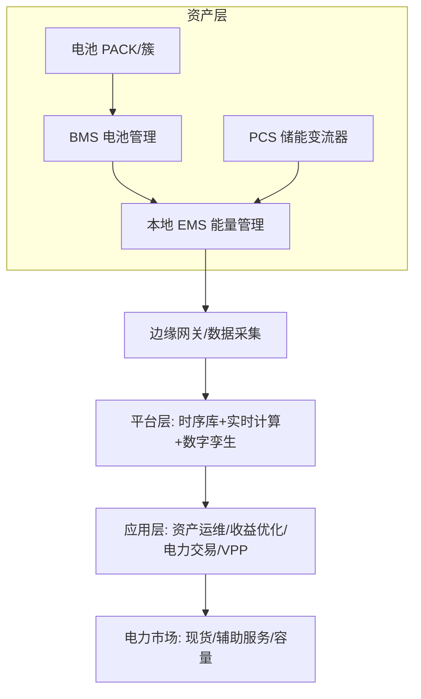
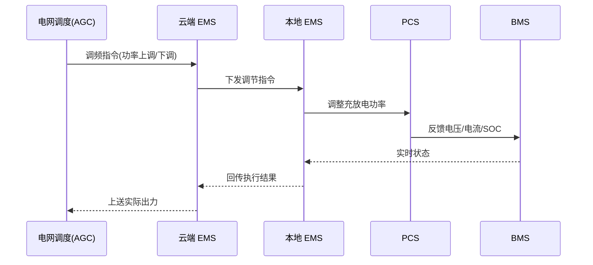
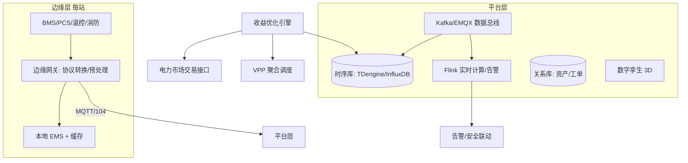

# 储能业务模型（深扒）

> 储能（Energy Storage，电化学为主）是能源革命的核心枢纽：让"电"从即发即用变成可时空转移的"资产"。它的软件系统横跨 **OT（电池/电力设备）与 IT（云平台/交易）**，数据上是**海量设备时序 + 强实时控制**，商业上是**多市场收益优化**——是工业互联网里最"重资产 + 强实时 + 强政策"的范本。
>
> 配套总览见「[业务模型总览](业务模型总览.md)」；时序数据底座见「[基础知识/时序库](../基础知识/时序库)」，OT/IT 融合见「[业务模型总览#二-15-制造工业互联网](业务模型总览.md)」。

---

## 一、业务全景与领域划分

储能按**应用侧**分三大场景，收益模式完全不同：

| 应用侧 | 场景 | 核心收益模式 |
|--------|------|--------------|
| 发电侧 | 新能源（风/光）配储、火储联合 | 减少弃风弃光、调频补偿 |
| 电网侧 | 独立储能、电网调峰/调频/备用 | 容量租赁 + 现货套利 + 辅助服务 |
| 用户侧 | 工商业削峰填谷、需量管理、光储充 | 峰谷价差套利、降需量电费、备电 |

| 域 | 核心职责 | 关键实体 |
|----|----------|----------|
| 资产域 | 电池、BMS、PCS、温控、消防 | 电池簇、PACK、电芯 |
| 采集域 | 遥测采集、协议转换、边缘控制 | 网关、RTU、SCADA 点表 |
| 运维域 | 告警、巡检、工单、安全 | 告警、工单、消防事件 |
| 交易域 | 现货/辅助服务申报、结算 | 申报单、结算单、账单 |
| 优化域 | 充放电计划、套利、调度 | 调度计划、收益模型 |
| 聚合域（VPP） | 虚拟电厂聚合分布式资源 | 聚合体、可调容量 |

---

## 二、核心系统架构

### 2.1 电池管理系统 BMS

- **三层架构**：电芯级（采集电压/温度）→ 模组/簇级（BMU）→ 总控（BCU）。
- **核心算法**：SOC（荷电状态，类似"电量 %"）、SOH（健康状态/容量衰减）、均衡（主动/被动，消除电芯一致性差异）。
- **安全职责**：过充/过放/过温/短路保护，是电池安全第一道防线。

### 2.2 储能变流器 PCS

- **双向 DC-AC**：充电（电网→电池，整流）、放电（电池→电网，逆变）。
- **并离网切换**：支持并网运行与离网（黑启动/备电）模式。
- **毫秒级响应**：这是储能做**调频**优于火电的根本——响应快、精度高。

### 2.3 能量管理系统 EMS

- **本地 EMS**：站级控制，执行充放电指令、与 BMS/PCS 联动、安全闭锁。
- **云端 EMS**：接收优化策略、下发调度计划、参与市场交易、资产全景监控。
- **闭环控制**：`云端策略 → 本地 EMS → PCS 执行 → BMS 反馈 → 回传`，控制周期通常秒级。

### 2.4 监控与云平台

- **SCADA**：采集电压/电流/温度/SOC/功率等遥测（点表可达数十万点/站）。
- **数字孪生**：站级 3D 可视化、热分布、拓扑，辅助运维与培训。
- **资产运维**：告警分级、工单流转、消防联动（早期气体/VOC 探测 → 舱级隔离 → 灭火）。

### 2.5 电力交易与 VPP

- **现货市场**：日前/日内/实时电价，低买（充电）高卖（放电）套利，依赖**电价预测**。
- **辅助服务**：调频（AGC）、调峰、备用、黑启动，按性能和调用量补偿。
- **虚拟电厂 VPP**：把分散的储能 + 光伏 + 柔性负荷聚合成"一个电厂"参与市场，核心是**聚合调度 + 可调节能力建模**。

---

## 三、关键链路

### 3.1 调频（AGC）实时响应链路

要求：**指令响应秒级、调节精度高、不越限（SOC/功率）**。

### 3.2 峰谷套利优化链路

优化本质是**约束规划**：在 SOC 上下限、功率上下限、市场规则约束下，最大化日收益（峰谷价差 + 辅助服务 + 容量租赁）。

---

## 四、典型部署架构（边缘—平台—云）

| 层 | 关注点 |
|----|--------|
| 边缘 | 协议接入（Modbus/CAN/OPC-UA/IEC104）、低延迟控制、断网续传 |
| 平台 | 海量时序写入/查询、实时告警、数字孪生 |
| 应用 | 收益优化、交易结算、VPP 聚合、资产全生命周期 |

---

## 五、技术栈详表

| 技术 | 用途 | 备注 |
|------|------|------|
| 时序数据库（TDengine/InfluxDB/Lindorm） | 遥测存储、查询 | 见「[基础知识/时序库](../基础知识/时序库)」 |
| MQTT / EMQX | 设备上报、命令下发 | 物联网总线 |
| Modbus / CAN / OPC-UA / IEC 104 | 设备/电力协议接入 | 协议碎片化需适配 |
| Kafka | 遥测流、事件总线 | 高吞吐 |
| Flink | 实时特征、告警、异常检测 | 低延迟计算 |
| 边缘计算（网关/工控机） | 本地预处理、闭环控制 | 断网自治 |
| 优化求解器（OR-Tools/Gurobi/CPLEX） | 充放电计划、套利、竞价 | 运筹优化 |
| 数字孪生（Three.js/Unity） | 站级可视化 | 3D 拓扑/热图 |
| K8s / 云原生 | 平台部署编排 | 多站多租户 |
| 等保/数据安全 | 合规、隔离 | 电力行业强合规 |

---

## 六、行业特有坑

- **安全（头号风险）**：电池热失控→舱级火灾，靠**早期探测（气体/VOC/温度）+ 舱级隔离 + 消防联动**；软件必须做安全闭锁（越限即停），不能"为收益牺牲安全"。
- **电池衰减/一致性**：SOH 估算不准 → 可用容量虚高 → 实际收益缩水；均衡策略与梯次利用（退役动力电池再利用）是长期课题。
- **收益优化难**：电价/市场规则地区差异大、波动大，套利依赖**电价预测精度**与**多市场组合**（容量租赁 + 现货 + 辅助服务）。
- **海量遥测**：单站数十万测点、秒级采样 → 时序库写入/查询压力、存储成本；需降采样/压缩。
- **实时性**：调频 AGC 要求秒级甚至亚秒级闭环，云—边网络抖动会拖垮调节性能，关键控制须**下沉到边缘**。
- **协议碎片化**：不同厂商 BMS/PCS 协议私有、点表不一致 → 接入层适配成本高，行业在推标准化（如 202 号文通信协议）。
- **政策依赖**：收益高度依赖电价机制/补贴/市场准入，规则一变商业模式就变。

> 口诀：**"储能三件套：BMS 看电池、PCS 管充放、EMS 做调度；安全第一位，收益靠优化，时序海量实时难。"**

---

## 七、与制造/工业互联网的异同

| 维度 | 制造工业互联网 | 储能 |
|------|----------------|------|
| 设备 | PLC/机床/产线 | BMS/PCS/电池簇 |
| 实时性 | 产线节拍（秒~分） | 调频（秒~亚秒），更苛刻 |
| 数据 | 设备工况时序 | 遥测时序 + 电力量测 |
| 商业 | 提效降本 | 多市场收益优化 |
| 合规 | 等保 | 等保 + 电力市场规则 + 安全强监管 |
| 核心难题 | OT/IT 融合、数据孤岛 | 安全 + 收益优化 + 协议碎片化 |
