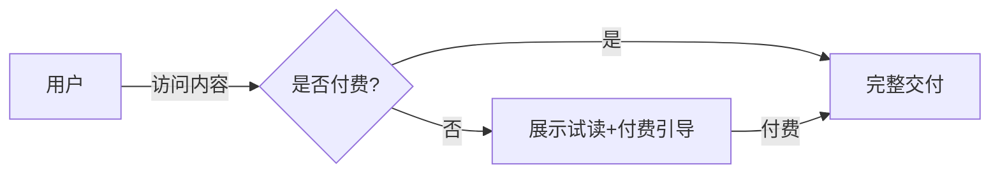

# 内容付费与知识付费业务模型

> 板块：业务模型 　|　 返回：[README](README.md)
> 适用：网文/漫画、在线课程、付费专栏、音频/直播课、咨询服务的商业化。

内容付费把"内容"变成"商品"。与电商卖实物不同，它的核心资产是**版权、创作者与用户信任**，难点在付费墙、盗版防控、创作者分成与复购。

## 一、业务全景

```
创作者(生产) → 平台(审核/加工/分发) → 用户(免费试读→付费解锁→交付)
                    ↓                        ↑
              推荐/搜索分发             付费/续费/复购
                    ↓
              结算(平台与创作者分成)
```

| 模块 | 核心职责 |
|------|----------|
| 内容生产 | 创作者上传、编辑、版本管理 |
| 内容治理 | 审核（版权/合规/质量）、分类打标 |
| 分发 | 推荐、搜索、运营位、社媒引流 |
| 交易 | 付费墙、下单、支付、退款 |
| 交付 | 在线阅读/播放、下载、证书 |
| 结算 | 创作者分成、税务、对账单 |

## 二、商业模式

| 模式 | 说明 | 适用 |
|------|------|------|
| 单次购买 | 单课程/单本买断 | 标准化内容 |
| 订阅 | 会员期内畅读/畅看 | 内容持续更新（网文/专栏） |
| 打赏/赞助 | 用户自愿付费 | 直播/社区/创作者经济 |
| 训练营/服务 | 内容+服务（答疑/作业） | 高客单价知识付费 |
| 广告+免费 | 免费看、广告变现 | 流量大、单价低 |

> 趋势：从"卖一次"走向"订阅+服务"，提升 LTV（用户生命周期价值）。

## 三、付费墙设计

付费墙是内容付费的关键转化环节：

- **试读/试看**：前 N 章/前 3 分钟免费，降低决策门槛。
- **解锁方式**：单篇购买、会员解锁、章节解锁。
- **DRM 与防盗**：视频加密（HLS + 令牌）、文字水印、截图溯源防搬运。
- **权益映射**：会员等级对应不同解锁范围（见[会员与订阅业务模型](会员与订阅业务模型.md)）。



## 四、转化漏斗与营销

```
免费流量 → 试读/试看 → 加购/下单 → 支付 → 复购/续费
  100%        40%          15%         12%      3%（月复购）
```

- **免费→付费**：靠试读质量与价格锚点（原价划线）。
- **首单→复购**：会员权益、连续包月优惠、内容更新节奏。
- **流失召回**：Push/短信/优惠券，针对沉默用户。

## 五、创作者生态与分成

- **分成比例**：平台与创作者按比例（如 5:5、7:3），头部可谈。
- **结算周期**：T+月/季度，含对账与税务。
- **创作者工具**：数据看板（阅读/转化/收入）、粉丝运营、带货。
- **激励**：签约、流量扶持、保底。

## 六、版权与合规

- **版权确权**：原创声明、权属证明，避免侵权下架。
- **内容合规**：涉政/色情/虚假宣传审核，监管风险（教培/医疗内容尤甚）。
- **用户数据**：学习行为合规使用（个保法）。

## 七、与电商的对比

| 维度 | 电商 | 内容付费 |
|------|------|----------|
| 商品 | 实物/标品 | 数字内容/服务 |
| 交付 | 物流 | 在线/下载 |
| 核心资产 | 供应链 | 版权+创作者+信任 |
| 盗版风险 | 低 | 高（易复制） |
| 复购 | 看需求 | 靠持续内容更新 |
| 售后 | 退换货 | 退款/未消费退 |

## 八、常见坑

1. **试读过长** → 用户白嫖不付费；控制试读比例 + 强钩子。
2. **盗版无防控** → 收入被侵蚀；DRM + 水印 + 法律维权。
3. **分成对账不清** → 创作者纠纷；透明对账单 + 自动结算。
4. **内容质量参差** → 口碑崩；准入审核 + 评分。
5. **退款滥用** → 买完看完就退；限制退款条件（如已学比例）。
6. **合规踩雷** → 教培/医疗内容违规；前置合规审核。
7. **只卖不续** → LTV 低；会员化 + 持续更新。

## 九、关键指标

| 指标 | 含义 |
|------|------|
| 付费率 | 试读→付费转化 |
| ARPU | 每用户平均收入 |
| LTV | 生命周期价值 |
| 复购/续费率 | 留存变现能力 |
| 完课率 | 内容质量信号 |
| 盗版渗透率 | 盗版影响面 |

## 十、延伸阅读

- [业务模型/会员与订阅业务模型](会员与订阅业务模型.md)
- [业务模型/内容社区与UGC业务模型](内容社区与UGC业务模型.md)
- [业务模型/电商交易业务模型](电商交易业务模型.md)
- [场景设计/支付系统核心设计](../场景设计/支付系统核心设计.md)
