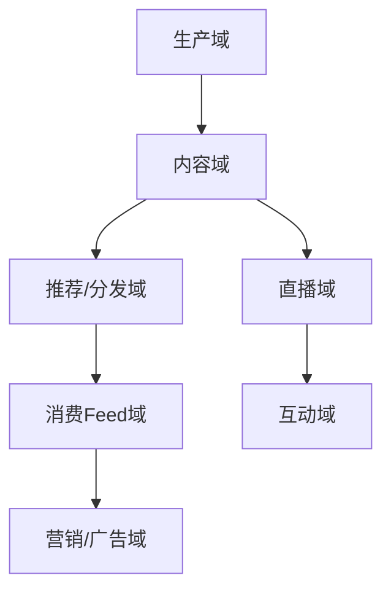
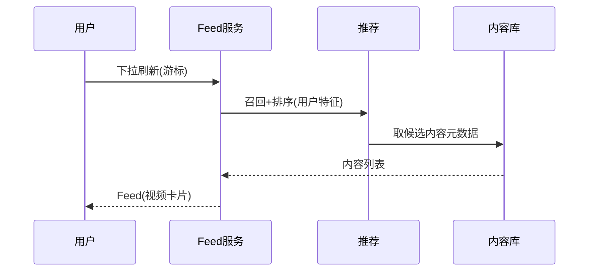

# 内容 / 短视频 / 直播业务模型（深扒）

> 内容平台的核心是「**生产（UGC/PGC）— 分发（推荐）— 消费（Feed）**」的飞轮。技术上最难的是**超大流量下的 Feed 流架构**与**实时推荐**，直播则叠加了低延迟音视频与高并发互动。
>
> 配套总览见「[业务模型总览](业务模型总览.md)」；推荐/缓存见「[架构](../架构)」「[场景设计](../场景设计)」「[大模型](../大模型)」。

---

## 一、业务全景与领域划分



| 域 | 核心职责 | 关键实体 |
|----|----------|----------|
| 生产域 | 上传、转码、审核 | 视频、稿件 |
| 内容域 | 元数据、分类、标签 | 内容、标签 |
| 推荐域 | 召回、排序、重排 | 推荐流、特征 |
| Feed域 | 时间线/推荐流、翻页 | Feed、游标 |
| 直播域 | 推流、转码、分发(CDN) | 直播间、流 |
| 互动域 | 弹幕、点赞、打赏、连麦 | 消息、礼物 |

---

## 二、核心系统架构

### 2.1 内容生产
- **转码**：上传后异步转多分辨率（HLS/DASH），FFmpeg 集群。
- **审核**：先机审（鉴黄/暴恐/文本违规，接大模型/规则引擎）后人审，违规下架。

### 2.2 Feed 流架构（核心技术）
- **推模式（写扩散）**：发布时写入所有粉丝收件箱（Redis Sorted Set / 时间线存储）→ 读快，但大 V 粉丝多写入爆炸。
- **拉模式（读扩散）**：读时聚合关注源 → 写轻，但读重、长尾慢。
- **混合（推拉结合）**：普通用户推、大 V 拉 + 热榜合并，工程主流。

### 2.3 推荐分发
- 漏斗：**召回（百万→千）** → **粗排** → **精排（深度模型）** → **重排（多样性/去重）**。
- 特征实时性：用户实时行为进特征平台，分钟级更新。

### 2.4 直播
- 推流 RTMP/SRT → 服务端转码 → **CDN 边缘分发**（低延迟 LL-HLS/WebRTC）。
- 互动：弹幕/礼物走 **IM 长连接**（见「[社交IM](社交IM业务模型.md)」），千万级房间用分桶 + 广播树。

---

## 三、关键链路：刷到一个视频



---

## 四、峰值与实时场景

| 场景 | 挑战 | 方案 |
|------|------|------|
| 爆款视频 | 瞬时读洪峰 | CDN + 多级缓存 + 热点探测 |
| 大 V 发布 | 写扩散爆炸 | 大 V 转拉模式 |
| 直播秒开 | 首帧延迟 | 边缘转码 + 低延迟协议 |
| 弹幕风暴 | 高并发写入 | 分桶 + 异步持久化 |
| 审核漏放 | 合规风险 | 机审前置 + 实时拦截 |

---

## 五、技术栈详表

| 技术 | 用途 | 备注 |
|------|------|------|
| FFmpeg 集群 | 转码 | 异步 |
| CDN | 视频/直播分发 | 边缘 |
| Redis / Timeline 存储 | Feed 收件箱 | 推拉结合 |
| 推荐引擎（召回/排序） | 分发 | 深度模型 |
| 特征平台（Flink） | 实时特征 | 流式 |
| IM 长连接 | 弹幕/礼物 | 见社交IM |
| 审核（大模型/规则） | 内容安全 | 机审+人审 |

---

## 六、深挖：核心业务机制

### 6.1 Feed 推拉结合（写扩散 vs 读扩散的工程取舍）

| 模式 | 发布成本 | 读取成本 | 适用 |
|------|----------|----------|------|
| 纯推（写扩散） | 写入粉丝收件箱（O(粉丝数)） | 读 O(1) | 普通用户 |
| 纯拉（读扩散） | O(1) | 聚合关注源 O(关注数) | 大 V（粉丝百万级） |
| 推拉结合 | 普通推 + 大 V 拉 | 收件箱 + 关注大 V 的实时流合并 | **工程主流** |

```
用户 Feed = 自己关注者的收件箱(推) + 关注大V的最新内容(拉) + 热榜(全局)
分页: cursor 游标（基于时间戳/序号），禁用 offset 防重复/遗漏
```

- 大 V 阈值：粉丝 > 10 万即转拉模式；热榜内容全局可见（热度衰减加权）；
- 收件箱存储：Redis ZSet（member=内容ID, score=发布时间）或专用 timeline 存储。

### 6.2 直播低延迟链路（秒开 + 低卡顿）

```
主播推流 RTMP/SRT → 源站 → 边缘转码(多清晰度) → CDN 分发
                          └─ LL-HLS(低延迟HLS) / WebRTC(亚秒级) / 国标 SRT
```

| 指标 | 目标 | 手段 |
|------|------|------|
| 首帧（秒开） | < 1s | 边缘预连接 + 首帧优先 + 转码预热 |
| 端到端延迟 | 普通 3~5s / 互动 1s | LL-HLS / WebRTC / 就近边缘 |
| 弱网流畅 | 卡顿率低 | 自适应码率（ABR）+ 冗余分片 |

- 互动（弹幕/礼物/连麦）走 IM 长连接而非视频通道；
- 千万人房间：弹幕分桶 + 广播树，持久化异步（见 [IM消息系统设计](../场景设计/IM消息系统设计.md)）。

### 6.3 审核体系（内容安全生命线）

```
机审(模型+规则) → 命中违规直接拦截
              ↘ 模糊命中 → 人审队列
上架后巡查(抽样+举报驱动) → 违规下架 + 作者处罚
```

- 机审模型：图像（鉴黄/暴恐）、文本（违规词/风险提示）、音频（ASR 后审）；
- 实时拦截（发布时）与存量巡查（定时全量）双通道；
- 合规红线：审核延迟、漏判率、下架时效都有监管要求。

---

## 七、核心指标与数据驱动

| 维度 | 指标 | 说明 |
|------|------|------|
| 增长 | DAU、人均时长 | 北极星 |
| 内容 | 发布量、完播率、互动率 | 内容质量 |
| 推荐 | CTR、留存提升、多样性 | 算法效果（AB 验收） |
| 直播 | 峰值在线、互动渗透率、卡顿率 | 体验 |
| 审核 | 机审拦截率、漏判率、下架时效 | 合规 |
| 技术 | Feed 拉取时延（P95）、CDN 命中率 | 后端 |

---

## 八、面试与系统设计视角

1. 设计一个短视频 Feed 流：推拉结合 + 游标分页 + 多级缓存（见 [Feed 信息流设计](../场景设计/Feed信息流设计.md)）。
2. 大 V 发布怎么不崩：转拉模式 + 热榜合并 + 异步写收件箱。
3. 直播弹幕怎么做：长连接 + 分桶 + 广播树。
4. 爆款视频热点怎么扛：热点探测 + 本地缓存 + CDN 预热。
5. 推荐与审核怎么配合：审核前置，违规内容不进推荐流。

---

## 九、内容特有坑

- **推模式大 V 灾难**：粉丝千万写入不现实 → 大 V 必走拉/热榜合并。
- **Feed 翻页游标**：用 `cursor` 而非 `offset`，避免新增内容导致重复/遗漏。
- **推荐信息茧房**：只推相似内容 → 重排引入多样性/探索。
- **直播卡顿/延迟**：源站到边缘链路长 → 多 CDN + 弱网降级。
- **审核滞后合规风险**：机审漏判引发舆情 → 实时拦截 + 快速下架通道。

> 口诀：**"内容飞轮：生产转码审，分发推拉混，推荐漏斗深；直播靠 CDN，弹幕走长连，大 V莫写扩散。"**
