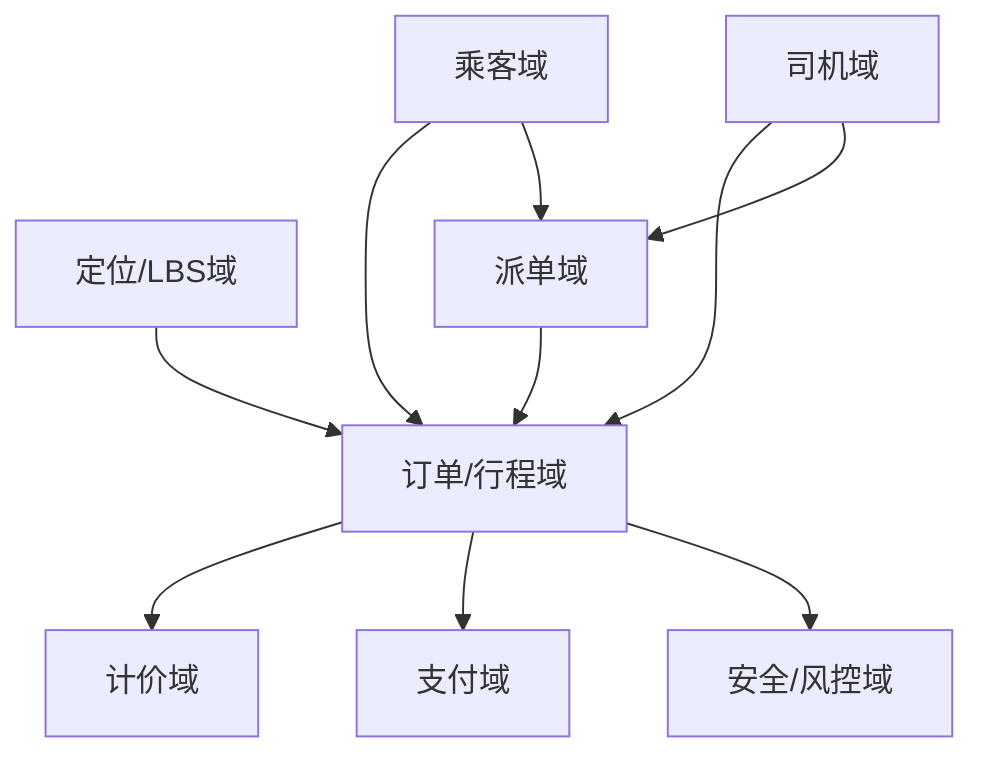
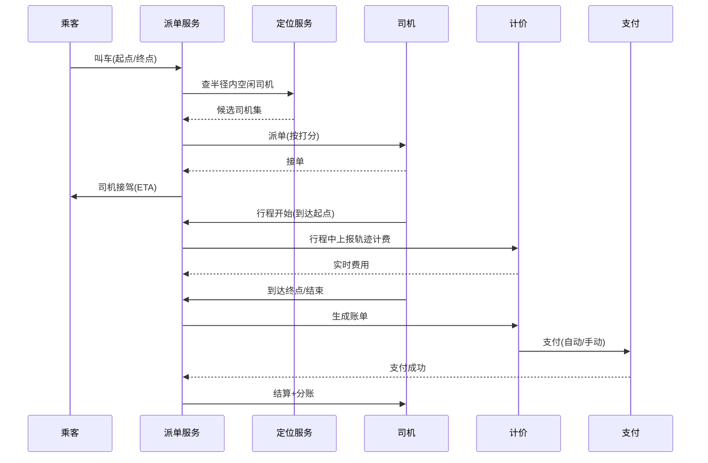

# 出行 / 打车业务模型（深扒）

> 出行的核心难点是**实时 LBS 调度**：在毫秒级把「附近空闲司机」匹配给「附近乘客」，还要兼顾体验、效率与合规。把打车吃透，外卖/同城配送的调度都能套。
>
> 配套总览见「[业务模型总览](业务模型总览.md)」；调度/一致性见「[场景设计](../场景设计)」「[架构](../架构)」。

---

## 一、业务全景与领域划分

出行本质是「**人（乘客/司机）— 位置（LBS）— 订单（行程）— 计价（费用）**」的实时撮合。按限界上下文拆为六大域：



| 域 | 核心职责 | 关键实体 |
|----|----------|----------|
| 乘客域 | 账号、常用地址、紧急联系人 | 乘客、地址薄 |
| 司机域 | 认证、车辆、状态（空闲/忙碌/离线）、心跳 | 司机、车辆、司机状态 |
| 定位域 | 实时坐标上报、地理围栏、轨迹 | 坐标点、热力图、电子围栏 |
| 派单域 | 供需匹配、路径规划、ETA、调价 | 派单请求、司机候选集 |
| 行程域 | 叫车→接驾→行程中→结束→支付 | 行程、状态机、轨迹 |
| 计价域 | 计费规则、动态调价、账单 | 账单、计费因子 |

---

## 二、核心系统架构

### 2.1 实时定位（LBS）
- 司机/乘客 App **每 3~5 秒上报坐标**到定位服务，写入 `Redis GEO` / `GeoHash` 索引，供派单快速检索「半径 R 内司机」。
- 轨迹压缩：用**道格拉斯-普克算法**抽稀，降存储与回放成本。
- GPS 漂移处理：速度/方向突变过滤，融合基站/WiFi 定位纠偏。

### 2.2 派单调度（系统大脑）
- **候选集召回**：以乘客为中心，GeoHash 圈定 1~3km 内空闲司机（Redis GEO / 空间索引）。
- **排序/打分**：综合距离、方向顺路度、司机评分、历史完单率，输出 Top-N。
- **调度算法演进**：贪心 → 全局最优（最小化总等待，匈牙利/KM 算法）→ **强化学习**（考虑未来供需、拼车效率）。
- **派单时机**：司机结束上一单的「空驶预测」时提前派，减少乘客等待。

### 2.3 路径规划与 ETA
- 底层用地图 SDK（高德/百度）或自研路网（Dijkstra/A* + 实时路况）。
- ETA（预计到达）是派单、接驾、动态调价的核心输入，靠历史轨迹 + 实时拥堵模型预估。

### 2.4 动态调价（供需）
- 供需失衡（雨天/晚高峰）时，调价系数 = f(区域供需比、历史叫车密度)；需设**封顶倍数**与公众沟通，避免「杀熟」舆情。

---

## 三、关键链路：一次叫车行程



---

## 四、高并发与实时场景

| 场景 | 挑战 | 方案 |
|------|------|------|
| 晚高峰海量叫车 | 瞬时请求百倍 | 派单服务无状态水平扩容 + 消息队列削峰 |
| 司机心跳风暴 | 百万司机每秒上报 | 批量写入 + 时间轮 + 长连接（WebSocket/gRPC） |
| 热力图实时 | 区域供需秒级更新 | Flink 实时聚合 + Redis 发布订阅 |
| 轨迹回放 | 存储与查询量大 | 轨迹抽稀 + 时序库/对象存储 |
| 派单延迟敏感 | 用户等超 30s 流失 | 候选召回用内存索引（Redis GEO），计算 < 100ms |

---

## 五、技术栈详表

| 技术 | 用途 | 备注 |
|------|------|------|
| Redis GEO / GeoHash | 附近司机检索 | 毫秒级召回 |
| Kafka / Pulsar | 坐标流、派单事件 | 削峰、解耦 |
| Flink | 实时供需聚合、热力图 | 流式计算 |
| WebSocket / gRPC 长连接 | 司机心跳、派单推送 | 低延迟双向 |
| 地图 SDK（高德/百度） | 路径规划、地理编码 | 或自研路网 |
| MySQL（分库分表） | 行程/账单主存 | 按城市/时间分片 |
| 时序数据库 | 轨迹、指标 | InfluxDB/TDengine |

---

## 六、深挖：核心业务机制

### 6.1 派单打分（候选司机怎么选）

| 因子 | 权重思路 | 说明 |
|------|----------|------|
| 接驾距离/时间 | 高 | 核心体验 |
| 方向顺路度 | 高 | 顺路单提人效 |
| 司机评分/完单率 | 中 | 服务质量 |
| 司机当前载客状态 | 硬约束 | 只在途末段才可派 |
| 区域负载均衡 | 中 | 防热点区域抢单不均 |

```
score = w1·dist + w2·heading + w3·quality − w4·regionalLoad
派单不是单单最优，而是"当前司机集合 vs 待派订单"的全局匹配
```

- 简单做法：贪心（每单选最优司机）；进阶：把 N 单 × M 司机构造成二分图，用**匈牙利/KM 或 KM 变体**求全局最小总等待。
- 工程限制：全局优化必须在百毫秒内完成 → 按区域分治 + 批量触发。

### 6.2 ETA 预测（计价与派单的共同输入）

```
ETA = 基础路网距离/速度 + 实时拥堵修正 + 信号灯/路口惩罚 + 历史同路段分位值
```

- 数据源：GPS 轨迹聚合成**路段级速度分布**（分钟级更新），再加实时路况事件；
- 分位数估计（如 P50/P90）：乘客看 P50，平台承诺看 P90；
- 准确度直接影响：派单顺路判断、动态调价、超时补偿。

### 6.3 计价模型（费用 = 规则 × 因子）

| 组成 | 说明 |
|------|------|
| 基础价 | 起步费 |
| 里程/时长 | 双计费（堵车收时长费） |
| 动态调价 | 供需系数，封顶倍数 |
| 附加费 | 夜间/远途/机场 |

> 计费要**透明可解释**（舆情风险），且每单费用流水不可变、可对账（呼应 [支付系统设计](../场景设计/支付系统设计：回调、幂等与对账.md)）。

---

## 七、核心指标与数据驱动

| 维度 | 指标 | 说明 |
|------|------|------|
| 体验 | 接驾时长、等待时长、取消率 | 用户留存关键 |
| 效率 | 空驶率、订单人效（单/小时） | 司机收入 |
| 调度 | 派单成功率、ETA 准确率（±2min 内） | 系统大脑质量 |
| 供需 | 叫车应答率、热点区域供需比 | 动态调价依据 |
| 风控 | 刷单检出率、投诉率 | 平台治理 |
| 技术 | 派单时延（P95）、轨迹上报到达率 | 后端质量 |

---

## 八、面试与系统设计视角

1. 设计一个网约车派单系统：LBS 召回（Redis GEO/GeoHash）→ 打分 → 全局匹配 → 下发。
2. 「附近的人/附近的车」怎么做：GeoHash 前缀 + 9 宫格边界处理（见 [附近的人与地理围栏](../场景设计/附近的人与地理围栏.md)）。
3. 司机心跳百万级怎么扛：长连接网关 + 批量上报 + 时间轮判定离线。
4. 动态调价怎么避免舆情：透明规则 + 封顶 + 区域粒度。
5. 轨迹数据怎么省钱：抽稀算法 + 时序库 + 对象存储回放。
6. 实时供需热力图：Flink 聚合 + Redis 发布订阅。

---

## 九、出行特有坑

- **派单不公平/效率低**：只按距离派导致热点区域抢单，需综合评分 + 区域负载均衡。
- **GPS 漂移与轨迹跳跃**：隧道/高楼下定位丢点，计费里程异常 → 滤波 + 路网吸附。
- **刷单/作弊**：司机自导自演虚假行程 → 设备指纹 + 行为风控 + 轨迹合理性校验。
- **隐私合规**：实时位置属敏感个人信息，需最小化采集、加密、授权与脱敏。
- **动态调价舆情**：倍数过高被指「杀熟」 → 透明规则 + 封顶 + 监管报备。

> 口诀：**"出行三件事：定位准、派单快、计价公；GeoHash 召回，强化学习排，轨迹要滤波，调价莫过头。"**
