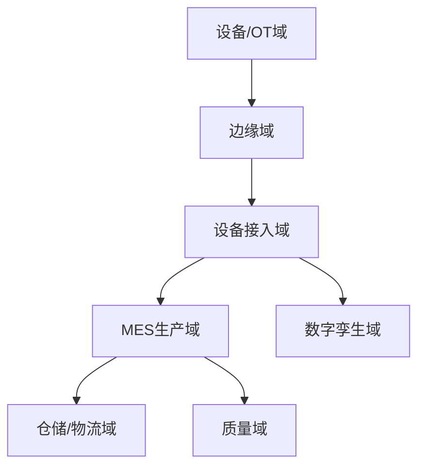
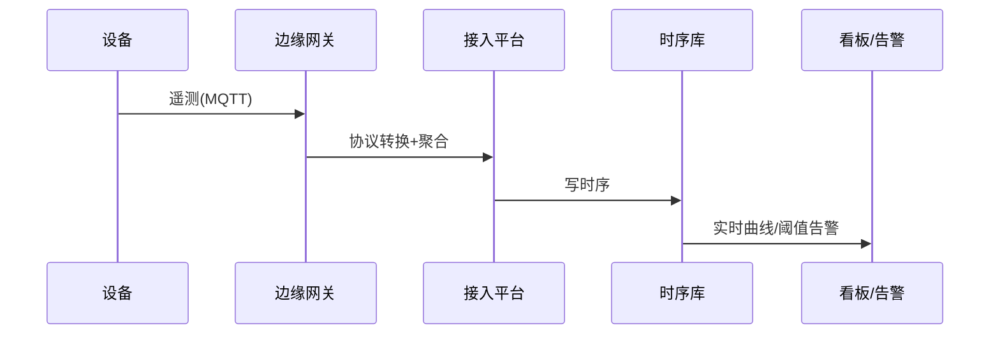

# 制造 / 工业互联网业务模型（深扒）

> 工业互联网把「**物理设备（OT）— 数字系统（IT）**」打通，核心是**设备接入（海量 IoT）、实时采集、生产执行（MES）、数字孪生**。技术难点在边缘接入、时序数据、弱网可靠。
>
> 配套总览见「[业务模型总览](业务模型总览.md)」；物联网/时序见「[基础知识/中间件](../基础知识/中间件)」（MQTT/时序库）、「[架构](../架构)」。

---

## 一、业务全景与领域划分



| 域 | 核心职责 | 关键实体 |
|----|----------|----------|
| 设备域 | 机床、传感器、PLC | 设备、点位 |
| 边缘域 | 协议转换、边缘计算 | 边缘网关 |
| 接入域 | 海量连接、采集 | 连接、遥测 |
| MES域 | 工单、排产、报工 | 工单、工艺 |
| 质量域 | 质检、良率 | 检验、批次 |
| 孪生域 | 虚拟映射、仿真 | 数字孪生体 |

---

## 二、核心系统架构

### 2.1 设备接入（IoT Hub）
- 设备经 **MQTT/OPC-UA/Modbus** 上报，边缘网关做协议转换与初步聚合。
- 海量长连接：接入层水平扩展（见「[MQTT](../基础知识/中间件/MQTT与消息broker.md)」）。

### 2.2 时序数据
- 设备遥测是典型**时序数据**（时间戳+点位+值），用时序库（InfluxDB/TDengine）存储，支撑监控与告警。
- 降采样：原始高频 → 分钟/小时聚合，降存储。

### 2.3 MES（制造执行）
- 工单下发 → 排产 → 报工 → 质检，连接 ERP（计划）与车间（执行）。
- 与 WMS 联动：物料齐套才开工。

### 2.4 数字孪生
- 物理设备实时映射为虚拟模型，用于监控、预测性维护、仿真优化。

---

## 三、关键链路：设备到看板



---

## 四、场景要点

| 场景 | 挑战 | 方案 |
|------|------|------|
| 弱网/断网 | 数据丢失 | 边缘缓存 + 断点续传 |
| 设备异构 | 协议多 | 边缘网关适配 |
| 海量点位 | 存储压力 | 时序库 + 降采样 |
| 实时告警 | 延迟 | 流计算（Flink） |

---

## 五、技术栈详表

| 技术 | 用途 | 备注 |
|------|------|------|
| MQTT / OPC-UA | 设备接入 | IoT |
| 边缘计算 | 协议转换 | 网关 |
| 时序数据库 | 遥测存储 | InfluxDB |
| Flink | 实时告警 | 流式 |
| MES / ERP | 生产执行 | 集成 |
| 数字孪生引擎 | 仿真 | 3D |

---

## 六、深挖：核心业务机制

### 6.1 设备接入与边缘计算（现场 → 平台）

```
设备(PLC/传感器/数控机床) → 网关/边缘盒子(采集+协议转换) → 平台(时序存储+应用)
```

| 采集方式 | 说明 |
|----------|------|
| OPC-UA / Modbus | 存量设备主协议，边缘网关转换 |
| MQTT 上报 | 网关主动上报，边缘预处理（抽稀/聚合/告警） |
| 边缘计算 | 本地规则引擎（高温立即报警），断网缓存续传 |

- **断网续传**是工业刚需：边缘缓存 + 时间戳对齐，网络恢复后补偿上报；
- 时间戳以**设备/边缘为准**（现场信号延迟），平台不做重排。

### 6.2 时序数据存储（工业大数据心脏）

```
指标: 温度/压力/转速/电流 → 按 设备ID × 指标ID × 时间 维度存储
```

| 对比 | 传统关系库 | 时序库（InfluxDB/TDengine/IoTDB） |
|------|-----------|----------------------------------|
| 写模型 | 行存，写入压力大 | 列存 + 追加写，压缩比高 |
| 查询 | 慢（全表扫） | 时间范围下钻快 |
| 降采样 | 手动 | 原生（原始→小时→天） |

- 高基数问题：指标维度多（设备×指标×工况）——按设备分区 + 标签索引；
- 数据生命周期：原始数据（热）→ 降采样（温）→ 归档（冷）。

### 6.3 MES 排产与追溯（一物一码）

```
排产: 订单 + 产能 + 工艺约束 → 排程（APS，先进先出/插单）
追溯: 产品条码/批次 → 绑定原料批次 + 设备 + 工艺参数 + 质检结果
```

- 反向追溯：质量事故 → 条码 → 找原料批次 → 召同批次；
- 工单状态机：待排 → 排产 → 生产中 → 完工 → 质检 → 入库（全过程事件留痕）。

---

## 七、核心指标与数据驱动

| 维度 | 指标 | 说明 |
|------|------|------|
| 生产 | 设备稼动率、OEE（综合设备效率） | 北极星 |
| 质量 | 良率、不良原因分布（Pareto） | 质量 |
| 效率 | 产能达成率、排产准确率 | 计划 |
| 设备 | 故障率、MTBF/MTTR | 设备健康 |
| 技术 | 数据接入完整率、上报时延、断网恢复率 | 数据底座 |

---

## 八、面试与系统设计视角

1. 设计一个设备数据采集平台：边缘接入 → 时序存储 → 监控告警。
2. 百万点位的时序数据怎么存：时序库选型 + 分区 + 降采样 + 归档。
3. 断网续传怎么设计：边缘缓存 + 时间戳 + 补偿上报（含幂等去重）。
4. 质量追溯链路：一物一码 + 批次绑定 + 双向追溯。
5. 预测性维护怎么做：时序特征 + 异常检测模型 + 维修工单联动。

---

## 九、制造特有坑

- **弱网丢数据**：设备断网 → 边缘本地缓存 + 续传，禁直接丢。
- **协议碎片化**：每家设备协议不同 → 边缘网关统一转换。
- **时序库选型错**：用关系库存遥测 → 写入瓶颈，必须用时序库。
- **告警风暴**：阈值过敏 → 去抖 + 分级 + 静默。
- **数字孪生失真**：模型与实物不同步 → 实时映射 + 校准。

> 口诀：**"工业联网：设备经 MQTT，边缘做转换，时序存遥测；弱网本地缓，断点能续传，告警要去抖，孪生实时映。"**
