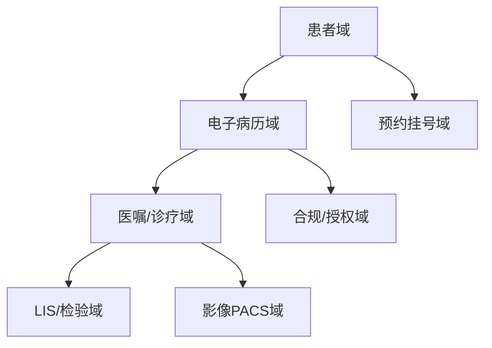
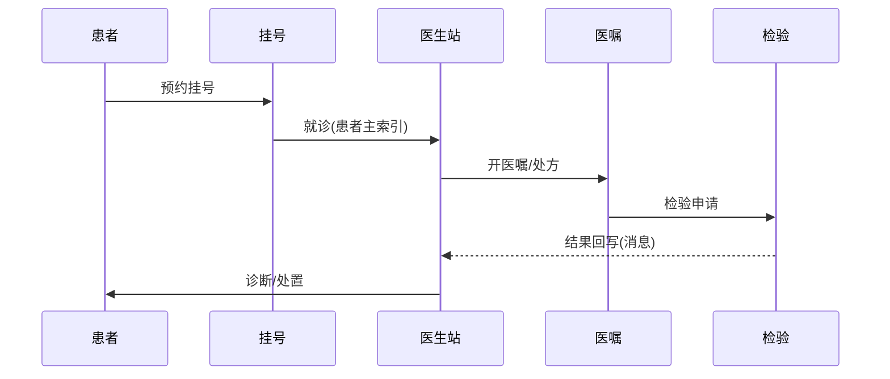

# 医疗健康业务模型（深扒）

> 医疗系统的第一约束是「**合规与隐私**」：病历属敏感个人信息，受《个人信息保护法》与行业规范强监管。技术上难在**系统集成（HIS/LIS/PACS 异构）、数据标准、高可靠**。
>
> 配套总览见「[业务模型总览](业务模型总览.md)」；隐私/权限见「[企业服务SaaS](企业服务SaaS业务模型.md)」「[基础知识/Web安全](../基础知识/Web安全.md)」。

---

## 一、业务全景与领域划分

| 域 | 核心职责 | 关键实体 |
|----|----------|----------|
| 患者域 | 主索引（EMPI）、档案 | 患者、主索引 |
| 病历域 | 电子病历、文书 | 病历、文书 |
| 诊疗域 | 医嘱、处方、诊断 | 医嘱、处方 |
| 检验域 | 检验申请、结果 | 检验单、结果 |
| 影像域 | 影像存储调阅 | 影像、DICOM |
| 合规域 | 授权、脱敏、审计 | 授权、审计 |

---

## 二、核心系统架构

### 2.1 主数据（患者主索引 EMPI）
- 多系统患者身份统一：用**主索引**把 HIS/LIS/PACS 中的同一患者归并，避免重复档案。

### 2.2 系统集成（异构互通）
- 医院系统多为 legacy（HIS/LIS/PACS），靠 **HL7 / FHIR / DICOM** 标准 + 企业服务总线（ESB）/集成平台打通。
- 消息驱动：检验完成 → 结果回写病历，异步解耦。

### 2.3 隐私与合规（最高优先级）
- **最小授权**：医生只能看授权范围内患者；操作全量审计留痕。
- **脱敏**：展示/调研发脱敏（姓名、身份证掩码）；导出需审批。
- **数据分级**：一般/敏感/核心，分级存储与访问控制。

### 2.4 高可靠
- 诊疗系统不可中断：核心服务冗余、容灾；处方/医嘱强校验防医疗差错。

---

## 三、关键链路：一次就诊

---

## 四、场景要点

| 场景 | 挑战 | 方案 |
|------|------|------|
| 系统异构 | 老系统难对接 | 标准协议 + 集成平台 |
| 隐私合规 | 泄露风险 | 脱敏 + 审计 + 分级 |
| 高并发挂号 | 号源抢 | 号源库存原子扣（同超卖） |
| 影像大 | 调阅慢 | PACS + 云存储 + CDN |

---

## 五、技术栈详表

| 技术 | 用途 | 备注 |
|------|------|------|
| HL7 / FHIR | 医疗数据交换 | 标准 |
| DICOM / PACS | 影像 | 专业 |
| ESB / 集成平台 | 系统互通 | 解耦 |
| 主数据管理 | EMPI | 归并 |
| 脱敏/审计 | 合规 | 必做 |
| 对象存储 | 影像/文档 | 海量 |

---

## 六、医疗特有坑

- **患者主索引错配**：不同系统同一人当成两人 → EMPI 归并 + 人工核对。
- **隐私泄露**：权限过宽 → 最小授权 + 脱敏 + 审计三件套。
- **系统孤岛**：HIS/LIS 不互通 → 集成平台 + 标准协议。
- **号源超卖**：并发抢号 → 原子扣减 + 锁。
- **处方差错**：无校验 → 知识库规则校验 + 双人核对。

> 口诀：**"医疗守合规：主索引归人，标准通系统，隐私三件套（授权/脱敏/审计）；号源防超卖，处方强校验，可靠不能停。"**
