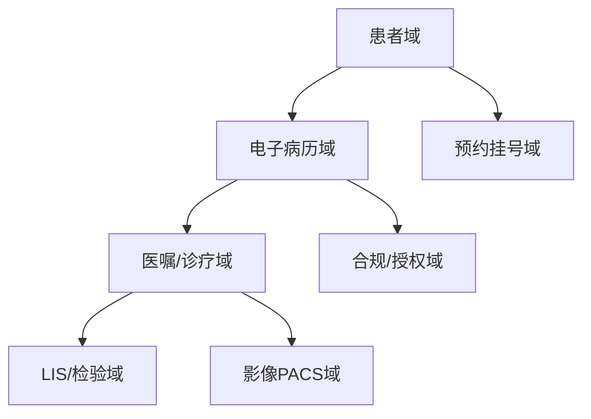
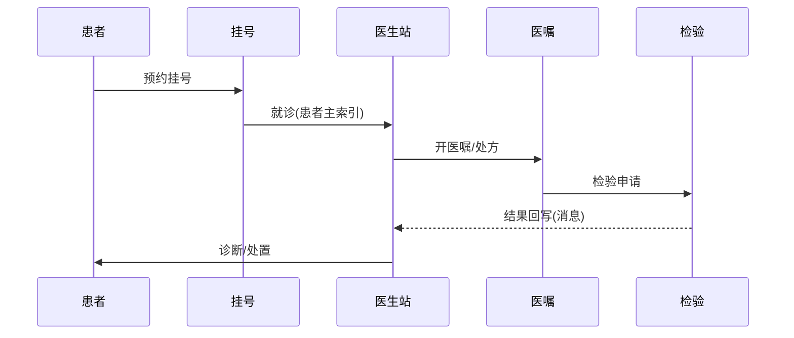

# 医疗健康业务模型（深扒）

> 医疗系统的第一约束是「**合规与隐私**」：病历属敏感个人信息，受《个人信息保护法》与行业规范强监管。技术上难在**系统集成（HIS/LIS/PACS 异构）、数据标准、高可靠**。
>
> 配套总览见「[业务模型总览](业务模型总览.md)」；隐私/权限见「[企业服务SaaS](企业服务SaaS业务模型.md)」「[基础知识/Web安全](../基础知识/Web安全.md)」。

---

## 一、业务全景与领域划分



| 域 | 核心职责 | 关键实体 |
|----|----------|----------|
| 患者域 | 主索引（EMPI）、档案 | 患者、主索引 |
| 病历域 | 电子病历、文书 | 病历、文书 |
| 诊疗域 | 医嘱、处方、诊断 | 医嘱、处方 |
| 检验域 | 检验申请、结果 | 检验单、结果 |
| 影像域 | 影像存储调阅 | 影像、DICOM |
| 合规域 | 授权、脱敏、审计 | 授权、审计 |

---

## 二、核心系统架构

### 2.1 主数据（患者主索引 EMPI）
- 多系统患者身份统一：用**主索引**把 HIS/LIS/PACS 中的同一患者归并，避免重复档案。

### 2.2 系统集成（异构互通）
- 医院系统多为 legacy（HIS/LIS/PACS），靠 **HL7 / FHIR / DICOM** 标准 + 企业服务总线（ESB）/集成平台打通。
- 消息驱动：检验完成 → 结果回写病历，异步解耦。

### 2.3 隐私与合规（最高优先级）
- **最小授权**：医生只能看授权范围内患者；操作全量审计留痕。
- **脱敏**：展示/调研发脱敏（姓名、身份证掩码）；导出需审批。
- **数据分级**：一般/敏感/核心，分级存储与访问控制。

### 2.4 高可靠
- 诊疗系统不可中断：核心服务冗余、容灾；处方/医嘱强校验防医疗差错。

---

## 三、关键链路：一次就诊



---

## 四、场景要点

| 场景 | 挑战 | 方案 |
|------|------|------|
| 系统异构 | 老系统难对接 | 标准协议 + 集成平台 |
| 隐私合规 | 泄露风险 | 脱敏 + 审计 + 分级 |
| 高并发挂号 | 号源抢 | 号源库存原子扣（同超卖） |
| 影像大 | 调阅慢 | PACS + 云存储 + CDN |

---

## 五、技术栈详表

| 技术 | 用途 | 备注 |
|------|------|------|
| HL7 / FHIR | 医疗数据交换 | 标准 |
| DICOM / PACS | 影像 | 专业 |
| ESB / 集成平台 | 系统互通 | 解耦 |
| 主数据管理 | EMPI | 归并 |
| 脱敏/审计 | 合规 | 必做 |
| 对象存储 | 影像/文档 | 海量 |

---

## 六、深挖：核心业务机制

### 6.1 EMPI 患者主索引怎么归并

```
两系统同一个人 → 如何判定"同人"？
候选键: 身份证号 / 姓名+出生日期 / 手机号 / 医保卡号
```

| 匹配方式 | 规则 | 处理 |
|----------|------|------|
| 精确匹配 | 身份证号一致 → 高置信 | 自动合并 |
| 规则匹配 | 姓名+出生日期+性别 全等 | 自动合并（加校验） |
| 概率匹配 | 姓名字符串相似度（如 edit distance） | 待人工仲裁 |
| 低置信 | 冲突（同身份证不同名） | 人工核对 + 审计留痕 |

> 关键：合并要**可追溯、可撤销**（错并的后果是档案污染），所以每条合并记录都进审计表。

### 6.2 FHIR 资源模型（现代互操作标准）

FHIR 用**标准资源 + RESTful API** 替代传统 HL7 v2 消息：患者、就诊、医嘱、检验结果都是资源，`GET /Patient/{id}`、`POST /Observation`。

| 对比 | 传统 HL7 v2 | FHIR |
|------|-------------|------|
| 形态 | 管道分隔消息 | REST + JSON/XML |
| 集成难度 | 字段错位易错 | 结构化资源、工具多 |
| 现代医疗集成 | 存量系统仍在用 | 新建系统首选（互联互通测评） |

> 工程启示：**存量系统用 ESB 适配（HL7 v2 → 内部事件），新建模块直接 FHIR**，两代协议并存是常态。

### 6.3 数据分级与脱敏落地

| 级别 | 示例 | 存储要求 | 访问要求 |
|------|------|----------|----------|
| L3 核心 | 病历全文、检验原始结果 | 加密存储 | 最小授权 + 全量审计 |
| L2 敏感 | 姓名、身份证、联系方式 | 脱敏索引 + 加密 | 授权可见，展示掩码 |
| L1 一般 | 科室、流水号 | 常规 | 常规 |

- 索引与数据分离：身份证用于精确查找，但**展示必须掩码**；
- 导出/打印走审批流，水印留痕（呼应 [安全工程·05 数据安全](../安全工程/05-数据安全与密码学基础.md)）。

---

## 七、核心指标与数据驱动

| 维度 | 指标 | 说明 |
|------|------|------|
| 患者 | 预约履约率、候诊时长、满意度 | 体验与运营 |
| 效率 | 挂号峰值 QPS、号源利用率、退号率 | 资源调度 |
| 质量 | 处方错误率、检验报告及时率（TAT） | 医疗安全 |
| 成本 | 影像存储成本/TB、系统可用率 | 99.9%+ |
| 合规 | 越权访问告警数、审计覆盖率 | 监管必查 |

> 医疗的北极星不是「增长」而是「安全 + 效率」：核心系统可用率（业务连续性）与数据合规率是两条生命线。

---

## 八、面试与系统设计视角

1. 设计一个预约挂号系统：号源库存防超卖（Redis 预扣/数据库乐观锁）+ 渠道分号源。
2. 多系统患者身份怎么统一：EMPI 归并 + 概率匹配 + 人工仲裁。
3. 病历数据怎么存储：结构化字段 + 全文检索 + 对象存储附件，加密分层。
4. 跨系统医嘱/检验怎么异步解耦：事件驱动 + 消息队列 + 结果回写幂等。
5. 隐私合规怎么落地：最小授权、脱敏三件套、审计留痕（回答框架见安全工程板块）。

---

## 九、医疗特有坑

- **患者主索引错配**：不同系统同一人当成两人 → EMPI 归并 + 人工核对。
- **隐私泄露**：权限过宽 → 最小授权 + 脱敏 + 审计三件套。
- **系统孤岛**：HIS/LIS 不互通 → 集成平台 + 标准协议。
- **号源超卖**：并发抢号 → 原子扣减 + 锁。
- **处方差错**：无校验 → 知识库规则校验 + 双人核对。

> 口诀：**"医疗守合规：主索引归人，标准通系统，隐私三件套（授权/脱敏/审计）；号源防超卖，处方强校验，可靠不能停。"**
