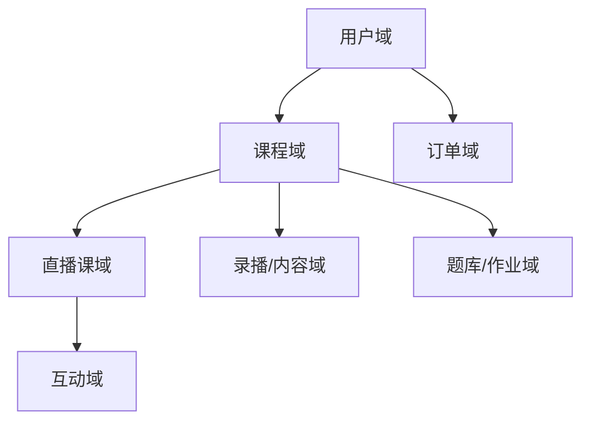
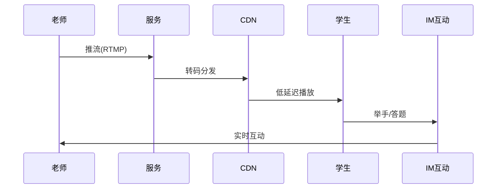

# 在线教育业务模型（深扒）

> 在线教育的核心是「**直播课（实时音视频 + 互动） + 内容（录播/题库） + 交易（报名/续费）**」的组合。技术上直播课与「内容直播」同源，题库/学习路径是独有难点。
>
> 配套总览见「[业务模型总览](业务模型总览.md)」；直播/互动见「[内容短视频直播](内容短视频直播业务模型.md)」「[社交IM](社交IM业务模型.md)」。

---

## 一、业务全景与领域划分

| 域 | 核心职责 | 关键实体 |
|----|----------|----------|
| 用户域 | 学员、老师、机构 | 用户、角色 |
| 课程域 | 排课、课表、目录 | 课程、章节 |
| 直播域 | 推流、转码、低延迟 | 直播间、流 |
| 内容域 | 录播、文档、回放 | 视频、资料 |
| 题库域 | 题目、组卷、批改 | 题目、作业、成绩 |
| 订单域 | 报名、续费、退费 | 订单、订阅 |

---

## 二、核心系统架构

### 2.1 直播课（实时互动）
- 老师推流 → 转码 → **CDN 低延迟分发**；学生端 WebRTC/LL-HLS 收看。
- 互动：举手、连麦、白板、答题，走**长连接 IM**（同社交 IM）。
- **白板/文档同步**：操作指令广播 + 状态对齐，弱网下指令补发。

### 2.2 录播与内容
- 直播自动录制 → 转码多清晰度 → 回放；资料（PPT/PDF）对象存储。
- 播放鉴权：付费课程 URL 带时效 token，防盗链。

### 2.3 题库与学习路径
- 题目结构化（知识点、难度、题型），支持组卷、自适应练习。
- **学习路径**：基于掌握度（掌握/薄弱）推荐下一题/下一课（推荐思路）。

### 2.4 交易
- 单课/套餐/会员/分期；试听→转化→续费漏斗，配合营销（优惠券/拼团）。

---

## 三、关键链路：一节直播课

---

## 四、场景要点

| 场景 | 挑战 | 方案 |
|------|------|------|
| 上课高峰 | 同时开课多 | CDN 多节点 + 弹性转码 |
| 弱网卡顿 | 体验差 | 自适应码率 + 回放兜底 |
| 互动延迟 | 连麦不同步 | WebRTC + 信令 |
| 盗录 | 内容泄露 | 水印 + 播放鉴权 |

---

## 五、技术栈详表

| 技术 | 用途 | 备注 |
|------|------|------|
| 直播 CDN / WebRTC | 低延迟课 | 边缘 |
| FFmpeg | 录制转码 | 回放 |
| IM 长连接 | 互动/白板 | 见社交IM |
| 对象存储 | 录播/资料 | 直传 |
| 推荐 | 学习路径 | 自适应 |
| 支付/营销 | 报名续费 | 见电商 |

---

## 六、教育特有坑

- **直播首帧慢**：学生等不起 → 边缘转码 + 预连接。
- **白板不同步**：指令丢失 → 指令序列 + 状态补发。
- **回放盗链**：URL 泄露 → 时效 token + 水印追溯。
- **题库组卷低效**：人工组卷慢 → 结构化 + 自动组卷。
- **续费漏斗断**：试听转化低 → 埋点 + 精准营销触达。

> 口诀：**"教育三块：直播低延迟，内容防盗链，题库结构化；互动走长连，回放带 token，路径靠推荐。"**
