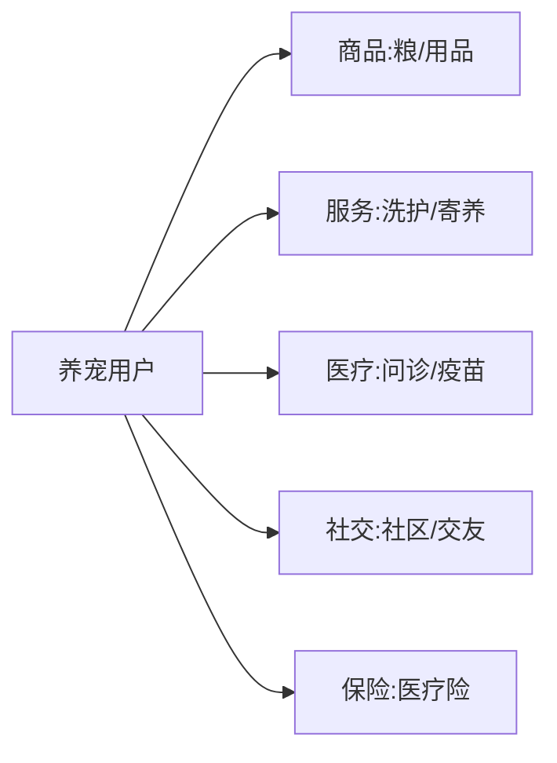

# 宠物本地生活业务模型

> 宠物经济是本地生活里高粘性、高客单的细分赛道：从"养"到"医"到"玩"，覆盖食品、用品、洗护、寄养、医疗、保险。其业务核心是"服务非标 + 信任敏感 + 到店/到家双形态"。

## 1. 业务全景

## 2. 核心模块

| 模块 | 关键问题 | 解法 |
| --- | --- | --- |
| 商品电商 | 复购高、品牌黏 | 订阅制粮、会员折扣 |
| 洗护寄养 | 非标、需预约 | 门店排班 + 服务标准化 |
| 宠物医疗 | 信任、专业 | 在线问诊 + 线下转诊 |
| 宠物社交 | 社区活跃 | UGC + 同城活动 |

## 3. 到店 vs 到家

- **到店**：洗护、寄养、医疗，依赖门店产能与排班。
- **到家**：上门喂养、遛狗，依赖服务者调度与信任背书。

## 4. 信任与合规

- 服务者实名 + 资质 + 评价。
- 医疗需合规资质，问诊与处方分离。
- 保险对接理赔，降低决策门槛。

## 5. 常见坑

| 坑 | 现象 | 对策 |
| --- | --- | --- |
| 服务非标 | 体验不一 | SOP + 培训 |
| 预约冲突 | 排班乱 | 产能校验 |
| 信任缺失 | 不敢下单 | 实名 + 评价 |
| 医疗合规 | 被监管 | 资质隔离 |
| 复购断层 | 流失 | 订阅 + 提醒 |

## 6. 面试题

1. 宠物业务到店与到家如何协同？
2. 非标服务如何标准化？
3. 宠物医疗合规要点？
4. 如何提升复购？

## 7. 小结

宠物本地生活 = 商品复购 + 非标服务 + 医疗信任 + 社区粘性。核心是"把高频刚需做成订阅，把信任敏感做成标准化与资质背书"。
