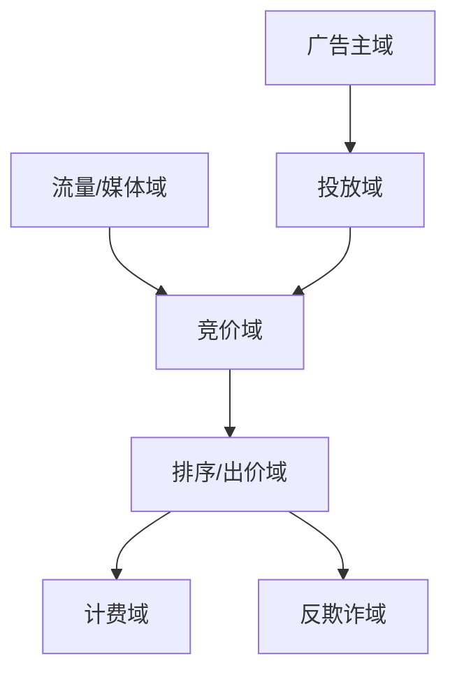
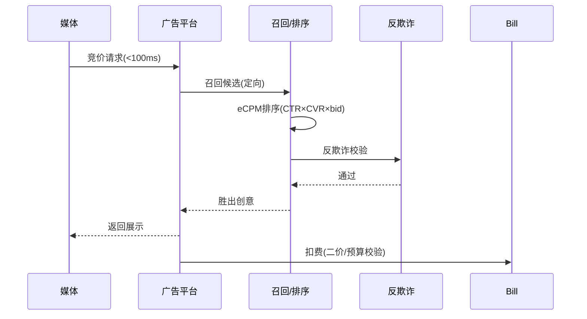

# 广告 / 营销业务模型（深扒）

> 广告系统是「**流量变现**」的引擎，核心是**实时竞价（RTB）**：在用户打开页面的 100ms 内，完成「召回 → 排序 → 出价 → 扣费」。它把高并发、大数据、算法、计费四件事压到极致。
>
> 配套总览见「[业务模型总览](业务模型总览.md)」；计费/高并发见「[架构](../架构)」「[场景设计](../场景设计)」「[电商](电商业务模型.md)」（营销复用）。

---

## 一、业务全景与领域划分

| 域 | 核心职责 | 关键实体 |
|----|----------|----------|
| 广告主域 | 开户、预算、创意 | 广告主、计划、创意 |
| 投放域 | 定向、出价、频控 | 投放计划、定向 |
| 竞价域 | 发起/参与 RTB | 竞价请求、响应 |
| 排序域 | eCPM 排序、胜出 | 排序、出价 |
| 计费域 | 扣费、对账、报表 | 扣费记录、账单 |
| 反欺诈 | 刷量、作弊识别 | 设备、行为 |

---

## 二、核心系统架构

### 2.1 实时竞价（RTB）
- **流程**：媒体发起竞价请求（用户+上下文）→ 广告平台在 ~100ms 内召回候选 → 各候选算出价 → 按 **eCPM（预期收益）** 排序 → 胜出者展示并扣费。
- **eCPM = 出价 × 预估CTR × 预估CVR**（或 pCTR×pCVR×bid）。

### 2.2 召回与排序
- 召回：从海量广告中按定向（地域/人群/上下文）快速筛千级候选。
- 排序：粗排（轻模型）→ 精排（深度 CTR/CVR 模型）→ 重排（多样性、频控）。

### 2.3 计费（计费正确性）
- **CPM/CPC/CPA/oCPC**：不同计费模式，扣费公式各异。
- 二价扣费（广义次高价）：胜出者按「第二名出价 + 最小单位」扣，鼓励真实出价。
- 防超投：预算实时扣减，预算耗尽即停投（见「[电商库存](../电商业务模型.md)」超卖同源）。

### 2.4 反欺诈
- 识别刷量（机器点击）、归因作弊（最后一触碰抢功），用设备指纹 + 行为模型。

---

## 三、关键链路：一次广告展示

---

## 四、峰值与实时场景

| 场景 | 挑战 | 方案 |
|------|------|------|
| 高 QPS 竞价 | 100ms 内决策 | 内存索引 + 模型量化 + 超时降级 |
| 预算实时 | 超投资损 | 原子扣减 + 预算中心 |
| 模型更新 | 效果波动 | 离线训练 + 准实时特征 |
| 刷量 | 计费失真 | 反欺诈前置 |

---

## 五、技术栈详表

| 技术 | 用途 | 备注 |
|------|------|------|
| 内存索引/特征 | 召回 | 低延迟 |
| CTR/CVR 模型 | 排序 | 深度模型 |
| Kafka | 曝光/点击流 | 归因 |
| Redis | 预算、频控 | 实时扣减 |
| 大数据平台 | 报表、训练 | 离线 |
| 反欺诈引擎 | 识别作弊 | 规则+模型 |

---

## 六、广告特有坑

- **超时雪崩**：竞价请求堆积 → 设硬超时 + 降级（返回默认/不投）。
- **预算超投**：扣减非原子 → 原子扣减 + 预算中心统一管控。
- **归因作弊**：刷点击抢转化 → 反欺诈 + 多触点归因模型。
- **eCPM 公式错**：排序用错指标致收益低 → 公式统一 + A/B 验证。
- **频控失效**：同一用户狂投 → 用户级频控（Redis 计数）。

> 口诀：**"广告引擎：百毫秒内决，eCPM 排先；预算原子扣，二价防虚高，反欺诈前置，超时不恋战。"**
