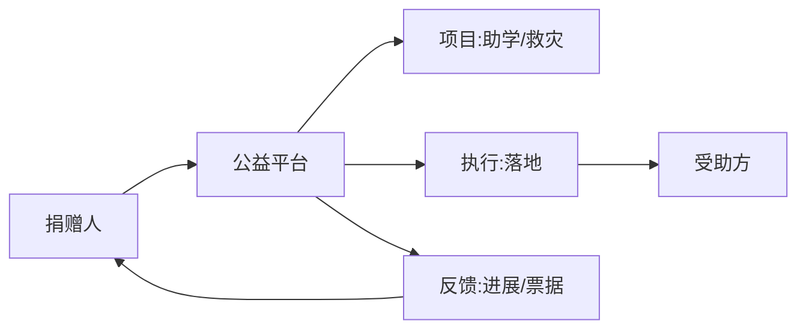

# 慈善公益业务模型

> 公益业务的独特性在于"捐赠人—平台—受助方"三方，且高度依赖**信任与透明**：每一笔捐款的去向、执行进度、票据都要可查。合规（公募资质）与公信力是生命线。

## 1. 业务结构

## 2. 核心模块

| 模块 | 关键 |
| --- | --- |
| 项目管理 | 募捐资质、目标、周期 |
| 捐赠 | 金额、留名、配捐 |
| 执行 | 资金划拨、落地凭证 |
| 透明 | 进展反馈、财务披露 |
| 票据 | 电子捐赠票据 |

## 3. 信任与透明

- **专款专用**：项目维度隔离资金池。
- **进展反馈**：图文/视频回执到捐赠人。
- **财务披露**：定期公示收支。
- **第三方审计**：年报 + 审计报告。

## 4. 合规

- 公募需公募资质，非公募走合作。
- 资金托管，不沉淀平台。
- 票据合规，税务可抵。

## 5. 常见坑

| 坑 | 现象 | 对策 |
| --- | --- | --- |
| 信任危机 | 善款疑云 | 全链路透明 |
| 资质缺失 | 违规募捐 | 合规前置 |
| 执行拖延 | 反馈慢 | SLA + 提醒 |
| 票据问题 | 无法抵税 | 电子票据 |
| 配捐纠纷 | 争议 | 规则透明 |

## 6. 面试题

1. 公益平台如何建立信任？
2. 专款专用如何实现？
3. 公募合规要点？
4. 捐赠票据怎么处理？

## 7. 小结

公益 = 合规资质 + 专款专用 + 透明反馈 + 审计披露。核心是"公信力"，用透明与可追溯换捐赠人信任。
