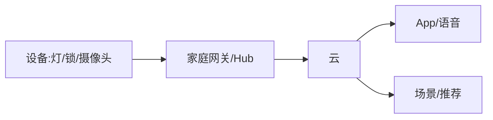

# 智能家居业务模型

> 智能家居是"硬件 + App + 云 + AI 服务"的家庭场景落地：设备互联、场景联动、语音交互、远程控制。其商业核心是**设备入口（硬件销售）+ 服务订阅（云存储/增值）+ 生态（平台）**，难点在设备兼容与体验一致性。

## 1. 业务结构

## 2. 核心模块

| 模块 | 关键 |
| --- | --- |
| 设备接入 | 配网、协议（Wi-Fi/Zigbee/Matter） |
| 场景联动 | 触发 → 动作（回家模式） |
| 语音交互 | 语音助手对接 |
| 云存储 | 摄像头录像、回放 |
| 生态 | 第三方设备接入 |

## 3. 体验关键点

- **配网简单**：扫码/一键配网，降低门槛。
- **联动可靠**：本地优先，断网也能跑基础联动。
- **语音自然**：语义理解 + 多轮对话。
- **隐私**：摄像头/麦克风数据加密与权限。

## 4. 商业模式

- 硬件利润 + 耗材（滤芯等）复购。
- 云存储订阅（录像保存）。
- 生态平台抽成/增值服务。
- AI 能力（如人形检测）增值。

## 5. 常见坑

| 坑 | 现象 | 对策 |
| --- | --- | --- |
| 配网失败 | 体验差 | 简化流程 |
| 设备不兼容 | 割裂 | 标准协议 |
| 断网失灵 | 投诉 | 本地联动 |
| 隐私担忧 | 不买 | 加密 + 透明 |
| 联动误触 | 烦人 | 精细化规则 |

## 6. 面试题

1. 智能家居配网如何简化？
2. 断网时联动如何保障？
3. 设备兼容性怎么解决？
4. 隐私如何保护？
5. 商业模式有哪些层次？

## 7. 小结

智能家居 = 设备接入 + 场景联动 + 语音 + 云订阅。核心是"把硬件入口变成服务生态，用体验一致性和隐私信任留住用户"。
