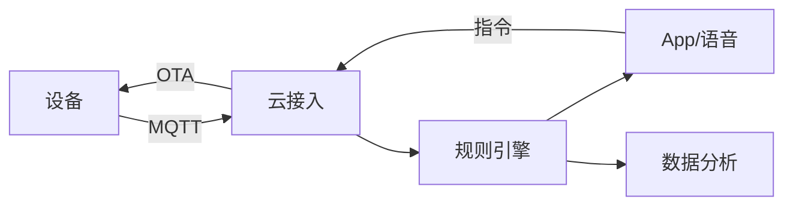

# 智能硬件 IoT 业务模型

> 智能硬件是"硬件 + App + 云 + 服务"的一体化业务：设备联网、数据采集、云端控制、场景联动。难点在**设备长连接管理**、**固件 OTA**、**数据安全**与**硬件供应链**。

## 1. 业务结构

## 2. 核心模块

| 模块 | 关键 |
| --- | --- |
| 设备接入 | MQTT/CoAP、鉴权、长连接 |
| 设备管理 | 注册、状态、分组 |
| 规则联动 | 触发条件 → 动作 |
| OTA | 差分升级、灰度、回滚 |
| 数据 | 时序存储、告警 |

## 3. 连接与协议

- **MQTT** 为主，轻量、断线重连、QoS。
- 设备鉴权用一机一密/证书。
- 指令下行需确认 + 超时重试。

## 4. OTA 与运维

- 分批次灰度升级，监控失败率。
- 失败自动回滚到旧版本。
- 设备日志远端采集辅助排障。

## 5. 安全

- 传输加密（TLS）。
- 固件签名防篡改。
- 设备身份不可伪造。
- 隐私数据本地化/脱敏。

## 6. 常见坑

| 坑 | 现象 | 对策 |
| --- | --- | --- |
| 连接风暴 | 服务器崩 | 限流 + 分级重连 |
| OTA 失败 | 变砖 | 灰度 + 回滚 |
| 指令丢失 | 不响应 | QoS + 确认 |
| 数据泄露 | 隐私 | 加密 + 脱敏 |
| 固件被刷 | 安全风险 | 签名校验 |

## 7. 面试题

1. IoT 为什么常用 MQTT？
2. OTA 如何安全升级？
3. 海量设备长连接怎么管理？
4. 设备安全如何保障？

## 8. 小结

智能硬件 = 设备接入 + 规则联动 + OTA + 安全。核心是"连接稳、升级可控、数据可信"，把物理世界可靠地映射到云端。
