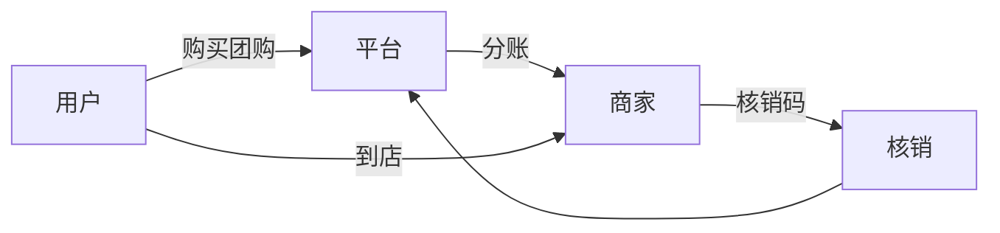
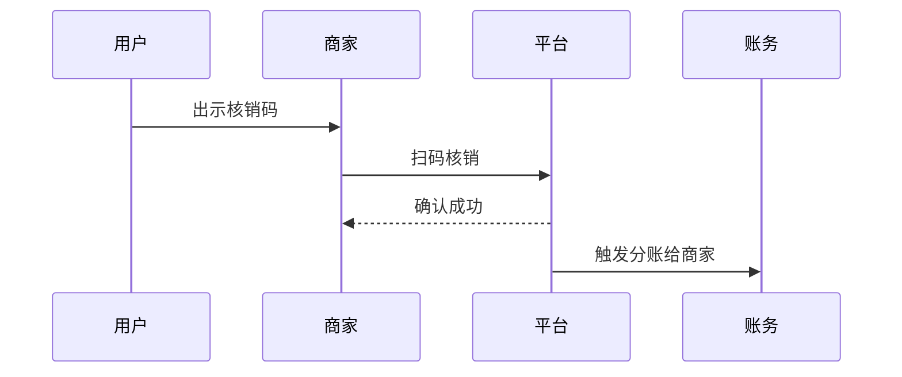

# 本地生活到店业务模型

> 到店业务（团购、核销、评价）连接线下商家与用户，核心是"线上交易、线下履约、到店核销"。本文梳理其交易结构、核销链路与商家侧系统。

## 1. 业务结构

| 角色 | 职责 |
| --- | --- |
| 用户 | 浏览、下单、到店核销 |
| 平台 | 流量、交易、分账、评价 |
| 商家 | 上架团购、接单、核销 |
| 服务商 | 地推、代运营（可选） |

## 2. 核心流程

### 2.1 团购交易
1. 商家配置团购套餐（原价/团购价/库存）。
2. 用户下单付款，平台暂管资金。
3. 生成核销码（一码一用）。

### 2.2 到店核销

- 核销即履约完成，平台按规则分账（扣佣金后打给商家）。
- 未核销可退款，资金原路返回。

## 3. 盈利模式

| 模式 | 说明 |
| --- | --- |
| 佣金抽成 | 每笔交易抽 X% |
| 广告/置顶 | 商家买流量曝光 |
| 年费/入驻 | 商家会员 |
| 金融 | 对账期沉淀资金（合规前提下） |

## 4. 商家侧系统

- **POI 管理**：门店、地址、营业时间。
- **团购管理**：上下架、库存、有效期。
- **核销终端**：商家 App / 收银台接入核销 API。
- **对账结算**：日清/周结，明细可查。

## 5. 技术挑战

- **核销一致性**：码唯一、防重核销、防截图复用。
- **高并发抢购**：热门团购瞬时流量，库存原子扣减。
- **分账准确**：多角色分账（平台/商家/服务商），实时+定期对账。
- **LBS**：门店搜索、距离排序、区域运营。
- **评价反作弊**：刷评识别、权重调整。

## 6. 常见坑

| 坑 | 风险 | 对策 |
| --- | --- | --- |
| 核销码盗用 | 资损 | 一次性+绑定用户 |
| 分账错 | 纠纷 | 对账+规则引擎 |
| 库存超卖 | 投诉 | 原子扣减 |
| 刷单 | 数据失真 | 风控识别 |

## 7. 面试题（业务侧）

1. 到店核销如何防止码被复用？
2. 平台与商家如何分账？
3. 团购库存超卖怎么解决？
4. 到店与外卖业务模型区别？

## 8. 小结

本地生活到店 = 线上交易 + 到店核销 + 分账结算。核心是核销唯一性与分账准确性，辅以 LBS 与反作弊保障体验与公平。
